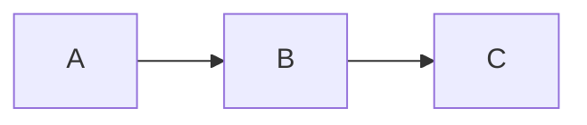

# notes — Typora notes vault

This repo is a **Typora**-edited Markdown notes vault. It is portable: cloned on any host, every note must render the same way, every cross-link must resolve. If you're editing a note from inside this repo, follow the rules in this file. If you're *creating* a new note, prefer using the `typora-note-taking` skill or `phd-note-taker` agent (see "Tooling" below) — they encode this same spec.

## Layout

```
notes-gilgamesh/
├── CLAUDE.md                    (this file)
├── <subject-folder>/            top-level domain (llm, architecture, networking, ...)
│   ├── <slug>.md                a note
│   ├── <slug>.md
│   └── assets/                  per-folder assets dir
│       └── <slug>/              one subfolder per note that has images
│           └── figure-1.png
└── <subject-folder>/
    └── ...
```

- **Subject folders** (top-level dirs) group notes by domain. Existing/expected ones: `llm/`, `architecture/`, `networking/`, `vision-ml/`, `software-eng/`. Don't invent a new one without checking the existing tree first.
- **Slugs**: filenames are kebab-case, lowercase, `.md` extension. `attention-mechanism.md`, not `Attention Mechanism.md`.
- **Assets**: each subject folder has its own `assets/<slug>/` subdirectory. A note at `llm/attention.md` always references its image as `./assets/attention/fig.png` — never as `../assets/...`, never as an absolute path.
- **Underscore-prefixed folders** (`_smoke-test/`, `_typora-render-test/`) are scratch/test areas and are ignored by `list-folders.sh`. Don't put real notes there.

## Frontmatter

Every note starts with YAML frontmatter that `create-note.sh` writes for you:

```yaml
---
title: "Human-readable title"
created: YYYY-MM-DD
updated: YYYY-MM-DD
tags: [topic, subtopic]
aliases: []
---
```

Bump `updated:` when meaningfully revising a note. Tags drive Typora's search and any future indexing — use the subject folder name plus 1–3 specifics (`[llm, attention, flash-attention]`).

## The 9 requirements for every note

In order:

1. **Real-world example with code** — a concrete scenario followed by a fenced code block with a language tag. Prose-only fails.
2. **Layered explanation** — TL;DR up top (1–3 sentences), low-level detail below.
3. **Headers** — `#` for the title, `##` for sections, `###` for sub-phases. Typora's outline panel reads these.
4. **Vocabulary** — every load-bearing term, one line each, with notation in inline math where the math has standard symbols.
5. **Code blocks** — every snippet in a fenced block with a language tag. Never inline a multi-line snippet.
6. **Teach every subsection — never heading → raw code.** Every `##`/`###` gets 2–4 sentences of teaching prose before any code or math block.
7. **Sources** — primary references (arXiv, RFCs, ISA manuals, original blog posts). `## Sources` at the bottom.
8. **Cross-links** — `## Related` section with wikilinks or relative-path links to existing notes. Always include if a relevant note exists.
9. **Clear and concise** — short sentences, bullet lists, tables. Cut filler.

## Body skeleton (PhD-level structure)

```markdown
# <Title>

[toc]

> **TL;DR:** <2–3 sentence thesis>

## Vocabulary
- **Term** ($\text{symbol}$) — one-line definition.

## Intuition
<mental picture before the math>

## How it works
<overview prose, then ### sub-phases each with prose-before-code>

## Math
$$ ... $$

## Real-world example
<scenario, then fenced code block>

## In practice
<systems / scale / production reality — heaviest callout density lives here>

## Pitfalls
- **Wrong belief** — correction.

## Sources
- <primary URL or citation>

## Related
- [[other-slug]]
- [Display Text](../other-folder/note.md)
```

## Portability rules — links and paths inside notes

This vault is a git repo. Anything inside a note body must work on *any* host where it's cloned. No exceptions.

### Allowed inside note content

- **Relative Markdown links** (PREFERRED) — `[text](./sibling.md)`, `[text](../other-folder/note.md)`, `[text](./note.md#heading-anchor)`. Always relative to the *containing note's* location. These always click through in Typora with no preference toggle required.
- **Wikilinks** — `[[note-slug]]` (file basename, no `.md`, no path). Only resolve if *Preferences → Markdown → Use [[]] for wiki links* is enabled, and Typora must scan the vault to find the target. **If the user reports broken links, default to relative Markdown links instead.**
- **Relative image paths** — ``. Per-folder assets convention, always `./assets/<slug>/...`.
- **External URLs** — `https://...`.

> [!TIP]
> When cross-linking notes inside this vault, prefer `[Display text](./other-note.md)` over `[[other-note]]`. Relative links survive without any Typora preference toggle, render as clickable blue text everywhere, and are explicit about the file extension. Reserve wikilinks for the `## Related` section only if the vault owner has wikilinks enabled. **Never link to a note file that does not exist yet** — broken links are silently broken in Typora.

### Forbidden inside note content

- Absolute filesystem paths: `/Users/...`, `/home/...`, `C:\...`.
- `$HOME`, `~/`, `file://` URLs into a user's home directory.
- Vault-rooted paths without `./` prefix (`assets/foo.png` instead of `./assets/foo.png`).

### Where absolute paths ARE okay

- Shell commands you run locally to generate assets (`python3 -c "...plt.savefig('$TYPORA_VAULT/llm/assets/attention/fig.png')"`). These execute on this host only; nothing leaks into the note body. Prefer `"$TYPORA_VAULT"` over the literal path so the command works on any clone.

## Typora syntax — what actually renders

Typora is WYSIWYG: what you write is what it renders. Use the exact syntax below.

### Math — use ```` ```math ```` fenced blocks, NOT `$…$` / `$$…$$`

This vault's Typora setup renders math via GitHub-style ```` ```math ```` fenced code blocks. Inline `$…$` and display `$$…$$` math do **not** render reliably in this configuration — they often show as raw LaTeX source. **Every math expression must live on its own line inside a `math` fenced block:**

````markdown
```math
\mathbf{y} = W \mathbf{x} + \mathbf{b}
```
````

> [!CAUTION]
> **Do not write `$x$` or `$$ … $$` anywhere.** Both fail to render in this vault. Convert every math expression — even a single symbol like `$n$` — into either a `math` fenced block on its own line, or a plain-text/Unicode equivalent in flowing prose.

> [!IMPORTANT]
> Inside a `math` fenced block, write raw LaTeX **with no `$` delimiters**. Just the content:
>
> - ✅ Correct: `\sqrt{x^2 + y^2}` (between the fence lines)
> - ❌ Wrong: `$\sqrt{x^2 + y^2}$` (do not put dollars inside a `math` fence)
>
> Matrix environments (`\begin{bmatrix}…\end{bmatrix}`, `pmatrix`, `aligned`, `cases`, `array`) work fine inside `math` fences. The `\\` row separator only fails in inline `$…$` math — `math` fences handle it correctly.

> [!TIP]
> **For short references in flowing prose**, use plain text or Unicode instead of a separate `math` block. A standalone `math` block breaks the reader's flow for a one-letter mention. Examples:
>
> - "a vector in ℝⁿ" (Unicode) — better than pulling `\mathbb{R}^n` into its own block.
> - "the dimension dim V" — better than a one-symbol `math` fence.
> - "the matrix A of shape (m, n)" — better than typesetting every shape spec.
>
> Reserve `math` fences for substantive equations: definitions, derivations, key identities, matrix displays. Pull every multi-symbol equation, every matrix, and every multi-line derivation into its own `math` block.

> [!NOTE]
> **Vocabulary sections** in this vault follow a specific pattern: a bold term on its own line, the canonical symbol in a `math` fenced block on the next line, then a plain-prose definition paragraph. This format avoids inline math entirely and renders reliably.
>
> Example:
>
> ````markdown
> **Scalar**
> 
> ```math
> a \in \mathbb{R}
> ```
> 
> A single real number such as 3, −0.5, or π. A scalar applies uniformly to every element it touches.
> ````

### GFM callouts — colored alert boxes

Typora 1.8+ renders these as colored boxes with icons. Requires *Preferences → Markdown → Callouts / GitHub Style Alerts*. **Use them — they're the single best way to flag interrupting information without breaking prose flow.**

| Syntax           | Color  | When to use                                                  |
| :--------------- | :----: | :----------------------------------------------------------- |
| `> [!NOTE]`      |  blue  | Side observation worth knowing but not blocking.             |
| `> [!TIP]`       | green  | The practitioner's idiom, perf optimization, "the way it's actually done in production". |
| `> [!IMPORTANT]` | purple | Load-bearing invariant — getting it wrong invalidates the section. |
| `> [!WARNING]`   | yellow | Footgun — code that compiles/runs but is wrong.              |
| `> [!CAUTION]`   |  red   | Data loss, security, or production-incident-class hazard.    |

Format:

```markdown
> [!IMPORTANT]
> Content goes on subsequent `>` lines.
> A blank line closes the callout.
```

Case-sensitive (`[!NOTE]` works; `[!note]` does not). Keep callouts 1–3 sentences; promote anything longer to a real subsection. Three to six callouts in a long note is typical — thirty is noise.

The bolded-label fallback (`> **TL;DR:** …`) is still useful for the top-of-note summary; it integrates with prose flow without taking the visual weight of a full callout.

### Diagrams — three engines

All require *Preferences → Markdown → Diagrams*.

**`mermaid`** (workhorse — many subtypes):

````markdown

````

Subtypes (select via first-line keyword): `graph LR` / `flowchart`, `sequenceDiagram`, `stateDiagram-v2`, `classDiagram`, `erDiagram`, `gantt`, `pie`, `mindmap`, `timeline`, `gitGraph`, `quadrantChart`, `sankey-beta`, `xychart-beta`, `requirementDiagram`, `C4Context`.

**`flow`** (flowchart.js — terse linear flows with shape-coded nodes):

````markdown
```flow
st=>start: Start
op=>operation: Process
e=>end
st->op->e
```
````

**`sequence`** (js-sequence-diagrams — lightweight two-actor exchanges):

````markdown
```sequence
Alice->Bob: hi
Bob-->Alice: hi back
```
````

Default to `mermaid`. Use a Markdown table or an ASCII figure (fenced plain block) for linear pipelines, header field layouts, anything grid-aligned where a real diagram is overkill.

### Code blocks

Always tag the language — Typora syntax-highlights ~150 languages: ```` ```python ````, ```` ```go ````, ```` ```rust ````, ```` ```c ````, ```` ```bash ````, ```` ```sql ````, ```` ```yaml ````, ```` ```json ````.

### Tables (GFM with alignment)

```markdown
| Left | Center | Right |
| :--- | :---: | ---: |
| L    | C      | R     |
```

Inline Markdown (math, bold, inline code, links) works inside cells.

### Typography extensions

- `**bold**`, `*italic*`, `***bold-italic***`
- `==highlight==` (requires *Highlight* toggle)
- `~~strikethrough~~`
- `H~2~O` subscript, `X^2^` superscript (requires *Subscript / Superscript* toggle)
- `` `inline code` ``
- `:rocket:` emoji shortcodes

### Footnotes

```markdown
Text with a footnote[^id].

[^id]: Footnote content.
```

### `[toc]`

`[toc]` on its own line → Typora generates a clickable table of contents. Always include after the title.

## What NOT to write

- **No HTML** (`<div>`, `<pre>`, `<br>`, `<p>`, `<a>`) — pure Markdown only. HTML was an Apple Notes workaround; this vault is Typora.
- **No bolded-label-only callouts** when a real GFM callout fits better (`> **Warning:** …` is fine for prose flow but `> [!WARNING]` is the colored interrupt the reader actually notices).
- **No absolute paths** anywhere in note content (see Portability rules).
- **No silent new top-level folders** — match the topic to an existing subject folder; if nothing fits, ask before creating.
- **No `## Heading` → fenced code with no prose between**. Every `##` and `###` gets 2–4 sentences of teaching prose first.
- **No invented hyperparameters, register names, RFC field names, or paper claims**. WebFetch the source or say "verify against [source]".

## Tooling — outside this repo

The full spec lives in two places on the host that wrote this vault:

- **Skill**: `~/.claude/skills/typora-note-taking/SKILL.md` — vault layout, syntax cheat sheet, the three shell scripts.
- **Agent**: `~/.claude/agents/phd-note-taker.md` — PhD-level note structure, callout placement guidance, depth dial (high-level + low-level), domain-specific defaults.

Helper scripts (per-host, not in this repo):

```bash
~/.claude/skills/typora-note-taking/scripts/list-folders.sh
~/.claude/skills/typora-note-taking/scripts/search-notes.sh <keyword> [more-keywords...]
~/.claude/skills/typora-note-taking/scripts/create-note.sh <folder> <Title> <body|->
```

The scripts honor the `TYPORA_VAULT` environment variable — set it to override the default vault path on a host where this repo is cloned somewhere other than `/Users/ptapayan/git/notes/notes-gilgamesh`:

```bash
export TYPORA_VAULT=/path/to/notes-gilgamesh
```

If you're editing notes from a host that doesn't have the skill installed, that's fine — every convention in this file is plain Markdown plus Typora preferences. You can hand-author notes following this CLAUDE.md and they'll render identically.

## Editing checklist — before saving a note

- [ ] Title heading matches the frontmatter `title:`.
- [ ] `[toc]` directly after the title.
- [ ] TL;DR blockquote with bolded label, 2–3 sentences.
- [ ] Every `##` and `###` has 2–4 sentences of prose before any code/math block.
- [ ] Real-world section contains an actual fenced code block with a language tag.
- [ ] At least one GFM callout (`[!NOTE]` / `[!TIP]` / `[!IMPORTANT]` / `[!WARNING]` / `[!CAUTION]`) where it earns its place.
- [ ] Sources cite primary references.
- [ ] `## Related` has at least one wikilink or relative-path link (unless this is the first note in the domain).
- [ ] No absolute paths in the body. No HTML tags. No Obsidian-style features that aren't Typora-supported.
- [ ] Images (if any) live at `./assets/<slug>/...` relative to the note.
- [ ] `updated:` bumped if revising an existing note.