# 1 - What is Computer Networking

[toc]

> **TL;DR:** Computer networking is the discipline of connecting machines so they can exchange data. Every design decision in networking — from packet switching to layered protocols — traces back to one core tension: you have shared, unreliable physical links and you want to deliver bits reliably and fairly to billions of endpoints. This note sets the conceptual stage before the series dives into specific protocols.

## Vocabulary

**Network**: A collection of interconnected nodes (hosts, routers, switches) and the links between them, capable of exchanging data.

---

**Host (end system)**: Any device at the edge of the network that originates or consumes data — laptops, phones, servers, IoT sensors.

---

**Router**: A device that forwards packets between networks based on destination IP address. Operates at Layer 3.

---

**Switch**: A device that forwards frames within a single network based on MAC address. Operates at Layer 2.

---

**Link**: A physical or logical communication channel between two nodes — copper wire, fiber, Wi-Fi, or a virtual tunnel.

---

**Packet**: A self-contained unit of data, including a header (routing/control metadata) and a payload (the data being transported). The fundamental currency of packet-switched networks.

---

**Packet switching**: A forwarding model where each packet is individually routed through the network; links are shared opportunistically rather than reserved.

```math
\text{transmission delay} = \frac{L \text{ bits}}{R \text{ bps}}
```

---

**Circuit switching**: A forwarding model where a dedicated end-to-end path is reserved before communication begins (the telephone network). Guarantees bandwidth but wastes capacity when idle.

---

**Bandwidth**: The maximum rate at which data can be transferred over a link, measured in bits per second (bps). A property of the link, not the traffic.

---

**Latency (delay)**: The time for one bit to travel from source to destination. Composed of transmission delay, propagation delay, queueing delay, and processing delay.

```math
d_{\text{total}} = d_{\text{prop}} + d_{\text{trans}} + d_{\text{queue}} + d_{\text{proc}}
```

---

**Throughput**: The actual rate at which bits are successfully delivered end-to-end over a period of time. Always ≤ bandwidth; throttled by the bottleneck link.

---

**Bandwidth-delay product (BDP)**: The volume of data "in flight" in the network at any time. BDP = bandwidth × round-trip time. A critical parameter for TCP window sizing.

```math
\text{BDP} = B \times \text{RTT}
```

---

**Protocol**: A set of rules governing the format and timing of messages exchanged between peers. Protocols at the same layer on different machines must agree exactly. More precisely: a protocol defines the format and order of messages exchanged between two or more communicating entities, as well as the actions taken on the transmission or receipt of a message.

---

**RFC (Request for Comments)**: The primary standards documents for Internet protocols, published by the IETF. RFCs are the authoritative specification for TCP, IP, DNS, HTTP, TLS, etc. There are nearly 9,000 RFCs in existence.

---

**ISP (Internet Service Provider)**: An organisation that provides access to the Internet. ISPs are organized in tiers: Tier 1 (global backbone), Tier 2 (regional), Tier 3 (access/last-mile).

---

**Autonomous System (AS)**: A network under a single administrative control, identified by an Autonomous System Number (ASN). BGP routes between ASes.

---

**Socket interface**: The API through which application programs instruct the Internet infrastructure to deliver data to a specific destination program running on another end system.

---

**Access network**: The network that physically connects an end system to the first router (also called the edge router) on a path from the end system to any other distant end system.

---

## Intuition

Think of the Internet as a postal system at unimaginable scale. Your data is broken into envelopes (packets), each labeled with a destination address. Each envelope travels independently through a series of post offices (routers), each of which reads the address and decides the next hop. Envelopes from the same letter may take different routes and arrive out of order — it is the receiver's job to reassemble them.

This analogy captures the essence of packet switching: shared infrastructure, statistical multiplexing, and decentralized routing. The design philosophy of the Internet — sometimes called the "end-to-end principle" — is to keep the network core simple and dumb, pushing complexity to the edges (the hosts). Routers forward packets; they do not guarantee delivery, ordering, or reliability. Those guarantees, if needed, are the responsibility of the endpoints.

The contrast with the telephone network (circuit switching) is instructive. A phone call reserves a 64 kbps channel from your phone to the other party for the entire duration of the call. That channel is yours even during silence. Packet switching allows many users to share the same links by filling gaps — statistically multiplexing their bursty traffic. The tradeoff: the telephone network never drops your voice; the Internet can and does drop packets under congestion.

The Internet connects billions of computing devices worldwide — traditional computers, smartphones, and nontraditional devices alike. All these devices are called hosts or end systems and are interconnected by a network of communication links and packet switches. The sequence of links and switches a packet traverses is called a route or path. Hosts access the Internet through ISPs, and lower-tier ISPs are interconnected through national and international upper-tier ISPs. Internet protocols — collectively TCP/IP — govern all data transmission. Standards are developed by the **IETF** and documented as RFCs; other bodies such as the **IEEE 802 committee** specify standards for Ethernet and WiFi.

## Why Networks Exist

Networks exist because the economics and physics of computation are spatially distributed. You cannot put all computing in one place, and even if you could, latency to distant users would be unacceptable. Networks solve the problem of moving data between separated machines efficiently, at scale, and with graceful failure handling.

The Internet, specifically, is a network of networks — tens of thousands of independently operated autonomous systems, interconnected via peering and transit relationships, all running compatible protocols (the IP suite). No single entity owns or operates the Internet. Its resilience comes from redundancy and from a routing system (BGP) that adapts to failures.

The Internet also serves as an infrastructure for applications. Internet applications — messaging, mapping, streaming, social media — are distributed and run on end systems, not within packet switches. To create an Internet application, you write programs for end systems; those programs call the socket interface to send and receive data across the network.

### The network edge

End systems are found at the network edge and run application programs. Hosts divide naturally into clients (desktops, laptops, smartphones) and servers (more powerful machines that store and distribute content). Large companies like Google operate multiple data centers worldwide, each with millions of servers, to serve global traffic at low latency.

Networking devices sit between hosts. A **hub** is a physical-layer device that broadcasts incoming signals out all ports — every attached host sees every frame, and only one device can transmit at a time (a single collision domain). A **switch** is a data-link-layer device that learns which MAC addresses are on which ports and forwards frames only to the intended destination, eliminating unnecessary collisions. A **router** is a network-layer device that forwards packets between independent networks; home and office traffic flows from the LAN through one or more routers to the ISP's core routers and out to the Internet. BGP (*Border Gateway Protocol*) lets routers share data with each other to learn the most optimal forwarding paths. Servers and clients are nodes; a node can act as both — an email server is a server to mail clients but a client to a DNS server.

### Access networks

The access network is the first hop from a host to the broader Internet. Several technologies achieve this last-mile connection, each with different physical media and performance characteristics.

**DSL (Digital Subscriber Line)** is often provided by the local telephone company, which acts as both telco and ISP. A DSL modem at the home communicates with a DSLAM (*Digital Subscriber Line Access Multiplexer*) at the telco's central office. DSL allows voice and data signals to share the same copper pair using frequency-division multiplexing; a splitter at the customer end separates them. DSL is asymmetric: downstream rates are higher than upstream. Achievable rates fall with distance; DSL is suited for homes within 5–10 miles of the central office.

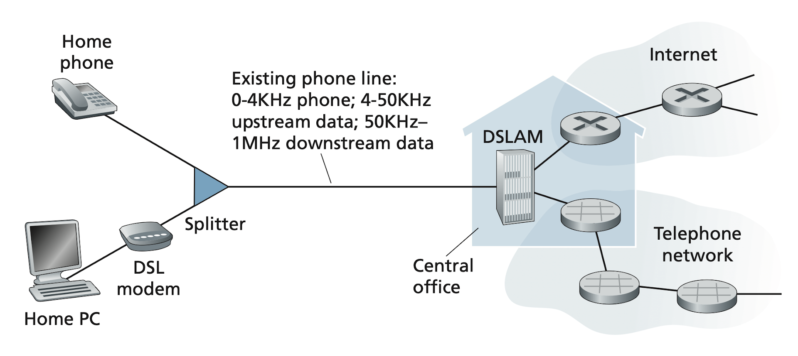

**Cable Internet** uses the existing cable TV infrastructure. Fiber optics carry traffic from the cable head end to neighborhood junctions; coaxial cable then runs to individual homes — a topology called **HFC (Hybrid Fiber Coax)**. A cable modem at the home connects to the home PC via Ethernet; the **CMTS (Cable Modem Termination System)** at the head end converts analog signals from modems into digital form. Cable Internet is a shared broadcast medium: neighbors share downstream and upstream channels, so simultaneous usage reduces individual rates. The upstream channel requires a multiple-access protocol to avoid collisions.

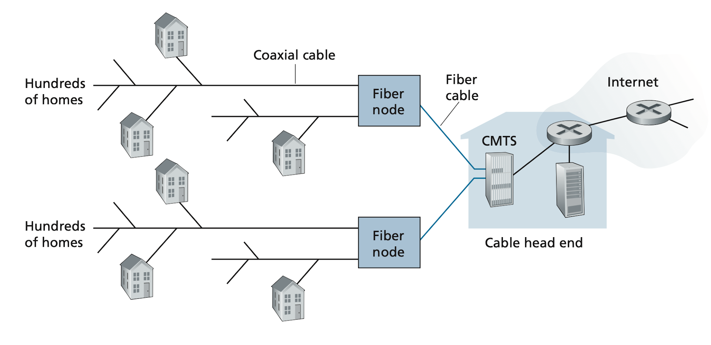

**FTTH (Fiber to the Home)** runs optical fiber directly to the residence, offering gigabit-per-second speeds. Shared-fiber architectures split a single fiber among multiple homes using either **AON (Active Optical Networks)** or **PON (Passive Optical Networks)**. In Verizon's FiOS PON deployment, an **ONT (Optical Network Terminator)** at each home connects through a neighborhood splitter to an **OLT (Optical Line Terminator)** at the central office; the OLT connects to the Internet via a telco router. Packets from the OLT are replicated at the splitter, so encryption is needed to prevent neighbors reading each other's traffic.

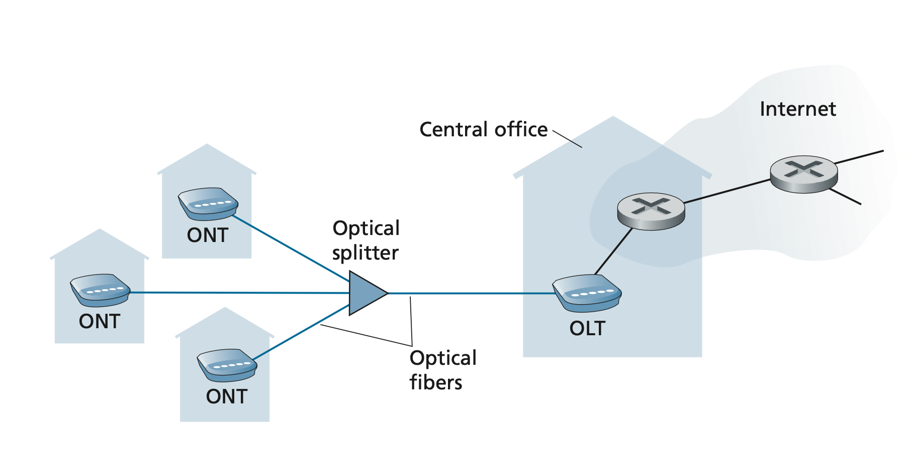

**5G Fixed Wireless** is an emerging residential access technology that eliminates costly last-mile cabling. A provider's base station sends data wirelessly to a modem inside the home using beamforming; a WiFi router connects downstream, similar to cable or DSL setups.

**Ethernet and WiFi** dominate enterprise and home LAN access. Ethernet uses twisted-pair copper wire at speeds from 100 Mbps to tens of Gbps. Wireless LAN users connect to an access point (itself connected to the wired LAN via Ethernet); IEEE 802.11 (WiFi) supports shared transmission rates exceeding 100 Mbps. Home networks increasingly combine a broadband residential access link (DSL, cable, fiber) with an 802.11 access point.

**Broadband and T-carrier context.** The term "broadband" refers to any connectivity technology that is not dial-up Internet. T-carrier lines — invented by AT&T — use twisted-pair copper to carry multiplexed phone calls. A T1 line supports up to 24 simultaneous phone calls on one twisted pair, each at 64 kbps, giving a total throughput of 1.544 Mbps. A T3 line multiplexes 28 T1 lines to achieve 44.736 Mbps. DSL sub-types matter in practice: **ADSL** (asymmetric) offers different speeds for upload and download; **SDSL** (symmetric) caps at 1.544 Mbps (T1 speed); **HDSL** (high-bit-rate DSL) exceeds that cap. Cable broadband shares bandwidth across neighbors and uses a CMTS to connect cable modems to the ISP core. Fiber connections fall under the **FTTX** umbrella — *Fiber to the Neighbourhood* (FTTN), *Fiber to the Building* (FTTB), or *Fiber to the Home* (FTTH). An FTTH deployment uses an ONT at the home to convert between fiber protocols and the twisted-pair copper that connects the home's devices.

> [!NOTE]
> DSL point-to-point connection diagram:
> 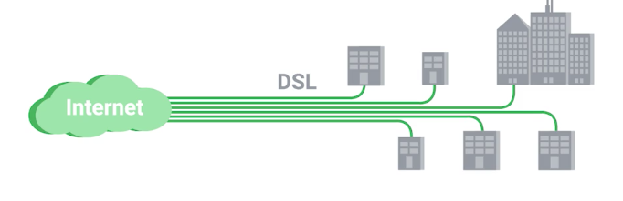
>
> Cable shared-bandwidth topology:
> 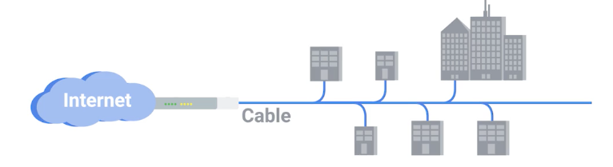

### Physical media

Network access technologies use various physical media. Physical media fall into two categories: **guided media** (waves guided along a solid medium — fiber-optic cable, twisted-pair copper wire, coaxial cable) and **unguided media** (waves propagate in atmosphere or space — wireless LAN, satellite).

Installation labor costs for physical links are often significantly higher than material costs, which motivates builders to install multiple media types in a single trench to avoid future re-wiring expense.

- **Twisted-pair copper wire** is the most common guided medium — two insulated wires twisted together to reduce electromagnetic interference. Data rates for LANs range from 10 Mbps (Cat5) to 10 Gbps (Cat6a for short runs). Crosstalk (an electrical pulse on one wire accidentally detected on another) is reduced by stricter twist specifications in Cat5e and Cat6.
- **Coaxial cable** has two concentric copper conductors and is used in cable TV systems. Coupled with a cable modem, it provides hundreds of Mbps. It can serve as a guided shared medium: multiple end systems attach directly to the cable and receive each other's signals.
- **Optical fiber** conducts light pulses representing bits, achieving very high data rates (Tbps on a single fiber with WDM), extremely low attenuation, and immunity to electromagnetic interference. Ideal for long-distance transmission; expensive for short-haul.
- **Terrestrial radio** is wireless and versatile. Three categories: short-range (Bluetooth, ~10 m), local-area (WiFi, ~100 m), and wide-area (4G/5G cellular, ~tens of km). Performance is governed by path loss, shadow fading, multipath fading, and interference from other transmitters.
- **Satellite links** use geostationary (GEO) or low-earth-orbit (LEO) satellites. GEO satellites remain fixed above one Earth location but introduce ~280 ms one-way propagation delay (altitude ~36,000 km). LEO satellites orbit much closer to Earth, reducing delay significantly; constellations like Starlink use many LEO satellites to provide continuous coverage. Satellite links serve areas where DSL and cable are unavailable.

### Protocol layering

Network protocols are organized into layers, each providing a specific service to the layer above and consuming a service from the layer below. Layers can be implemented in software (application, transport), hardware (physical, link), or a mix. The key advantages are modularity — you can update one layer without touching others — and a structured vocabulary for describing system components. A drawback is that strict layering can duplicate functionality or create information dependencies between layers.

The Internet protocol stack has five layers: physical, link, network, transport, and application. As data moves down the stack on the sender, each layer adds a header, creating a new encapsulated unit (segment → datagram → frame). On the receiver, each layer strips its header. This layering is the subject of [2 - OSI and TCP/IP Models](./2-osi-and-tcp-ip.md).

## The Four Sources of Delay

Every packet traversing the network experiences four categories of delay. Understanding each is essential for diagnosing performance problems and for the math in later notes.

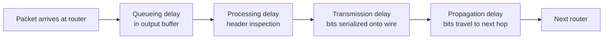

**Propagation delay** is governed by the speed of light (roughly 2×10⁸ m/s in fiber) and the physical distance. A San Francisco → New York link is ~4,000 km, implying ~20 ms one-way propagation. You cannot reduce this below the physics limit. **Transmission delay** is how long it takes to push the packet's bits onto the wire: a 1,500-byte packet on a 1 Gbps link takes 12 µs. **Queueing delay** is the variable component — time spent waiting in a router's output buffer while prior packets finish transmitting. This is what congestion control tries to minimize. **Processing delay** (header checksumming, routing table lookup) is typically sub-millisecond on modern silicon, though it includes examining the packet header and checking for bit-level errors.

Traffic intensity (La/R, where L is average packet length in bits, a is average packet arrival rate, and R is the link transmission rate) is a key predictor of queueing delay. When La/R > 1, the queue grows without bound and delay approaches infinity. The relationship is highly non-linear: at low traffic intensity, queueing delay is near zero; as intensity approaches 1, delay spikes sharply.

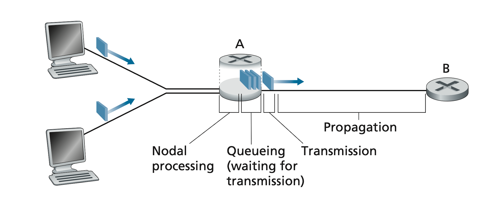

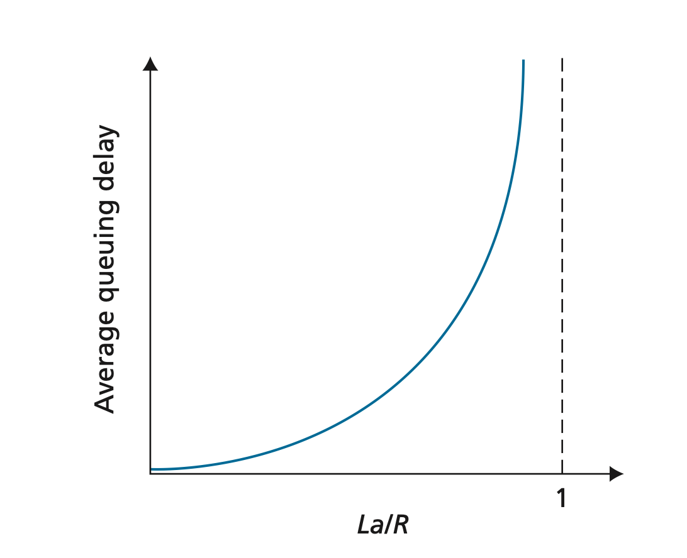

> [!IMPORTANT]
> Latency and bandwidth are independent properties. A satellite link may have enormous bandwidth (500 Mbps) but terrible latency (600 ms round-trip). A local gigabit link may have tiny latency (0.1 ms) but be narrow. Bandwidth determines how fast you can fill a pipe; latency determines how long before the first byte arrives. Many networking optimizations target one and not the other — make sure you know which you need.

**Throughput** is distinct from delay but closely related. If a file of F bits takes T seconds for the receiver to collect all F bits, the average throughput is F/T bps. In a two-link network the throughput is bounded by the slower (bottleneck) link: min{R_c, R_s}. In today's Internet, the access network is usually the bottleneck because the core is heavily over-provisioned. Even a high-rate core link can become a bottleneck when many competing flows share it.

Traceroute measures end-to-end delay by sending probe packets with increasing TTLs and recording round-trip times to each router hop. If a router does not reply (or fewer than three replies arrive due to packet loss), Traceroute prints an asterisk for that hop.

## Packet Switching vs. Circuit Switching

The Internet chose packet switching. Here is why the tradeoffs landed that way.

| Property | Packet Switching | Circuit Switching |
| :--- | :--- | :--- |
| Resource allocation | Shared on demand (statistical multiplexing) | Dedicated for the call's duration |
| Utilization | High — idle capacity is used by others | Low — reserved bandwidth wasted during silence |
| Setup time | None — send immediately | Call setup required before first bit |
| Congestion possible? | Yes — buffers can overflow, packets dropped | No — bounded by reserved capacity |
| Good for | Bursty data (web, file transfer, email) | Continuous streams (voice, real-time control) |
| Primary network | The Internet | PSTN (telephone), some cellular |

> [!NOTE]
> Modern cellular networks (4G/5G) and VoIP (SIP, WebRTC) run voice over packet-switched IP networks, blurring this boundary. Quality of Service (QoS) mechanisms let packet networks prioritize voice traffic, recovering some of circuit switching's guarantees while retaining statistical multiplexing's efficiency.

### Store-and-forward transmission and queuing

Most packet switches use **store-and-forward** transmission: the switch must receive the entire packet before it can begin transmitting it on the outbound link. This is because the switch needs to check the packet header, compute the output port, and (for some technologies) verify a checksum — all of which require the full packet to be buffered first. The store-and-forward delay for a source–destination path crossing N links each of rate R, carrying a packet of L bits, is:

```math
d = N \times \frac{L}{R}
```

For a simple two-link path (source → router → destination), d = 2L/R.

Packet switches have output buffers (output queues). When a packet arrives and the outbound link is busy transmitting another packet, the arriving packet must wait. This waiting time is **queueing delay**, and it varies with instantaneous traffic levels. When the buffer is completely full and a new packet arrives, **packet loss** occurs — either the arriving packet or one already in the queue is dropped.

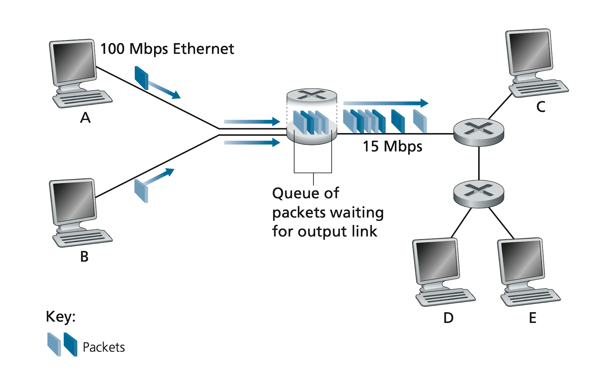

Routers use **forwarding tables** to determine which outbound link to use for each destination. Tables are keyed on destination IP address (or prefix) and are populated automatically by routing protocols. Hosts do not need to know the full topology; they simply send packets to their default gateway.

### Multiplexing in circuit-switched networks

Circuit-switched networks reserve resources for the entire communication session. Traditional telephone networks are the canonical example: a circuit is established before the first bit is sent, and a fixed transmission rate is reserved end-to-end for the call's duration. Two multiplexing strategies are used in circuit-switched networks:

- **FDM (Frequency-Division Multiplexing)**: the available frequency spectrum on a link is divided into bands; each circuit gets a fixed frequency band for the duration of the connection.
- **TDM (Time-Division Multiplexing)**: time is divided into frames, each frame divided into slots; each circuit gets one slot per frame, providing a fixed bit rate equal to (slot duration)/(frame duration) × link rate.

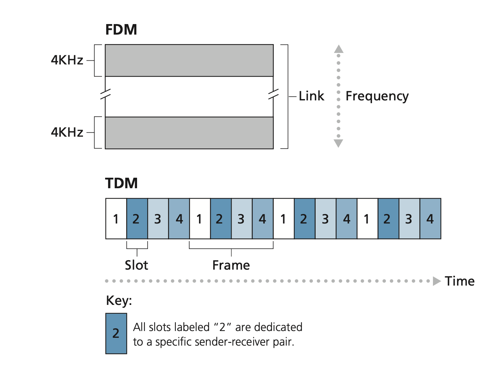

In the figure, FDM divides the frequency domain into four 4 kHz bands; TDM divides the time domain into frames with four slots each. Packet switching is more efficient than circuit switching because it does not reserve resources during idle periods — statistical multiplexing fills gaps. Circuit switching pre-allocates link use regardless of demand, leading to wasted capacity whenever a circuit is silent.

## The Internet as a Network of Networks

The Internet's tiered structure is worth visualizing before the routing notes.

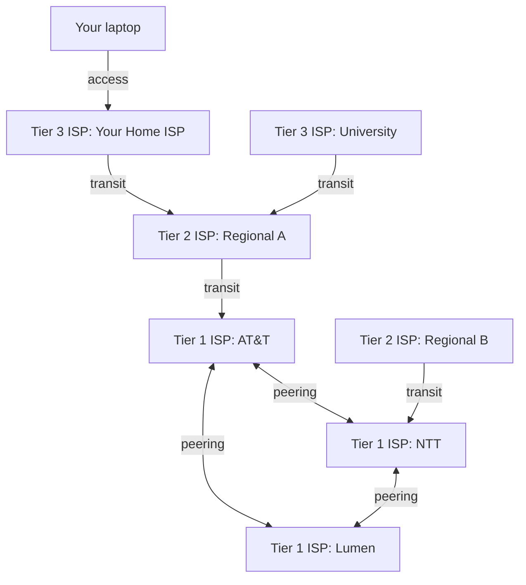

Tier 1 ISPs peer with each other for free (settlement-free peering) because the traffic is roughly balanced. Tier 2 and Tier 3 ISPs pay Tier 1 ISPs for transit. **Internet Exchange Points (IXPs)** are physical facilities where many ISPs connect to exchange traffic directly, reducing cost and latency. A **PoP (Point of Presence)** is a group of one or more routers at a single location in a provider's network where customer ISPs can connect into that provider.

Large content providers like Google build their own private global networks, bypassing Tier 1 ISPs to reduce cost and gain control over routing. Google's network peering into hundreds of ISPs directly means YouTube traffic rarely travels over the public Internet's tier structure.

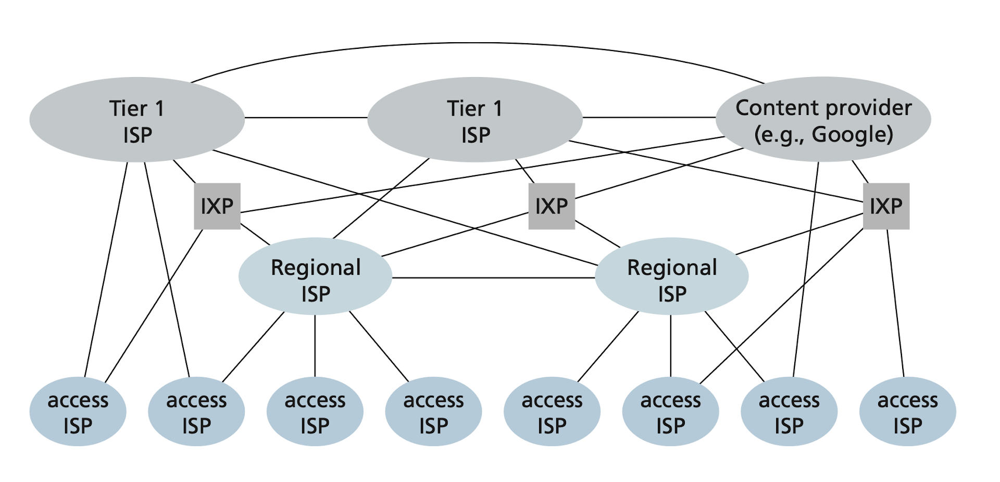

## Real-world Example

The `ping` and `traceroute` tools directly expose the delay concepts above. Here is a real session annotated to map tool output to the theory.

```bash
# Measure round-trip latency and packet loss to Google's DNS resolver
$ ping -c 5 8.8.8.8
PING 8.8.8.8 (8.8.8.8): 56 data bytes
64 bytes from 8.8.8.8: icmp_seq=0 ttl=117 time=12.456 ms
64 bytes from 8.8.8.8: icmp_seq=1 ttl=117 time=11.893 ms
64 bytes from 8.8.8.8: icmp_seq=2 ttl=117 time=12.101 ms
64 bytes from 8.8.8.8: icmp_seq=3 ttl=117 time=11.987 ms
64 bytes from 8.8.8.8: icmp_seq=4 ttl=117 time=12.233 ms
# RTT ≈ 12 ms. Propagation dominates — we are roughly 1,200 km from the nearest
# Google PoP at 2×10^8 m/s fiber speed: 1.2×10^6 m / 2×10^8 m/s ≈ 6 ms one-way.
--- 8.8.8.8 ping statistics ---
5 packets transmitted, 5 received, 0% packet loss

# Trace the path: see each router hop and per-hop RTT
$ traceroute 8.8.8.8
traceroute to 8.8.8.8, 64 hops max, 52 byte packets
 1  192.168.1.1 (192.168.1.1)   1.234 ms   0.987 ms   1.102 ms   # home router
 2  10.0.0.1    (10.0.0.1)      4.512 ms   4.231 ms   4.419 ms   # ISP CPE
 3  72.14.211.1 (72.14.211.1)   5.671 ms   5.489 ms   5.601 ms   # ISP backbone
 4  209.85.240.1                 9.102 ms   8.893 ms   9.011 ms   # Google AS15169 ingress
 5  8.8.8.8                     12.456 ms  11.893 ms  12.101 ms   # destination
# Each hop adds latency; hops 1-2 are LAN/access; hop 4 is the Google backbone entry.
```

A simple Python socket example shows how a host opens a connection — one line directly maps to each layer we will study in this series.

```python
import socket
import time

def measure_latency(host: str, port: int) -> float:
    """Open a TCP connection and return connect latency in milliseconds."""
    start = time.perf_counter()
    with socket.create_connection((host, port), timeout=5) as sock:
        elapsed = time.perf_counter() - start
    return elapsed * 1000  # ms

# Connect to Google's HTTPS port
latency_ms = measure_latency("8.8.8.8", 443)
print(f"TCP connect latency: {latency_ms:.2f} ms")
# ~12 ms — dominated by propagation + TCP three-way handshake (covered in note 5)
```

## In Practice

Real-world latency budgets are tight. A web page load is a cascade of network round-trips: DNS lookup → TCP connect → TLS handshake → HTTP GET → HTML parse → resource fetches. Each round-trip at 50 ms RTT adds 50+ ms to page load time. Google's research found a 100 ms increase in latency reduces search revenue by ~1%. This is why CDNs (content delivery networks) exist — to reduce the propagation component by serving content from PoPs geographically close to users.

> [!TIP]
> When debugging slow applications, distinguish bandwidth-bound problems (large transfers saturating a link — fix with compression, CDN, or a faster link) from latency-bound problems (many small round-trips — fix with connection reuse, pipelining, or protocol-level improvements like HTTP/2 multiplexing or QUIC). Confusing the two leads to optimizing the wrong thing.

> [!WARNING]
> The term "bandwidth" is widely misused. In everyday speech people say "my bandwidth is slow" when they mean "my latency is high" or "my throughput is low." In networking, bandwidth is the link capacity in bps — a fixed property of hardware. Throughput is what you achieve; latency is how long you wait. Keep these three separate in your mental model.

The bandwidth-delay product (BDP) is a number every systems engineer should compute before tuning TCP. If your cross-continental link is 10 Gbps with an 80 ms RTT, the BDP is 10×10⁹ × 0.08 = 800 Mb = 100 MB. That is how many bytes need to be "in flight" simultaneously to saturate the link. Default TCP window sizes of 64 KB are laughably small for such a pipe — you will only use 0.08% of the available bandwidth unless you tune `tcp_rmem`, `tcp_wmem`, or use a modern congestion controller like BBR. This is covered in [5 - The Transport Layer — TCP and UDP](./5-tcp-and-udp.md).

### Networks under attack

The Internet's open, best-effort design creates a broad attack surface. Understanding the main threat classes belongs alongside operational networking knowledge.

**Malware** enters hosts via the network and can delete files, steal credentials and personal data, or enlist compromised machines into **botnets** — fleets of infected hosts used to launch further attacks. Most malware is self-replicating: once it infects one host it probes others, causing exponential spread.

**Denial-of-service (DoS) attacks** aim to make a resource (server, link, service) unavailable to legitimate users. Three categories:

- *Vulnerability attacks* — exploit software bugs to crash or destabilize the target with a small number of specially crafted packets.
- *Bandwidth flooding* — send a deluge of packets to saturate the target's access link.
- *Connection flooding* — exhaust the target's half-open or fully open TCP connections so it cannot serve new requests.

**DDoS (Distributed DoS)** attacks coordinate many compromised sources simultaneously, making the flood much harder to filter. Because each individual source sends at a modest rate, simple rate-limiting at the target fails.

**Packet sniffing** is possible on shared or compromised links: a passive receiver records all packets it sees. The defense is end-to-end encryption (TLS); unencrypted protocols leak all payload content to anyone on-path.

**IP spoofing** is the injection of packets with a forged source IP address, allowing an attacker to impersonate another host or obscure the true origin of an attack. Defending against spoofing at scale requires **end-point authentication** — cryptographic proof that a message came from who it claims, not just from the IP address printed in the header.

> [!CAUTION]
> These threats are not theoretical. Botnets have saturated entire IXPs with DDoS traffic exceeding 1 Tbps. IP spoofing is widely used in volumetric amplification attacks (DNS, NTP, SSDP reflection). Treat network security as a day-one design concern, not a follow-on hardening step.

## Pitfalls

- **"Bandwidth and throughput are the same thing."** — Bandwidth is a link property (capacity). Throughput is the effective data rate you achieve end-to-end, always ≤ bandwidth. Congestion, protocol overhead, slow receivers, and window limits all reduce throughput below bandwidth.
- **"The Internet is reliable."** — IP provides best-effort delivery only. Packets can be dropped, reordered, or duplicated. Reliability is a service provided by TCP at the transport layer, not by the network itself.
- **"Latency is mostly about bandwidth — if I upgrade my link, my latency will drop."** — Propagation latency is bounded by the speed of light and the physical route length. Upgrading from 1 Gbps to 10 Gbps reduces transmission delay for large packets but does nothing to propagation delay, which often dominates for interactive traffic.
- **"Circuit switching is strictly worse than packet switching."** — Circuit switching provides strong latency guarantees and zero jitter for reserved circuits. It is still used in private WAN services (MPLS LSPs) and SONET/SDH optical networks where predictable performance is more important than statistical efficiency.
- **"Routers and switches are the same device."** — Switches operate at Layer 2 (Ethernet frames, MAC addresses), forwarding within a single broadcast domain. Routers operate at Layer 3 (IP packets, IP addresses), forwarding between different networks. Modern "Layer 3 switches" blur this but conceptually the layers remain distinct.
- **"Store-and-forward only adds one extra transmission delay."** — On an N-link path, store-and-forward multiplies the transmission delay by N. For a 1,500-byte packet on a 1 Mbps link crossing 10 routers, that is 10 × 12 ms = 120 ms of transmission delay alone, before propagation.

## Exercises

### Exercise 1 — Delay decomposition

A 1,500-byte packet is sent from San Francisco to New York (distance ≈ 4,000 km in fiber) over a 100 Mbps link with a propagation speed of 2×10⁸ m/s. Assume zero queueing and processing delay. Calculate: (a) propagation delay, (b) transmission delay, (c) total end-to-end delay.

#### Solution

Propagation delay is distance divided by propagation speed. Converting units:

```math
d_{\text{prop}} = \frac{4{,}000 \times 10^3 \text{ m}}{2 \times 10^8 \text{ m/s}} = 0.02 \text{ s} = 20 \text{ ms}
```

Transmission delay is packet size divided by link rate:

```math
d_{\text{trans}} = \frac{1{,}500 \times 8 \text{ bits}}{100 \times 10^6 \text{ bps}} = \frac{12{,}000}{10^8} = 0.00012 \text{ s} = 0.12 \text{ ms}
```

Total: 20 + 0.12 = **20.12 ms**. The takeaway: at 100 Mbps, propagation completely dominates for typical packet sizes. Upgrading to 10 Gbps reduces transmission delay to 1.2 µs — negligible compared to 20 ms propagation. The physics of light speed is the real constraint.

---

### Exercise 2 — Packet switching statistical multiplexing

Ten users share a 1 Mbps link. Each user alternates: active 10% of the time at 100 kbps, idle 90% of the time. (a) Under circuit switching, how many users can be supported? (b) Under packet switching, what is the probability that more than one user is active at the same time? (c) What is the probability that more than three users are active?

#### Solution

**(a) Circuit switching:** Each active user needs 100 kbps. The link is 1 Mbps. So circuit switching supports 1,000,000 / 100,000 = **10 simultaneous users**. But since only one in ten is active at any time on average, you are reserving capacity for nine idle circuits. Wasteful.

**(b–c) Packet switching:** Each user is independently active with probability p = 0.1. With n = 10 users, the number of active users X ~ Binomial(10, 0.1). The probability of exactly k users active:

```math
P(X = k) = \binom{10}{k} (0.1)^k (0.9)^{10-k}
```

P(X > 1) = 1 − P(X = 0) − P(X = 1):

```math
P(X = 0) = (0.9)^{10} \approx 0.3487
```

```math
P(X = 1) = \binom{10}{1}(0.1)^1(0.9)^9 \approx 10 \times 0.1 \times 0.3874 \approx 0.3874
```

```math
P(X > 1) = 1 - 0.3487 - 0.3874 \approx 0.264 \approx 26.4\%
```

P(X > 3) = 1 − P(X ≤ 3). Summing the remaining terms gives P(X > 3) ≈ 1.3%. Packet switching can accommodate all 10 users on a 1 Mbps link with only a ~1.3% chance of more than 3 users competing simultaneously — and a modern router buffers that burst without dropping anything. Circuit switching would need 10× capacity to serve the same 10 users in the worst case.

---

### Exercise 3 — Bandwidth-delay product

A transcontinental fiber link has capacity 40 Gbps and round-trip time 80 ms. (a) What is the BDP? (b) If a TCP sender has a receive window of 64 KB, what fraction of link capacity will it utilize? (c) What window size is needed to fully utilize the link?

#### Solution

**(a)** BDP = bandwidth × RTT = 40×10⁹ bps × 0.08 s = 3.2×10⁹ bits = **400 MB**. This is how many bytes must be in-flight simultaneously to keep the pipe full.

**(b)** With a 64 KB = 65,536-byte window, the sender sends 65,536 bytes then stops waiting for an ACK. The ACK arrives after one RTT (80 ms). In that RTT, the link could have carried 40×10⁹ × 0.08 / 8 = 400,000,000 bytes. Utilization = 65,536 / 400,000,000 ≈ **0.016%**. The link is almost completely idle.

**(c)** Window needed = BDP in bytes = 400,000,000 bytes = **400 MB**. The default kernel TCP buffer cap is typically 4–16 MB. You need to tune `net.core.rmem_max`, `net.ipv4.tcp_rmem`, and `net.ipv4.tcp_wmem` on Linux to allow windows large enough to utilize high-BDP paths. This is the "long fat pipe" problem; covered further in [5 - The Transport Layer — TCP and UDP](./5-tcp-and-udp.md).

---

### Exercise 4 — Conceptual: why does the Internet use packet switching?

Explain in three to four paragraphs why the Internet's designers chose packet switching over circuit switching, and what engineering tradeoffs that choice imposed on higher-layer protocols.

#### Solution

The Internet's traffic is fundamentally bursty. A user browsing the web is idle 99% of the time and then bursts at wire speed. Circuit switching would require reserving a full-rate channel for every user at all times — an extraordinarily wasteful allocation. Packet switching allows many users to share the same physical links, using idle capacity opportunistically. This statistical multiplexing is the economic foundation of the Internet: the same fiber can serve millions of users without reserving a private channel for each.

Packet switching also enables simpler, more resilient routing. A circuit must be re-established if any router on the path fails. A packet network simply finds a new route — each packet is independently forwarded, so partial failures cause temporary degradation rather than complete outage. The original ARPANET design was explicitly motivated by this survivability requirement (DARPA wanted a network that could survive nuclear strikes).

The tradeoff is that best-effort packet delivery provides no guarantees. Packets can be dropped when buffers overflow, reordered when routing changes, or duplicated due to link-layer retransmissions. This pushed reliability to the edge — TCP (Layer 4) was invented specifically to provide reliable, ordered delivery on top of the unreliable IP substrate. The Internet's layering model (studied in [2 - OSI and TCP/IP Models](./2-osi-and-tcp-ip.md)) is a direct consequence of this design choice: IP does just enough to get packets to the destination; everything else is the endpoint's problem.

This "end-to-end principle" has enabled the Internet's flexibility. New protocols (UDP, QUIC, SCTP) can build different reliability and ordering guarantees on top of IP without modifying the network core. The cost is that applications must handle the unreliability they care about, and the network cannot enforce service-level agreements the way circuit-switched PSTN could.

## Sources

- Kurose, J. F. & Ross, K. W. (2022). *Computer Networking: A Top-Down Approach* (8th ed.). Chapter 1. Pearson.
- Tanenbaum, A. S. & Wetherall, D. (2011). *Computer Networks* (5th ed.). Chapter 1. Pearson.
- RFC 791 — Internet Protocol (IPv4). https://www.rfc-editor.org/rfc/rfc791
- RFC 793 — Transmission Control Protocol. https://www.rfc-editor.org/rfc/rfc793
- Saltzer, J. H., Reed, D. P., & Clark, D. D. (1984). "End-to-End Arguments in System Design." *ACM TOCS* 2(4). https://web.mit.edu/Saltzer/www/publications/endtoend/endtoend.pdf
- Material in this note draws on open-source chapter summaries at [VasanthVanan/computer-networking-top-down-approach-notes](https://github.com/VasanthVanan/computer-networking-top-down-approach-notes) (Kurose & Ross 8th ed.) and [karthick28/computer-networking-notes](https://github.com/karthick28/computer-networking-notes) (Coursera "Bits and Bytes of Computer Networking").

## Related

- [2 - OSI and TCP/IP Models](./2-osi-and-tcp-ip.md)
- [3 - Physical and Link Layer](./3-physical-and-link-layer.md)
- [4 - The Network Layer — IP, Subnetting, Routing](./4-network-layer-ip.md)
- [5 - The Transport Layer — TCP and UDP](./5-tcp-and-udp.md)
- [8 - Performance — Latency, Throughput, Congestion](./8-performance.md)
