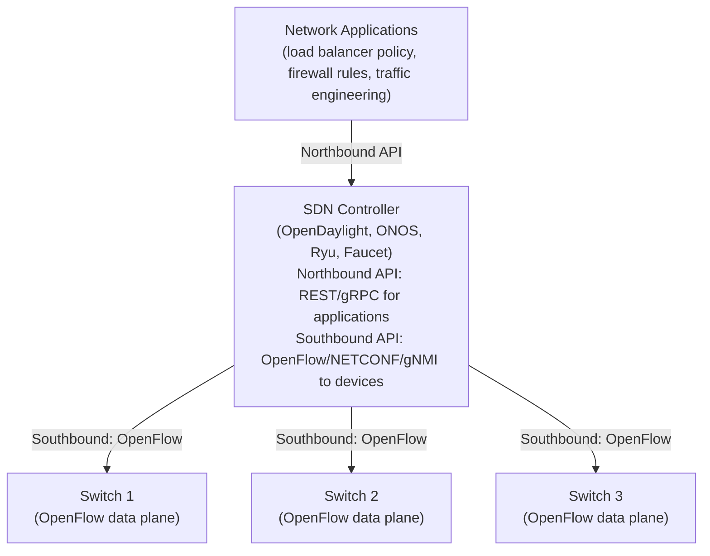
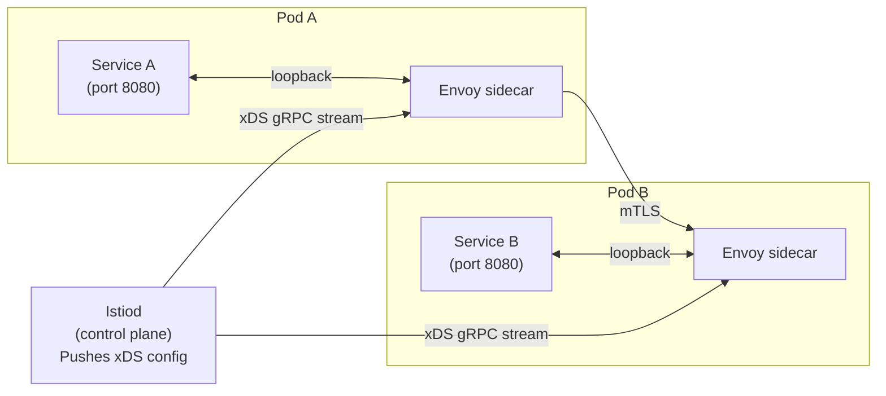
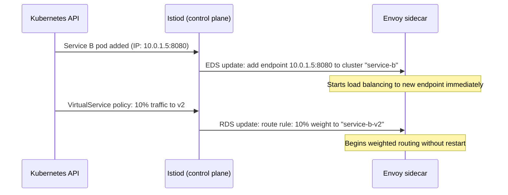

# 10 - Modern Networking — SDN, gRPC, Service Mesh

[toc]

> **TL;DR:** Modern cloud-native networking decouples control from forwarding, enabling programmatic network management at scale. Software-Defined Networking (SDN) separates the control plane (what policy says) from the data plane (how packets are forwarded). gRPC over HTTP/2 replaces REST+JSON for inter-service communication with generated stubs, bidirectional streaming, and binary (Protobuf) encoding. Service meshes (Envoy, Istio, Linkerd) provide mTLS, observability, and traffic management transparently as a sidecar, without modifying application code.

## Vocabulary

**SDN (Software-Defined Networking)**: An architecture that centralizes network control into a software controller, decoupling the control plane from the forwarding hardware.

---

**Control plane**: The part of a network device (or separate controller) that computes forwarding decisions — runs routing protocols, programs the forwarding table.

---

**Data plane (forwarding plane)**: The part that actually moves packets, based on forwarding tables programmed by the control plane. Implemented in ASICs, FPGAs, or P4-programmable hardware.

---

**OpenFlow**: The first widely adopted SDN control protocol. A controller communicates flow rules to OpenFlow-enabled switches via a TCP channel. RFC-not; IEEE 802 SDNFORUM standard.

---

**P4 (Programming Protocol-Independent Packet Processors)**: A domain-specific language for programming the data plane. Allows defining custom match-action tables and packet parsers without changing switch ASICs.

---

**gRPC**: A high-performance, language-agnostic RPC framework from Google. Uses HTTP/2 for transport and Protocol Buffers (Protobuf) for serialization. Supports unary, server-streaming, client-streaming, and bidirectional-streaming RPCs.

---

**Protocol Buffers (Protobuf)**: A binary serialization format with a schema language. More compact and faster to serialize/deserialize than JSON; requires a compiled schema. Canonically used with gRPC.

---

**Service mesh**: Infrastructure layer that manages service-to-service communication in a microservices architecture. Provides mTLS, load balancing, circuit breaking, retries, observability, and traffic management — typically as a sidecar proxy.

---

**Sidecar proxy**: A proxy process co-located with each service instance in the same pod/VM. Intercepts all inbound and outbound network traffic from the service. Examples: Envoy, Linkerd2-proxy.

---

**Envoy**: A high-performance, C++ L4/L7 proxy originally built at Lyft. The data plane of Istio. Handles HTTP/1.1, HTTP/2, gRPC, TCP, and provides rich observability (metrics, traces, access logs) via its xDS API.

---

**xDS API**: Envoy's management API (Discovery Service). A control plane pushes configuration updates to Envoy proxies via gRPC streams. APIs: CDS (Cluster), EDS (Endpoint), LDS (Listener), RDS (Route), SDS (Secret).

---

**Istio**: An open-source service mesh built on Envoy. Control plane: Istiod. Data plane: Envoy sidecars injected into every pod. Provides mTLS, RBAC, traffic management, telemetry.

---

**Circuit breaker**: A resilience pattern. After a backend fails repeatedly, the circuit "opens" and requests fail fast (without sending to the backend) until a probe succeeds. Prevents cascading failures.

---

**OpenTelemetry (OTel)**: A vendor-neutral observability framework providing APIs, SDKs, and a collector for traces, metrics, and logs. The standard for distributed tracing in modern microservices.

---

## Intuition

Traditional networking is like programming in assembly: you configure each router individually, the logic is distributed, and changing policy requires updating dozens of devices. SDN is like writing high-level code: a central controller holds the network's intent, translates it into forwarding rules, and pushes them to every switch simultaneously. The programmer sees one API; the hardware sees exact match-action rules.

A service mesh is the same idea applied to the application layer. Instead of configuring each microservice to do its own TLS, load balancing, and retransmission, you deploy a sidecar next to every service. The sidecar handles all of that transparently. The service developer writes business logic; the mesh operator configures policies in one place. The decoupling is the same as SDN — policy in a central control plane, enforcement in distributed data plane proxies.

gRPC is HTTP/2 with a code generator. You define your API in a `.proto` file, run `protoc`, and get type-safe client and server stubs in 10+ languages. The binary encoding is 5–10× smaller than JSON, the streaming support is native, and HTTP/2 multiplexing means hundreds of concurrent RPC streams on one connection.

## SDN Architecture



### OpenFlow Flow Tables

Each switch maintains a flow table with entries in the form:

`(match fields, priority, actions, counters)`

Match fields: any combination of Ethernet src/dst MAC, VLAN ID, IP src/dst, TCP/UDP ports, ingress port. Actions: forward to port, drop, flood, rewrite header, send to controller.

When a packet arrives, the switch performs a longest-priority-match against the table. If no entry matches, the switch either drops the packet or sends it to the controller (if configured with `table-miss = CONTROLLER`). The controller installs a new flow entry for subsequent packets.

> [!NOTE]
> OpenFlow's reactive (per-packet controller query for unknown flows) mode has significant latency for the first packet of each new flow. Production SDN deployments use **proactive flow installation** — the controller pre-programs all expected flows — to avoid controller latency on the data path.

### P4 and Programmable Data Planes

P4 allows defining how packets are parsed and processed directly in hardware, without changing the ASIC's firmware. A P4 program specifies:
1. **Headers** to parse (arbitrary protocol stacks).
2. **Match-action tables** (like flow tables, but custom).
3. **Deparsers** to reconstruct packets after modification.

This enables implementing custom protocols (INT — in-band network telemetry, custom load balancing algorithms) in hardware without vendor firmware updates.

## gRPC

### Protobuf Schema and Generated Code

A gRPC service is defined in a `.proto` file:

```protobuf
// inference.proto
syntax = "proto3";

package inference;

service InferenceService {
  // Unary RPC: one request, one response
  rpc Predict (PredictRequest) returns (PredictResponse);

  // Server streaming: one request, stream of responses
  rpc PredictStream (PredictRequest) returns (stream PredictResponse);

  // Bidirectional streaming: streams in both directions
  rpc PredictBidi (stream PredictRequest) returns (stream PredictResponse);
}

message PredictRequest {
  bytes input_data = 1;    // raw bytes for flexibility
  string model_name = 2;   // which model to run
  int32 max_tokens = 3;
}

message PredictResponse {
  bytes output_data = 1;
  float latency_ms = 2;
  string status = 3;
}
```

Run `protoc --python_out=. --grpc_python_out=. inference.proto` to generate Python stubs. The generated code is type-safe, versioned by the `.proto` schema, and backward-compatible if you follow proto3 conventions (no field removal, only field additions).

> [!IMPORTANT]
> Protobuf field numbers (the `= 1`, `= 2` in the schema) are the serialized identifiers — not the field names. Never reuse a field number after removing a field, even if you give it a different name. Doing so causes deserialization errors in clients that still send the old field type. Use `reserved` to prevent accidental reuse: `reserved 3; reserved "old_field_name";`.

### gRPC vs REST

| Property | gRPC | REST/JSON |
| :--- | :--- | :--- |
| Protocol | HTTP/2 | HTTP/1.1 or HTTP/2 |
| Encoding | Protobuf (binary) | JSON (text) |
| Contract | Strict schema (.proto) | Optional (OpenAPI) |
| Streaming | Native (4 modes) | SSE or WebSocket workarounds |
| Code generation | First-class | Optional (openapi-generator) |
| Browser support | Requires grpc-web proxy | Native |
| Debuggability | Requires Protobuf decoder | Human-readable JSON |

## Service Mesh — Envoy and Istio

### Sidecar Injection

In Kubernetes, Istio injects an Envoy proxy sidecar into every application pod automatically (via a MutatingWebhookConfiguration). The sidecar runs as a second container in the pod and uses `iptables` rules to intercept all inbound and outbound TCP traffic — the application does not need to know about it.



### xDS Configuration Flow

Istiod maintains a model of all services and pods (via the Kubernetes API). When a pod comes up or a policy changes, Istiod pushes updated xDS configuration to all Envoy sidecars via a long-lived gRPC stream. This push model means Envoy picks up changes in <100 ms without restarts.



### Observability with OpenTelemetry

Envoy automatically emits distributed trace spans (Zipkin/Jaeger/OTLP format), metrics (Prometheus), and access logs. OpenTelemetry instruments the application code to propagate trace context (W3C TraceContext headers). The combined result: a complete trace from user request through every service hop, visible in Grafana/Tempo/Jaeger.

> [!TIP]
> Instrument your services with OpenTelemetry from day one, even before deploying a service mesh. The `otel-collector` can receive traces/metrics/logs from both the application (via OTLP) and the sidecar (via Zipkin), correlating them by trace ID. Retroactively adding observability to a production system is far harder than building it in from the start.

## Real-world Example

A minimal gRPC server and client in Python implementing the inference service defined above:

```python
# server.py — gRPC inference server
import time
import grpc
from concurrent import futures
# Generated by: protoc --python_out=. --grpc_python_out=. inference.proto
import inference_pb2
import inference_pb2_grpc

class InferenceServicer(inference_pb2_grpc.InferenceServiceServicer):
    def Predict(
        self,
        request: inference_pb2.PredictRequest,
        context: grpc.ServicerContext,
    ) -> inference_pb2.PredictResponse:
        """Unary RPC: process one request and return one response."""
        t0 = time.perf_counter()
        # Simulate model inference
        result = b"output:" + request.input_data[::-1]  # reverse bytes as dummy output
        latency = (time.perf_counter() - t0) * 1000
        return inference_pb2.PredictResponse(
            output_data=result,
            latency_ms=latency,
            status="ok",
        )

    def PredictStream(
        self,
        request: inference_pb2.PredictRequest,
        context: grpc.ServicerContext,
    ):
        """Server streaming: yield multiple tokens (streaming generation)."""
        for i in range(5):
            yield inference_pb2.PredictResponse(
                output_data=f"token_{i}".encode(),
                latency_ms=float(i),
                status="streaming",
            )
            time.sleep(0.1)  # simulate token-by-token generation

def serve() -> None:
    server = grpc.server(futures.ThreadPoolExecutor(max_workers=10))
    inference_pb2_grpc.add_InferenceServiceServicer_to_server(InferenceServicer(), server)
    server.add_insecure_port("[::]:50051")
    server.start()
    print("gRPC server listening on port 50051")
    server.wait_for_termination()

# client.py
import grpc
import inference_pb2
import inference_pb2_grpc

def run_client() -> None:
    with grpc.insecure_channel("localhost:50051") as channel:
        stub = inference_pb2_grpc.InferenceServiceStub(channel)

        # Unary RPC
        response = stub.Predict(
            inference_pb2.PredictRequest(
                input_data=b"hello world",
                model_name="gpt-mini",
                max_tokens=100,
            )
        )
        print(f"Unary response: {response.output_data}, latency: {response.latency_ms:.2f}ms")

        # Server streaming RPC
        print("Streaming tokens:")
        for token in stub.PredictStream(
            inference_pb2.PredictRequest(input_data=b"stream test", model_name="gpt-mini")
        ):
            print(f"  token: {token.output_data.decode()}")
```

> [!NOTE]
> For production gRPC servers, use `grpc.aio` (asyncio-based) instead of the thread pool server. The asyncio implementation handles thousands of concurrent streams on a single thread via coroutines. The thread pool server serializes non-streaming handlers per-thread, which limits concurrency. Envoy's gRPC-JSON transcoder allows REST clients to call gRPC services without gRPC libraries.

## In Practice

**SDN is not universally adopted.** Most enterprises run traditional distributed routing (OSPF/BGP). SDN is dominant in datacenter fabrics (Google's Jupiter, Meta's Fabric Aggregator, Microsoft Azure) where the operator controls all hardware and needs rapid programmatic policy changes at scale. OpenFlow-based SDN proved difficult to scale to large networks due to controller reliability and performance requirements.

**Service mesh overhead is real.** Each Envoy sidecar consumes ~50–100 MB RAM per pod and adds ~0.2–1 ms latency per hop (TLS handshake amortized over connection lifetime, but header parsing and metric emission add overhead). For high-RPS, latency-sensitive services, profile before enabling every mesh feature. Cilium (eBPF-based) is an alternative that moves proxy logic into the kernel, dramatically reducing overhead.

> [!WARNING]
> gRPC deadlines (timeouts) are not automatically propagated. If service A calls service B with a 1-second deadline, and B calls C without forwarding the deadline, C will run until its own timeout even if A has already timed out and discarded the response. This causes wasted CPU, latency spikes, and phantom load. Always propagate gRPC deadlines downstream: `ctx.WithTimeout` in Go propagates the deadline; the gRPC stub will abort the call when the deadline elapses.

## Pitfalls

- **"SDN eliminates the need to understand networking."** — SDN changes where you configure policy (controller vs. per-device CLI) but does not eliminate the need to understand IP routing, BGP, spanning tree, or QoS. The controller still implements these; you need to understand them to configure the controller correctly.
- **"A service mesh fixes reliability problems."** — Retries, circuit breakers, and timeouts in Envoy are configuration options that require understanding the failure modes of your services. Setting a 3× retry on a non-idempotent endpoint causes triple charging, triple DB writes, etc. The mesh provides mechanisms; you must apply policy correctly.
- **"Protobuf is always faster than JSON."** — Protobuf serialization is typically 5–10× smaller and faster. But for tiny messages (<100 bytes), the framing overhead and library startup cost can make JSON competitive. Profile your actual workload. Also: Protobuf is not self-describing (you need the schema to parse it), which makes debugging harder.
- **"gRPC doesn't work in browsers."** — Standard gRPC uses HTTP/2 trailers, which browsers cannot access via the Fetch API. gRPC-Web (a thin shim protocol) bridges this, with Envoy translating between gRPC-Web and gRPC on the server side. Alternatively, ConnectRPC implements gRPC semantics over both HTTP/1.1 and HTTP/2 with JSON support.

## Exercises

### Exercise 1 — OpenFlow flow table

An OpenFlow switch has the following flow table:

| Priority | Match | Action |
| :---: | :--- | :--- |
| 100 | srcMAC=aa:bb:cc:dd:ee:01 | Forward port 2 |
| 50 | dstPort=80 | Forward port 3 (HTTP server) |
| 50 | dstPort=443 | Forward port 3 (HTTPS server) |
| 10 | ANY | Send to controller |

Trace the action for: (a) a packet from MAC aa:bb:cc:dd:ee:01 to dstPort=80, (b) a packet from any host to dstPort=443, (c) a packet from any host to dstPort=22, (d) a packet from MAC aa:bb:cc:dd:ee:01 to dstPort=22.

#### Solution

OpenFlow matches the highest priority entry first.

**(a) srcMAC=aa:bb:cc:dd:ee:01, dstPort=80:**
Priority 100 entry matches (srcMAC matches). Action: **Forward port 2**.
The dstPort=80 rule (priority 50) is never reached — first match wins, and priority 100 > 50.

**(b) srcMAC=anything, dstPort=443:**
Priority 100 entry: srcMAC doesn't match aa:bb:cc:dd:ee:01. No match.
Priority 50 entry for dstPort=443: match. Action: **Forward port 3**.

**(c) srcMAC=anything, dstPort=22:**
Priority 100: srcMAC no match.
Priority 50 (dstPort=80): dstPort=22 ≠ 80. No match.
Priority 50 (dstPort=443): dstPort=22 ≠ 443. No match.
Priority 10 (ANY): **Match. Send to controller**. The controller will inspect the packet and decide: either install a new flow entry or drop.

**(d) srcMAC=aa:bb:cc:dd:ee:01, dstPort=22:**
Priority 100: srcMAC matches. Action: **Forward port 2**.
Same as (a) — the srcMAC match wins at priority 100, regardless of dstPort.

---

### Exercise 2 — gRPC vs REST latency analysis

A client calls a service 1,000 times with a 1 KB request and 1 KB response. Compare gRPC and REST/JSON on three metrics: (a) bytes on the wire per call, (b) connection setup overhead for all 1,000 calls, (c) which is preferred for a streaming inference API?

#### Solution

**(a) Bytes on the wire:**
JSON encodes field names in every message. A 1 KB JSON payload with field names might be 1,100–1,200 bytes on the wire (field names are repeated).
Protobuf uses field numbers (1–3 bytes each) instead of names. A 1 KB Protobuf payload is typically 800–900 bytes.
Plus HTTP/2 HPACK compressed headers (gRPC) vs repeated HTTP/1.1 text headers (REST/HTTP/1.1).

Rough estimate: gRPC is **20–40% smaller** per call, and HPACK reduces repeated header overhead by 80–90% for subsequent requests on the same connection.

**(b) Connection setup overhead:**
REST over HTTP/1.1: each new connection requires TCP + TLS handshake (2 RTTs). If the client reuses one connection with keep-alive, only 1 handshake for all 1,000 calls.
gRPC over HTTP/2: all 1,000 calls are multiplexed on **1 TCP + TLS connection** (1 handshake). Connection setup amortizes to effectively zero per call.

If the REST client does NOT use keep-alive (common in naive implementations), each call costs 2 RTTs of connection setup = 2,000 RTTs wasted for 1,000 calls.

**(c) Streaming inference API:**
gRPC is clearly superior. For a language model generating tokens one at a time (server streaming), gRPC's `returns (stream PredictResponse)` allows sending each token as it is generated over the same HTTP/2 stream. REST would require either SSE (Server-Sent Events — adds framing overhead and lacks backpressure) or WebSockets (not RESTful, separate connection). gRPC's bidirectional streaming also allows sending the next prompt while receiving the last response — useful for multi-turn conversation.

---

### Exercise 3 — Service mesh resilience policy

A service mesh policy should implement: (1) retry failed requests up to 3 times with exponential backoff, (2) circuit break after 5 consecutive failures, (3) timeout all requests after 2 seconds. Write an Envoy VirtualService/DestinationRule in Istio YAML format implementing this policy for service "payment-service".

#### Solution

```yaml
---
# VirtualService: routing + retry + timeout policy
apiVersion: networking.istio.io/v1beta1
kind: VirtualService
metadata:
  name: payment-service
  namespace: production
spec:
  hosts:
    - payment-service
  http:
    - route:
        - destination:
            host: payment-service
            port:
              number: 8080
      timeout: 2s                    # (3) 2-second timeout per request
      retries:
        attempts: 3                  # (1) retry up to 3 times
        perTryTimeout: 600ms         # each retry gets 600ms (3 × 600ms < 2s total)
        retryOn: "5xx,gateway-error,connect-failure,retriable-4xx"
        # NOTE: retryOn must be idempotent methods only (GET) in production
        # POST retries risk double processing — add x-envoy-retry-on: retriable-status-codes
---
# DestinationRule: circuit breaker (outlier detection)
apiVersion: networking.istio.io/v1beta1
kind: DestinationRule
metadata:
  name: payment-service
  namespace: production
spec:
  host: payment-service
  trafficPolicy:
    outlierDetection:                # (2) circuit breaker
      consecutive5xxErrors: 5        # eject endpoint after 5 consecutive 5xx
      interval: 30s                  # evaluation window
      baseEjectionTime: 30s          # minimum ejection duration
      maxEjectionPercent: 50         # never eject more than 50% of endpoints
    connectionPool:
      tcp:
        connectTimeout: 500ms
      http:
        http2MaxRequests: 1000
        pendingRequests: 1000
```

The combination of `timeout`, `retries`, and `outlierDetection` implements the full resilience policy. The `maxEjectionPercent: 50` is critical: ejecting all endpoints (100%) would take the entire service down. Setting it to 50% ensures at least half the endpoints remain available even under heavy failure.

## Sources

- McKeown, N. et al. (2008). "OpenFlow: Enabling Innovation in Campus Networks." *SIGCOMM CCR* 38(2). https://dl.acm.org/doi/10.1145/1355734.1355746
- Bosshart, P. et al. (2014). "P4: Programming Protocol-Independent Packet Processors." *SIGCOMM CCR* 44(3). https://dl.acm.org/doi/10.1145/2656877.2656890
- Google gRPC documentation. https://grpc.io/docs/
- Istio documentation. https://istio.io/latest/docs/
- Burns, B. et al. (2022). *Kubernetes: Up and Running* (3rd ed.). O'Reilly.
- Envoy proxy documentation. https://www.envoyproxy.io/docs/

## Related

- [5 - The Transport Layer — TCP and UDP](./5-tcp-and-udp.md)
- [6 - Application Layer — HTTP, DNS, TLS](./6-application-layer.md)
- [9 - Network Security](./9-network-security.md)
- [12 - Cloud and Datacenter Networking](./12-cloud-and-datacenter.md)
