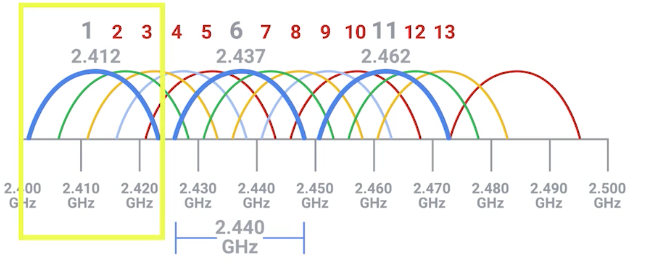
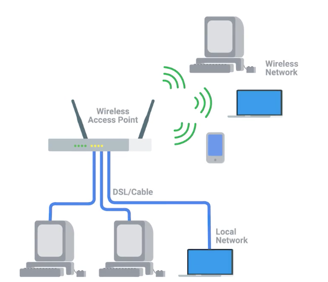
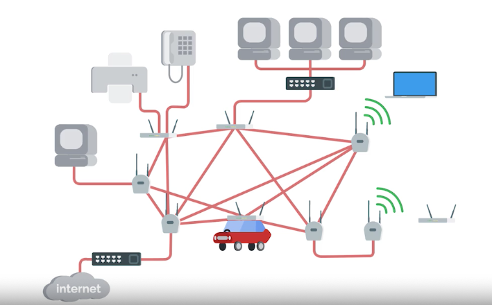
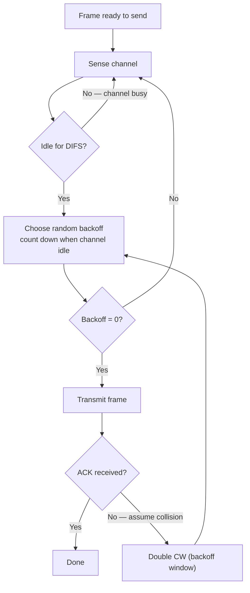
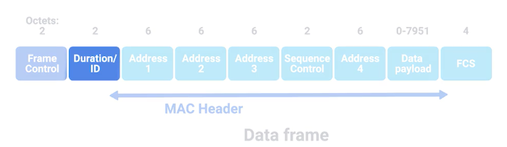
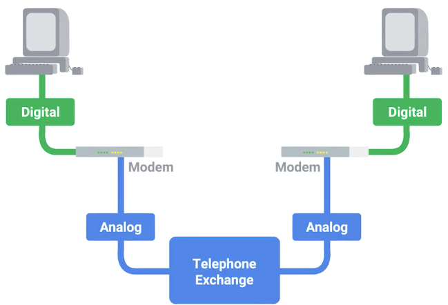
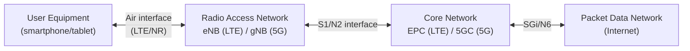

# 11 - Wireless and Mobile Networking

[toc]

> **TL;DR:** Wireless networks share fundamental challenges not found in wired networking: shared medium (all stations in range contend for the same spectrum), fading (signal strength varies with distance, obstacles, and multipath), and mobility (nodes move, requiring handover between access points or base stations). Wi-Fi (802.11) handles contention with CSMA/CA; 5G uses massive MIMO and millimeter-wave spectrum for multi-Gbps throughput; both require sophisticated PHY-layer coding to combat channel impairments that wired Ethernet never encounters.

## Vocabulary

**CSMA/CA (Carrier Sense Multiple Access with Collision Avoidance)**: Wi-Fi's medium access protocol. Unlike CSMA/CD (used by wired Ethernet), wireless stations cannot detect collisions during transmission (the transmitted signal drowns the received signal). CSMA/CA uses random backoff to avoid collisions before they happen.

---

**SSID (Service Set Identifier)**: The human-readable network name broadcasted by an access point. The 32-byte label in beacon frames.

---

**BSSID (Basic Service Set Identifier)**: The MAC address of the access point (or the 48-bit identifier for an ad-hoc network). Identifies a specific AP instance, as opposed to the SSID which identifies the network.

---

**Access Point (AP)**: The 802.11 base station that bridges the wireless network to the wired LAN. Manages associations, beacons, and channel coordination.

---

**Channel**: A specific frequency band allocation. 2.4 GHz band has 11 overlapping channels (3 non-overlapping: 1, 6, 11). 5 GHz band has ~24 non-overlapping 20 MHz channels. 6 GHz band (Wi-Fi 6E) adds even more.

---

**OFDM (Orthogonal Frequency Division Multiplexing)**: The modulation scheme used by 802.11a/g/n/ac/ax. Splits the channel into many narrow orthogonal subcarriers, each modulated independently. Robust to multipath fading.

---

**MIMO (Multiple Input Multiple Output)**: Using multiple transmit and receive antennas to increase throughput (spatial multiplexing) or reliability (diversity). 802.11n introduced MIMO; Wi-Fi 6 supports 8×8 MU-MIMO.

---

**MU-MIMO (Multi-User MIMO)**: Allows an AP to transmit to multiple stations simultaneously on different spatial streams. Wi-Fi 6 supports 8 simultaneous downlink users.

---

**OFDMA (Orthogonal Frequency Division Multiple Access)**: Wi-Fi 6's (802.11ax) resource allocation technique. Divides the channel into Resource Units (RUs) assigned to different stations, reducing overhead for small-packet workloads (IoT, dense deployments).

---

**Hidden node problem**: When two stations A and B are both in range of an AP but not of each other, they cannot detect each other's transmissions and collide at the AP. RTS/CTS mechanism mitigates this.

---

**RTS/CTS (Request to Send / Clear to Send)**: Optional 802.11 mechanism. A station sends RTS before transmitting; the AP broadcasts CTS to silence other stations. Solves the hidden node problem at the cost of overhead.

---

**Handover (handoff)**: The process of transferring a mobile device's connection from one AP (or base station) to another as the device moves.

---

**eNB / gNB**: LTE base station (eNodeB) / 5G NR base station (gNodeB). Provides radio access to UEs (User Equipment, i.e., phones/modems).

---

**5G NR (New Radio)**: The 5G air interface standard. Supports sub-6 GHz (wide coverage, moderate throughput) and mmWave (millimeter wave, 24–40 GHz, Gbps throughput, very short range).

---

**Beamforming**: Directing the RF beam toward a specific user by adjusting the phase of multiple antenna elements. Critical for mmWave 5G where the signal is directional and easily blocked.

---

**BSS (Basic Service Set)**: A network topology in 802.11 where all clients communicate through a central access point. The most common Wi-Fi deployment model (home, enterprise).

---

**IBSS (Independent Basic Service Set)**: An ad-hoc 802.11 network where stations communicate directly with each other, without a central access point.

---

**Frequency band**: A specific section of the radio spectrum allocated for a particular type of communication. 802.11 uses the 2.4 GHz, 5 GHz, and 6 GHz unlicensed bands.

---

**Baud rate**: The number of signal changes (symbols) per second on a transmission medium. In dial-up modems, baud rate and bit rate diverged once multi-bit modulation schemes were introduced.

---

## Intuition

Wireless networking is harder than wired because the physical medium is shared and hostile. Every station within radio range competes for the same spectrum. The channel quality varies second-by-second based on the user's location, nearby obstacles, multipath reflections, and interference from neighboring networks.

Think of a wireless channel as a constantly shifting, noisy telephone call on a party line where everyone shares the line. Wired Ethernet is a private dedicated phone line. The party-line problem requires medium access control (who speaks when). The noise problem requires forward error correction codes. The shifting quality problem requires adaptive modulation (speak more slowly in a noisy room). All three are built into 802.11 and 5G at the physical layer.

Mobility adds another dimension: as a device moves, it must hand off from one AP to another without dropping the connection. In cellular (4G/5G), this is a complex signaling procedure involving the core network. In Wi-Fi (802.11r), fast roaming extensions reduce handover latency to < 50 ms.

## 802.11 Physical Layer

### Channels and Bands

Wi-Fi operates in three unlicensed bands. Each band has different propagation characteristics:

| Band | Channels | Max data rate | Range | Penetration |
| :--- | :--- | :--- | :--- | :--- |
| 2.4 GHz | 3 non-overlapping (1, 6, 11) | 600 Mbps (n) | Long (50–100m indoors) | Good through walls |
| 5 GHz | ~24 non-overlapping 20 MHz | 6.9 Gbps (ac/ax) | Medium (30–50m indoors) | Moderate |
| 6 GHz (Wi-Fi 6E) | ~60 non-overlapping | 9.6 Gbps (ax) | Short | Lower |

The 2.4 GHz band is congested because it is also used by Bluetooth, microwave ovens, and baby monitors. The 5 GHz and 6 GHz bands have more non-overlapping channels and less interference. The eleven 2.4 GHz channels overlap heavily — only channels 1, 6, and 11 are fully non-overlapping, so adjacent APs should be assigned to those three channels to avoid creating overlapping collision domains.



> [!NOTE]
> Access points typically perform background congestion analysis and dynamically switch to the least-congested channel on startup or when interference is detected. In enterprise deployments (Cisco Catalyst, Aruba), this is managed centrally by a wireless controller.

### Adaptive Modulation and Coding

When a station is close to the AP (high SNR), it uses high-order modulation (1024-QAM in Wi-Fi 6 — 10 bits per symbol). When far or in a noisy environment (low SNR), it falls back to lower-order modulation (BPSK — 1 bit per symbol). The AP and station negotiate the **MCS (Modulation and Coding Scheme)** index based on observed channel conditions.

```
SNR → MCS index → bits/symbol × coding rate = throughput
Low SNR (< 5 dB):  BPSK, rate 1/2  → 1 × 0.5 = 0.5 bits/subcarrier
Mid SNR (20 dB):   64-QAM, rate 2/3 → 6 × 0.67 = 4 bits/subcarrier
High SNR (>30 dB): 1024-QAM, rate 5/6 → 10 × 0.83 = 8.3 bits/subcarrier
```

### Network configurations — BSS, IBSS, and mesh

802.11 supports three distinct network topologies, each suited to a different deployment scenario. Understanding them clarifies why 802.11 has four address fields in its frame header — different topologies use the fields differently.

**Infrastructure (BSS):** All clients associate with a central access point, which bridges the wireless segment to the wired LAN. This is the standard home and enterprise Wi-Fi topology.



**Ad-hoc (IBSS):** Stations communicate directly peer-to-peer with no infrastructure. There is no central AP; all nodes help route messages. Useful in temporary scenarios — a warehouse floor, a disaster-response area, or device-to-device file transfer — where wiring an AP is impractical.

**Mesh:** A hybrid of the two above. Some nodes act as access points for clients while simultaneously relaying traffic to neighboring mesh nodes over a wireless backhaul. This extends coverage without running Ethernet cable to every AP.



## 802.11 MAC — CSMA/CA

Wireless stations cannot detect their own collisions during transmission, so they avoid collisions using random backoff before transmitting.



The backoff window (CW, Contention Window) starts at CW_min (15 for 802.11b/g) and doubles on each collision up to CW_max (1023). This binary exponential backoff reduces collision probability under high load.

> [!NOTE]
> Unlike CSMA/CD (Ethernet), CSMA/CA does not detect collisions in progress. If two stations both happen to start transmitting at the same time, both transmissions are corrupted. The receiver detects this by failing to receive an ACK. Both senders then back off and retry. This is less efficient than Ethernet's CSMA/CD but is required because wireless stations cannot hear their own signal over their transmitted power.

### 802.11 Frame Structure

The 802.11 MAC frame header is notably more complex than Ethernet's, carrying up to four MAC addresses rather than two. This is because a single frame may pass through an access point that must track both the original source and the wireless transmitter as separate entities.



| Field | Size | Purpose |
| :--- | :--- | :--- |
| Frame Control | 16 bits | Sub-fields describing frame type, 802.11 version, flags |
| Duration / ID | 16 bits | How long the channel will be occupied by this exchange |
| Address 1 | 48 bits | Destination MAC address |
| Address 2 | 48 bits | Source MAC address of the sending device |
| Address 3 | 48 bits | Receiver address — MAC of the AP that should receive the frame |
| Sequence Control | 16 bits | Sequence number for frame ordering and duplicate detection |
| Address 4 | 48 bits | Transmitter address — MAC of the device that last transmitted the frame |
| Data payload | Variable | Upper-layer data |
| FCS | 32 bits | Frame check sequence (CRC) |

> [!NOTE]
> The distinction between Address 2 (original source) and Address 4 (current transmitter) matters in mesh and WDS (Wireless Distribution System) topologies where a frame is relayed across multiple wireless hops. In a basic BSS, Address 3 and Address 4 are often identical.

### Wireless security

Security in 802.11 has evolved significantly as early protocols proved cryptographically weak. Each generation increased key length and improved the underlying cipher, but the transition from WEP to WPA to WPA2 also closed fundamental design flaws, not just key-size limits.

- **WEP (Wired Equivalent Privacy):** The original 802.11 security protocol. Uses a static 40-bit key (later extended to 104-bit) with RC4 stream cipher. Fundamentally broken — IV reuse allows key recovery in minutes. Do not use.
- **WPA (Wi-Fi Protected Access):** Interim replacement. Uses TKIP (Temporal Key Integrity Protocol) to work on WEP-era hardware via firmware. 128-bit keys. Deprecated; vulnerable to TKIP attacks.
- **WPA2:** The current standard for most deployments. Uses AES-CCMP for encryption (128-bit or 256-bit keys). Mandatory for Wi-Fi CERTIFIED devices since 2006.
- **WPA3:** The current recommended standard. Replaces PSK with SAE (Simultaneous Authentication of Equals), providing forward secrecy. Eliminates dictionary attacks against captured handshakes.
- **MAC filtering:** Configuring an AP to only accept connections from a specific allowlist of MAC addresses. Provides minimal security — MAC addresses are trivially spoofed — but useful as a defense-in-depth measure in low-threat environments.

> [!WARNING]
> MAC filtering and hidden SSIDs are not security controls. Both are defeated by passive monitoring with any Wi-Fi adapter in monitor mode. Rely on WPA2/WPA3 with strong passphrases for actual security.

## Cellular Networks — 4G LTE and 5G

### Legacy access — POTS and dial-up modems

Before cellular data and broadband, consumer internet access ran over the **PSTN (Public Switched Telephone Network)**, also called POTS (Plain Old Telephone Service). Understanding this history contextualizes why cellular and DSL were such significant advances: they reused the same copper infrastructure but engineered around POTS's voice-optimized constraints.

A **dial-up modem** (modulator/demodulator) converted digital data into audio-frequency tones that could travel over POTS voice circuits. The key metric was **baud rate** — the number of signal changes per second — but clever modulation schemes (V.34, V.90) encoded multiple bits per symbol, pushing throughput beyond the baud rate to a maximum of ~56 kbps on a standard voice line.



- **POTS / PSTN:** Analog voice network, optimized for the 300–3400 Hz voice band. Maximum theoretical data rate ~56 kbps (V.90/V.92). Still in service in rural areas.
- **Baud rate vs. bit rate:** V.90 modems operate at 8,000 baud (8,000 symbols/second) but encode up to 7 bits per symbol downstream, achieving 56,000 bps. Baud rate and bit rate are not the same.
- **ISDN (Integrated Services Digital Network):** A digital circuit-switching standard that ran over existing copper pairs. Offered two 64 kbps B-channels (128 kbps combined), but required end-to-end digital infrastructure and was largely superseded by DSL and cable modem before widespread adoption.

> [!NOTE]
> The 56 kbps cap on V.90 dial-up is not a modulation limit — it is a regulatory limit (FCC Part 68) capping transmit power on the PSTN to protect the network from interference. The upstream direction was limited to ~33.6 kbps because both directions used analog modulation; only the downstream leg benefited from the ISP's digital connection to the telephone switch.

### Architecture



In 5G, the core network (5GC) is fully cloud-native: each network function (AMF, SMF, UPF, etc.) is a microservice that can be containerized and deployed on standard hardware. The User Plane Function (UPF) handles actual packet forwarding; it can be placed at the edge (MEC — Mobile Edge Computing) for ultra-low latency.

Cellular networks organize coverage into geographic **cells**, each served by a base station assigned a specific set of frequency bands. Neighboring cells deliberately use non-overlapping bands to avoid interference — the same principle as Wi-Fi channels 1/6/11, applied at geographic scale. Frequency reuse across non-adjacent cells multiplies the effective spectrum capacity of the network.

### 5G Key Technologies

**Sub-6 GHz NR:** Similar range to LTE (hundreds of meters per cell). Uses 100 MHz channels (vs. LTE's 20 MHz) for 4–5× more throughput. Suitable for wide-area coverage.

**mmWave (24–100 GHz):** Extremely short range (100–300 meters). Easily blocked by buildings, foliage, even heavy rain. But: 800 MHz channels → theoretical throughput > 20 Gbps per cell. Requires beamforming and dense small-cell deployment.

**Massive MIMO:** 64–256 antennas at the base station (vs. 4–8 in LTE). Spatial multiplexing sends different data streams to different users simultaneously, multiplying cell capacity.

**Network slicing:** The 5G core allows creating logical "slices" — dedicated virtual networks with guaranteed bandwidth, latency, and isolation. One physical network can simultaneously serve a low-latency slice for autonomous vehicles and a high-throughput slice for video streaming.

> [!IMPORTANT]
> 5G's architecture fundamentally separates radio access from the core. The 5G core is software, running on commodity x86 servers. This is the reason for concerns about "who makes the radio hardware" vs "who makes the core software" — they are now decoupled and can be from different vendors (Open RAN). The security implications and supply-chain considerations are distinct for each component.

## Comparison: Wired vs. Wireless

| Property | Wired Ethernet | Wi-Fi (802.11ax) | 5G NR |
| :--- | :--- | :--- | :--- |
| Medium | Dedicated copper/fiber | Shared unlicensed spectrum | Licensed spectrum |
| Collision handling | CSMA/CD (detect) | CSMA/CA (avoid) | OFDMA (scheduled) |
| PHY impairments | None (at normal speeds) | Fading, interference | Fading, Doppler, interference |
| Handover | Not applicable | BSS transition (ms) | Handoff (10–50 ms) |
| Max throughput | 400 Gbps (400GbE) | 9.6 Gbps (Wi-Fi 6) | 20 Gbps (5G mmWave theoretical) |
| Typical RTT | 0.01–0.1 ms | 1–10 ms | 5–50 ms |
| Security | Requires explicit tapping | WPA3 (AES-CCMP) | 5G AKA (SUCI) |

## Real-world Example

Using Python to scan for nearby Wi-Fi networks (on Linux using the wireless tools interface) and analyze channel utilization:

```python
import subprocess
import re
from typing import List, TypedDict

class WifiNetwork(TypedDict):
    ssid: str
    bssid: str
    channel: int
    signal_dbm: int
    frequency_mhz: int

def scan_wifi_linux() -> List[WifiNetwork]:
    """Scan for nearby Wi-Fi networks using iw on Linux."""
    try:
        output = subprocess.check_output(
            ["iw", "dev", "wlan0", "scan"],
            stderr=subprocess.DEVNULL,
            timeout=10,
        ).decode("utf-8", errors="replace")
    except (subprocess.CalledProcessError, FileNotFoundError):
        # Fall back to showing simulated output for demonstration
        return []

    networks: List[WifiNetwork] = []
    current: dict = {}
    for line in output.splitlines():
        line = line.strip()
        if line.startswith("BSS "):
            if current:
                networks.append(current)  # type: ignore[arg-type]
            current = {"bssid": line.split()[1].rstrip("(associated)").strip()}
        elif "SSID:" in line:
            current["ssid"] = line.split("SSID:")[-1].strip()
        elif "signal:" in line:
            match = re.search(r"signal: ([-\d.]+) dBm", line)
            if match:
                current["signal_dbm"] = int(float(match.group(1)))
        elif "DS Parameter set: channel" in line:
            match = re.search(r"channel (\d+)", line)
            if match:
                current["channel"] = int(match.group(1))
        elif "freq:" in line:
            match = re.search(r"freq: (\d+)", line)
            if match:
                current["frequency_mhz"] = int(match.group(1))
    if current:
        networks.append(current)  # type: ignore[arg-type]
    return networks

def analyze_channel_congestion(networks: List[WifiNetwork]) -> dict[int, int]:
    """Count networks per channel to identify congested channels."""
    from collections import Counter
    channels = [n.get("channel", 0) for n in networks if n.get("channel")]
    return dict(Counter(channels))

networks = scan_wifi_linux()
congestion = analyze_channel_congestion(networks)
print(f"Found {len(networks)} networks")
print("Channel congestion:", congestion)
# Example output: Channel congestion: {1: 8, 6: 3, 11: 5}
# Channel 1 has 8 competing networks → consider switching to 6 or 11
```

A `tcpdump` command that captures 802.11 beacon frames to see nearby APs:

```bash
# Capture Wi-Fi management frames (requires monitor mode)
$ sudo ip link set wlan0 down
$ sudo iw dev wlan0 set type monitor
$ sudo ip link set wlan0 up

# Capture beacon frames showing SSIDs, channels, capabilities
$ sudo tcpdump -i wlan0 -e type mgt subtype beacon -c 20 2>/dev/null
# Shows: BSSID, seq number, beacon interval, SSID, supported rates, channel
```

> [!TIP]
> `iwconfig wlan0` shows your current Wi-Fi connection's link quality, signal level, and noise level. `iw dev wlan0 station dump` shows per-client statistics when you are the AP. For detailed 802.11 frame analysis, Wireshark with a monitor-mode capture is the definitive tool — it decodes every 802.11 frame field including MCS index, guard interval, and spatial streams.

## In Practice

**Wi-Fi interference is the primary cause of poor performance in dense environments.** Conference rooms with dozens of laptops, apartment buildings with overlapping networks, and IoT devices on the 2.4 GHz band all compete for the same spectrum. Mitigation: use 5 GHz or 6 GHz (less crowded), deploy enterprise APs with automatic channel selection (Cisco Catalyst, Aruba), and use 802.11k/r/v for fast roaming in enterprise deployments.

**5G mmWave's range limitation is severe and underappreciated.** Indoor mmWave links require line-of-sight or near-line-of-sight to the small cell. Human bodies attenuate mmWave by 20–30 dB — a person walking between the device and the antenna can drop throughput by 100×. mmWave 5G is best suited for outdoor dense deployments (stadiums, street-level small cells) where the device is typically stationary and in direct view of the antenna.

> [!WARNING]
> Wi-Fi's performance degrades non-linearly with distance and obstacles. A -70 dBm RSSI (weak signal) might still show "connected" in the OS UI, but throughput drops from 500 Mbps at -50 dBm to < 10 Mbps at -75 dBm, and packet loss increases sharply below -80 dBm. The OS signal indicator (1–4 bars) is a very coarse proxy for actual link quality. Always use `iw dev wlan0 link` or `netsh wlan show interfaces` (Windows) to see the actual MCS index and link speed.

## Pitfalls

- **"Wi-Fi 6 is 6× faster than Wi-Fi 5."** — Wi-Fi 6's (802.11ax) peak theoretical throughput is 9.6 Gbps vs Wi-Fi 5's 3.5 Gbps. The real-world improvement for a single device is modest (2×). Wi-Fi 6's primary gain is capacity for dense deployments via OFDMA and MU-MIMO, not single-device peak throughput.
- **"Connecting to 5 GHz Wi-Fi is always better than 2.4 GHz."** — At long distances or through walls, 2.4 GHz often provides better throughput because its longer wavelength penetrates obstacles more effectively. 5 GHz wins when you are close to the AP with a clear line of sight.
- **"5G replaces Wi-Fi."** — 5G and Wi-Fi serve different deployment models. 5G requires licensed spectrum, base station infrastructure, and carrier relationships. Wi-Fi runs on unlicensed spectrum with no carrier. They complement each other: 5G for wide-area mobility; Wi-Fi for local indoor coverage with higher capacity and lower cost per bit.
- **"Wireless TCP performance is limited by bandwidth."** — Wireless TCP often underperforms because the TCP congestion controller interprets wireless packet loss as congestion and reduces cwnd, even though the loss is due to channel fading (not congestion). BBR handles this better than Cubic/Reno because it models bottleneck bandwidth independently of loss. QUIC's per-stream recovery also avoids TCP-level HoL blocking on partially corrupted frames.
- **"WEP with a long key is secure."** — WEP's weakness is structural, not key-length. The 24-bit IV space is exhausted in minutes on a busy network, and IV reuse enables Fluhrer-Mantin-Shamir attacks that recover any WEP key regardless of length. Upgrade to WPA2 or WPA3.

## Exercises

### Exercise 1 — CSMA/CA backoff

Two stations A and B both want to transmit at the same time on an 802.11 channel. Both perform random backoff: A picks backoff = 5 slots, B picks backoff = 8 slots. The slot time is 9 µs. Trace what happens: (a) which station transmits first, (b) what does the other station do during transmission, (c) after A's transmission, A wants to send again immediately while B still has 3 backoff slots remaining. Who transmits next?

#### Solution

**(a) A transmits first.** A has a shorter backoff (5 × 9 µs = 45 µs) and counts down to zero first. A begins transmitting.

**(b) During A's transmission, B senses the channel busy (carrier sense).** B freezes its backoff counter at 3 (it counted down from 8 to 3 before A started). B waits until A finishes and the channel is idle for a DIFS period (34 µs for 802.11g/n).

**(c) After A finishes:** Both A and B want to transmit. B's frozen backoff is 3 slots. A must perform a new random backoff (say A picks 7). B's residual backoff (3) is less than A's new backoff (7). **B transmits next** (frozen backoff resumes). This is a key property of CSMA/CA: a station that already waited gets priority over a new transmitter. A must wait for B to finish, then count down its remaining 4 slots (7 − 3).

---

### Exercise 2 — Hidden node problem

Station A and Station C are both associated with AP B. A and C are out of range of each other but in range of B. Draw a diagram showing why collisions occur and how RTS/CTS solves it.

#### Solution

**The problem:**

```
A (--150m--) B (--150m--) C
A and C are 300m apart and cannot hear each other.
A senses the channel idle (it cannot hear C) and transmits.
C also senses the channel idle (it cannot hear A) and transmits simultaneously.
Both signals collide at B. Neither A nor C knows about the other's transmission.
```

**Why CSMA/CA fails for hidden nodes:** CSMA/CA requires sensing the channel before transmitting. A senses A's local radio environment — it does not hear C. C senses C's local environment — it does not hear A. Both see an idle channel and transmit simultaneously. The collision occurs at B, not near A or C.

**RTS/CTS solution:**

1. A sends a short RTS (Request to Send) frame to B.
2. B responds with a CTS (Clear to Send), heard by ALL stations in B's range — including C.
3. C hears the CTS and knows B is about to receive a frame. C enters NAV (Network Allocation Vector) silence for the CTS's stated duration.
4. Only A transmits the full data frame; C is silenced.

The RTS/CTS exchange adds overhead (~20–40 µs) and is therefore typically enabled only for frames larger than a threshold (RTS threshold = 2,347 bytes by default). For small frames, the overhead outweighs the benefit.

---

### Exercise 3 — 5G vs Wi-Fi throughput tradeoff

A hospital wants to deploy reliable, high-throughput connectivity for medical devices. Compare: (a) deploying 5G private network using CBRS spectrum (3.5 GHz), (b) deploying Wi-Fi 6 access points. Consider mobility, coverage, interference, QoS guarantees, and management complexity.

#### Solution

**5G private network (CBRS, 3.5 GHz):**

Advantages:
- **Licensed-style spectrum (via PAL in CBRS):** Protection against interference from neighbors. Critical in a hospital with many competing wireless devices.
- **QoS guarantees:** 5G network slicing allows guaranteed bandwidth and latency for critical devices (infusion pumps, patient monitors). One slice for real-time monitoring (< 5 ms), another for data uploads.
- **Mobility:** Seamless handover between base stations as patients or staff move through the building, with < 50 ms handover time. Better than Wi-Fi roaming (which requires 802.11r Fast BSS Transition for < 50 ms).
- **Coverage:** Fewer base stations needed (gNBs have larger coverage than Wi-Fi APs at 3.5 GHz).

Disadvantages:
- Higher cost (5G radio hardware, 5G core licenses, SIM management).
- Devices need 5G-capable modems (embedded SIMs in medical devices are rare today).
- More complex operations (core network management vs. just configuring APs).

**Wi-Fi 6:**

Advantages:
- Lower cost (commodity hardware, no licensing fees).
- Universal device support (every modern device has Wi-Fi).
- Simpler management (cloud-managed APs: Cisco Meraki, Aruba Central).
- OFDMA in Wi-Fi 6 handles dense IoT device deployments well.

Disadvantages:
- Unlicensed spectrum — interference from other Wi-Fi networks, nearby hospitals, or even microwaves cannot be prevented by policy.
- QoS in Wi-Fi is advisory (WMM/802.11e) — devices can violate it.
- Roaming in Wi-Fi requires 802.11r/k/v; not all medical devices implement these.

**Recommendation:** For critical life-support devices requiring guaranteed latency and interference protection, a 5G private network is superior. For general connectivity (staff laptops, patient entertainment tablets), Wi-Fi 6 is more cost-effective. A hybrid deployment is common in modern hospitals.

## Sources

- IEEE 802.11ax-2021 — Wi-Fi 6 Standard.
- 3GPP TS 38.211 — 5G NR Physical Channels and Modulation.
- 3GPP TS 38.300 — 5G NR Overall Description.
- Rappaport, T. S. (2002). *Wireless Communications: Principles and Practice* (2nd ed.). Prentice Hall.
- Kurose, J. F. & Ross, K. W. (2022). *Computer Networking: A Top-Down Approach* (8th ed.). Chapter 7. Pearson.
- Material in this note draws on open-source course notes at [karthick28/computer-networking-notes](https://github.com/karthick28/computer-networking-notes) (Coursera "Bits and Bytes of Computer Networking").

## Related

- [1 - What is Computer Networking](./1-what-is-networking.md)
- [3 - Physical and Link Layer](./3-physical-and-link-layer.md)
- [5 - The Transport Layer — TCP and UDP](./5-tcp-and-udp.md)
- [8 - Performance — Latency, Throughput, Congestion](./8-performance.md)
- [12 - Cloud and Datacenter Networking](./12-cloud-and-datacenter.md)
