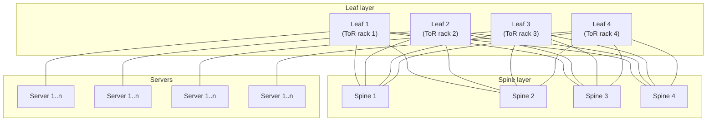
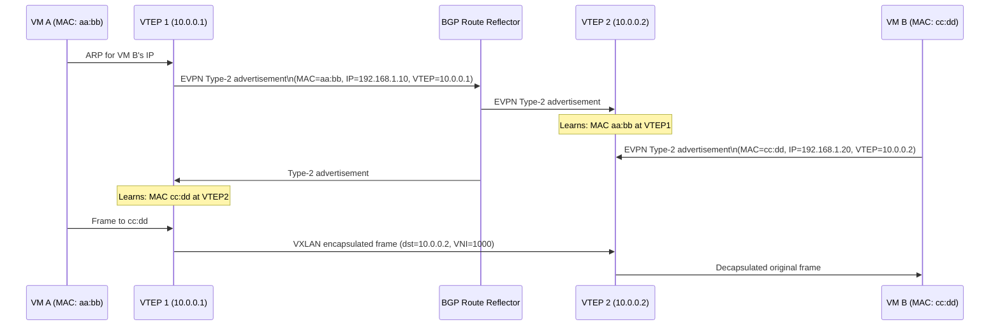
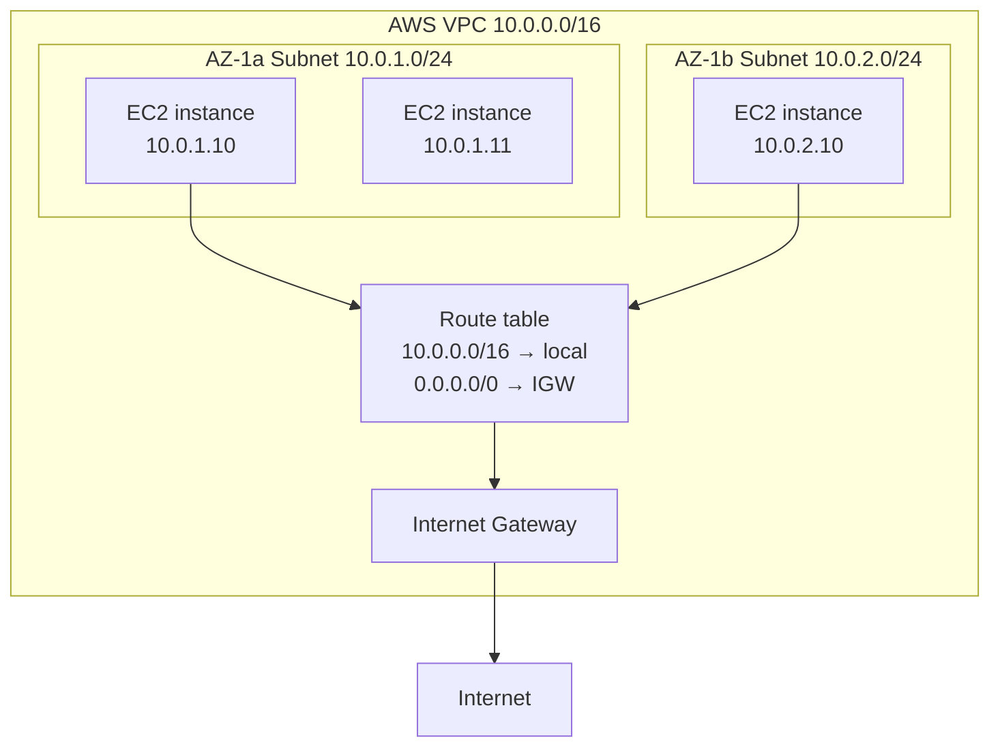
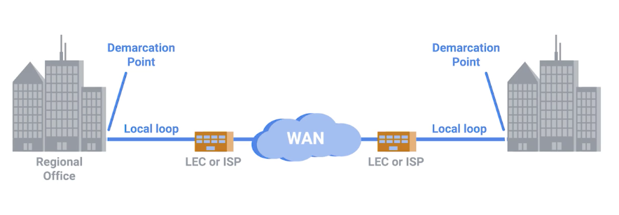
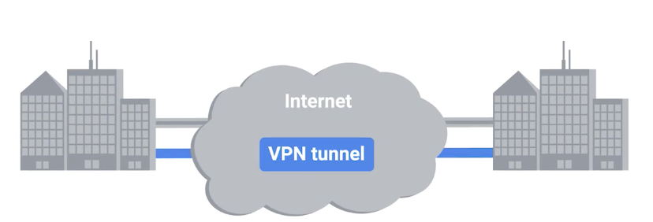

# 12 - Cloud and Datacenter Networking

[toc]

> **TL;DR:** Datacenter networking is built for high bisection bandwidth, predictable latency, and massive scale that enterprise campus networks never face. Leaf-spine topology replaces the traditional three-tier hierarchy, providing equal-cost multipath between any two servers. VXLAN overlays stretch Layer 2 across a routed Layer 3 fabric. RDMA enables microsecond-latency, kernel-bypass storage and ML training traffic. Cloud providers add a virtualization layer (VPC) on top, making a physical datacenter appear as a programmable, multi-tenant network.

## Vocabulary

**Bisection bandwidth**: The bandwidth between the two halves of a network when it is split down the middle. A critical datacenter metric: high bisection bandwidth means any server can communicate with any other server at full speed.

---

**Oversubscription ratio**: The ratio of downstream port capacity to upstream port capacity at a switch. A 4:1 oversubscription means 4 servers share 1 server's worth of uplink capacity. Full bisection bandwidth = 1:1.

---

**Top-of-Rack (ToR) switch**: A switch located in each server rack, connecting the servers in that rack to the datacenter fabric. Typically 48 × 25/100 GbE downlinks + 8 × 100/400 GbE uplinks.

---

**Leaf-spine topology**: A two-layer fat-tree network. Leaf switches connect to servers; spine switches connect to all leaves. Every leaf-spine path has exactly 2 hops; all paths have equal bandwidth.

---

**ECMP (Equal-Cost Multi-Path)**: Forwarding packets across multiple equal-cost paths. Used in leaf-spine fabrics to distribute load. Hashing on flow 5-tuple ensures all packets in a flow take the same path (avoiding reordering).

---

**VXLAN (Virtual Extensible LAN)**: A network virtualization protocol that encapsulates Layer 2 Ethernet frames in UDP/IP packets, enabling Layer 2 domains to stretch across a Layer 3 routed fabric. RFC 7348.

---

**VTEP (VXLAN Tunnel Endpoint)**: A device (physical switch or hypervisor virtual switch) that performs VXLAN encapsulation/decapsulation. The VTEP adds/removes the outer UDP/IP header.

---

**VNI (VXLAN Network Identifier)**: A 24-bit identifier (16 million possible values) that identifies a virtual Layer 2 domain within a VXLAN overlay. Analogous to 802.1Q VLAN ID but with vastly more capacity.

---

**BGP-EVPN (Ethernet VPN)**: A BGP address family used to distribute MAC/IP binding information and VXLAN VNI reachability across the datacenter fabric. RFC 7432. Replaces flood-and-learn with a control-plane-driven MAC distribution.

---

**RDMA (Remote Direct Memory Access)**: A network protocol that allows a host to read/write the memory of a remote host without involving the remote host's CPU or OS. Used for high-throughput, low-latency storage (NVMe-oF) and ML collective operations (NCCL over RoCEv2).

---

**RoCEv2 (RDMA over Converged Ethernet version 2)**: RDMA over an IP/UDP substrate (vs. RoCEv1's pure Ethernet). Routable across subnets; standard in modern HPC and ML training clusters.

---

**InfiniBand**: A dedicated high-speed interconnect fabric originally for HPC. Very low latency (< 1 µs), very high bandwidth (400 Gbps HDR, 800 Gbps NDR). NVIDIA's dominant backend for large language model training clusters (DGX SuperPOD, NVIDIA DGX GH200).

---

**VPC (Virtual Private Cloud)**: The network virtualization abstraction provided by cloud providers (AWS VPC, GCP VPC). A logically isolated network in the cloud; the user defines subnets, routing tables, and security groups without configuring physical hardware.

---

**Security group**: A stateful virtual firewall applied to individual instances in a VPC. Rules specify which traffic is allowed to/from the instance on a per-port and per-source-CIDR basis.

---

**Transit Gateway (AWS) / Cloud Router (GCP)**: A managed routing service that connects VPCs, on-premises networks, and other cloud regions. Replaces manual VPC peering with a hub-and-spoke routing model.

---

## Intuition

A datacenter is a special-purpose network optimized for one thing traditional enterprise networks are not: **uniform, high-bandwidth any-to-any communication**. In a typical enterprise, traffic flows north-south (client to server). In a modern datacenter, traffic flows east-west (server to server) — distributed workloads communicate heavily between themselves. Leaf-spine was invented specifically to give every server equal-bandwidth access to every other server.

VXLAN is the "IP inside Ethernet inside IP" trick that lets the datacenter operator program virtual networks on top of the physical routed fabric. The physical network is a boring L3 routed fabric (no spanning tree, no VLAN limitations). The virtual network provides tenants with their own private Ethernet segments, stretched across the physical topology as UDP tunnels.

RDMA removes the CPU and OS from the data path. In ML training, NCCL allreduce operations between GPUs in different servers use RDMA to move gradients at 400 Gbps with 2–5 µs latency, without a single memcpy or system call. The network becomes an extension of the GPU memory bus.

### Cloud service models — IaaS / PaaS / SaaS

Cloud computing is a technological approach where computing resources are provisioned in a shareable way, so that many users get what they need, when they need it. The underlying mechanism is **virtualization**: a single physical host runs many virtual guest instances, managed by a **hypervisor** — software that presents each guest with a virtual hardware platform indistinguishable from bare metal.

Providers package this capability into three service tiers:

| Model | What the provider manages | What the customer manages |
| :--- | :--- | :--- |
| **IaaS** (Infrastructure as a Service) | Physical hardware, network, hypervisor | OS, runtime, app |
| **PaaS** (Platform as a Service) | Hardware + OS + runtime (e.g. a managed web server) | App code and data |
| **SaaS** (Software as a Service) | Everything, including the app | Configuration only |

> [!NOTE]
> Cloud storage products (S3, GCS, Azure Blob) sit at the boundary of IaaS and PaaS: the provider manages durability, replication, and access control; the customer manages data layout and lifecycle policies.

Cloud providers further distinguish **public cloud** (shared, multi-tenant infrastructure), **private cloud** (dedicated infrastructure operated in a single tenant's environment), and **hybrid cloud** (a mix, connected by VPN or dedicated circuits such as AWS Direct Connect or Google Cloud Interconnect).

## Leaf-Spine Topology

The leaf-spine (Clos) topology replaced the traditional three-tier (access/distribution/core) for datacenter networks around 2010.



Every leaf connects to every spine. Any two servers in different racks have exactly 2 hops (leaf → spine → leaf). With 4 spines, there are 4 ECMP paths between any two leaves — full bisection bandwidth at 1:1 oversubscription if the uplink/downlink capacity is matched.

**Scaling:** To add more servers, add a leaf switch + servers. To add more bandwidth (reduce oversubscription), add spine switches and uplinks. The two dimensions scale independently.

### ECMP and Flow Hashing

ECMP distributes flows across the spine switches. The hash key is typically the 5-tuple (src IP, dst IP, src port, dst port, protocol). All packets in a flow take the same path, ensuring in-order delivery. Different flows are distributed across spines by the hash, achieving statistically uniform load balancing.

> [!WARNING]
> ECMP hash collisions — multiple large flows mapping to the same spine — can cause severe imbalance. A single large file transfer (elephant flow) using one spine can starve other flows sharing that path. Flowlet switching (splitting a flow into subflows at burst boundaries) and WCMP (weighted ECMP based on real-time utilization feedback) address this but add complexity.

## VXLAN Overlay Networking

VXLAN solves the problem of stretching Layer 2 segments across a Layer 3 datacenter fabric without spanning tree.

### Encapsulation Format

A VXLAN-encapsulated frame has four layers of headers:

```
Outer Ethernet header  (14 bytes)  — src/dst VTEP MAC
Outer IP header        (20 bytes)  — src/dst VTEP IP
Outer UDP header        (8 bytes)  — src port (hash), dst port 4789
VXLAN header            (8 bytes)  — I flag (1 bit), VNI (24 bits), reserved
Original Ethernet frame (14 bytes) — tenant VM MAC addresses
Original IP packet      (20 bytes) — tenant VM IP addresses
Payload
```

Total overhead: 50 bytes per frame. This is why VXLAN links need an MTU of 1,550+ bytes (or jumbo frames = 9,000 bytes) to avoid fragmentation of the 1,500-byte inner frames.

### BGP-EVPN Control Plane

Without a control plane, VXLAN VTEPs use flood-and-learn: unknown destinations trigger a BUM (Broadcast, Unknown unicast, Multicast) flood to all VTEPs in the VNI. This scales poorly.

BGP-EVPN (RFC 7432) distributes MAC/IP bindings via BGP Type-2 routes and VNI reachability via Type-3 routes. Each VTEP learns remote MAC → VTEP mappings from BGP before it ever receives a frame, eliminating flooding.



## RDMA and High-Performance Networking

RDMA is the networking technology behind petabyte-scale distributed training. In standard IP networking, sending data involves: application buffer → kernel socket buffer → NIC DMA → wire → NIC DMA → kernel socket buffer → application buffer. With two context switches and three copies per transfer.

RDMA eliminates the kernel entirely: the NIC (a RDMA-capable NIC, called RNIC) DMA-reads directly from the application's registered memory buffer into the wire, and DMA-writes the received data directly to the remote application's registered buffer. Zero copies, zero context switches.

**Performance numbers (2024 hardware):**
- InfiniBand NDR: 800 Gbps bandwidth, 0.5 µs latency
- RoCEv2 (100GbE): 100 Gbps, 1–2 µs latency
- Standard TCP (100GbE): 100 Gbps bandwidth, 20–50 µs latency (kernel overhead)

> [!IMPORTANT]
> RoCEv2 requires a **lossless network** (Priority Flow Control, PFC, or Explicit Congestion Notification, ECN) to function correctly. If a packet is dropped, the RDMA protocol has no retransmission mechanism at the NIC level — the operation fails. PFC (IEEE 802.1Qbb) sends PAUSE frames to the upstream switch when a priority queue is near full, holding traffic at the switch rather than dropping it. This "lossless Ethernet" configuration requires careful end-to-end QoS setup.

## VPC Architecture

Cloud VPCs provide the illusion of a private network using overlay networking on top of the cloud provider's physical fabric.



Each VPC subnet maps to an availability zone. Route tables control where traffic goes. Security groups provide stateful per-instance firewalling. Network ACLs provide stateless subnet-level rules (evaluated before security groups). VPC peering or Transit Gateway connects VPCs. AWS PrivateLink and GCP Private Service Connect allow services to be accessed across VPC boundaries without traffic traversing the internet.

### WAN technologies — leased lines, frame relay, MPLS

A **Wide Area Network (WAN)** acts like a single network but spans multiple physical locations — typically connecting branch offices, on-premises datacenters, and cloud VPCs across carrier infrastructure.



WANs use multiple data-link layer protocols depending on the carrier technology in use. The main connectivity options, roughly in historical order:

- **Leased lines (T-carrier / E-carrier):** A dedicated point-to-point circuit with a fixed, guaranteed bandwidth (T1 = 1.544 Mbps, T3 = 44.7 Mbps). Expensive and inflexible but provide deterministic latency and no contention.
- **Frame relay:** A packet-switched WAN protocol that replaced leased lines for many enterprise sites in the 1990s. Virtual circuits (PVCs) share physical links; bandwidth is not guaranteed beyond a committed information rate (CIR).
- **MPLS (Multiprotocol Label Switching):** The dominant enterprise WAN technology today. Traffic is label-switched through the provider core; customers see a private, low-latency overlay. Supports QoS classes — voice, video, and data can receive differentiated treatment across the WAN.
- **SD-WAN:** Software-defined WAN overlays running over commodity broadband (internet, LTE/5G). Traffic steering is policy-driven; underlay diversity improves resilience at lower cost than MPLS.

**Point-to-point VPNs** extend WAN connectivity across untrusted internet links. The VPN tunneling logic is handled by network devices at either end, so individual users do not need to establish their own tunnels:



> [!TIP]
> AWS Direct Connect, Google Cloud Interconnect, and Azure ExpressRoute are the modern "leased line" equivalents: dedicated Layer 2 or Layer 3 circuits between an on-premises datacenter and a cloud region's edge POP. They bypass the public internet entirely, giving predictable latency and higher throughput than site-to-site VPN over commodity broadband.

## Real-world Example

Verifying VXLAN tunnel state and RDMA performance — the two key diagnostic scenarios for datacenter networking:

```bash
# Show VXLAN tunnel state on Linux (using ip command)
$ ip -d link show vxlan0
7: vxlan0: <BROADCAST,MULTICAST,UP,LOWER_UP> mtu 1450
    link/ether 52:54:00:ab:cd:ef brd ff:ff:ff:ff:ff:ff
    vxlan id 1000 remote 10.0.0.2 local 10.0.0.1 dev eth0 srcport 0 0 dstport 4789
    # VNI=1000, this VTEP is 10.0.0.1, remote VTEP is 10.0.0.2

# Show VXLAN FDB (forwarding database — MAC to VTEP mappings)
$ bridge fdb show dev vxlan0
cc:dd:ee:ff:00:01 dst 10.0.0.2 self permanent
# MAC cc:dd:.. is reachable via VTEP at 10.0.0.2

# Test RDMA connectivity (requires rdma-tools / rdma-core)
$ rdma link show
link mlx5_0/1 state ACTIVE physical_state LINK_UP netdev eth0
# mlx5_0: Mellanox CX-5 RNIC, link active

# Run RDMA bandwidth test (requires rdma-core + perftest)
# On server: ib_send_bw --ib-dev mlx5_0 -d mlx5_0
# On client:
$ ib_send_bw --ib-dev mlx5_0 -d mlx5_0 10.0.0.2
# Output: ~95 Gbps bandwidth at ~2 µs latency on 100GbE RoCEv2
```

A Python script that creates a VXLAN interface programmatically using `pyroute2`:

```python
from pyroute2 import IPRoute  # type: ignore[import]

def create_vxlan_tunnel(
    vni: int,
    local_ip: str,
    remote_ip: str,
    iface_name: str = "vxlan0",
    dstport: int = 4789,
) -> None:
    """Create a VXLAN tunnel interface (requires root / CAP_NET_ADMIN)."""
    with IPRoute() as ipr:
        # Create VXLAN interface
        ipr.link(
            "add",
            ifname=iface_name,
            kind="vxlan",
            vxlan_id=vni,
            vxlan_local=local_ip,
            vxlan_remote=remote_ip,    # point-to-point; omit for multicast flood
            vxlan_port=dstport,
            vxlan_ttl=64,
        )
        # Bring it up
        idx = ipr.link_lookup(ifname=iface_name)[0]
        ipr.link("set", index=idx, state="up")
        print(f"Created VXLAN interface {iface_name} (VNI={vni})")
        print(f"  Local VTEP: {local_ip}, Remote VTEP: {remote_ip}")

# create_vxlan_tunnel(vni=1000, local_ip="10.0.0.1", remote_ip="10.0.0.2")
```

> [!TIP]
> For debugging VPC connectivity in AWS, the **VPC Reachability Analyzer** is the authoritative tool. It traces the path between two endpoints through all VPC routing tables, security groups, and network ACLs, showing exactly where traffic is blocked. Much faster than iteratively checking each security group by hand.

## In Practice

**The GPU cluster is the new datacenter performance-critical path.** Large-scale ML training (GPT-4 class, LLaMA 3 class) uses thousands of GPUs interconnected by InfiniBand (NVIDIA) or RoCEv2 (Meta, Google) at 200–800 Gbps per link. NCCL (NVIDIA Collective Communications Library) implements AllReduce, AllGather, and ReduceScatter over RDMA. A single misconfigured ECN marking or PFC pause loop can cause a training job to run at 10% of expected throughput — the "golden butterfly" problem where one sick link degrades the entire job.

**Cloud cost optimization requires understanding VPC traffic flows.** AWS charges for data transfer between AZs ($0.01/GB) and out of the region ($0.09/GB outbound to internet). A microservices architecture that puts services in different AZs without considering data locality can generate surprisingly large inter-AZ transfer bills. Co-locating services that exchange large amounts of data in the same AZ, using VPC endpoints for S3/DynamoDB access (eliminating NAT gateway costs), and using CloudFront for edge caching are the primary cost levers.

> [!CAUTION]
> RDMA's zero-copy, kernel-bypass nature means that a malicious or buggy application can DMA from/to arbitrary registered memory regions — bypassing OS access controls. RDMA security requires careful management of memory region keys (rkeys). A leaked rkey allows any remote RDMA client to overwrite arbitrary application memory. This is why RDMA is only used in trusted cluster environments (HPC, ML training), not in multi-tenant networks.

## Pitfalls

- **"Leaf-spine eliminates all bottlenecks."** — Leaf-spine at 1:1 oversubscription (full bisection bandwidth) is ideal but expensive. Most real deployments oversubscribe the spine (4:1 to 8:1) to reduce switch count and cost. Elephant flows (large file transfers, ML all-reduce) can still cause congestion on oversubscribed spines.
- **"VXLAN adds significant latency."** — The VXLAN encapsulation/decapsulation is done in hardware on modern NICs/switches and adds < 1 µs. The MTU overhead (50-byte header) is the more significant concern for small packets. Jumbo frames (MTU 9000) eliminate per-packet overhead for large transfers.
- **"VPC security groups are sufficient for security."** — Security groups are the primary control but they are per-instance and can have complex interaction with NACLs, peering rules, and VPC endpoints. Defense-in-depth applies: security groups for instance-level control, NACLs for subnet-level defense-in-depth, and WAF/Shield for application-layer protection.
- **"RDMA works out of the box on any Ethernet network."** — RoCEv2 requires a lossless fabric (PFC + ECN). Deploying RDMA on a standard datacenter network without PFC/ECN causes silent, severe performance degradation that is difficult to diagnose. Configure and validate PFC and ECN before deploying any RDMA workload.

## Exercises

### Exercise 1 — Leaf-spine bandwidth calculation

A leaf-spine fabric has 4 spine switches, each with 32 × 400 GbE ports. 4 leaf switches each connect to all 4 spines via 4 × 400 GbE uplinks and to 48 servers via 48 × 100 GbE downlinks. Calculate: (a) total east-west bandwidth between any two leaf switches, (b) oversubscription ratio, (c) what is needed to achieve 1:1?

#### Solution

**(a) East-west bandwidth between two leaves:**
Each leaf has 4 uplinks × 400 GbE = 1,600 Gbps of uplink bandwidth. Traffic between two leaves passes through 1 spine, so bandwidth is min(sender uplink, receiver uplink) = min(1,600, 1,600) = **1,600 Gbps** total between any pair of leaves (distributed across 4 paths of 400 Gbps each via ECMP).

**(b) Oversubscription ratio:**
Each leaf has 48 × 100 GbE downlinks = 4,800 Gbps total server bandwidth. Each leaf has 4 × 400 GbE uplinks = 1,600 Gbps uplink bandwidth. Oversubscription = 4,800 / 1,600 = **3:1**.

**(c) To achieve 1:1 (full bisection bandwidth):**
Need uplink bandwidth = downlink bandwidth = 4,800 Gbps per leaf. Each spine port is 400 GbE. To deliver 4,800 Gbps uplink per leaf, each leaf needs 4,800 / 400 = 12 spine uplinks. With 4 spines, each leaf needs 3 × 400 GbE links to each spine (12 total). Or, upgrade all 48 downlinks to 400 GbE (total downlink 19,200 Gbps) and use 48 uplinks of 400 GbE — impractical. More commonly: upgrade server links to 400 GbE and add 2 more spine switches for more uplink bandwidth.

---

### Exercise 2 — VXLAN encapsulation overhead

A server sends a 1,500-byte Ethernet frame (inner tenant traffic) over a VXLAN tunnel. (a) What is the total packet size on the physical network? (b) Will the outer IP packet be fragmented on a standard 1,500-byte MTU link? (c) What MTU is needed on the physical fabric to avoid fragmentation?

#### Solution

**(a) Total packet size:**
VXLAN overhead = outer Ethernet (14) + outer IP (20) + outer UDP (8) + VXLAN header (8) = **50 bytes**.
Total outer packet = 1,500 (inner frame) + 50 = **1,550 bytes**.

**(b) Will it be fragmented?**
A standard 1,500-byte MTU Ethernet link cannot carry a 1,550-byte IP packet without fragmentation. The outer IP packet (1,550 bytes) exceeds the 1,500-byte MTU. Unless the "Don't Fragment" bit is set (in which case the router sends ICMP "fragmentation needed" and drops the packet), the outer packet would be fragmented.

In practice, VXLAN tunnels between VTEPs almost always have the DF bit set on the outer header to enable PMTU discovery. The inner frame never sees a fragmentation event — the outer header is fragmented or the MTU is negotiated down. However, VXLAN fragmentation is expensive and usually disabled. The standard solution is:

**(c) Required MTU:**
The physical fabric must support at least **1,550 bytes** MTU (or 1,600 bytes to provide headroom). Most datacenter deployments configure **jumbo frames (9,000 bytes MTU)** on all physical links, allowing inner frames up to 8,950 bytes. This also allows efficient storage traffic (NFS, iSCSI, NVMe-oF) that benefits from large frames.

---

### Exercise 3 — Cloud VPC routing

An EC2 instance (10.0.1.10) in a private subnet (10.0.1.0/24) needs to: (a) reach another EC2 instance (10.0.2.10) in a different subnet (10.0.2.0/24) in the same VPC, (b) reach an S3 bucket in the same region, (c) reach the public internet. Design the VPC routing table entries and resources needed.

#### Solution

**VPC CIDR: 10.0.0.0/16**

**Route Table for the private subnet (10.0.1.0/24):**

| Destination | Target | Purpose |
| :--- | :--- | :--- |
| 10.0.0.0/16 | local | All inter-subnet VPC traffic (a) |
| pl-xxxxxxxx (S3 prefix list) | vpce-xxxxxxxx (VPC Endpoint) | S3 access without internet (b) |
| 0.0.0.0/0 | nat-xxxxxxxx (NAT Gateway) | Internet access for private subnet (c) |

**Explanation:**

**(a) EC2-to-EC2 (10.0.1.10 → 10.0.2.10):** The `10.0.0.0/16 → local` route covers all subnets within the VPC. AWS routes this directly between instances without leaving the VPC. Security groups on both instances must allow the traffic (source: 10.0.1.0/24 or the other instance's security group).

**(b) S3 access:** Use a **VPC Endpoint** (Gateway type for S3). The VPC endpoint adds a route to S3's prefix list (a managed list of S3 IP ranges) pointing to the VPC endpoint. Traffic to S3 stays within AWS's private network — no internet transit, no NAT Gateway cost, no data transfer charges. Policy documents on the VPC endpoint can restrict which buckets are accessible.

**(c) Internet access from a private subnet:** A **NAT Gateway** in a public subnet (with an Elastic IP) allows outbound internet traffic. The private subnet's route table adds `0.0.0.0/0 → NAT Gateway`. Return traffic is allowed by the NAT Gateway's state table. Inbound internet connections are not possible (no public IP on the instance) — this is intentional for private subnet instances.

**Resources to create:**
- NAT Gateway in a public subnet (with an Internet Gateway for the public subnet)
- Internet Gateway attached to the VPC
- VPC Endpoint (Gateway type) for S3

## Sources

- RFC 7348 — VXLAN: A Framework for Overlaying Virtualized Layer 2 Networks over Layer 3 Networks. https://www.rfc-editor.org/rfc/rfc7348
- RFC 7432 — BGP MPLS-Based Ethernet VPN (EVPN). https://www.rfc-editor.org/rfc/rfc7432
- Greenberg, A. et al. (2009). "VL2: A Scalable and Flexible Data Center Network." *SIGCOMM '09*. https://dl.acm.org/doi/10.1145/1592568.1592576
- Poutievski, L. et al. (2022). "Jupiter Evolving: Transforming Google's Datacenter Network via Optical Circuit Switches and Software-Defined Networking." *SIGCOMM '22*. https://dl.acm.org/doi/10.1145/3544216.3544265
- AWS VPC Documentation. https://docs.aws.amazon.com/vpc/latest/userguide/
- NVIDIA NCCL Documentation. https://docs.nvidia.com/deeplearning/nccl/
- Material in this note draws on the open-source notes at [karthick28/computer-networking-notes](https://github.com/karthick28/computer-networking-notes) (Coursera "Bits and Bytes of Computer Networking").

## Related

- [1 - What is Computer Networking](./1-what-is-networking.md)
- [3 - Physical and Link Layer](./3-physical-and-link-layer.md)
- [4 - The Network Layer — IP, Subnetting, Routing](./4-network-layer-ip.md)
- [7 - Routing Protocols and the Internet](./7-routing-protocols.md)
- [8 - Performance — Latency, Throughput, Congestion](./8-performance.md)
- [9 - Network Security](./9-network-security.md)
- [10 - Modern Networking — SDN, gRPC, Service Mesh](./10-modern-networking.md)
