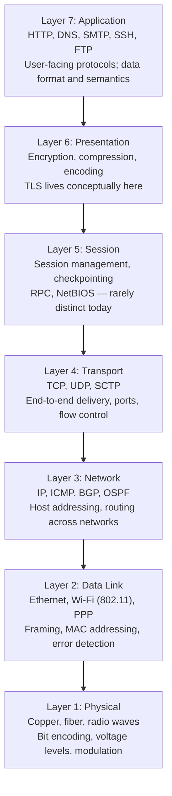
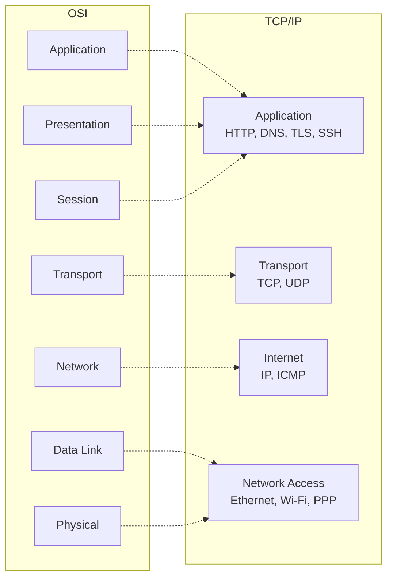
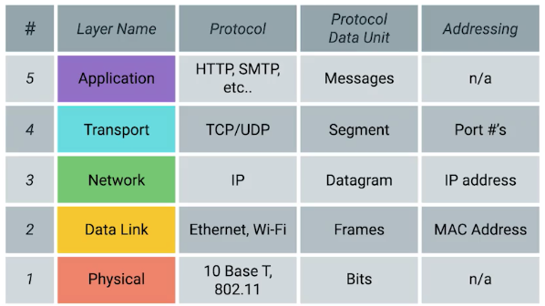
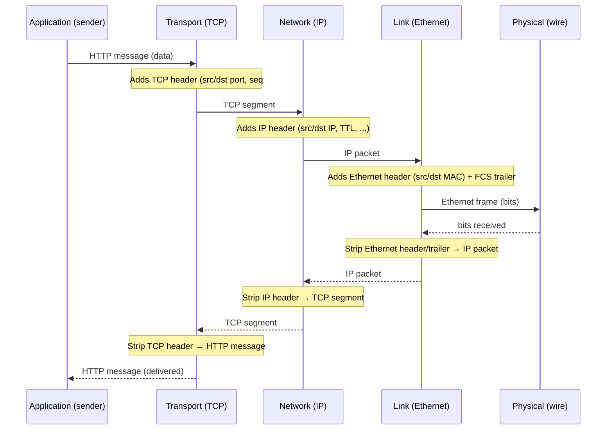

# 2 - OSI and TCP/IP Models

[toc]

> **TL;DR:** The OSI and TCP/IP models are layered abstractions that decompose the complexity of networking into independent, interoperable pieces. Each layer provides services to the layer above and relies on services from the layer below, communicating with its peer on the remote machine using a defined protocol. The TCP/IP model (4 layers) is what the real Internet runs; OSI (7 layers) is the conceptual reference used for teaching and documentation.

## Vocabulary

**Protocol data unit (PDU)**: The unit of data at a given layer. Each layer has its own name for it: bits (Physical), frames (Link), packets (Network), segments (Transport), messages (Application).

---

**Encapsulation**: The process of wrapping a PDU from a higher layer inside the header (and sometimes trailer) of the current layer before transmission.

---

**Decapsulation**: The reverse process — stripping a layer's header/trailer at the receiver to expose the payload for the layer above.

---

**Service interface**: The API a layer exposes to the layer directly above it. In UNIX, the socket API is the service interface between the Transport layer and the Application layer.

---

**Peer protocol**: The rules governing communication between the same layer on two different machines. Only the Physical layer communicates directly (bits on the wire); all other peer protocols are logical — the actual bits flow down through all lower layers.

---

**Layer**: An abstraction boundary that hides implementation details. A layer's implementation can change without affecting layers above or below, as long as the service interface and peer protocol are preserved.

---

**Socket**: The OS abstraction for a Transport-layer communication endpoint. Identified by (IP address, port, protocol). The primary interface between application code and the TCP/IP stack.

---

**Port number**: A 16-bit unsigned integer (0–65535) that identifies a specific process or service on a host. Ports ≤ 1023 are "well-known" and require root to bind.

---

**MTU (Maximum Transmission Unit)**: The largest PDU that a given link layer is willing to carry. Ethernet MTU = 1,500 bytes. IP fragmentation occurs when a packet exceeds the path MTU.

---

**Path MTU (PMTU)**: The smallest MTU across all links on an end-to-end path. PMTU discovery sends packets with the "don't fragment" bit and adjusts based on ICMP "fragmentation needed" messages.

---

## Intuition

Imagine building a house. The architect draws blueprints (Application layer concern). The contractor interprets them into structural loads (Presentation/Session). The framing subcontractor builds walls according to those specs (Transport). The foundation company pours concrete according to the framing specs (Network). The site prep crew levels the ground (Link). The actual soil supports everything (Physical). Each crew only needs to know how to talk to the one above and one below it — the plasterer does not need to understand soil compaction.

Layering makes the system composable. You can swap Ethernet for Wi-Fi (different Physical + Link) without changing TCP or HTTP. You can upgrade from HTTP/1.1 to HTTP/2 (Application change) without touching IP routing. The layers are a contract: "give me a byte stream and I will deliver it; I do not care what goes inside those bytes."

The practical reality is that layers leak. TCP-offload engines on NICs collapse Layer 3 and 4 into hardware. TLS operates at Layer 5/6 but is universally described as "below the application." QUIC bundles Transport and Security. OSI's clean separation is a pedagogical ideal; real systems are messier — and deliberately so, for performance.

## The OSI Reference Model

OSI (Open Systems Interconnection) was designed by ISO in the late 1970s as a universal networking standard. The Internet beat it to deployment, but OSI's seven-layer vocabulary is now the universal shorthand for describing where a protocol lives in the stack.



### Layer 1 — Physical

The Physical layer is concerned with transmitting raw bits over a physical medium. It defines voltage levels, bit timing, connector pinouts, modulation schemes (NRZ, Manchester encoding, QAM for DSL), and cable specifications. The PDU is a **bit**. Examples: 1000BASE-T (Gigabit Ethernet over copper), 100GBASE-LR4 (100 Gbps over single-mode fiber), IEEE 802.11ax (Wi-Fi 6) radio parameters.

> [!NOTE]
> The Physical layer never "knows" what the bits mean. It just reliably (or unreliably) moves voltage/light/radio symbols from transmitter to receiver. Bit errors at this layer appear as flipped bits to Layer 2; Layer 2's error detection (CRC) catches them.

### Layer 2 — Data Link

The Data Link layer organizes bits into **frames** and handles point-to-point (or shared-medium) delivery between directly connected nodes. It provides error detection (CRC), MAC addressing, and access control for shared media (CSMA/CD for Ethernet, CSMA/CA for Wi-Fi). Switches operate here. The PDU is a **frame**.

### Layer 3 — Network

The Network layer provides logical (IP) addressing and routing across multiple hops and heterogeneous link types. It decides which router to send a packet through next, based on destination IP address and routing tables. Routers operate here. The PDU is a **packet**. Key protocols: IPv4 (RFC 791), IPv6 (RFC 8200), ICMP (RFC 792).

### Layer 4 — Transport

The Transport layer provides end-to-end communication between **processes** on different hosts, identified by port numbers. TCP provides reliable, ordered, connection-oriented delivery. UDP provides unreliable, connectionless delivery. SCTP provides multi-stream reliable delivery. The PDU is a **segment** (TCP) or **datagram** (UDP).

### Layers 5–7 — Session, Presentation, Application

In practice these three layers collapse in the TCP/IP world. Session layer (connection management, checkpointing) has almost no distinct implementations. Presentation layer (encoding, encryption) is where TLS conceptually lives, though it is implemented as a library between Application and Transport. Application layer encompasses all user-visible protocols: HTTP, DNS, SMTP, SSH, FTP, WebSocket.

## The TCP/IP Model (Internet Model)

The real Internet runs a simpler four-layer model, sometimes called the DoD or Internet model. TCP/IP was designed first, deployed first, and is what every network stack implements.



TCP/IP collapses OSI Layers 5–7 into one Application layer, and collapses Layers 1–2 into one Network Access (Link) layer. The Internet layer maps to OSI Layer 3. This collapsing reflects reality: the Internet does not standardize below Layer 2 (it runs over any link technology) and does not mandate separate session/presentation layers.

> [!IMPORTANT]
> The TCP/IP stack does NOT implement OSI as a spec — it predates it. When a network engineer says "Layer 3" or "Layer 7" they are using OSI's numbering as a vocabulary, while the actual protocol stack is TCP/IP. The two models are conceptual frameworks for talking about the same phenomena, not competing implementations.

### The five-layer pedagogical variant

Many textbooks and introductory courses (notably Google's *Bits and Bytes of Computer Networking* on Coursera) teach a **five-layer** version of TCP/IP that splits the Network Access layer back into separate Physical and Data Link layers. This matches OSI's Layer 1 and Layer 2 split and makes the physical-vs-framing distinction explicit for learners — a useful pedagogical move even though the "official" TCP/IP model elides it.



The five layers and their responsibilities:

- **Physical** — physical devices and media; cable specifications, electrical/optical signal encoding
- **Data Link** — common interpretation of signals between nodes on the same network or link; Ethernet provides framing and MAC addressing for local delivery
- **Network** — routing across multiple links via logical addressing; IP moves packets across heterogeneous networks
- **Transport** — demultiplexing to the correct process on the destination host; TCP (reliable, ordered) and UDP (unreliable, connectionless)
- **Application** — application-specific protocols that sit above the transport byte stream

> [!NOTE]
> The five-layer model is a teaching convention, not a separate standard. In RFCs and IETF documents the authoritative model is still the four-layer TCP/IP stack. The split is harmless for understanding — just keep in mind that "Network Access" and "Physical + Data Link" describe the same two layers with different granularity.

## Encapsulation and Decapsulation

The sending host wraps each PDU as it passes down the stack. The receiving host unwraps it as it passes up. This is the core mechanical operation of a layered protocol stack.



Each header adds overhead. A 1-byte payload traveling over Ethernet + IP + TCP carries 14 (Ethernet) + 20 (IP) + 20 (TCP) = 54 bytes of headers — 54× overhead. This is why protocol efficiency matters for small-message workloads.

## Why Layering Matters

Layering enables independent evolution of each component. When Ethernet speeds went from 10 Mbps to 100 Gbps, TCP did not change. When TLS 1.3 replaced TLS 1.2, IP routing did not change. When IPv6 replaced IPv4, Ethernet framing did not change. Each layer evolves on its own schedule, and the interface contracts between layers are stable.

From an engineering standpoint, layering also means you can identify *where* a problem lives. A packet drop is a Layer 3 event. A checksum error is a Layer 2 event. A connection timeout is a Layer 4 event. A 404 response is a Layer 7 event. The layers give you a mental triage hierarchy.

> [!TIP]
> When debugging a network issue, start at Layer 1 (is the cable plugged in?) and work up. `ping` tests Layer 3. `telnet host port` tests Layer 4. `curl -v` tests Layer 7. Each tool tests a different layer; if ping works but curl fails, the issue is Layer 4–7.

## Real-world Example

Here is a Python socket server and client that expose the Layer 4 → Layer 7 boundary directly. The `socket()` call is the moment you cross from "the kernel's TCP/IP stack owns this" to "your application code owns this."

```python
# server.py — Layer 4/7 boundary in Python
import socket

def run_echo_server(host: str = "127.0.0.1", port: int = 9000) -> None:
    """A minimal TCP echo server — the simplest possible Layer 7 application."""
    # AF_INET = IPv4 (Layer 3), SOCK_STREAM = TCP (Layer 4)
    with socket.socket(socket.AF_INET, socket.SOCK_STREAM) as srv:
        srv.setsockopt(socket.SOL_SOCKET, socket.SO_REUSEADDR, 1)
        srv.bind((host, port))   # associate socket with IP:port
        srv.listen(5)            # Layer 4: accept backlog of 5 pending connections
        print(f"Listening on {host}:{port}")
        while True:
            conn, addr = srv.accept()   # blocks until a TCP handshake completes
            with conn:
                print(f"Connection from {addr}")
                while True:
                    data = conn.recv(4096)   # Layer 7: read application data
                    if not data:
                        break
                    conn.sendall(data)        # echo back

# client.py
import socket

def echo_client(message: str, host: str = "127.0.0.1", port: int = 9000) -> str:
    """Send a message to the echo server and return the response."""
    with socket.create_connection((host, port)) as sock:
        # create_connection performs DNS resolution (Layer 7) and TCP connect (Layer 4)
        sock.sendall(message.encode())
        return sock.recv(4096).decode()

if __name__ == "__main__":
    print(echo_client("Hello, networking!"))
    # Output: Hello, networking!
```

> [!NOTE]
> `socket.SOCK_DGRAM` instead of `SOCK_STREAM` gives you UDP — the same Layer 3 IP substrate, but Layer 4 provides no connection, no ordering, no reliability. The application receives raw datagrams and must handle all of the above itself if it needs them.

## In Practice

Real stacks deviate from the clean model in performance-critical paths. **TCP offload engines (TOE)** on modern NICs move TCP/IP processing off the host CPU and into the NIC's ASIC, collapsing Layers 2–4 into hardware. **RDMA** (Remote Direct Memory Access, used in datacenter networking) bypasses the kernel network stack entirely, letting applications DMA directly to/from remote memory — effectively collapsing Layers 4–7 into a single hardware operation. **eBPF** hooks let you insert custom code at any layer in the Linux kernel stack without recompiling the kernel.

The OSI model's Layers 5 and 6 are essentially vestigial in modern TCP/IP. TLS is implemented as a library (`openssl`, `boringssl`) that sits between application code and the TCP socket. It is conceptually Layer 6 but operationally part of the application. HTTP/2 and HTTP/3 both embed their own framing and multiplexing, further blurring Layer 5's session-management role.

> [!WARNING]
> When people say "I will handle this at Layer 7," they often mean a load balancer or proxy that terminates TCP connections and inspects HTTP headers. That load balancer is simultaneously operating at Layers 3, 4, and 7 — routing (L3), maintaining state (L4), and parsing HTTP (L7). "Operating at layer N" means "caring about PDUs at layer N," not "ignoring all other layers."

## Pitfalls

- **"OSI is what the Internet runs."** — The Internet runs TCP/IP. OSI is the reference model used for describing and teaching protocol stacks. No major Internet protocol is an OSI protocol; the two models exist in parallel as vocabulary vs. implementation.
- **"Layers are strictly isolated."** — In production, layers frequently inspect each other. NAT devices rewrite Layer 3 IP headers based on Layer 4 TCP/UDP ports. QoS mechanisms mark packets based on Layer 7 application type. HTTPS middleboxes terminate TLS (Layer 6) to inspect HTTP (Layer 7) and enforce policies. Cross-layer optimization is the rule in production, not the exception.
- **"The Application layer is where user code runs."** — The Application layer is where Application-layer protocols (HTTP, DNS, SMTP) are implemented, usually in user space. But the kernel's TLS stack (ktls), the eBPF socket filter, and the NIC's RSS hashing also run "in the application's name" while living in the kernel. The boundary is a useful fiction.
- **"TLS is above TCP."** — Conceptually yes; TLS encrypts the application data stream before handing it to TCP. But TLS negotiation happens after the TCP handshake and before any application bytes flow — it is a setup phase that straddles Layers 4 and 6/7. QUIC (HTTP/3) integrates TLS into the transport handshake itself, obliterating the clean layer boundary.

## Exercises

### Exercise 1 — Match PDUs to layers

For each PDU below, identify its OSI layer and the protocols responsible for it: (a) a 1,500-byte Ethernet frame carrying an IP packet, (b) a 40-byte TCP ACK segment, (c) an HTTP/1.1 GET request, (d) a BGP UPDATE message, (e) a DNS A record response.

#### Solution

**(a) Ethernet frame** → Layer 2 (Data Link). The Ethernet frame has a 14-byte header (src MAC, dst MAC, EtherType) and a 4-byte FCS trailer. The 1,500-byte payload is the IP packet (Layer 3 PDU). Protocol: IEEE 802.3 Ethernet.

**(b) TCP ACK segment** → Layer 4 (Transport). A 40-byte TCP ACK is a 20-byte TCP header (with no data payload — this is a pure acknowledgment). Protocol: TCP (RFC 793). It is encapsulated inside an IP packet and an Ethernet frame before it hits the wire.

**(c) HTTP/1.1 GET request** → Layer 7 (Application). Example: `GET /index.html HTTP/1.1\r\nHost: example.com\r\n\r\n`. This message is the payload of a TCP segment. Protocol: HTTP/1.1 (RFC 7230).

**(d) BGP UPDATE** → Layer 7 (Application), though BGP is a routing protocol that configures Layer 3 forwarding state. BGP sessions run over TCP port 179. The UPDATE message is a Layer 7 PDU (from TCP's perspective, it is application data).

**(e) DNS A record response** → Layer 7 (Application). DNS messages are the payload of UDP datagrams (or TCP segments for large responses). Protocol: DNS (RFC 1035). The response carries an IP address (Layer 3 data) inside a Layer 7 message — layers cross all the time in content.

---

### Exercise 2 — Calculate encapsulation overhead

An application sends a 100-byte HTTP message over TCP/IP/Ethernet. Calculate the total bytes on the wire, including all protocol headers. Assume IPv4, no IP options, standard TCP, standard Ethernet (no VLAN tag).

#### Solution

Layer headers added:
- **TCP header**: 20 bytes (source port, destination port, sequence number, acknowledgment number, flags, window size, checksum, urgent pointer — each standard field)
- **IP header**: 20 bytes (version, IHL, DSCP/ECN, total length, identification, flags, fragment offset, TTL, protocol, header checksum, source IP, destination IP)
- **Ethernet header**: 14 bytes (6 src MAC + 6 dst MAC + 2 EtherType)
- **Ethernet FCS trailer**: 4 bytes

Total overhead = 20 + 20 + 14 + 4 = **58 bytes**
Total on wire = 100 + 58 = **158 bytes**

Overhead ratio = 58/158 ≈ 36.7%. For small messages (IoT sensors, telemetry), this overhead dominates. Protocols like MQTT and CoAP exist specifically to reduce Application-layer overhead for constrained devices. At the Transport layer, QUIC has a slightly smaller overhead for 0-RTT connections because the TLS handshake is merged with the transport handshake.

---

### Exercise 3 — Trace a web request through the stack

Describe, layer by layer, everything that happens when a browser fetches `http://example.com/` from your laptop on a home network. Be specific about which protocol operates at each layer and what it does.

#### Solution

**Layer 7 — Application (DNS):** The browser needs to resolve `example.com` to an IP address. It calls the OS resolver, which sends a DNS UDP query (Layer 7 protocol: DNS, RFC 1035) to the configured DNS server (typically 192.168.1.1 or 8.8.8.8). The DNS response returns an A record with an IP address, say 93.184.216.34.

**Layer 7 — Application (HTTP):** The browser constructs an HTTP GET request: `GET / HTTP/1.1\r\nHost: example.com\r\n\r\n`.

**Layer 4 — Transport (TCP):** Before sending the HTTP request, the browser opens a TCP connection to 93.184.216.34:80. This involves a three-way handshake (SYN → SYN-ACK → ACK). Once the connection is established, the HTTP message becomes the payload of TCP segments. TCP adds src/dst port, sequence numbers, and checksums.

**Layer 3 — Network (IP):** Each TCP segment is wrapped in an IPv4 packet. The IP header specifies src IP (your laptop's IP), dst IP (93.184.216.34), TTL (typically 64), and protocol (6 = TCP). The router reads the dst IP to decide where to forward the packet.

**Layer 2 — Data Link (Ethernet):** On your local network, the IP packet is wrapped in an Ethernet frame. The Ethernet header contains your laptop's MAC address and your home router's MAC address (found via ARP — more on this in [3 - Physical and Link Layer](./3-physical-and-link-layer.md)).

**Layer 1 — Physical:** The Ethernet frame is serialized as voltage pulses (or light pulses in fiber) onto the cable. At the router, the process reverses: decapsulate up to IP, examine the destination IP, make a forwarding decision, re-encapsulate in a new Ethernet frame for the next hop toward the Internet.

---

### Exercise 4 — Design question: why not one big protocol?

Why do we use layered protocols instead of one monolithic protocol that handles everything from bit encoding to application semantics? What are the engineering tradeoffs?

#### Solution

**Separation of concerns and independent evolution:** A monolithic protocol would require all implementations to agree on every detail simultaneously. Changing the link-layer from copper to fiber would require updating every application. With layering, IP can run over copper, fiber, Wi-Fi, or satellite without HTTP knowing or caring. HTTP can evolve from 1.1 to 2 to 3 without IP routing changing. Each layer's development team, standards body, and deployment timeline are independent.

**Reuse:** TCP is reused by HTTP, SMTP, SSH, FTP, and thousands of other applications. Without layering, each application would reinvent reliable ordered delivery. Similarly, IP runs over dozens of different link technologies without each link vendor re-implementing routing.

**Fault isolation and debugging:** Layering provides a diagnostic hierarchy. You can use `ping` to test Layer 3 connectivity without running an application. You can use `netstat` to inspect Layer 4 state. When a problem is Layer 2 (VLAN misconfiguration) vs Layer 3 (wrong route) vs Layer 7 (broken certificate), layering lets you isolate the level where it lives.

**Tradeoffs:** Strict layering imposes overhead (headers at each layer) and can prevent useful cross-layer optimizations. TCP's congestion control is blind to the link layer's current bandwidth (a problem over variable-rate wireless links). NAT breaks IP's end-to-end addressing principle. TLS negotiation requires multiple round-trips before useful application data flows. Every real protocol stack makes pragmatic compromises — the goal is not perfect layering, but *sufficient* layering to enable independent evolution while keeping cross-layer coordination manageable.

## Sources

- Kurose, J. F. & Ross, K. W. (2022). *Computer Networking: A Top-Down Approach* (8th ed.). Chapter 1.5. Pearson.
- Tanenbaum, A. S. & Wetherall, D. (2011). *Computer Networks* (5th ed.). Chapter 1.4. Pearson.
- RFC 1122 — Requirements for Internet Hosts — Communication Layers. https://www.rfc-editor.org/rfc/rfc1122
- ISO/IEC 7498-1:1994 — Information technology — OSI Basic Reference Model.
- Stevens, W. R. (1994). *TCP/IP Illustrated, Volume 1*. Chapter 1. Addison-Wesley.
- Material in this note draws on the open-source notes at [karthick28/computer-networking-notes](https://github.com/karthick28/computer-networking-notes) (Coursera "Bits and Bytes of Computer Networking").

## Related

- [1 - What is Computer Networking](./1-what-is-networking.md)
- [3 - Physical and Link Layer](./3-physical-and-link-layer.md)
- [4 - The Network Layer — IP, Subnetting, Routing](./4-network-layer-ip.md)
- [5 - The Transport Layer — TCP and UDP](./5-tcp-and-udp.md)
- [6 - Application Layer — HTTP, DNS, TLS](./6-application-layer.md)
