# 3 - Physical and Link Layer

[toc]

> **TL;DR:** The Physical and Link layers together handle moving bits from one directly connected machine to another. The Physical layer encodes bits as signals on a medium; the Link layer organizes those bits into frames, adds MAC addressing for local delivery, and handles error detection. Ethernet (IEEE 802.3) dominates wired Link-layer networking; ARP bridges the gap between IP addresses (Layer 3) and MAC addresses (Layer 2).

## Vocabulary

**Frame**: The Link-layer PDU. Contains a header (src/dst MAC), payload (an IP packet), and a trailer (FCS). Ethernet frames are 64–1518 bytes (or 9000 bytes for jumbo frames).

---

**MAC address (Media Access Control)**: A 48-bit hardware address burned into a NIC (or randomly assigned in software). Written as six colon-separated hex bytes: `aa:bb:cc:dd:ee:ff`. Globally unique in theory; locally unique in practice.

```math
\text{MAC address} \in \{0,1\}^{48}
```

---

**Broadcast address**: The special MAC address `ff:ff:ff:ff:ff:ff`. A frame sent to this address is delivered to every host in the broadcast domain.

---

**ARP (Address Resolution Protocol)**: The protocol that maps a known IPv4 address to the unknown MAC address of the corresponding host on the local network. RFC 826.

---

**Broadcast domain**: A network segment where a broadcast frame is delivered to all hosts. A switch does not break broadcast domains; a router does.

---

**Collision domain**: A network segment where two simultaneous transmissions collide. A hub shares one collision domain across all ports; a switch gives each port its own collision domain.

---

**CSMA/CD (Carrier Sense Multiple Access with Collision Detection)**: The medium access control algorithm used by half-duplex Ethernet. Hosts listen before transmitting, detect collisions, and back off randomly.

---

**Full duplex**: Both ends of a link can transmit simultaneously on separate channels. Modern switched Ethernet is full duplex — CSMA/CD is irrelevant.

---

**Half duplex**: Only one end can transmit at a time. Required CSMA/CD to mediate contention.

---

**Switch**: A Layer 2 device that maintains a MAC address table and forwards frames only to the port where the destination MAC is reachable.

---

**Hub**: A Layer 1 device that electrically repeats every incoming signal to all ports. Creates a single collision domain. Obsolete in enterprise networks.

---

**VLAN (Virtual LAN)**: A logical broadcast domain created within a physical switch by tagging frames with a 12-bit VLAN ID (802.1Q tag). Isolates broadcast traffic without requiring separate separate physical switches.

---

**CRC (Cyclic Redundancy Check)**: The error detection algorithm used in Ethernet's FCS (Frame Check Sequence). Detects single-bit and burst errors. Does not correct them.

---

**MTU (Maximum Transmission Unit)**: The maximum payload size a link can carry. Standard Ethernet MTU is 1,500 bytes. Jumbo frames extend this to 9,000 bytes on supported hardware.

---

**NIC (Network Interface Card)**: The hardware that implements the Physical and Link layers. Handles bit serialization, MAC address management, frame CRC computation, and (with offload engines) TCP/IP processing.

---

**MPLS (Multiprotocol Label Switching)**: A packet-forwarding technique that uses short fixed-length labels instead of IP address lookups, enabling fast switching and traffic engineering across a carrier backbone.

---

## Intuition

Think of the Link layer as the local postal service within a single building. IP addresses are like city-wide mailing addresses; MAC addresses are like room numbers in the same building. When you want to send a letter to someone in the same building, you look up their room number (ARP) and hand it directly to them. When the destination is in a different building (a different network), you hand the letter to the lobby mailbox (the router) — the router's MAC address on your LAN.

A switch is the intelligent mail sorter: it learns which room each person is in by watching where letters come from, and then delivers subsequent letters directly to the right room rather than shouting them to the whole building (as a hub does). A VLAN is a logical partition: "treat rooms 100–150 as if they are in a separate building for broadcast purposes."

### What the Link Layer does

The Link layer provides communication between devices on the same local network segment. Its responsibilities include framing (wrapping IP packets in Layer-2 envelopes), link access via MAC protocols, and error detection. Relevant protocols include Ethernet (IEEE 802.3), Wi-Fi (IEEE 802.11), PPP, HDLC, and ARP.

The Link layer is implemented almost entirely in hardware. The NIC (network adapter) is a chip — either discrete or integrated into the motherboard chipset — that handles framing, MAC address management, CRC computation, and (on modern NICs) TCP/IP checksum offload. The kernel provides a thin driver layer above the NIC; protocol software like TCP lives entirely above the Link layer.

> [!NOTE]
> Because the Link layer is in hardware, it operates at line rate without CPU involvement. A 100 Gbps NIC processes 150 million frames per second — far beyond what any kernel interrupt handler could match. Kernel-bypass frameworks (DPDK, io_uring with AF_XDP) exploit this by letting application code DMA frames directly to/from NIC ring buffers.

## Physical Layer

The Physical layer converts binary bits into physical signals and back. It is the layer you can literally touch — copper wire, fiber, radio waves. Understanding its constraints (bandwidth, noise, attenuation) explains why Link-layer framing and error detection are necessary.

### The Physical Layer — wiring and modulation

Bits travel across a medium by varying some physical property: voltage on copper, light intensity on fiber, or radio amplitude/frequency on wireless. This process is called **modulation** or **line coding**. The simplest scheme varies voltage — high voltage for 1, low voltage for 0 — but real systems use more sophisticated encodings (Manchester, NRZ, PAM4) to embed clock signals and improve spectral efficiency.

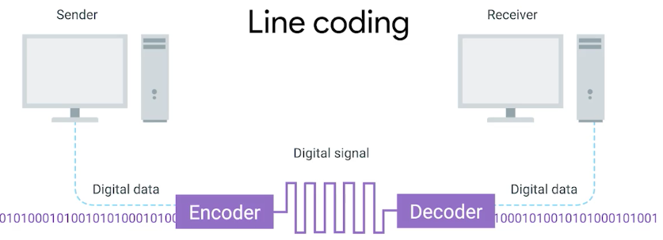

The dominant physical medium for wired LANs is **twisted-pair copper cable**. Pairs of copper wires are twisted together at a specific pitch; the twist causes each wire to pick up equal amounts of electromagnetic interference, which cancels out when the differential signal is decoded. Standard Cat 6 cable contains four twisted pairs per jacket.

**Duplexing** describes the direction of communication on a link:

- **Full duplex**: Both ends transmit simultaneously on separate wire pairs. No collisions possible. Standard on all modern switched Ethernet.
- **Half duplex**: Both ends share one channel; only one can transmit at a time. Required CSMA/CD. Rare today.
- **Simplex**: One direction only (e.g., a cable TV feed).

The most common physical interface is the **RJ-45** (Registered Jack 45) connector — the 8-pin plastic plug used on Ethernet patch cables. A **patch panel** is a passive device with rows of RJ-45 ports that aggregates building cabling into one rack-mounted location, letting a network engineer patch any wall port to any switch port.

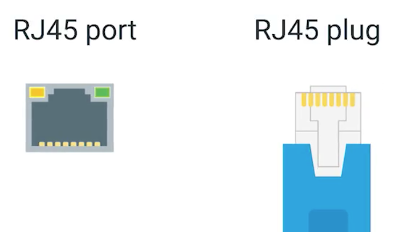 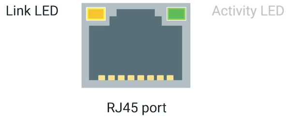

> [!TIP]
> Cable category determines maximum supported speed and range: Cat 5e → 1 Gbps/100 m, Cat 6 → 10 Gbps/55 m, Cat 6A → 10 Gbps/100 m. Above 10 Gbps, datacenter links typically use twinax DAC (direct-attach copper) or fiber.

## Ethernet Frame Structure

Ethernet is the dominant wired Link-layer technology. The IEEE 802.3 frame format is worth memorizing — every packet on a wired LAN is wrapped in this structure.

```
 0                   1                   2                   3
 0 1 2 3 4 5 6 7 8 9 0 1 2 3 4 5 6 7 8 9 0 1 2 3 4 5 6 7 8 9 0 1
+---------------+---------------+---------------+---------------+
|             Preamble (7 bytes)                | SFD (1 byte)  |
+---------------+---------------+---------------+---------------+
|         Destination MAC Address (6 bytes)                     |
+---------------------------------------------------------------+
|          Source MAC Address (6 bytes)                         |
+-------------------------------+-------------------------------+
|      EtherType / Length       |     Payload (46–1500 bytes)   |
|       (2 bytes)               |      (IP packet goes here)    |
+-------------------------------+                               |
|                          ...Payload...                        |
+---------------------------------------------------------------+
|              FCS — CRC-32 (4 bytes)                           |
+---------------------------------------------------------------+
```

The **Preamble** (7 bytes of alternating 1s and 0s) and **SFD** (Start Frame Delimiter, `10101011`) allow the receiver to synchronize its clock to the incoming bit stream. The **EtherType** field (≥ 0x0600) identifies the payload protocol: `0x0800` = IPv4, `0x86DD` = IPv6, `0x0806` = ARP. The **FCS** is a CRC-32 computed over the frame body; a mismatch means the frame is silently discarded.

The six fields in summary:

1. **Preamble (8 bytes total including SFD)** — clock synchronization between adapters.
2. **Destination MAC (6 bytes)** — MAC address of the receiving adapter.
3. **Source MAC (6 bytes)** — MAC address of the transmitting adapter.
4. **EtherType / Length (2 bytes)** — identifies the encapsulated protocol; permits multiplexing of multiple Network-layer protocols over one Ethernet segment.
5. **Payload (46–1,500 bytes)** — the IP datagram; minimum 46 bytes (padded if shorter); maximum 1,500 bytes (the source of IP's default MTU).
6. **FCS — CRC-32 (4 bytes)** — detects bit errors introduced by the physical medium.

> [!IMPORTANT]
> The minimum Ethernet payload is 46 bytes. If the IP packet is shorter, padding is added. The maximum is 1,500 bytes — the source of IP's default MTU. Jumbo frames (9,000 bytes) require explicit NIC and switch configuration; standard NICs will drop them.

### Unicast, Multicast, and Broadcast

The destination MAC address encodes the delivery scope of the frame. The **least significant bit of the first octet** is the I/G (Individual/Group) bit:

- **Unicast** (`I/G = 0`): Frame is intended for exactly one destination. Example: `00:01:44:55:66:77` — first octet `00` = `0000 0000`, LSB = 0.
- **Multicast** (`I/G = 1`): Frame is delivered to a group of interfaces that have opted in via their MAC configuration. Example: `01:00:CC:CC:DD:DD` — first octet `01` = `0000 0001`, LSB = 1.
- **Broadcast** (`ff:ff:ff:ff:ff:ff`): Frame is delivered to every host on the segment. Every adapter accepts it unconditionally.

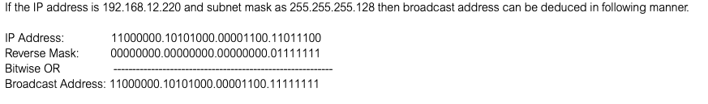

> [!NOTE]
> The I/G bit convention is why OUI (organizationally unique identifier) assignments from IEEE always have LSB = 0 in the first octet — they are unicast MAC prefixes. A multicast MAC is never assigned to a physical NIC; it is a logical group address.

### Error Detection and Correction

Error detection is necessary because physical media introduce bit errors — a copper cable exposed to EMI, a fiber with a dirty connector, or a wireless link in a noisy environment. The Link layer must detect corrupted frames and discard them rather than passing garbage up to IP.

**Parity checks** are the simplest scheme. A single parity bit is appended to a data word so the total count of 1-bits is always even (even parity) or always odd (odd parity). Single-bit errors are detected; two-bit errors in the same word cancel out and go undetected. Two-dimensional parity (parity over rows and columns of a bit matrix) can detect and correct single-bit errors — this is the simplest form of **Forward Error Correction (FEC)**, where the receiver corrects errors without retransmission.

**Checksums** sum all data words and append the result. The receiver recomputes the sum; a mismatch signals corruption. Internet checksum (used in UDP/IP headers) is a 1s-complement sum over 16-bit words — fast to compute in software but weak: it cannot detect swapped words. Ethernet does not use an Internet checksum; it uses CRC.

**CRC (Cyclic Redundancy Check)** treats the frame as the coefficients of a binary polynomial and divides it by a predetermined generator polynomial using modulo-2 arithmetic. The remainder (the CRC value) is appended to the frame. The receiver performs the same division; a non-zero remainder means the frame is corrupted and is silently discarded. Ethernet uses CRC-32 (a 32-bit remainder), which detects:

- All single-bit and double-bit errors.
- All burst errors of length ≤ 32 bits.
- Most burst errors longer than 32 bits (with probability 1 − 2⁻³²).

> [!IMPORTANT]
> CRC detects errors but does not correct them. Ethernet's response to a CRC mismatch is to silently drop the frame — no retransmission at Layer 2. Reliable delivery, if needed, is the job of Layer 4 (TCP). This is a deliberate design choice: keep the Link layer fast and simple; push reliability to the edges.

## ARP — Address Resolution Protocol

ARP is the critical glue between Layer 3 (IP addresses) and Layer 2 (MAC addresses). When a host wants to send an IP packet to a destination on the same subnet, it must first find that destination's MAC address. ARP provides plug-and-play resolution: tables are built automatically via broadcast, with no manual configuration required.

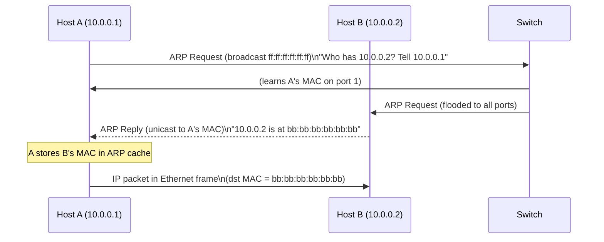

ARP caches entries with a TTL (typically 20 minutes on Linux). The ARP table is visible with `arp -n` on Linux or `arp -a` on macOS/Windows. Each entry maps an IP address to a MAC address and carries a timestamp; stale entries are evicted automatically.

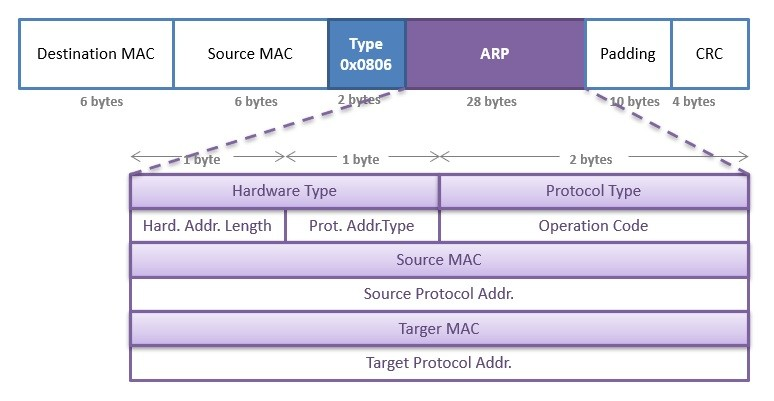

### CAM Table vs. ARP Table

Two distinct tables govern Layer 2 forwarding. They are often confused because both involve MAC addresses.

| Feature | CAM Table (switch) | ARP Table (host/router) |
| :--- | :--- | :--- |
| **Purpose** | Forward frames to the correct switch port | Resolve IP → MAC for next-hop delivery |
| **Keyed by** | MAC address → egress port | IP address → MAC address |
| **Scope** | Local to one switch, per-VLAN | Per-host or per-router interface |
| **Storage** | Hardware TCAM (content-addressable memory) | Software, in OS kernel |
| **Built by** | Self-learning from ingress frame source MACs | ARP Request/Reply exchange |
| **Security risk** | CAM flooding → switch degrades to hub mode | ARP spoofing → MITM attack |

> A MAC address table is sometimes called a **Content Addressable Memory (CAM) table** because the underlying hardware supports lookup by value (find the port for this MAC) rather than by index (read address 0x0042).

### Sending a Datagram off the Subnet

When a host on subnet A wants to reach a host on subnet B, ARP is still involved — but at each hop, not end-to-end. The source host ARPs for the **first-hop router's MAC** (not the ultimate destination's MAC). The router receives the frame, strips the Ethernet header, consults its IP routing table, selects an outgoing interface toward subnet B, and ARPs for the next-hop MAC on that interface. This continues hop by hop.

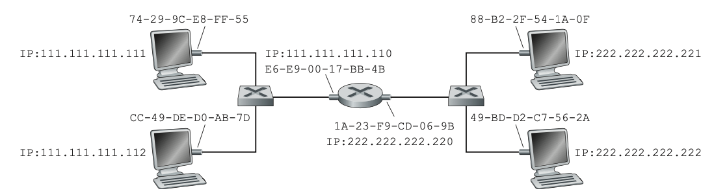

The key invariant: the **IP destination address never changes** in transit, but the **destination MAC address changes at every hop** to address the next router (or final host).

> [!WARNING]
> **ARP is unauthenticated.** Any host can send an unsolicited "ARP reply" claiming to have any IP address. This is **ARP spoofing** (or ARP poisoning) — the basis of most MITM attacks on local networks. A malicious host announces "I have the gateway's IP" to divert all traffic through itself. Dynamic ARP Inspection (DAI) on managed switches mitigates this by validating ARP packets against a DHCP snooping table.

## Switches vs. Hubs vs. Routers

Understanding the differences is a prerequisite for troubleshooting real networks. Each device operates at a different layer and makes fundamentally different forwarding decisions.

| Device | Layer | Forwarding decision | Collision domains | Broadcast domains |
| :--- | :---: | :--- | :---: | :---: |
| Hub | 1 | None — repeat all bits to all ports | 1 (shared) | 1 |
| Bridge (2-port switch) | 2 | MAC address table | 2 | 1 |
| Switch | 2 | MAC address table per port | N (one per port) | 1 per VLAN |
| Router | 3 | IP routing table | N (one per port) | N (one per interface) |

A switch maintains a **MAC address table** (also called CAM table): a mapping from MAC address to the switch port on which that MAC was last seen. When a frame arrives, the switch performs two functions — **filtering** (should this frame be dropped or forwarded?) and **forwarding** (which port?):

1. **Learn**: Records (src MAC, ingress port, timestamp) in the CAM table.
2. **Forward**: Looks up the destination MAC. If found → forward only to that port (unicast). If not found → **flood** to all ports except ingress.
3. **Broadcast**: Frames to `ff:ff:ff:ff:ff:ff` are always flooded to all ports in the VLAN.
4. **Same-port discard**: If the destination MAC maps to the same port the frame arrived on, the frame is discarded (the destination is reachable directly without the switch).

Switches **self-learn**: the CAM table is built automatically from observed traffic without manual configuration. Entries age out (default 300 seconds on most Cisco switches) so the table tracks device moves.

**Advantages of switches over hubs:**

- **Collision elimination**: Each port is its own collision domain. Full-duplex links have zero collisions.
- **Heterogeneous links**: Different ports can run at different speeds (10/100/1000 Mbps) and media types.
- **Security and management**: Port security, VLAN assignment, SPAN mirroring, and 802.1X authentication are all switch-level controls unavailable on a hub.

> [!NOTE]
> A switch that has never seen a destination MAC floods the frame to all ports, exactly like a hub. This is normal and temporary — the switch learns the location on the first reply. This brief flooding is exploited by **MAC flooding attacks** (overflowing the CAM table with fake MACs, forcing the switch into hub mode) which enable passive sniffing of all traffic.

## VLANs and 802.1Q Tagging

VLANs partition a physical switch into multiple logical broadcast domains without requiring separate physical hardware. Hosts within a VLAN communicate as if they are on a dedicated switch; traffic between VLANs requires a router or Layer 3 switch. VLANs optimize switch utilization, isolate broadcast storms, and simplify user management by decoupling logical topology from physical port location.

In a **port-based VLAN**, the network manager assigns each switch port to a VLAN. The switch delivers frames only between ports in the same VLAN. A broadcast from a port in VLAN 10 never reaches a port in VLAN 20.

The IEEE 802.1Q standard defines a 4-byte tag inserted into the Ethernet frame between the source MAC and EtherType fields. The 12-bit VLAN ID field allows 4,094 distinct VLANs per switch.

```
+------+------+---------+--------+
| TPID | PCP  | DEI     | VID    |
| 0x8100| 3 bits| 1 bit | 12 bits|
+------+------+---------+--------+
```

- **TPID** (Tag Protocol Identifier, `0x8100`): Identifies this as an 802.1Q-tagged frame.
- **PCP** (Priority Code Point): 3-bit QoS priority field (802.1p).
- **DEI** (Drop Eligible Indicator): Set when the frame may be dropped under congestion.
- **VID** (VLAN Identifier): 12-bit VLAN ID (0 and 4095 are reserved; 1–4094 are usable).

**Access ports** strip the VLAN tag before delivering to the end device; the end device is unaware of VLANs. **Trunk ports** carry tagged frames between switches, preserving VLAN identity across switch-to-switch or switch-to-router links. A router (or Layer 3 switch) is required to route traffic between VLANs.

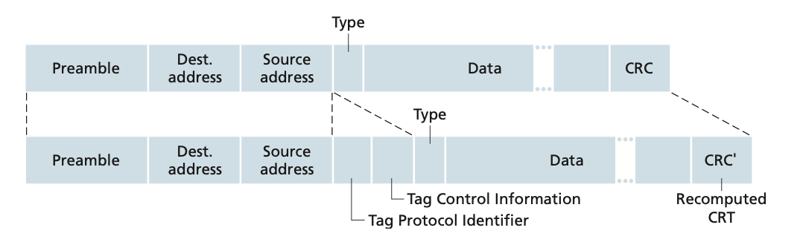

### MPLS — label-switched data plane

MPLS (Multiprotocol Label Switching) sits conceptually between Layer 2 and Layer 3 — often called "Layer 2.5." It is widely deployed in carrier and ISP backbones to enable fast forwarding and traffic engineering across large networks.

MPLS enhances forwarding speed by replacing longest-prefix IP lookups with exact-match label lookups. An **MPLS header** is inserted between the Link-layer header and the IP header on links between MPLS-capable routers. The header carries:

- **Label** (20 bits): The forwarding key — replaces IP destination lookup.
- **TC / Experimental bits** (3 bits): Traffic class / QoS.
- **S (Bottom of Stack)** (1 bit): Indicates the last label in a stack of headers.
- **TTL** (8 bits): Decremented at each MPLS hop to prevent loops.

**Label-switched routers (LSRs)** forward frames by swapping the incoming label for an outgoing label and sending the frame to the next LSR — no IP address extraction, no longest-prefix match. This is O(1) per hop rather than O(log n) for an IP routing table.

MPLS enables **traffic engineering** (TE): operators can route traffic along explicit paths that bypass the paths chosen by standard OSPF/IS-IS, for load balancing or latency guarantees. It is also the foundation for **MPLS VPNs** (RFC 4364), where customer routes are carried in a VPN label stack without leaking into the provider's global IP table.

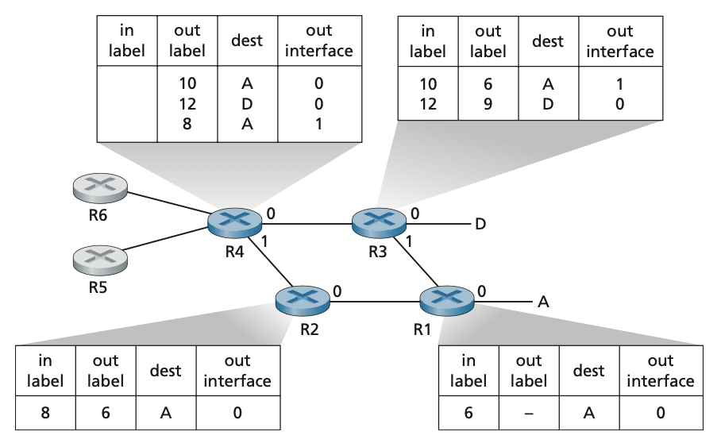

> [!NOTE]
> From the perspective of the Link layer, an MPLS frame looks like a normal Ethernet frame — the MPLS header is encapsulated in the Ethernet payload. MPLS is transparent to end hosts; only the carrier's routers are MPLS-aware.

## Medium Access Control

Early Ethernet operated on shared coaxial cable: all hosts saw all frames simultaneously, and two simultaneous transmissions destroyed each other. The question of "who gets to transmit when?" is the **multiple access problem**, solved by MAC protocols. Understanding MAC protocols explains both why CSMA/CD was necessary and why it is no longer relevant on modern switched Ethernet.

### Multiple Access Protocols

Multiple access protocols fall into three categories: **channel partitioning**, **random access**, and **taking turns**.

#### Channel Partitioning

Channel partitioning protocols divide the shared channel into slices and assign one slice permanently to each node. They eliminate collisions entirely but waste capacity when nodes are idle.

**Time-Division Multiplexing (TDM)** divides time into frames and subdivides each frame into N fixed-length slots, one per node. Each node transmits only in its assigned slot. Waste: a node with nothing to send still "owns" its slot, so the channel sits idle. See also [circuit switching](./1-what-is-networking.md).

**Frequency-Division Multiplexing (FDM)** divides the channel bandwidth into N sub-bands of R/N bps each, one per node. Same efficiency problem: an idle node wastes its sub-band.

**Code Division Multiple Access (CDMA)** assigns each node a unique spreading code. Nodes can transmit simultaneously; receivers use the code to extract the intended signal from the aggregate. Used in 3G wireless and some military systems — not in wired Ethernet.

#### Random Access Protocols

In random access, every node transmits at the full channel rate R bps whenever it has data. When two nodes transmit simultaneously, a **collision** occurs and both frames are corrupted. The protocol specifies how collisions are detected and recovered.

**Pure ALOHA** (earliest random access protocol): A node transmits immediately when it has data. If no ACK arrives within a timeout, the node waits a random backoff time and retransmits. Maximum efficiency is approximately 18% of channel capacity — most transmissions collide.

**Slotted ALOHA** divides time into fixed-length slots equal to one frame transmission time. Nodes may only begin transmitting at slot boundaries. Collisions still occur but are contained within one slot; a colliding node waits a random number of slots before retrying. Maximum efficiency approximately 37%.

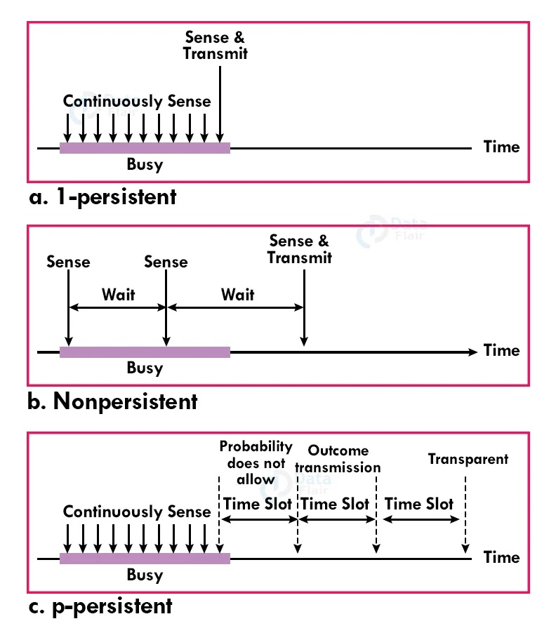

**CSMA (Carrier Sense Multiple Access)** improves on ALOHA by adding **carrier sensing**: a node listens to the channel before transmitting. If the channel is busy, it waits; if idle, it transmits. Collisions still occur due to propagation delay — two nodes can both sense the channel as idle in the same instant if they are far apart. CSMA variants differ in how long a node waits when it senses a busy channel:

- **1-persistent CSMA**: Continuously sense; transmit immediately when channel goes idle. Aggressive — multiple waiting nodes always collide.
- **Non-persistent CSMA**: When channel is busy, wait a random time before sensing again. Reduces collisions at the cost of idle time.
- **p-persistent CSMA**: When the channel goes idle, transmit with probability p; defer with probability 1−p. Balances aggressiveness and collision rate.

**CSMA/CD** (Carrier Sense Multiple Access with Collision Detection) adds **collision detection**: a transmitting node monitors the channel while transmitting. If it detects a collision (the received signal differs from what it sent), it immediately aborts transmission, transmits a jam signal to ensure all nodes hear the collision, and enters **binary exponential backoff**:

- After the k-th collision, the node picks a random wait time from {0, 1, …, 2^k − 1} × 512-bit transmission times.
- After 16 failures, the frame is dropped and an error is reported.

Three time phases in CSMA/CD operation: **contention period** (carrier sensing + collision resolution), **transmission period** (frame in flight, no collision), **idle period** (inter-frame gap).

**CSMA/CA** (Collision Avoidance) is used in wireless networks (802.11 Wi-Fi) where collision detection is impractical — a node cannot simultaneously transmit and detect a collision on a radio channel. Instead, it adds a **contention window**: after sensing the channel idle for a DIFS period, the node waits a random backoff within the contention window before transmitting. ACKs confirm receipt; a missing ACK triggers backoff and retransmission.

#### Taking Turns (Controlled Access)

Taking-turns protocols eliminate collisions via coordination, at the cost of overhead or a single point of failure.

**Reservation**: Before each data interval, nodes broadcast a reservation in a fixed mini-slot frame with N slots (one per node). Only nodes that reserved a slot transmit data in the following interval.

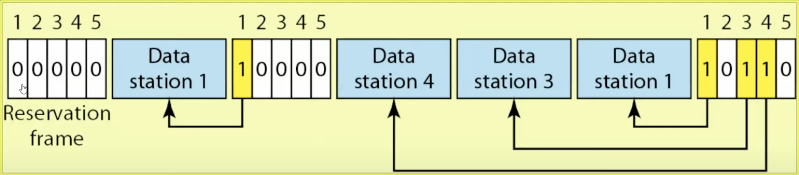

**Polling**: A master node polls each node in round-robin. Only the polled node transmits. Drawback: polling delay on every cycle; master node failure disables the channel.

**Token Passing**: A special "token" frame circulates among nodes in a fixed ring. A node may transmit only when it holds the token; it passes the token on when done. Decentralized — no master node. Used in Token Ring (IEEE 802.5) and FDDI. Examples of physical topologies: Physical Ring, Dual Ring, Star Ring, Bus Ring.

### Full Duplex and the Death of CSMA/CD

Early Ethernet (10BASE-T on shared coax) was half-duplex: all hosts shared one collision domain. CSMA/CD governed when each host could transmit. Modern Ethernet is point-to-point (switch port ↔ NIC) and full duplex: separate wire pairs for TX and RX. Collisions are physically impossible. CSMA/CD is disabled. The switch replaces the collision domain with separate dedicated links.

This matters for performance: a 1 Gbps full-duplex link provides 1 Gbps in each direction simultaneously, for 2 Gbps aggregate. Half-duplex 1 Gbps would provide 1 Gbps shared in both directions.

## Real-world Example

Using `tcpdump` to observe Ethernet frames and ARP on a Linux or macOS host. This is the most direct way to see Layer 2 in action.

```bash
# Capture all ARP traffic on the default interface (replace eth0 with your interface)
$ sudo tcpdump -i eth0 -n arp -v
tcpdump: listening on eth0, link-type EN10MB (Ethernet)

# ARP request: who has 192.168.1.1?
14:23:01.123456 ARP, Request who-has 192.168.1.1 tell 192.168.1.42, length 28
    Sender: 192.168.1.42 (aa:bb:cc:dd:ee:01)
    Target: 192.168.1.1  (00:00:00:00:00:00)   # MAC unknown, hence the ARP request

# ARP reply: 192.168.1.1 is at aa:bb:cc:dd:ee:ff
14:23:01.124789 ARP, Reply 192.168.1.1 is-at aa:bb:cc:dd:ee:ff, length 28
    Sender: 192.168.1.1  (aa:bb:cc:dd:ee:ff)
    Target: 192.168.1.42 (aa:bb:cc:dd:ee:01)

# Capture first 3 Ethernet frames, show full frame details
$ sudo tcpdump -i eth0 -n -e -c 3
14:23:05.200001 aa:bb:cc:dd:ee:01 > aa:bb:cc:dd:ee:ff, ethertype IPv4 (0x0800), length 74:
  192.168.1.42.52341 > 8.8.8.8.53: UDP, length 32
  # Ethernet src/dst MACs, EtherType 0x0800 (IPv4), total frame length 74 bytes
  # Payload is a UDP DNS query
```

A Python example that constructs a raw Ethernet frame using `socket.AF_PACKET` (Linux only):

```python
import socket
import struct

def send_raw_frame(interface: str, dst_mac: bytes, src_mac: bytes, payload: bytes) -> None:
    """Send a raw Ethernet frame on Linux using AF_PACKET socket."""
    # EtherType 0x0800 = IPv4
    ethertype = b"\x08\x00"
    # Ethernet frame: dst MAC (6) + src MAC (6) + EtherType (2) + payload
    frame = dst_mac + src_mac + ethertype + payload

    with socket.socket(socket.AF_PACKET, socket.SOCK_RAW) as sock:
        sock.bind((interface, 0))
        sock.send(frame)
        # NOTE: FCS is computed and appended by the NIC automatically

# Example: send a raw frame (payload would normally be an IP packet)
dst = bytes.fromhex("ffffffffffff")   # broadcast
src = bytes.fromhex("aabbccddeeff")   # our MAC
payload = b"\x00" * 46                # minimum Ethernet payload (padded)
send_raw_frame("eth0", dst, src, payload)
```

> [!TIP]
> On most modern systems you never construct raw Ethernet frames in application code — the kernel handles Layers 1–4. `AF_PACKET` is used by packet sniffers (Wireshark, tcpdump), network testing tools, and protocol implementations that live below the kernel's IP stack (e.g., custom DPDK-based applications).

## In Practice

Switch CAM table size is finite. High-density datacenter switches may have tables supporting 128k–512k MAC entries. MAC flooding attacks deliberately overflow this table. In production, **port security** limits the number of MAC addresses per port (Cisco feature) or **802.1X** requires authentication before any frames are forwarded.

Jumbo frames (MTU 9,000) reduce CPU overhead for large transfers by cutting the number of packets. But they require end-to-end support — every NIC, switch, and router on the path must be configured identically. A single 1,500 MTU hop causes IP fragmentation (or TCP MSS mismatch), which destroys performance. PMTU discovery (RFC 1191) uses ICMP "fragmentation needed" messages to discover the path MTU, but many firewalls block ICMP, causing "black holes" where large packets silently disappear. This is the **PMTU black hole problem**, a persistent real-world failure mode.

> [!CAUTION]
> Disabling ICMP at your firewall — a common misguided "security" measure — breaks PMTU discovery. Large packets are silently dropped, HTTP connections hang after the handshake, and SCP/rsync of large files times out mysteriously. Always allow ICMP type 3 (destination unreachable) / code 4 (fragmentation needed) to pass through firewalls.

## Pitfalls

- **"MAC addresses are globally unique and immutable."** — MAC addresses are assigned by the NIC manufacturer (OUI prefix) and are supposed to be globally unique. In practice, VMs generate random MACs, many OSes randomize MACs for privacy (iOS, Android), and `ip link set dev eth0 address ...` changes a MAC trivially. Never rely on MAC addresses as a security boundary.
- **"A switch prevents all network sniffing."** — A switch prevents passive sniffing of unicast traffic you are not the intended recipient of. But: SPAN ports, ARP spoofing, CAM flooding, and MITM attacks all enable capture of traffic on a switched network. "Switched" ≠ "secure."
- **"ARP is only relevant on the local subnet."** — ARP is also used for **Gratuitous ARP** (announcing your own IP-to-MAC binding, used by HSRP/VRRP failover and by some DHCP implementations) and **Proxy ARP** (a router responding to ARP for remote hosts). Both are common sources of mysterious connectivity issues.
- **"Jumbo frames are always better."** — Jumbo frames reduce overhead but require uniform MTU across the path. Mixed-MTU paths cause fragmentation or PMTU black holes. Only use jumbo frames in controlled environments (datacenter storage networks, HPC clusters) where you control every hop.
- **"CRC guarantees data integrity."** — CRC-32 detects most errors but not all. A sufficiently long burst error can produce the same CRC as the original frame. CRC is a probabilistic check, not a cryptographic guarantee. For integrity over untrusted paths, use a cryptographic MAC (HMAC-SHA256) at a higher layer.

## Exercises

### Exercise 1 — ARP trace

Host A (IP 10.0.0.10, MAC `aa:aa:aa:aa:aa:aa`) wants to send a packet to Host B (IP 10.0.0.20, MAC `bb:bb:bb:bb:bb:bb`) on the same /24 subnet. Host A has an empty ARP cache. Trace every frame and packet exchanged, including the Ethernet headers, until the IP packet from A reaches B.

#### Solution

**Step 1 — A broadcasts ARP Request.**
Host A checks its ARP cache: no entry for 10.0.0.20. A sends:

```
Ethernet frame:
  dst MAC:  ff:ff:ff:ff:ff:ff  (broadcast — all hosts on segment receive it)
  src MAC:  aa:aa:aa:aa:aa:aa
  EtherType: 0x0806 (ARP)
ARP payload:
  Operation: REQUEST (1)
  Sender MAC: aa:aa:aa:aa:aa:aa
  Sender IP:  10.0.0.10
  Target MAC: 00:00:00:00:00:00  (unknown)
  Target IP:  10.0.0.20
```

The switch receives this frame, learns (aa:aa:aa:aa:aa:aa → port 1), and floods to all other ports because dst is broadcast.

**Step 2 — B sends ARP Reply (unicast).**
Host B receives the ARP Request, recognizes 10.0.0.20 as its own IP, and responds:

```
Ethernet frame:
  dst MAC:  aa:aa:aa:aa:aa:aa  (unicast directly to A)
  src MAC:  bb:bb:bb:bb:bb:bb
  EtherType: 0x0806 (ARP)
ARP payload:
  Operation: REPLY (2)
  Sender MAC: bb:bb:bb:bb:bb:bb
  Sender IP:  10.0.0.20
  Target MAC: aa:aa:aa:aa:aa:aa
  Target IP:  10.0.0.10
```

The switch receives this frame, learns (bb:bb:bb:bb:bb:bb → port 2), and forwards only to port 1 (A's port) — not flooding, since it now knows where A is.

**Step 3 — A sends IP packet to B.**
A receives the ARP Reply, caches `10.0.0.20 → bb:bb:bb:bb:bb:bb`, and sends the original IP packet:

```
Ethernet frame:
  dst MAC:  bb:bb:bb:bb:bb:bb  (B's MAC from ARP cache)
  src MAC:  aa:aa:aa:aa:aa:aa
  EtherType: 0x0800 (IPv4)
IP packet payload: (src 10.0.0.10, dst 10.0.0.20, ...)
```

The switch looks up `bb:bb:bb:bb:bb:bb` in its CAM table, finds port 2, and forwards only to port 2. B receives the Ethernet frame, strips the Ethernet header, and passes the IP packet up to Layer 3.

---

### Exercise 2 — VLAN isolation

A company has two departments, Engineering and Finance, sharing one physical switch. Engineering hosts are on VLAN 10 (10.0.10.0/24); Finance on VLAN 20 (10.0.20.0/24). Can an Engineering host directly ping a Finance host? What infrastructure do you need to add?

#### Solution

No, an Engineering host cannot directly ping a Finance host without a router (or Layer 3 switch). Here is why:

**Broadcast domain isolation:** The 802.1Q VLAN tag causes the switch to keep frames from VLAN 10 and VLAN 20 completely separate. A broadcast from Engineering never reaches Finance hosts, and vice versa. This means ARP cannot resolve across VLANs — Engineering hosts cannot discover the MAC of Finance hosts.

**IP subnet mismatch:** Even if somehow a frame crossed VLANs, 10.0.10.x and 10.0.20.x are different /24 subnets. An Engineering host's IP stack recognizes the destination is not on its subnet and sends the packet to its default gateway, not directly.

**What is needed:** A **router** (or **Layer 3 switch** with inter-VLAN routing configured) connected to both VLANs as a "router on a stick" (one physical port with two 802.1Q sub-interfaces) or with two physical interfaces. The router routes packets between VLANs at Layer 3. Access control lists (ACLs) on the router can enforce policies — for example, Engineering can SSH to Finance servers but Finance cannot initiate connections to Engineering workstations.

This VLAN + router architecture is the standard way to provide network segmentation in enterprise environments. It combines Layer 2 broadcast isolation (VLANs) with Layer 3 access control (ACLs on routers).

---

### Exercise 3 — MTU and fragmentation

A host sends a 2,000-byte IP packet (including IP header) over an Ethernet link with a standard 1,500-byte MTU. (a) Will this packet be fragmented? (b) If so, into how many fragments? (c) What are the sizes of each fragment?

#### Solution

**(a)** The IP payload (IP packet) is 2,000 bytes. The Ethernet MTU is 1,500 bytes. Since 2,000 > 1,500, yes, the packet will be fragmented (assuming the "Don't Fragment" bit is not set; if it is set, the router sends an ICMP "Fragmentation Needed" and drops the packet).

**(b)** The IP header is 20 bytes (standard, no options). So the data payload is 2,000 − 20 = 1,980 bytes to be fragmented. Each fragment carries an IP header (20 bytes) plus up to 1,480 bytes of data (1,500 MTU − 20 IP header). The fragment sizes must be multiples of 8 bytes (required by the IP fragmentation offset field, which is in units of 8 bytes).

Fragment 1: 20 (IP header) + 1,480 (data) = 1,500 bytes (fills the MTU). Data bytes 0–1,479.
Fragment 2: 20 (IP header) + 500 (remaining data) = 520 bytes. Data bytes 1,480–1,979.

So **2 fragments**.

**(c)** Fragment 1: 1,500 bytes (1,480 bytes of original data, More Fragments bit = 1, Fragment Offset = 0).
Fragment 2: 520 bytes (500 bytes of original data, More Fragments bit = 0, Fragment Offset = 185 × 8 = 1,480).

The receiving host reassembles by collecting all fragments with the same IP ID field, sorting by Fragment Offset, and concatenating payloads. In practice, IPv4 fragmentation is avoided (PMTU discovery) because reassembly is expensive and fragments can arrive out of order or be dropped individually. IPv6 prohibits router fragmentation entirely — only the sending host can fragment.

## Sources

- IEEE 802.3-2018 — Ethernet Standard. https://standards.ieee.org/standard/802_3-2018.html
- RFC 826 — ARP: An Ethernet Address Resolution Protocol. https://www.rfc-editor.org/rfc/rfc826
- RFC 1191 — Path MTU Discovery. https://www.rfc-editor.org/rfc/rfc1191
- Stevens, W. R. (1994). *TCP/IP Illustrated, Volume 1*. Chapters 4–5. Addison-Wesley.
- Kurose, J. F. & Ross, K. W. (2022). *Computer Networking*. Chapter 6. Pearson.
- Material in this note draws on open-source companion notes at [VasanthVanan/computer-networking-top-down-approach-notes](https://github.com/VasanthVanan/computer-networking-top-down-approach-notes) (Kurose & Ross 8th ed.) and [karthick28/computer-networking-notes](https://github.com/karthick28/computer-networking-notes) (Coursera "Bits and Bytes of Computer Networking").

## Related

- [1 - What is Computer Networking](./1-what-is-networking.md)
- [2 - OSI and TCP/IP Models](./2-osi-and-tcp-ip.md)
- [4 - The Network Layer — IP, Subnetting, Routing](./4-network-layer-ip.md)
- [9 - Network Security](./9-network-security.md)
