# 4 - The Network Layer — IP, Subnetting, Routing

[toc]

> **TL;DR:** The Network layer (Layer 3) is responsible for getting packets from any source host to any destination host across an arbitrary collection of interconnected networks. IPv4 and IPv6 provide the universal addressing scheme; CIDR subnetting divides address space efficiently; routers perform longest-prefix-match forwarding; DHCP automates address assignment; NAT is the pragmatic patch that kept IPv4 alive past its address-exhaustion deadline; BGP glues the entire Internet's autonomous systems together.

## Vocabulary

**IPv4 address**: A 32-bit identifier for a network interface, written as four dot-separated decimal octets: `192.168.1.1`. Globally unique for public hosts; private ranges (RFC 1918) are reused behind NAT.

```math
\text{IPv4 address} \in \{0,1\}^{32}
```

---

**IPv6 address**: A 128-bit identifier written as eight colon-separated groups of four hex digits: `2001:0db8:85a3::8a2e:0370:7334`. Solves IPv4 exhaustion; no NAT required.

```math
\text{IPv6 address} \in \{0,1\}^{128}
```

---

**Subnet**: A contiguous block of IP addresses identified by a network prefix and a prefix length. All hosts on a subnet share the same prefix.

---

**CIDR (Classless Inter-Domain Routing)**: The notation and routing system that replaced classful A/B/C addressing. A CIDR block is written as `prefix/length`, e.g., `10.0.0.0/8`.

---

**Subnet mask**: A 32-bit mask where the first N bits are 1 (the network portion) and the remaining 32−N bits are 0 (the host portion). `255.255.255.0` is the mask for /24.

---

**Network address**: The first address in a subnet (all host bits = 0). Not assignable to a host. `10.0.1.0` in `10.0.1.0/24`.

---

**Broadcast address**: The last address in a subnet (all host bits = 1). Frames sent here are delivered to all hosts. `10.0.1.255` in `10.0.1.0/24`.

---

**Default gateway**: The router's IP address on the local subnet. Hosts send packets to the gateway when the destination is not on the local subnet.

---

**Routing table**: A data structure mapping IP prefixes to next hops. Each entry specifies: destination prefix, next-hop IP, egress interface.

---

**Longest prefix match (LPM)**: The forwarding rule: among all routing table entries that match a destination IP, choose the one with the longest (most specific) prefix. /32 beats /24 beats /16 beats /0.

---

**TTL (Time to Live)**: An 8-bit field in the IP header, decremented by each router. When it reaches 0, the packet is dropped and an ICMP "Time Exceeded" message is sent back to the source. Prevents routing loops from circulating packets forever.

---

**ICMP (Internet Control Message Protocol)**: A Layer 3 companion protocol to IP for error reporting and diagnostics. `ping` uses ICMP Echo Request/Reply; `traceroute` uses ICMP Time Exceeded.

---

**NAT (Network Address Translation)**: A mechanism that allows multiple private-addressed hosts to share one public IP address. The NAT device rewrites src IP (and src port for NAPT) on outgoing packets and maintains a translation table to reverse the mapping on replies.

---

**RFC 1918 private ranges**: Three IPv4 address blocks reserved for private use, never routed on the public Internet:
- `10.0.0.0/8` — 16 million addresses
- `172.16.0.0/12` — 1 million addresses
- `192.168.0.0/16` — 65,536 addresses

---

**DHCP (Dynamic Host Configuration Protocol)**: An application-layer protocol (UDP ports 67/68) that automates IP address assignment. A client broadcasts a discover message; a server responds with an offer containing IP address, subnet mask, default gateway, and DNS server.

---

**BGP (Border Gateway Protocol)**: The path-vector routing protocol that exchanges reachability information between autonomous systems (AS). The routing protocol of the Internet. RFC 4271.

---

**Autonomous System Number (ASN)**: A 16-bit or 32-bit number identifying an AS. Assigned by IANA/RIRs. Example: Google is AS15169, Cloudflare is AS13335.

---

**Forwarding**: The router-local action of moving a packet from an input link interface to the appropriate output link interface. Implemented in hardware; operates in the data plane.

---

**Routing**: The network-wide process that determines end-to-end paths packets take from source to destination. Implemented in software; operates in the control plane via routing algorithms.

---

**SDN (Software-Defined Networking)**: An architecture that separates the control plane from the data plane. A remote controller computes and distributes forwarding tables to routers, enabling programmable, centrally managed networks.

---

## Intuition

Think of IP addresses as postal codes (ZIP codes). A subnet is a ZIP code zone: all addresses in `192.168.1.0/24` are like ZIP code 10001 — they identify a specific neighborhood. A router is the postal sorting facility: it looks at the destination ZIP code and decides which truck to put the letter in. The routing table is the facility's routing manual.

The crucial insight of longest-prefix match: if you have entries for `10.0.0.0/8` (the entire city) and `10.0.1.0/24` (a specific neighborhood), a packet to `10.0.1.55` matches both — but the router forwards to the more specific /24 rule because you presumably have better information about that neighborhood.

The network layer operates at two levels simultaneously. The **data plane** (per-router, hardware-speed) handles individual packet forwarding via lookup tables. The **control plane** (network-wide, software-speed) runs routing protocols to build and update those tables. Early routers conflated both in one box; SDN pulls them apart — the control plane moves to a remote controller that programs many forwarding devices centrally.

IP addresses belong to network interfaces (and therefore networks), not to the physical device. A router with four interfaces has four IP addresses — one per connected subnet. When a host moves to a different network, its IP address changes. This is why DHCP is needed: it assigns addresses dynamically as hosts join subnets.

The classful addressing system (Class A/B/C/D/E based on leading bits) predates CIDR and is largely obsolete, but still appears in legacy equipment and certifications:

| Class | Leading bits | Network octets | Range |
| :---: | :---: | :---: | :--- |
| A | 0 | 1 | 0.0.0.0 – 127.255.255.255 |
| B | 10 | 2 | 128.0.0.0 – 191.255.255.255 |
| C | 110 | 3 | 192.0.0.0 – 223.255.255.255 |
| D | 1110 | — | 224.0.0.0 – 239.255.255.255 (multicast) |
| E | 1111 | — | 240.0.0.0 – 255.255.255.255 (reserved) |

CIDR replaced this with flexible-length prefixes, dramatically reducing routing table size through **route aggregation** (announcing one /20 instead of 16 separate /24s).

## IPv4 Addressing and Subnetting

An IPv4 address is 32 bits, divided by the subnet prefix into a network portion and a host portion. The subnet mask makes the division explicit in binary: the consecutive 1-bits at the left identify the network, and the trailing 0-bits identify the host.

```
Address:   192.168.1.100
Binary:    11000000.10101000.00000001.01100100
Mask /24:  11111111.11111111.11111111.00000000
           |---------network---------|--host--|
Network:   192.168.1.0
Broadcast: 192.168.1.255
Host range: 192.168.1.1 — 192.168.1.254 (254 usable hosts)
```

The binary AND of any address with its subnet mask yields the network address. For example, `9.100.100.100 AND 255.255.255.0 = 9.100.100.0`. This is the fundamental operation every router and host performs to decide whether a destination is on the local subnet or must be forwarded to the gateway.

### Subnet Math

Given a /N prefix:
- Number of host bits = 32 − N
- Number of usable hosts = 2^(32-N) − 2 (subtract network and broadcast)
- Number of subnets if splitting a larger block

```math
\text{usable hosts per subnet} = 2^{32 - N} - 2
```

Common prefix lengths to memorize:

| CIDR | Mask | Hosts | Typical use |
| :---: | :--- | ---: | :--- |
| /30 | 255.255.255.252 | 2 | Point-to-point router links |
| /29 | 255.255.255.248 | 6 | Small office |
| /28 | 255.255.255.240 | 14 | Tiny subnet |
| /27 | 255.255.255.224 | 30 | |
| /24 | 255.255.255.0 | 254 | Standard LAN |
| /23 | 255.255.254.0 | 510 | |
| /22 | 255.255.252.0 | 1,022 | |
| /16 | 255.255.0.0 | 65,534 | Large private network |
| /8 | 255.0.0.0 | 16,777,214 | Very large (class A) |

### CIDR and Route Aggregation

CIDR (Classless Inter-Domain Routing) is the Internet's address assignment strategy. The network portion is the x most significant bits of the address (the prefix); the remaining 32−x bits identify devices within the organization. CIDR allows flexible-length subnetting, avoiding the rigid class A/B/C constraints that wasted enormous address blocks.

The key operational benefit of CIDR is **route aggregation**: an ISP allocated `200.23.16.0/20` can announce a single prefix to the Internet even if it serves 16 different /24 customer networks. Routers holding the aggregated /20 entry need not know about each /24, keeping global routing tables smaller.

> [!IMPORTANT]
> A subnet's **network address** (host bits all 0) and **broadcast address** (host bits all 1) are reserved and cannot be assigned to a host. A /24 has 256 total addresses but only 254 usable. A /30 has 4 total addresses but only 2 usable — just enough for a point-to-point router link.

### VLSM — Variable Length Subnet Masking

VLSM allows subnetting a larger block into subnets of different sizes to avoid wasting addresses. Given 192.168.1.0/24, you need: one /26 (62 hosts), two /27 (30 hosts each), one /30 (2 hosts, router link).

- `192.168.1.0/26` — hosts .1–.62, broadcast .63
- `192.168.1.64/27` — hosts .65–.94, broadcast .95
- `192.168.1.96/27` — hosts .97–.126, broadcast .127
- `192.168.1.128/30` — hosts .129–.130, broadcast .131

### DHCP — Dynamic Host Configuration Protocol

Every host on a TCP/IP network needs four pieces of configuration: an IP address, a subnet mask, a default gateway, and a DNS server address. DHCP automates all four, eliminating manual administration and supporting mobile hosts that roam between subnets.

DHCP uses UDP: the client listens on port 68, the server on port 67. Since the client has no IP address yet, all messages are broadcast at the IP layer (destination `255.255.255.255`, source `0.0.0.0`) until the server assigns an address.

#### DHCP four-way handshake (DORA)

The four messages follow a discover → offer → request → acknowledge pattern:

1. **DHCP Discover** — The client broadcasts a discover message to find any DHCP server on the subnet.
2. **DHCP Offer** — One or more DHCP servers respond with an offer: proposed IP address, subnet mask, lease duration, gateway, and DNS.
3. **DHCP Request** — The client broadcasts a request, selecting one server's offer (and implicitly declining others). Broadcasting the request lets all servers see which offer was accepted.
4. **DHCP ACK** — The selected server acknowledges with the finalized configuration. The client can now configure its network interface for the lease duration.

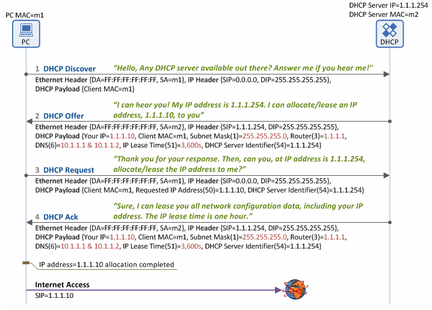

The DHCP server tracks which address is assigned to which MAC address, so it can assign the same address to the same device on reconnect (**dynamic allocation**). **Fixed allocation** uses a static MAC-to-IP mapping, useful for servers and printers that need a predictable address. **Automatic allocation** permanently assigns the first available address from a pool.

> [!NOTE]
> If no DHCP server exists on the local subnet, a **DHCP relay agent** (typically the gateway router itself) forwards DHCP broadcasts as unicast packets to a DHCP server on another subnet. This lets a single DHCP server serve multiple subnets without requiring one server per subnet.

DHCP also commonly distributes **NTP (Network Time Protocol)** server addresses so all hosts on the network automatically synchronize their clocks.

Individual messages in action:

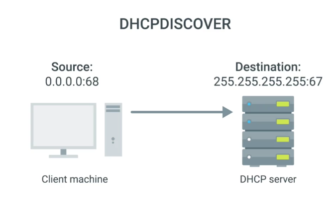

## IPv4 Header

The IPv4 header is the core of the Network layer. Understanding its fields matters for firewall rules, QoS, and debugging. An IP datagram consists of the header (minimum 20 bytes, variable with options) followed by the payload (a transport-layer segment or an ICMP message).

```
 0                   1                   2                   3
 0 1 2 3 4 5 6 7 8 9 0 1 2 3 4 5 6 7 8 9 0 1 2 3 4 5 6 7 8 9 0 1
+-+-+-+-+-+-+-+-+-+-+-+-+-+-+-+-+-+-+-+-+-+-+-+-+-+-+-+-+-+-+-+-+
|Version|  IHL  |    DSCP   |ECN|         Total Length          |
+-+-+-+-+-+-+-+-+-+-+-+-+-+-+-+-+-+-+-+-+-+-+-+-+-+-+-+-+-+-+-+-+
|         Identification        |Flags|     Fragment Offset     |
+-+-+-+-+-+-+-+-+-+-+-+-+-+-+-+-+-+-+-+-+-+-+-+-+-+-+-+-+-+-+-+-+
|  Time to Live |    Protocol   |         Header Checksum       |
+-+-+-+-+-+-+-+-+-+-+-+-+-+-+-+-+-+-+-+-+-+-+-+-+-+-+-+-+-+-+-+-+
|                       Source Address                          |
+-+-+-+-+-+-+-+-+-+-+-+-+-+-+-+-+-+-+-+-+-+-+-+-+-+-+-+-+-+-+-+-+
|                    Destination Address                        |
+-+-+-+-+-+-+-+-+-+-+-+-+-+-+-+-+-+-+-+-+-+-+-+-+-+-+-+-+-+-+-+-+
|                    Options (if IHL > 5)                       |
+-+-+-+-+-+-+-+-+-+-+-+-+-+-+-+-+-+-+-+-+-+-+-+-+-+-+-+-+-+-+-+-+
```

The following table describes every field (Kurose & Ross field-by-field treatment):

| Field | Size | Description |
| :--- | :---: | :--- |
| **Version** | 4 bits | IP protocol version: 4 for IPv4, 6 for IPv6. |
| **IHL (Header Length)** | 4 bits | Header length in 32-bit words. Minimum 5 (= 20 bytes). Values > 5 indicate options are present. |
| **DSCP / Type of Service** | 8 bits | Differentiated Services Code Point — used for QoS marking and traffic prioritization. |
| **ECN** | 2 bits | Explicit Congestion Notification — allows routers to signal congestion without dropping packets. |
| **Total Length** | 16 bits | Total datagram length (header + data) in bytes. Maximum 65,535 bytes. |
| **Identification** | 16 bits | Groups fragments of the same original datagram. All fragments of one datagram share the same ID. |
| **Flags** | 3 bits | Bit 1: Don't Fragment (DF). Bit 2: More Fragments (MF). Bit 0: reserved. |
| **Fragment Offset** | 13 bits | Position of this fragment within the original datagram, in units of 8 bytes. Used to reassemble at the destination. |
| **TTL (Time to Live)** | 8 bits | Decremented by 1 at each router hop. Datagram discarded (ICMP Time Exceeded sent) when TTL = 0. |
| **Protocol** | 8 bits | Upper-layer protocol: 1 = ICMP, 6 = TCP, 17 = UDP, 89 = OSPF. |
| **Header Checksum** | 16 bits | 1s-complement checksum over the header only (not the payload). Recomputed at each router because TTL changes. |
| **Source Address** | 32 bits | IPv4 address of the sending interface. |
| **Destination Address** | 32 bits | IPv4 address of the intended recipient. |
| **Options** | variable | Rarely used; allow header extension for timestamps, strict source routing, etc. Omitted entirely in IPv6. |
| **Data (Payload)** | variable | Transport-layer segment (TCP/UDP) or ICMP message. A datagram carrying TCP has 40 bytes of total header (20 IP + 20 TCP) before the application payload. |

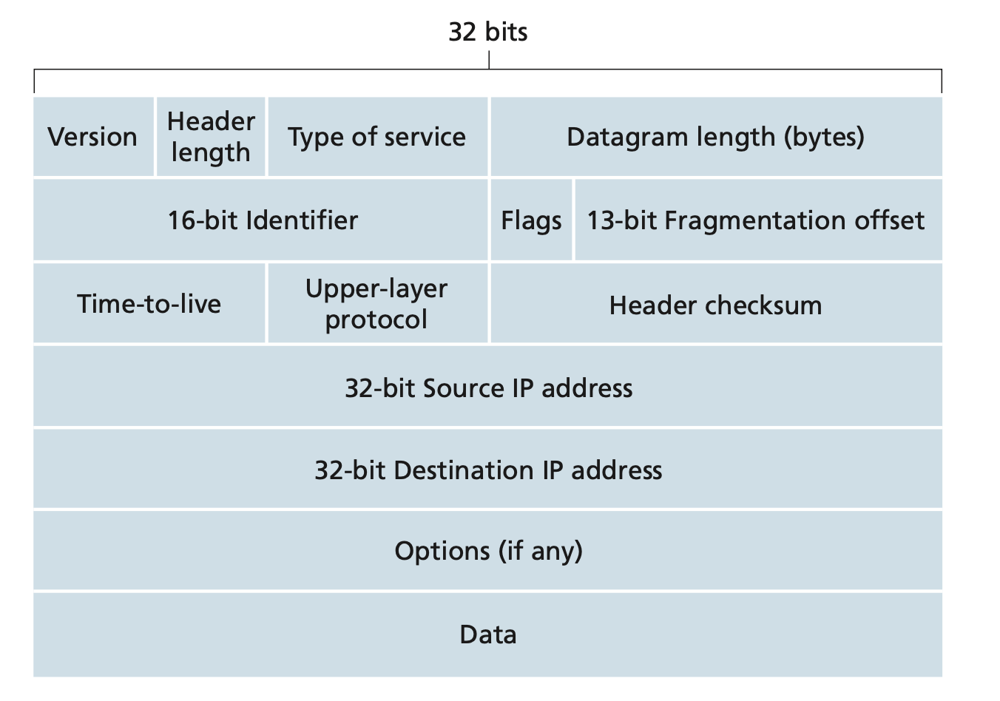

Additional field reference images from the Coursera notes:

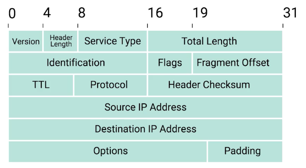

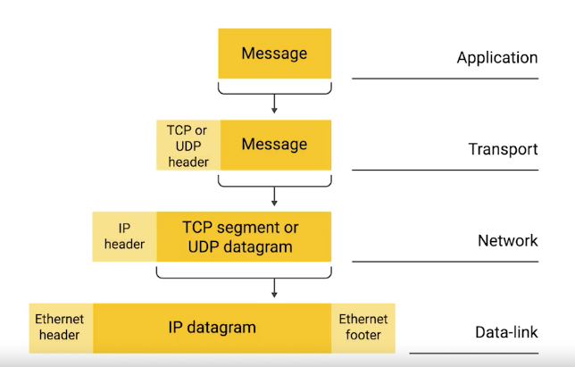

> [!TIP]
> When a router decrements TTL, it must recompute the header checksum — the checksum covers the header, and TTL is in the header. This is why IPv6 dropped the header checksum entirely: every hop recomputing it is unnecessary work when transport layers (TCP, UDP) already check their own data integrity.

## Routing Tables and Longest Prefix Match

A router's forwarding table maps destination prefixes to egress interfaces and next-hop IPs. When a packet arrives, the router performs LPM to find the best entry. There are two conceptually distinct operations involved: **forwarding** (the per-packet, hardware-speed lookup in the data plane) and **routing** (the network-wide, software-speed computation of the table itself in the control plane).

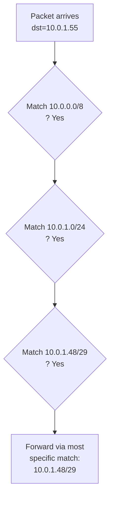

A real Linux routing table (from `ip route show`):

```bash
$ ip route show
default via 192.168.1.1 dev eth0        # 0.0.0.0/0 — default route, lowest priority
10.0.0.0/8 via 10.1.0.1 dev tun0       # /8 — corporate VPN
10.0.1.0/24 dev eth1 proto kernel       # /24 — directly connected subnet
192.168.1.0/24 dev eth0 proto kernel    # /24 — home LAN (directly connected)
# A packet to 10.0.1.55 matches both 10.0.0.0/8 and 10.0.1.0/24.
# The /24 wins (longer prefix) → forwarded via eth1, not the VPN.
```

> [!IMPORTANT]
> The **default route** (`0.0.0.0/0`) matches every destination with prefix length 0. It is the catch-all: if no more specific route exists, use this one. A host with no default route cannot reach the Internet — it only knows how to reach directly connected subnets. Routers inject default routes via DHCP or static configuration.

### Forwarding vs Routing

The distinction between forwarding and routing is fundamental to understanding modern network architecture. **Forwarding** is the data-plane action: a packet arrives at a router's input port, the router looks up the destination IP in the forwarding table, and sends the packet to the appropriate output port. This happens in hardware at line rate (nanoseconds). **Routing** is the control-plane process: routing protocols (OSPF, BGP) exchange topology information between routers and compute the forwarding tables. This happens in software on the routing processor (milliseconds to seconds).

A router's **forwarding table** is the interface between these planes. The routing processor computes it and installs a shadow copy at each line card so individual packet lookups never hit the CPU.

SDN pushes this separation further: the control plane moves entirely off the router onto a remote controller. Routers become simple forwarding devices that receive their forwarding tables from the controller via a protocol such as OpenFlow. This enables network-wide optimization policies that individual routers, making local decisions, cannot achieve.

### Router Architecture

A generic router has four functional components. Understanding how they interact explains queuing delays, head-of-line blocking, and why router buffer sizing matters.

**Input ports** terminate incoming physical links, perform link-layer processing, and execute the forwarding lookup to determine the output port. Control packets (routing protocol messages) are forwarded to the routing processor rather than the switching fabric.

**Switching fabric** connects input ports to output ports. Three main switching methods exist:

| Method | Mechanism | Limitation |
| :--- | :--- | :--- |
| Via memory | CPU copies packet between ports | Limited by memory bus bandwidth; shared bus |
| Via bus | Input port labels packet with output port, bus transfers it | One packet at a time; bus speed is the bottleneck |
| Via interconnection network | Crossbar switch: 2N buses connect N inputs to N outputs | Non-blocking parallel forwarding; used in high-end routers |

Modern high-speed routers use crossbar or multistage interconnection fabrics that allow multiple packets to be forwarded simultaneously.

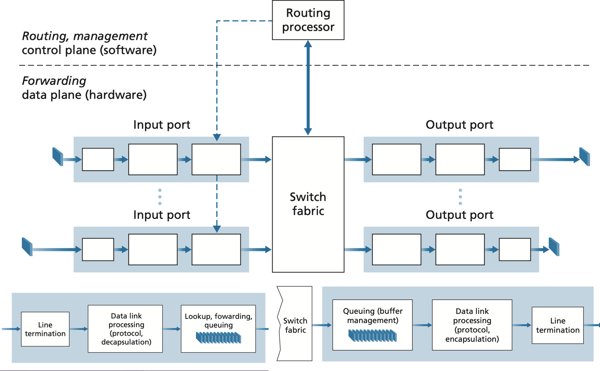

**Output ports** store packets received from the switching fabric and transmit them onto the outgoing link, performing link-layer and physical-layer processing.

**Routing processor** handles control-plane functions: executing routing protocols, maintaining routing tables, and computing forwarding tables. In SDN routers, it communicates with the remote controller and installs received forwarding entries.

#### Queueing and HOL Blocking

Queues form at both input and output ports when the arrival rate exceeds the service rate. At input ports, if the switching fabric is slower than N × line rate, packets queue up and **head-of-line (HOL) blocking** can occur: a packet at the head of an input queue that is blocked (its output port is busy) prevents packets behind it from being forwarded even if their output ports are free.

At output ports, queues form when packets from multiple input ports arrive simultaneously destined for the same output. If the output queue fills, packets are dropped (tail drop) or managed via active queue management (AQM).

The traditional buffer sizing rule is B = RTT × C, where RTT is the average round-trip time and C is the link capacity. A more modern formula accounting for many simultaneous flows is B = RTT × C / √N, where N is the number of independent TCP flows. Over-buffering causes **bufferbloat**: packets sit in large queues for hundreds of milliseconds, inflating latency without preventing loss.

#### Packet Scheduling

The output port scheduler determines which queued packet to transmit next when the link is available:

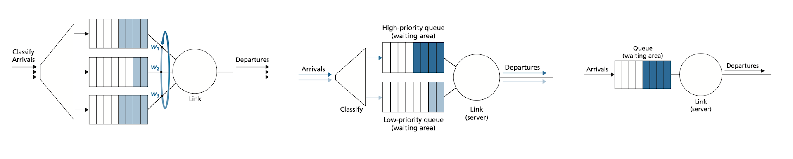

| Discipline | Description | Notes |
| :--- | :--- | :--- |
| **FIFO** | Packets leave in arrival order | Simple; no differentiation |
| **Priority queuing** | Higher-priority classes served first | Low-priority traffic can starve |
| **Round robin** | Alternates service among classes | Fair across classes |
| **WFQ (Weighted Fair Queuing)** | Round robin with per-class weights | Provides bandwidth guarantees per class |

### Generalised Forwarding and SDN Data Plane

Traditional destination-based forwarding uses only the destination IP address to make forwarding decisions. Generalised forwarding, as implemented by SDN/OpenFlow, matches on any combination of header fields (Layer 2 through Layer 4) and supports a richer set of actions beyond simple forwarding.

An OpenFlow flow table entry has three parts: a **match** (a set of header field values to match against), a **priority** (to resolve conflicts among overlapping rules), and an **action** (forward to port, drop, modify header fields, send to controller). This match-plus-action abstraction unifies routers, firewalls, load balancers, and NAT into a single programmable forwarding model.

**Middleboxes** — NAT devices, firewalls, load balancers, intrusion detection systems — implement network functions by inspecting and modifying traffic in transit. In traditional networks these are purpose-built appliances. In SDN and NFV (Network Function Virtualisation) architectures, their logic runs as software on commodity servers. See [[10-modern-networking]] for SDN, NFV, and programmable data planes in depth.

> [!NOTE]
> The match-plus-action model and the full OpenFlow specification are covered in the SDN material. This section notes their existence so the data-plane picture is complete; the control-plane implications belong in the routing and SDN notes.

## IPv6

IPv6 uses 128-bit addresses, providing 2^128 ≈ 3.4 × 10^38 addresses — enough to give 500 billion billion addresses to every person on Earth. Key improvements over IPv4:

- No need for NAT — every device gets a globally routable address.
- Simplified header (fixed 40 bytes, no checksum — transport layers handle that).
- No router fragmentation — only the source can fragment (Path MTU Discovery built in).
- Stateless Address Autoconfiguration (SLAAC) — hosts self-configure from router advertisements.
- Built-in IPsec (optional in IPv4, mandatory to support in IPv6).

### IPv6 Address Notation and Reserved Ranges

IPv6 addresses are written as eight groups of four hex digits separated by colons: `2001:0db8:0000:0000:0000:ff00:0012:3456`. Two shortening rules apply:

1. Leading zeros within a group may be omitted: `2001:db8:0:0:0:ff00:12:3456`.
2. One (and only one) consecutive run of all-zero groups may be replaced with `::`: `2001:db8::ff00:12:3456`.

Reserved ranges:

| Prefix | Purpose |
| :--- | :--- |
| `::1/128` | Loopback (localhost) |
| `2001:db8::/32` | Documentation and examples (never routed) |
| `ff00::/8` | Multicast — addressing groups of hosts simultaneously |
| `fe80::/10` | Link-local unicast — auto-configured from MAC address; on-link communication only |

IPv6 address structure: a /64 prefix (network) + 64-bit Interface Identifier (host). Link-local addresses (`fe80::/10`) are automatically assigned to every interface for on-link communication.

### IPv6 Header

The IPv6 header is simpler than IPv4's: fixed 40 bytes with no options field (extensions are chained via the Next Header field) and no header checksum.

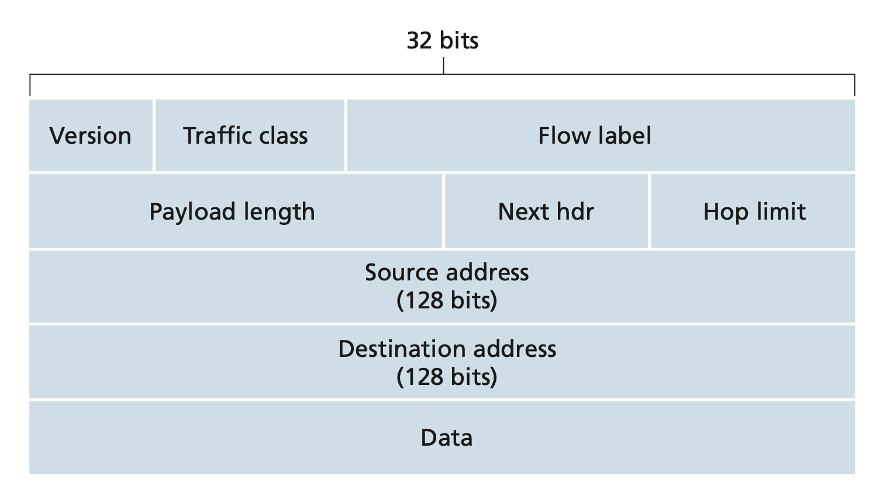

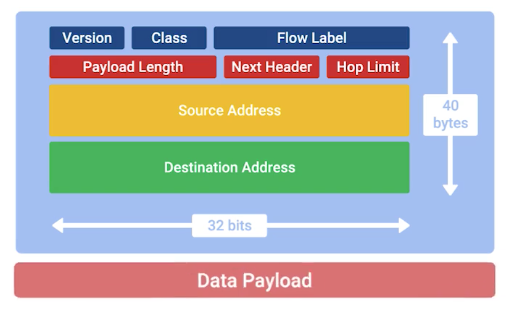

| Field | Size (bits) | Description |
| :--- | :---: | :--- |
| **Version** | 4 | Always 6 for IPv6. |
| **Traffic Class** | 8 | Similar to DSCP in IPv4; prioritizes datagrams within a flow or from specific applications. |
| **Flow Label** | 20 | Identifies a flow of datagrams; used with Traffic Class to give special handling for real-time or QoS traffic. |
| **Payload Length** | 16 | Byte count of everything after the fixed 40-byte header. |
| **Next Header** | 8 | Identifies the protocol immediately after the IPv6 header (e.g., 6 = TCP, 17 = UDP, 58 = ICMPv6, 43 = Routing extension header). |
| **Hop Limit** | 8 | Equivalent to IPv4 TTL: decremented by each forwarding router; datagram discarded at zero. |
| **Source Address** | 128 | IPv6 address of sender. |
| **Destination Address** | 128 | IPv6 address of intended recipient. |
| **Fragmentation/Reassembly** | N/A | IPv6 routers do not fragment. If a datagram is too large, the router sends an ICMPv6 "Packet Too Big" error; the source must retransmit at a smaller size (Path MTU Discovery). |
| **Header Checksum** | N/A | Removed; checksumming is performed by transport (TCP/UDP) and link-layer protocols. |
| **Options** | N/A | No longer in the fixed header; represented as extension headers chained via Next Header. |

### IPv4-to-IPv6 Transition: Dual-Stack and Tunneling

A flag-day cutover from IPv4 to IPv6 was never feasible. Two mechanisms dominate the transition:

**Dual-stack**: A host or router speaks both IPv4 and IPv6 simultaneously. It has both a 32-bit and a 128-bit address on each interface. DNS returns both A (IPv4) and AAAA (IPv6) records; the application picks which to use (typically IPv6 first via RFC 6724 address selection).

**Tunneling**: When two IPv6 nodes want to communicate but the path between them traverses IPv4-only routers, the sending IPv6 node encapsulates the entire IPv6 datagram as the payload of an IPv4 datagram addressed to the receiving IPv6 node. The IPv4 routers in between forward it as a normal IPv4 datagram, unaware of the IPv6 payload. The receiving node strips the IPv4 wrapper and processes the IPv6 datagram.

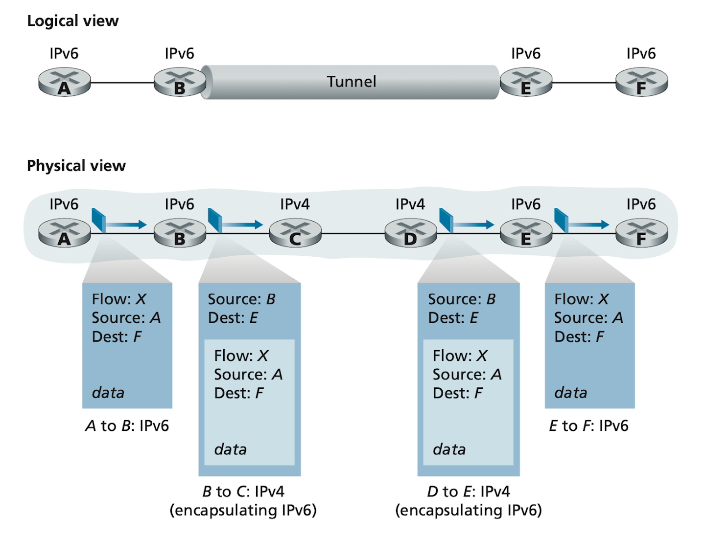

IPv4-mapped IPv6 addresses allow IPv6 applications to represent IPv4 addresses in IPv6 notation: `::ffff:192.168.1.1`. **IPv6 tunnel brokers** are commercial services that provide IPv6 tunneling endpoints so networks without native IPv6 transit can still reach the IPv6 Internet without deploying new hardware.

> [!NOTE]
> IPv6 adoption reached roughly 40–45% of Google users as of 2024. Dual-stack deployment is now standard in cloud environments. AWS, GCP, and Azure all support IPv6 natively. The long-awaited "IPv6 day" never came as a flag-day switch — instead, dual-stack has been the de facto transition mechanism for two decades.

## NAT — Network Address Translation

NAT lets multiple private-addressed hosts share one public IP. The NAT device (typically a home router or a cloud NAT gateway) rewrites packet headers and maintains a translation state table. It is the technology that allowed IPv4 to survive address exhaustion far beyond its original capacity.

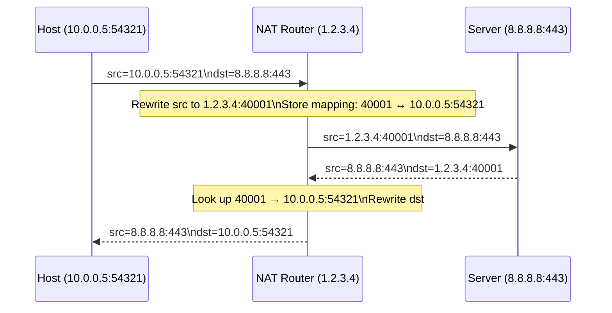

### Port Preservation and Port Forwarding

NAT rewrites both the source IP address and the source port (this full form is NAPT — Network Address Port Translation). **Port preservation** is a technique where the NAT device tries to keep the same source port the client chose. When two internal clients pick the same source port, the router assigns one of them a different (randomly chosen) port to avoid a collision in the translation table.

**Port forwarding** inverts the flow: an administrator configures the NAT device to forward packets arriving on a specific public IP:port to a fixed internal IP:port. This is how home users run public servers (web servers, game servers) behind NAT — without a port-forwarding rule, the NAT table has no entry for unsolicited inbound connections and drops them.

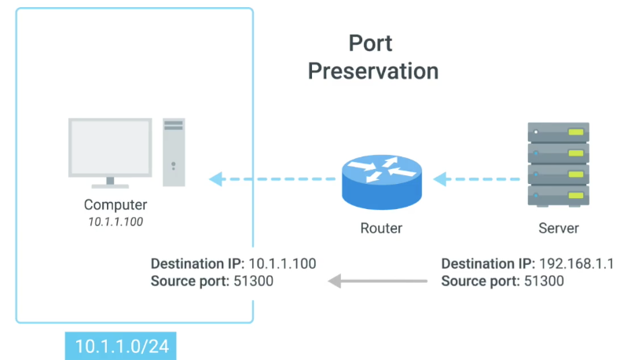

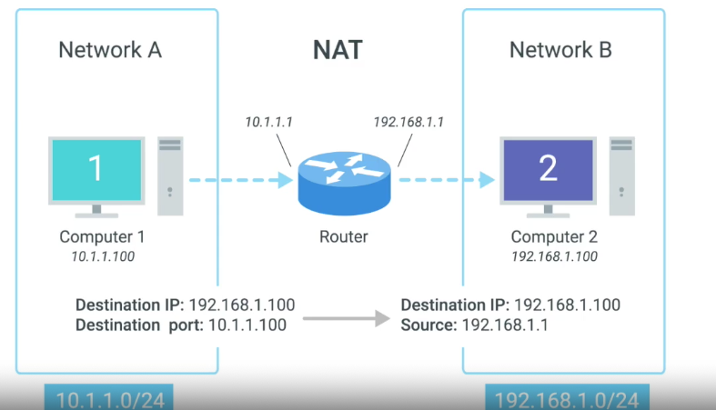

### NAT and IPv4 Exhaustion

NAT is a direct response to IPv4 address exhaustion. Address allocation is managed by five Regional Internet Registries (RIRs):

| RIR | Region |
| :--- | :--- |
| ARIN | United States, Canada, parts of the Caribbean |
| RIPE NCC | Europe, Russia, Middle East, parts of Central Asia |
| APNIC | Asia, Australia, New Zealand, Pacific Islands |
| LACNIC | Central and South America, remaining Caribbean |
| AFRINIC | Africa |

IANA exhausted its free IPv4 pool in 2011; all five RIRs have since exhausted their own allocations. IPv4 addresses are now traded on a secondary market. NAT has allowed billions of devices to share the remaining public IPv4 space, but at the cost of breaking the end-to-end principle.

NAT breaks the Internet's end-to-end principle: a server cannot initiate a connection to a NATed host without prior hole-punching (used by WebRTC, VoIP). STUN and TURN protocols exist specifically to work around NAT traversal.

> [!WARNING]
> **NAT is not a security mechanism.** It prevents unsolicited inbound connections as a side effect of stateful translation, but it does not inspect payload, does not prevent malware-initiated outbound connections, and does not protect against local-network attacks. A stateful firewall with explicit allow rules is the correct security boundary — especially critical in IPv6 networks where there is no NAT at all.

## Real-world Example

Using Python to enumerate subnet addresses and compute routing decisions — the exact math every network engineer does by hand.

```python
import ipaddress
from typing import List

def subnet_info(cidr: str) -> None:
    """Print detailed info about a subnet."""
    net = ipaddress.IPv4Network(cidr, strict=False)
    print(f"Network:     {net.network_address}")
    print(f"Broadcast:   {net.broadcast_address}")
    print(f"Mask:        {net.netmask}")
    print(f"Prefix len:  /{net.prefixlen}")
    print(f"Host count:  {net.num_addresses - 2} usable")
    print(f"First host:  {list(net.hosts())[0]}")
    print(f"Last host:   {list(net.hosts())[-1]}")

def vlsm_split(parent: str, sizes: List[int]) -> None:
    """Split parent prefix into subnets of given host counts."""
    net = ipaddress.IPv4Network(parent)
    subnets = net.subnets(new_prefix=None)  # generate all /25s, /26s, etc.
    # Find smallest prefix that fits each size
    for size in sorted(sizes, reverse=True):
        needed_prefix = 32 - (size + 2).bit_length()
        sub = ipaddress.IPv4Network(f"{net.network_address}/{needed_prefix}", strict=False)
        print(f"  {sub}  ({sub.num_addresses - 2} usable hosts)")
        # advance past this subnet
        net = list(ipaddress.IPv4Network(parent).address_exclude(sub))[0]

def longest_prefix_match(dst_ip: str, routing_table: List[tuple]) -> str:
    """Simple LPM implementation."""
    dst = ipaddress.IPv4Address(dst_ip)
    best_prefix = -1
    best_entry = "No route (drop)"
    for (prefix, next_hop) in routing_table:
        net = ipaddress.IPv4Network(prefix)
        if dst in net and net.prefixlen > best_prefix:
            best_prefix = net.prefixlen
            best_entry = f"{prefix} via {next_hop}"
    return best_entry

# Demo
print("=== Subnet info for 192.168.10.0/24 ===")
subnet_info("192.168.10.0/24")

print("\n=== Routing table lookup ===")
table = [
    ("0.0.0.0/0",   "203.0.113.1"),   # default route
    ("10.0.0.0/8",  "10.1.0.1"),       # corporate VPN
    ("10.0.1.0/24", "10.0.1.254"),     # direct connect
    ("10.0.1.48/29","10.0.1.49"),      # specific subnet
]
for dst in ["10.0.1.55", "10.0.2.5", "8.8.8.8"]:
    print(f"  {dst} → {longest_prefix_match(dst, table)}")
```

> [!TIP]
> The Python `ipaddress` module is invaluable for network automation. It handles all the binary subnet math, provides `network_address`, `broadcast_address`, and `hosts()` iterators. Use it instead of manually computing subnet boundaries — the binary arithmetic is error-prone.

## In Practice

Modern routers use **TCAM (Ternary Content-Addressable Memory)** for forwarding table lookups. A TCAM can match a packet against all routes in parallel in O(1) time — no sequential search. TCAM is expensive and power-hungry; a typical datacenter router has 256k–1M TCAM entries. BGP routing tables for the full Internet have ~1 million prefixes (as of 2024), requiring careful aggregation to fit in TCAM.

At Gigabit and higher transmission rates, forwarding lookups must complete in nanoseconds. This demands hardware implementation (ASIC or TCAM), careful memory hierarchy design (on-chip SRAM for the hot path, DRAM for the full table), and algorithmic techniques beyond linear search (trie structures, hash tables with fallback).

IPv6 deployment is complicated by the lack of NAT — every device is directly reachable, which is the design intent but also a security shift. Stateful firewalls replace NAT as the security boundary, requiring explicit allow rules rather than NAT's implicit "only initiated from inside" policy.

DHCP in enterprise networks typically runs on dedicated servers (Windows Server DHCP, ISC DHCP, Kea) rather than on the router, with DHCP relay agents configured on each subnet's gateway interface to forward client broadcasts to the central server. Cloud platforms (AWS VPC, GCP VPC) provide managed DHCP automatically; you configure only the IP ranges.

> [!WARNING]
> **Route leaks** are one of the most disruptive BGP failure modes. A route leak occurs when an AS announces to its upstream provider routes that it should only announce to its customers. In 2019, a misconfigured AS in Pennsylvania accidentally advertised 70,000+ routes it had learned from peers directly to Verizon, causing a major Internet outage. BGP RPKI (Resource Public Key Infrastructure) and route filtering are the defenses, but adoption remains incomplete.

## Pitfalls

- **"A /24 has 256 addresses."** — A /24 has 256 addresses total, but only 254 usable hosts (subtract the network address and the broadcast address). The network address (host bits all 0) and broadcast address (host bits all 1) are reserved.
- **"The default gateway is the router's public IP."** — The default gateway is the router's IP *on your local subnet* — its Layer 3 address on your LAN, not its address on the Internet. Your host sends packets to the gateway's local IP; the router then handles forwarding toward the Internet.
- **"NAT provides security."** — NAT prevents unsolicited inbound connections, but it is not a security mechanism — it is an address translation mechanism. It does not inspect payload, does not prevent malware-initiated outbound connections, and does not protect against local-network attacks. Use a stateful firewall.
- **"IPv6 replaces IPv4 soon."** — IPv6 has been "replacing" IPv4 for over 20 years. Dual-stack is the realistic path: most networks will run both protocols simultaneously for the foreseeable future. Do not assume IPv6-only networks.
- **"Longer subnets are always more efficient."** — A /30 (2 hosts) is more "efficient" in address usage but has real cost: router point-to-point links use /30s or /31s (RFC 3021), but misconfiguring the mask wastes an entire /24 or causes routing black holes.
- **"DHCP is fire-and-forget."** — DHCP leases expire. A host that does not renew its lease on time will lose its IP address mid-session. DHCP servers also have scope exhaustion: if the pool runs dry, new clients get no address at all. Monitor lease utilization in large networks.

## Exercises

### Exercise 1 — Subnet calculation

Given the network `172.16.0.0/12`, answer: (a) What is the subnet mask in dotted-decimal? (b) How many usable host addresses? (c) What is the broadcast address? (d) Is `172.31.255.1` in this network?

#### Solution

**(a) Subnet mask:** /12 means the first 12 bits are network bits.
`11111111.11110000.00000000.00000000` = `255.240.0.0`

**(b) Usable hosts:** 32 − 12 = 20 host bits. Total addresses = 2^20 = 1,048,576. Usable = 1,048,576 − 2 = **1,048,574**.

**(c) Broadcast address:** Network address `172.16.0.0`. Set all host bits to 1.
`172.16.0.0` in binary: `10101100.00010000.00000000.00000000`. The first 12 bits are the network. The last 20 bits set to 1 = `172.31.255.255`. Broadcast = **`172.31.255.255`**.

**(d) Is `172.31.255.1` in this network?**
The /12 network is `172.16.0.0` to `172.31.255.255`. `172.31.255.1` is in the range → **yes**. Algebraically: `172.31.255.1 AND 255.240.0.0 = 172.16.0.0` ✓.

---

### Exercise 2 — VLSM design

A company is allocated `192.168.5.0/24`. They need:
- Department A: 100 hosts
- Department B: 50 hosts
- Department C: 25 hosts
- WAN link: 2 hosts (router-to-router)

Design a VLSM allocation with minimum address waste.

#### Solution

Work from largest to smallest requirement, choosing the smallest prefix that fits.

**Department A — 100 hosts:** Need 100 + 2 = 102 addresses. 2^7 = 128 ≥ 102, so /25. Allocate `192.168.5.0/25` (usable: .1–.126, broadcast .127).

**Department B — 50 hosts:** Need 52 addresses. 2^6 = 64 ≥ 52, so /26. Next available: `192.168.5.128/26` (usable: .129–.190, broadcast .191).

**Department C — 25 hosts:** Need 27 addresses. 2^5 = 32 ≥ 27, so /27. Next available: `192.168.5.192/27` (usable: .193–.222, broadcast .223).

**WAN link — 2 hosts:** Need 4 addresses. 2^2 = 4, so /30. Next available: `192.168.5.224/30` (usable: .225–.226, broadcast .227).

**Summary:**

| Subnet | Prefix | Usable hosts | Range |
| :--- | :---: | ---: | :--- |
| Department A | /25 | 126 | 192.168.5.1 – .126 |
| Department B | /26 | 62 | 192.168.5.129 – .190 |
| Department C | /27 | 30 | 192.168.5.193 – .222 |
| WAN link | /30 | 2 | 192.168.5.225 – .226 |
| **Remaining** | | | 192.168.5.228 – .255 (available for future growth) |

Total used = 128 + 64 + 32 + 4 = 228 of 256 addresses. 28 remain in `192.168.5.228/30` through `192.168.5.255`.

---

### Exercise 3 — Longest prefix match

A router has the following routing table:

| Destination | Next hop |
| :--- | :--- |
| 0.0.0.0/0 | 203.0.113.1 |
| 10.0.0.0/8 | 10.255.0.1 |
| 10.10.0.0/16 | 10.10.255.1 |
| 10.10.10.0/24 | 10.10.10.254 |
| 10.10.10.64/26 | 10.10.10.65 |

For each destination, state which route matches and the next hop: (a) `10.10.10.100`, (b) `10.10.10.5`, (c) `10.10.20.5`, (d) `172.16.1.1`.

#### Solution

For each, identify all matching prefixes and choose the longest (most specific):

**(a) `10.10.10.100`:** Matches /0, /8 (10.x.x.x), /16 (10.10.x.x), /24 (10.10.10.x), /26 (10.10.10.64–.127 — yes, .100 is in range). Longest match = **/26**. Next hop: **10.10.10.65**.

**(b) `10.10.10.5`:** Matches /0, /8, /16, /24 (10.10.10.x). Does /26 match? 10.10.10.64/26 = 10.10.10.64–.127; .5 is NOT in range. Longest match = **/24**. Next hop: **10.10.10.254**.

**(c) `10.10.20.5`:** Matches /0, /8, /16 (10.10.x.x — yes, 10.10.20.x). Does /24 match? 10.10.10.0/24 = 10.10.10.x only; .20.5 is not. Longest match = **/16**. Next hop: **10.10.255.1**.

**(d) `172.16.1.1`:** Matches only /0 (default route). Nothing more specific. Longest match = **/0**. Next hop: **203.0.113.1**.

---

### Exercise 4 — NAT translation table

A NAT router (public IP 203.0.113.50) serves three internal hosts. Describe what happens to the following packet at each step: internal host 10.0.0.10:55000 sends a TCP SYN to 93.184.216.34:80.

#### Solution

**Step 1 — Packet leaves internal host.**
The host at 10.0.0.10:55000 sends a TCP SYN:
```
src IP:port  = 10.0.0.10:55000
dst IP:port  = 93.184.216.34:80
```
The host's default gateway is the NAT router's internal IP (e.g., 10.0.0.1).

**Step 2 — NAT router receives and rewrites the packet.**
The NAT router inspects the packet, rewrites the source to its public address, and assigns a port from its NAT pool:
```
Before:  src = 10.0.0.10:55000  dst = 93.184.216.34:80
After:   src = 203.0.113.50:43210  dst = 93.184.216.34:80
```
The router stores the mapping: `203.0.113.50:43210 ↔ 10.0.0.10:55000` in its NAT table.

**Step 3 — Server receives and responds.**
The server at 93.184.216.34 sees the connection as coming from 203.0.113.50:43210 — it has no knowledge of the internal host. Its SYN-ACK is addressed to `203.0.113.50:43210`.

**Step 4 — NAT router receives reply and reverse-translates.**
```
Before:  src = 93.184.216.34:80  dst = 203.0.113.50:43210
After:   src = 93.184.216.34:80  dst = 10.0.0.10:55000
```
The router forwards the de-NATed packet to 10.0.0.10 on the internal network.

The key insight: the server can only respond to packets that the internal host **initiated**. A fresh inbound connection to `203.0.113.50:43210` that was not in the NAT table would be dropped (or forwarded to a preconfigured port-forwarding rule). This is why NAT devices act as a de-facto firewall for inbound connections.

## Sources

- RFC 791 — Internet Protocol. https://www.rfc-editor.org/rfc/rfc791
- RFC 8200 — IPv6 Specification. https://www.rfc-editor.org/rfc/rfc8200
- RFC 1918 — Address Allocation for Private Internets. https://www.rfc-editor.org/rfc/rfc1918
- RFC 4271 — BGP-4. https://www.rfc-editor.org/rfc/rfc4271
- RFC 3022 — Traditional IP Network Address Translator. https://www.rfc-editor.org/rfc/rfc3022
- Stevens, W. R. (1994). *TCP/IP Illustrated, Volume 1*. Chapters 3, 10. Addison-Wesley.
- Kurose, J. F. & Ross, K. W. (2022). *Computer Networking: A Top-Down Approach* (8th ed.). Chapters 4.1–4.3. Pearson.
- Material in this note draws on open-source notes at [VasanthVanan/computer-networking-top-down-approach-notes](https://github.com/VasanthVanan/computer-networking-top-down-approach-notes) (Kurose & Ross 8th ed.) and [karthick28/computer-networking-notes](https://github.com/karthick28/computer-networking-notes) (Coursera "Bits and Bytes of Computer Networking").

## Related

- [1 - What is Computer Networking](./1-what-is-networking.md)
- [2 - OSI and TCP/IP Models](./2-osi-and-tcp-ip.md)
- [3 - Physical and Link Layer](./3-physical-and-link-layer.md)
- [5 - The Transport Layer — TCP and UDP](./5-tcp-and-udp.md)
- [7 - Routing Protocols and the Internet](./7-routing-protocols.md)
- [[10-modern-networking]]
