# 5 - The Transport Layer — TCP and UDP

[toc]

> **TL;DR:** TCP and UDP are the two workhorses of the Transport layer. TCP provides a reliable, ordered, connection-oriented byte stream using a three-way handshake, sequence numbers, and a sophisticated congestion control system (Reno, Cubic, BBR). UDP provides a lightweight, connectionless datagram service — no reliability, no ordering, no connection setup — making it ideal for latency-sensitive applications that implement their own error handling. Understanding TCP's congestion control is prerequisite knowledge for every systems engineer.

## Vocabulary

**Port**: A 16-bit unsigned integer (0–65535) identifying a process endpoint on a host. Well-known ports: 80 (HTTP), 443 (HTTPS), 22 (SSH), 53 (DNS), 25 (SMTP).

---

**Socket**: A (IP address, port, protocol) triple that uniquely identifies a communication endpoint. A TCP connection is uniquely identified by the 4-tuple: (src IP, src port, dst IP, dst port).

---

**Three-way handshake**: The TCP connection establishment protocol: SYN → SYN-ACK → ACK. Establishes initial sequence numbers on both sides before data exchange.

---

**Sequence number (SEQ)**: A 32-bit counter in the TCP header identifying the byte position of the first byte in this segment. Used for ordering and retransmission.

---

**Acknowledgment number (ACK)**: A 32-bit counter indicating the next byte the receiver expects from the sender. Cumulative: ACK N means "I have received all bytes up to N−1."

---

**MSS (Maximum Segment Size)**: The maximum amount of data in a single TCP segment, negotiated during the handshake. Typically 1,460 bytes on Ethernet (1,500 MTU − 20 IP header − 20 TCP header).

---

**Receive window (rwnd)**: Advertised by the receiver; tells the sender how many bytes the receiver can buffer. Flow control mechanism — prevents the sender from overwhelming a slow receiver.

---

**Congestion window (cwnd)**: Maintained by the sender; limits how many bytes can be in-flight. Congestion control mechanism — prevents overwhelming the network.

**Effective window** = min(rwnd, cwnd). This is the actual limit on in-flight bytes.

---

**Slow start**: TCP's initial phase, where cwnd grows exponentially (doubles each RTT) until it reaches the slow-start threshold (ssthresh).

---

**Congestion avoidance**: TCP's steady-state phase after slow start, where cwnd grows linearly (by ~1 MSS per RTT) to probe for available bandwidth carefully.

---

**AIMD (Additive Increase Multiplicative Decrease)**: The fundamental congestion-control algorithm. Increase cwnd by 1 MSS per RTT (additive); on packet loss, cut cwnd by half (multiplicative).

---

**RTT (Round-Trip Time)**: The time for a segment to be sent and its ACK to be received. TCP estimates RTT continuously with the Karn/Jacobson algorithm to set the retransmission timeout (RTO).

---

**TIME_WAIT**: TCP's terminal state after closing a connection. Lasts 2×MSL (Maximum Segment Lifetime, typically 2×60 s = 2 minutes). Ensures delayed packets from the old connection cannot corrupt a new connection with the same 4-tuple.

---

**UDP (User Datagram Protocol)**: Connectionless, unreliable transport. Adds only source/destination port and checksum to IP. No handshake, no flow control, no congestion control.

---

**BBR (Bottleneck Bandwidth and Round-trip propagation time)**: Google's 2016 congestion control algorithm. Models the network's bottleneck bandwidth and minimum RTT to maximize throughput without building queues. Does not rely on packet loss as a congestion signal.

---

## Intuition

The transport layer sits between the application and network layers. It takes application messages, wraps them into **segments**, and hands them to IP for delivery. IP only promises best-effort, host-to-host delivery. The transport layer's job is to extend that to **process-to-process** delivery — and optionally to reliability, ordering, and flow control.

TCP is a virtual circuit layered on top of the unreliable IP substrate. Think of it as a phone call: you dial (three-way handshake), you talk back and forth (data exchange with ACKs), and you hang up (four-way FIN sequence). The phone system (IP) might corrupt or lose some words, but TCP keeps re-asking until every byte arrives in order.

UDP is a postcard. You write it, you mail it, you have no idea if it arrives, and you do not wait for a reply. Perfect for DNS queries (one RTT, then resend if no reply), video streaming (a lost frame is better than a delayed one), and game state updates.

The TCP congestion control story is the story of how the Internet avoided collapse in the late 1980s. Before Van Jacobson's 1988 congestion control paper, hosts sent at full speed until the network fell over. AIMD is the elegant distributed algorithm that allows thousands of TCP flows to fairly share the network without centralized coordination.

### Multiplexing and Demultiplexing

A single host runs many processes simultaneously. The transport layer needs a mechanism to route each incoming segment to the right process — this is **demultiplexing** — and to gather outgoing data from different sockets and stamp it with the right port headers — this is **multiplexing**.

The mechanism is the port number. Every segment carries a source port and a destination port (each 16 bits, 0–65535; well-known ports 0–1023 are reserved for established protocols). The transport layer uses these fields as the delivery address within the host.

**UDP demultiplexing** is socket-identified by `(destination IP, destination port)` alone. Two segments from different source IPs but the same destination port land at the same socket. The source port in a UDP segment acts as a return address — the receiver copies it into the destination port of any reply.

```python
# UDP: bind to a specific port so the OS knows which socket gets incoming datagrams
client_socket = socket(AF_INET, SOCK_DGRAM)
client_socket.bind(('', 19157))   # ephemeral ports are in the range 1024–65535
```

**TCP demultiplexing** is socket-identified by the full 4-tuple: `(src IP, src port, dst IP, dst port)`. Two TCP segments that share a destination IP and port but differ in source IP or port are delivered to different sockets. This is how a single web server listening on port 443 handles thousands of concurrent connections — each client gets its own socket keyed on the 4-tuple.

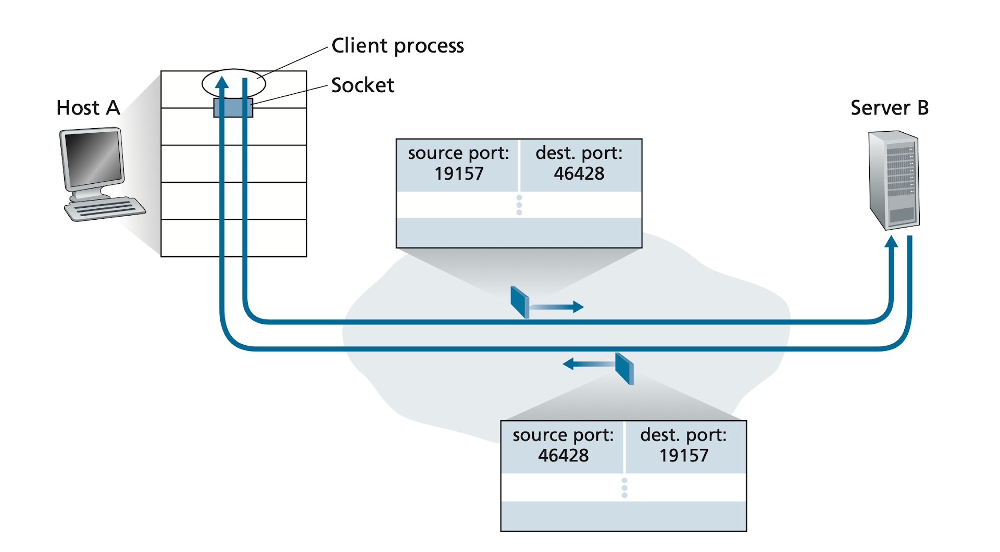

Web servers typically use one process with many threads or lightweight sub-processes. A single process can hold many connection sockets, each with a distinct 4-tuple identifier. Persistent HTTP reuses the same socket across multiple request/response pairs; non-persistent HTTP creates and tears down a new TCP connection per request, incurring handshake overhead each time.

> [!NOTE]
> The distinction between UDP and TCP demultiplexing explains why a UDP server can handle many clients on one socket, while a TCP server needs a dedicated socket per accepted connection. Accepting a new TCP connection clones the listening socket into a connected socket bound to the client's 4-tuple.

## TCP Segment Header

Understanding every field in the TCP header is essential for reading `tcpdump` traces and debugging production issues. A TCP segment consists of a header (minimum 20 bytes, up to 60 bytes with options) plus the data payload. The header encodes source and destination ports, sequence and acknowledgment numbers, control flags, the receive window for flow control, checksum, and optional extensions such as MSS negotiation, window scaling, and SACK.

```
 0                   1                   2                   3
 0 1 2 3 4 5 6 7 8 9 0 1 2 3 4 5 6 7 8 9 0 1 2 3 4 5 6 7 8 9 0 1
+-+-+-+-+-+-+-+-+-+-+-+-+-+-+-+-+-+-+-+-+-+-+-+-+-+-+-+-+-+-+-+-+
|          Source Port          |       Destination Port        |
+-+-+-+-+-+-+-+-+-+-+-+-+-+-+-+-+-+-+-+-+-+-+-+-+-+-+-+-+-+-+-+-+
|                        Sequence Number                        |
+-+-+-+-+-+-+-+-+-+-+-+-+-+-+-+-+-+-+-+-+-+-+-+-+-+-+-+-+-+-+-+-+
|                    Acknowledgment Number                      |
+-+-+-+-+-+-+-+-+-+-+-+-+-+-+-+-+-+-+-+-+-+-+-+-+-+-+-+-+-+-+-+-+
|  Data |       |C|E|U|A|P|R|S|F|                               |
| Offset|  Rsv  |W|C|R|C|S|S|Y|I|            Window Size       |
|       |       |R|E|G|K|H|T|N|N|                               |
+-+-+-+-+-+-+-+-+-+-+-+-+-+-+-+-+-+-+-+-+-+-+-+-+-+-+-+-+-+-+-+-+
|           Checksum            |         Urgent Pointer        |
+-+-+-+-+-+-+-+-+-+-+-+-+-+-+-+-+-+-+-+-+-+-+-+-+-+-+-+-+-+-+-+-+
|                    Options (0–40 bytes)                       |
+-+-+-+-+-+-+-+-+-+-+-+-+-+-+-+-+-+-+-+-+-+-+-+-+-+-+-+-+-+-+-+-+
```

**Sequence numbers** are assigned per byte in the data stream. The sequence number in the header is the byte offset of the first byte in this segment. **Acknowledgment numbers** are cumulative: ACK N means "I have received all bytes up to N−1; send me N next." Handling out-of-order segments is left to the implementation — a receiver may buffer them (modern TCP with SACK) or discard and wait (simpler stacks).

The **header length** (Data Offset) field is measured in 32-bit multiples. A value of 7 means 7 × 4 = 28 bytes of header. The **window size** field directly encodes rwnd (or a scaled version when the window-scaling option is negotiated).

Critical flags: **SYN** (initiate connection), **ACK** (acknowledgment number valid), **FIN** (sender finished), **RST** (abort connection — not a graceful close), **PSH** (push data to application immediately), **URG** (urgent pointer field is valid).

| Flag | Value | Meaning |
| :--- | :---: | :--- |
| URG | 1 | Segment is urgent; urgent pointer field is active |
| ACK | 1 | Acknowledgment number field is valid |
| PSH | 1 | Push buffered data to the application immediately |
| RST | 1 | Reset — abort connection, discard buffers |
| SYN | 1 | Synchronize sequence numbers (connection initiation) |
| FIN | 1 | Sender has no more data to send |

> [!IMPORTANT]
> MSS is the maximum amount of **application-layer data** in one segment — not the total segment size including headers. On Ethernet (MTU 1500), TCP/IP headers consume 40 bytes, leaving MSS = 1460 bytes. Exceeding the MTU forces IP fragmentation, which is expensive and disruptive.

## TCP Connection Lifecycle

### Three-Way Handshake (Connection Establishment)

The handshake serves three purposes: establishes a reliable channel, exchanges ISNs (Initial Sequence Numbers), and negotiates capabilities (MSS, window scale, SACK).

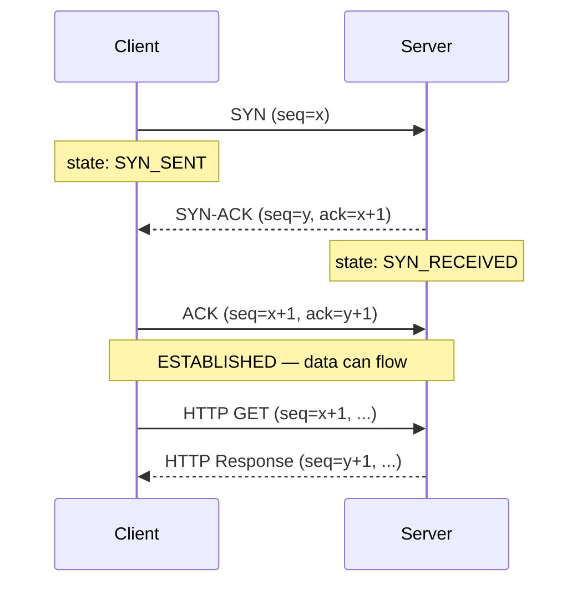

The ISN (x and y) are randomized to prevent sequence number prediction attacks (TCP sequence number injection). The SYN-ACK carries the server's own ISN, and the final ACK acknowledges it. After this exchange, both sides know each other's starting sequence numbers.

> [!IMPORTANT]
> The three-way handshake takes **one full RTT** before any application data flows. On a 100 ms RTT connection, every new TCP connection wastes 100 ms before the first byte of HTTP response is sent. This is the primary motivation for HTTP/1.1 keep-alive, HTTP/2 multiplexing, and QUIC's 0-RTT connection establishment.

### TCP Socket States

TCP tracks connection state in both the kernel and the application. Each side of the connection moves through a well-defined set of states. Knowing these states is essential for interpreting `ss`, `netstat`, and kernel metrics.

- **LISTEN** — server socket is ready and listening for incoming SYNs (server side only).
- **SYN_SENT** — SYN has been sent, waiting for SYN-ACK (client side).
- **SYN_RECEIVED** — SYN received and SYN-ACK sent, waiting for final ACK (server side).
- **ESTABLISHED** — connection is open; both sides can send data freely.
- **FIN_WAIT_1** — active closer has sent FIN, waiting for ACK.
- **FIN_WAIT_2** — active closer's FIN has been ACKed; waiting for the peer's FIN.
- **CLOSE_WAIT** — passive closer has received FIN and ACKed it; application has not yet called `close()`.
- **LAST_ACK** — passive closer has sent its FIN, waiting for the final ACK.
- **TIME_WAIT** — active closer has sent the final ACK; waiting 2×MSL before releasing the 4-tuple.
- **CLOSED** — connection fully terminated.

> [!WARNING]
> A large number of CLOSE_WAIT sockets in `ss -s` almost always indicates an application bug: clients are closing their side of the connection, but the server application is not calling `close()` on the accepted socket. This is a resource leak — the socket and its buffers stay allocated until the process exits or the FD is closed.

### Data Transfer and Sliding Window

TCP uses a sliding window protocol. The sender can have up to `min(cwnd, rwnd)` bytes in-flight (sent but not yet ACKed). As ACKs arrive, the window slides forward and new data can be sent.

```
Sender view:
 ... [already ACKed] | [sent, awaiting ACK] | [can send now] | [cannot send yet] ...
                     ^                       ^               ^
                 send base               send next        send base + min(cwnd, rwnd)
```

The constraint at the sender is:

```
LastByteSent - LastByteAcked <= min(cwnd, rwnd)
```

The sender's effective throughput is approximately `min(cwnd, rwnd) / RTT` bytes per second. Congestion control adjusts cwnd; flow control adjusts rwnd from the receiver's side.

#### Reliable Transfer Building Blocks

TCP's reliability did not appear fully formed — it is built on a progression of protocol ideas, each solving a specific failure mode. Understanding these building blocks clarifies why TCP works the way it does.

**RDT 1.0 — perfect channel assumption.** The sender sends data; the receiver accepts it. No acknowledgments, no error handling. Useful as a baseline but unrealistic.

**RDT 2.0 — bit errors, stop-and-wait with ACK/NAK.** The receiver detects corruption (checksum) and responds with ACK (success) or NAK (retransmit). This is the **ARQ (Automatic Repeat reQuest)** model. The sender blocks after each segment waiting for the reply — called a stop-and-wait protocol. Fatal flaw: a corrupted ACK/NAK leaves the sender unable to tell if the receiver got the data.

**RDT 2.1 — sequence numbers fix duplicate delivery.** Each frame carries a 1-bit sequence number (0 or 1). The receiver discards frames whose sequence number it has already delivered. Corrupted ACK/NAK now leads to retransmit, but the sequence number prevents the retransmit from being delivered twice.

**RDT 3.0 — lost frames, timeout-based retransmission.** Adds a countdown timer at the sender. If no ACK arrives within the timeout, the sender retransmits. RDT 3.0 is functionally correct but performance is poor: stop-and-wait on a 1 Gbps link with 30 ms RTT achieves roughly 0.027% utilization (8 µs transmit / 30,008 µs cycle).

**Pipelining** fixes utilization by allowing the sender to have multiple unacknowledged segments in-flight at once. The maximum window size N determines how many segments can be in-flight. Two error-recovery strategies arise:

**Go-Back-N (GBN).** The sender maintains a window of up to N unacknowledged packets. ACKs are cumulative. If a timeout fires or a gap is detected, the sender retransmits the timed-out segment *and all subsequent segments in the window*, even ones already correctly received. The receiver discards out-of-order segments (no buffering required at receiver). Simple receiver, but wastes bandwidth when the window is large and a single segment is lost.

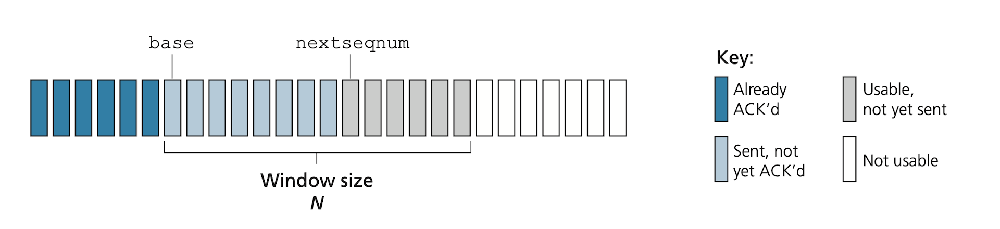

```
GBN sender window (N=4):
  [0 ACKed][1 ACKed] | [2 sent] [3 sent] [4 sent] [5 sent] | [6 not yet] ...
                       ^-- base (oldest unACKed)              ^-- base + N
```

**Selective Repeat (SR).** The sender retransmits only the specific segments believed lost or corrupted — not the entire window. Each segment has its own timer. The receiver buffers out-of-order segments and sends individual ACKs. More efficient on lossy links, but requires buffering at both sender and receiver, and the finite sequence number space requires careful window sizing (window ≤ sequence space / 2) to avoid ambiguity on reordering.

| Mechanism | Purpose | Notes |
| :--- | :--- | :--- |
| Checksum | Detect bit errors | UDP uses 1s complement of 16-bit words |
| Timer | Recover from lost packets | Exponential backoff on TCP timeout |
| Sequence number | Ordering, duplicate detection | Gaps indicate loss; duplicates indicate retransmit |
| Acknowledgment | Confirm correct receipt | Cumulative (TCP/GBN) or selective (SR/SACK) |
| NAK | Notify sender of bad packet | Not used in TCP; replaced by duplicate ACKs |
| Window + pipelining | Increase utilization | Window size bounded by rwnd and cwnd |

TCP's error recovery is a hybrid of GBN and SR. It uses cumulative ACKs (like GBN) but with SACK (Selective Acknowledgment, RFC 2018) options it can selectively retransmit only missing segments (like SR). Fast retransmit — retransmitting on three duplicate ACKs without waiting for timeout — is the practical manifestation of selective repeat behavior.

### RTT Estimation and Timeout

TCP cannot set a static retransmission timeout — RTT varies with network conditions. The Karn/Jacobson algorithm continuously estimates RTT and derives a timeout interval that is neither too short (spurious retransmits) nor too long (slow recovery).

TCP measures `SampleRTT` for one unacknowledged segment at a time. It then tracks a smoothed estimate and a deviation estimate using exponentially weighted moving averages (EWMA):

```
EstimatedRTT = (1 - α) × EstimatedRTT + α × SampleRTT     [α = 0.125]
DevRTT       = (1 - β) × DevRTT       + β × |SampleRTT - EstimatedRTT|    [β = 0.25]
TimeoutInterval = EstimatedRTT + 4 × DevRTT
```

The 4× multiplier on DevRTT gives a safety margin proportional to RTT variance — a jittery path gets a wider timeout automatically. After a timeout event, `TimeoutInterval` is doubled (exponential backoff) to prevent rapid-fire retransmissions under sustained congestion. Once a valid ACK arrives, the formula takes over again.

> [!NOTE]
> Per Karn's algorithm, TCP does **not** update `SampleRTT` for retransmitted segments. A retransmitted segment's ACK is ambiguous — it might be acknowledging the original or the retransmit. Using it would corrupt the estimate.

TCP uses a single retransmission timer per connection (not one per segment). The timer is associated with the oldest unacknowledged segment:

1. A new segment is sent → start the timer if it is not already running.
2. An ACK arrives that advances the base → restart the timer if there are still unacknowledged segments.
3. Timer fires → retransmit the segment at the base, double `TimeoutInterval`, restart the timer.

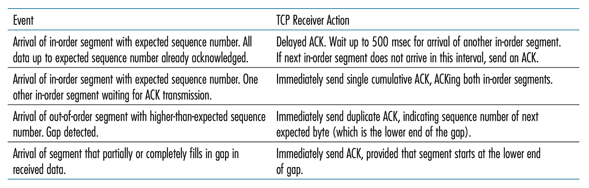

### Flow Control

Flow control prevents the sender from overwhelming a slow receiver. The receiver's application may read from the socket buffer at any pace; if the sender ignores this and floods the link, the receive buffer overflows and data is silently dropped.

The receiver advertises its available buffer space in the **receive window** field of every ACK. The sender is required to keep the amount of in-flight unacknowledged data at or below rwnd:

```
rwnd = RcvBuffer - [LastByteRcvd - LastByteRead]
LastByteSent - LastByteAcked <= rwnd
```

Both sides maintain their own rwnd for the full-duplex stream. rwnd is dynamic — it shrinks when the application reads slowly and grows when it catches up.

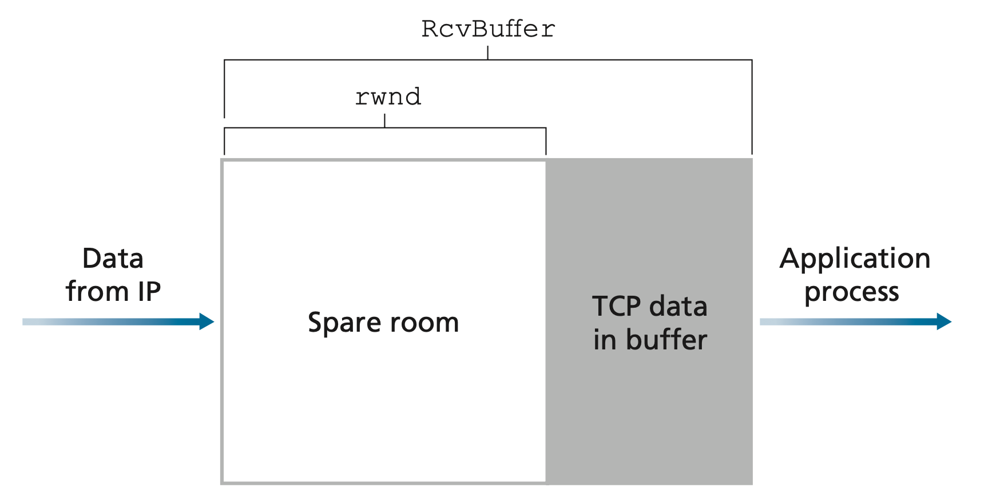

> [!IMPORTANT]
> If the receiver advertises rwnd = 0, the sender must stop sending data. But then the sender has no way to learn when rwnd becomes nonzero again (the receiver's update is in a segment, and the sender is not sending). TCP handles this edge case by requiring the sender to continue sending **probe segments with one byte of data** when rwnd = 0. When the receiver ACKs these, it includes the current (nonzero) rwnd, unblocking the sender.

Flow control and congestion control both throttle the sender but for different reasons. Flow control matches the sender's rate to the receiver's reading speed. Congestion control matches the sender's rate to the network's capacity.

### Four-Way FIN (Connection Teardown)

TCP closes gracefully using a four-way exchange, allowing both sides to finish sending their data independently (half-close):

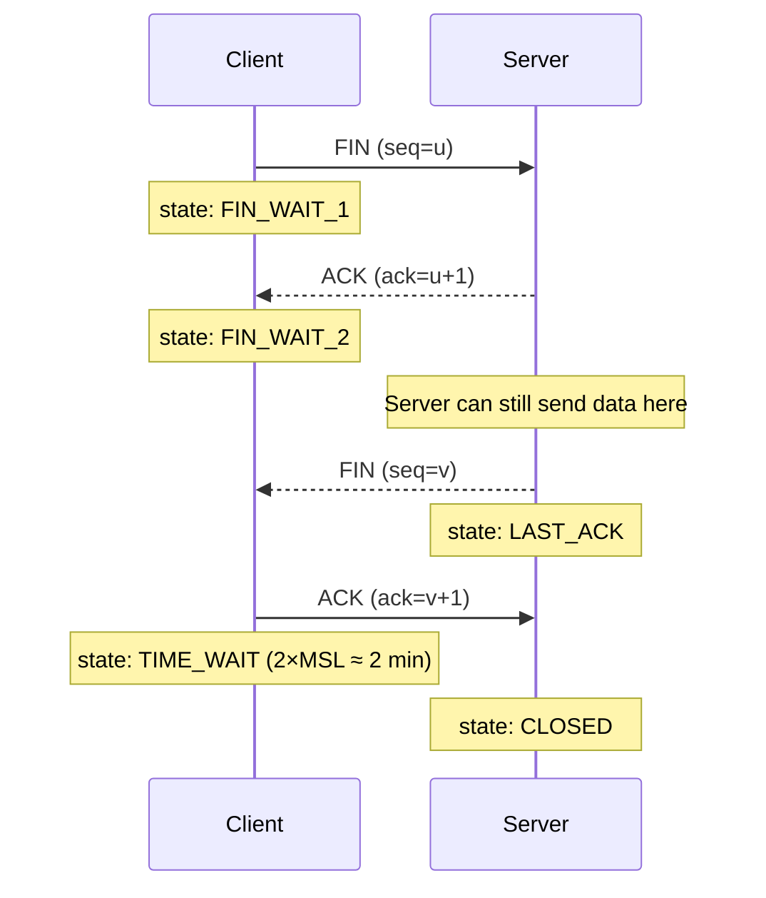

The TCP state machine has 11 states. The most important ones for debugging: `ESTABLISHED` (normal data flow), `TIME_WAIT` (closing, waiting for stray packets), `CLOSE_WAIT` (server ACKed FIN but hasn't sent its own — often indicates an application-level bug where the server doesn't close its socket).

The K&R diagram for the full connection lifecycle state machine:

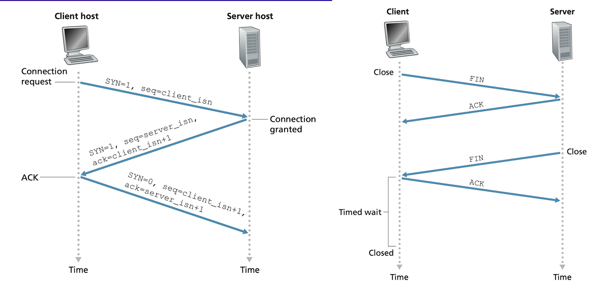

## TCP Congestion Control

### Slow Start and Congestion Avoidance (TCP Reno)

TCP Reno's congestion control is the canonical AIMD implementation. The sender maintains `cwnd` (bytes) and adjusts it based on ACKs and losses. The guiding principle is bandwidth probing: increase the sending rate until a loss event signals congestion, then back off, then probe again.

TCP perceives congestion through two types of loss events: a **timeout** (severe — the segment disappeared entirely) and **three duplicate ACKs** (milder — subsequent segments arrived, so the network is still delivering; one segment is missing). These two signals trigger different responses.

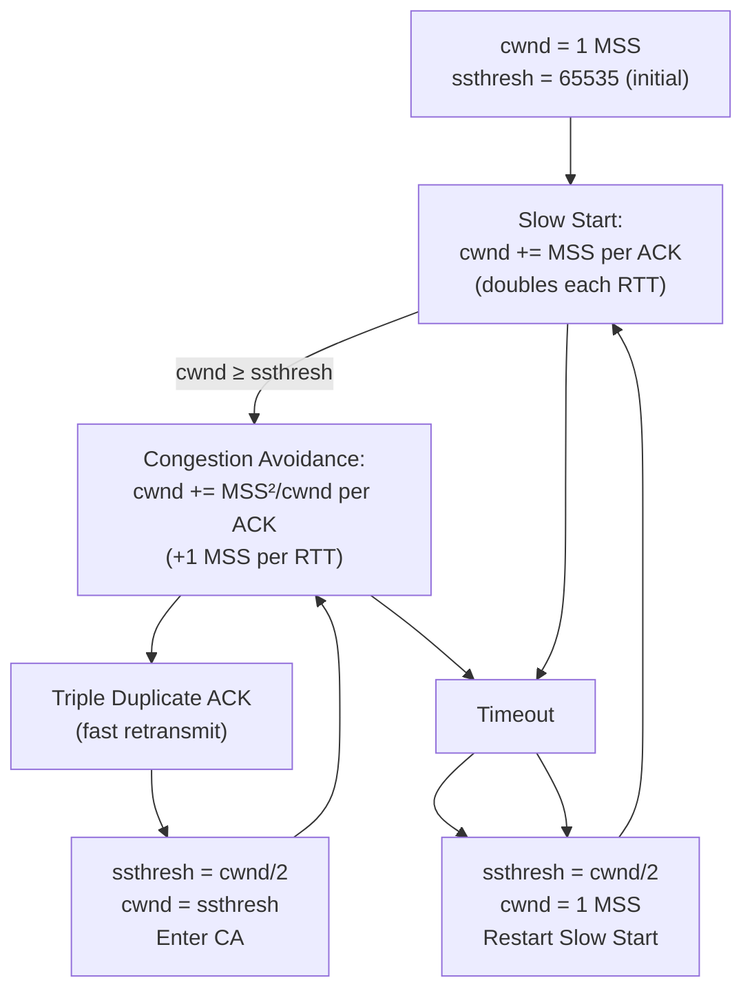

**Slow start:** cwnd starts at 1 MSS. Each ACK increases cwnd by 1 MSS, so cwnd roughly doubles each RTT. This continues until cwnd ≥ ssthresh or a loss event.

**Congestion avoidance:** cwnd increases by MSS²/cwnd per ACK — approximately +1 MSS per RTT. This is the "additive increase" of AIMD.

**On triple duplicate ACK (fast retransmit):** ssthresh = cwnd/2, cwnd = ssthresh. Halving cwnd is the "multiplicative decrease." The sender immediately retransmits the missing segment without waiting for timeout. TCP Reno enters fast recovery here (cwnd = ssthresh, stay in CA). The older TCP Tahoe cut cwnd to 1 MSS on any loss and restarted slow start — Reno's fast recovery is the key improvement.

**On timeout:** cwnd = 1 MSS, ssthresh = half the previous cwnd. Much more aggressive reset — indicates severe congestion.

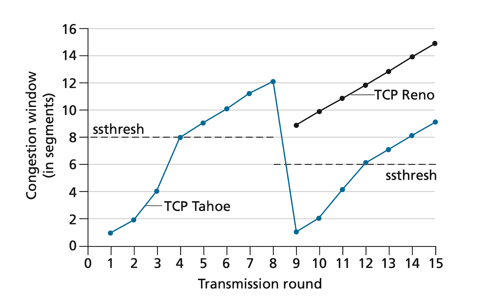

This sawtooth behavior — linear growth, multiplicative decrease — is the characteristic TCP throughput signature visible in any Wireshark trace during bulk transfer. The algorithm is AIMD: **additive increase, multiplicative decrease**.

### Explicit Congestion Notification (ECN)

Network-assisted congestion control offers a faster signal than loss. Two bits in the IP header's Type of Service field are reserved for ECN. One setting marks a packet as "congestion experienced" (CE); another indicates ECN capability. When a congested router marks a packet CE, the receiver sets the ECE (ECN-Echo) bit in its ACK. The TCP sender reacts by halving cwnd (as if a triple-duplicate ACK had occurred) and setting the CWR (Congestion Window Reduced) bit in its next segment to acknowledge the signal.

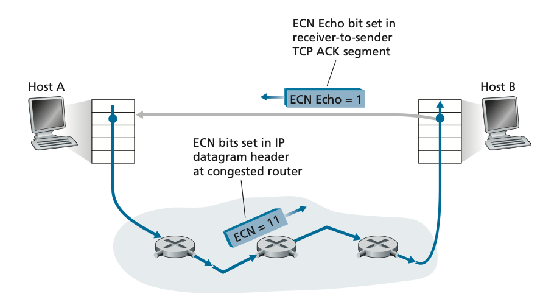

ECN avoids the loss event entirely — the router signals congestion before its buffer overflows, giving the sender an earlier and less destructive signal than a dropped packet. Other transport protocols (DCCP, DCTCP, DCQCN) also use ECN. Deployment has grown substantially; modern cloud load balancers and data center fabrics routinely enable ECN.

### Delay-Based Congestion Control

Classic AIMD waits for a loss event before backing off. Delay-based approaches detect the onset of congestion earlier by watching RTT. The intuition: when a bottleneck router's queue starts to fill, RTT increases — this is the earliest observable signal that capacity is being exceeded.

TCP Vegas measures the RTT for each acknowledged segment and computes expected throughput vs. actual throughput. If actual < expected, the queue is growing; Vegas reduces its sending rate proactively. Vegas operates under the principle "keep the pipe just full, but no fuller" — aim to have zero standing queue at the bottleneck.

### TCP Cubic

Linux's default congestion controller since kernel 2.6.19. Cubic does not reduce cwnd by half on every loss — it uses a cubic function to probe more aggressively after recovery, then backs off near the saturation point. Better performance on high-BDP paths (10 Gbps transcontinental) where Reno's AIMD is too conservative.

### BBR (Bottleneck Bandwidth and Round-trip propagation time)

Google's 2016 algorithm (deployed in YouTube, Google.com). BBR does not treat packet loss as a congestion signal — it explicitly models the bottleneck bandwidth Bw and minimum RTT. It alternates between bandwidth probing (send at 125% of estimated Bw for one RTT) and drain (send at 75% to clear the queue built during probing). BBR builds on TCP Vegas ideas and competes fairly with non-BBR TCP senders. Google adopted it for all TCP traffic on its private B4 network, replacing CUBIC.

```math
cwnd_BBR = 2 × Bw × RTT_min
```

BBR achieves throughput much closer to the theoretical maximum on lossy links (satellite, LTE) because it does not halve cwnd on random wireless loss. The downside: it can starve loss-based flows (Cubic, Reno) on shared bottlenecks since it probes at full bandwidth regardless of queue depth.

> [!NOTE]
> BBR v2 (under development) addresses the unfairness issue with loss-based flows. As of 2024, Linux 6.x ships BBR v2 as an experimental module. To enable: `sysctl net.ipv4.tcp_congestion_control=bbr`.

### QUIC — Transport Evolution at the Application Layer

When transport services needed by an application do not fit the TCP or UDP service models precisely, application designers can build their own transport at the application layer. QUIC (Quick UDP Internet Connections) is the premier example: a full-featured, reliable, multiplexed, encrypted transport protocol built on top of UDP, designed to replace TCP+TLS for HTTP/3.

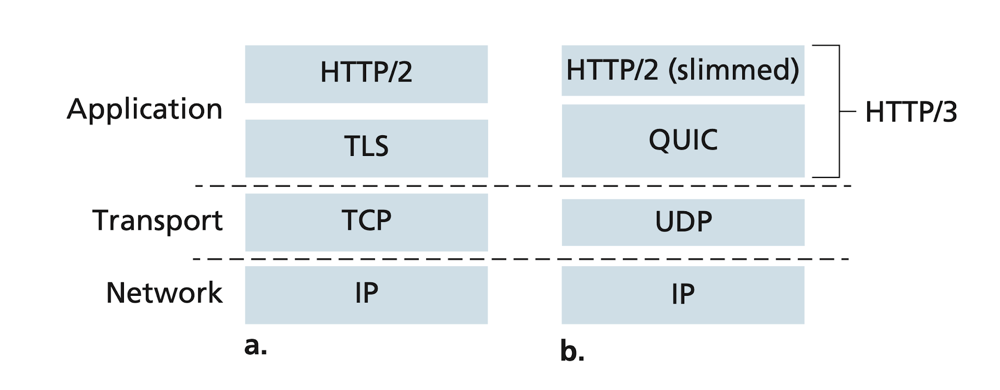

QUIC combines what TCP+TLS+HTTP/2 do in separate layers into a single protocol with three major improvements:

1. **Faster connection establishment.** TCP requires 1 RTT for the handshake; TLS 1.3 adds another 1 RTT. QUIC merges the connection and cryptographic handshake into a single exchange — 1 RTT for a new connection, and 0-RTT resumption for returning clients.

2. **Stream multiplexing without head-of-line blocking.** HTTP/2 multiplexes many streams over one TCP connection, but a single lost TCP segment blocks all streams (HOL blocking at the TCP layer). QUIC multiplexes streams independently at the application layer over UDP — a lost packet blocks only the stream it belongs to, not all streams.

3. **Reliable, TCP-friendly congestion control.** Each QUIC stream gets reliable, in-order delivery. The congestion control mechanism is similar to TCP NewReno and is pluggable — deployments can swap in BBR or Cubic without OS updates, since QUIC runs in userspace.

> [!IMPORTANT]
> QUIC's deployment model is significant: because it runs in userspace (not the OS kernel), Google can update its congestion control, encryption, and reliability mechanisms by deploying new server binaries — without waiting for OS vendors to ship kernel patches. This is why QUIC has iterated far faster than TCP.

## UDP

UDP's header is 8 bytes: source port (2), destination port (2), length (2), checksum (2). There is no handshake, no sequencing, no retransmission, no flow control, no congestion control. The application gets exactly what IP delivered, potentially out of order, with possible drops.

UDP is minimalist by design. It provides multiplexing/demultiplexing (port-based delivery) and minimal error checking (checksum), and nothing else. This makes it the right choice when the application wants direct control over timing and data sent, or when the overhead of TCP's connection setup is unacceptable for the workload.

**UDP checksum** is computed as the 1s complement of the sum of all 16-bit words in the segment. At the receiver, all 16-bit words including the checksum are summed; if no errors occurred, the result is all 1s (0xFFFF). A single-bit error produces a nonzero result — the packet is discarded silently, or passed to the application with a warning flag.

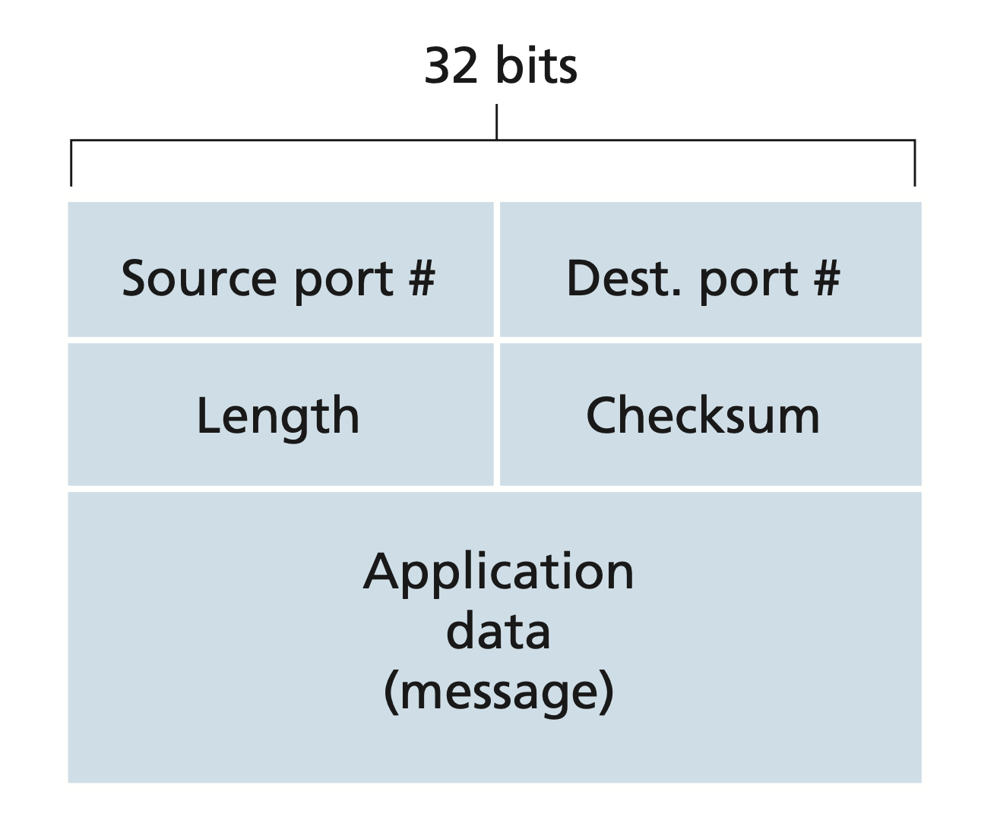

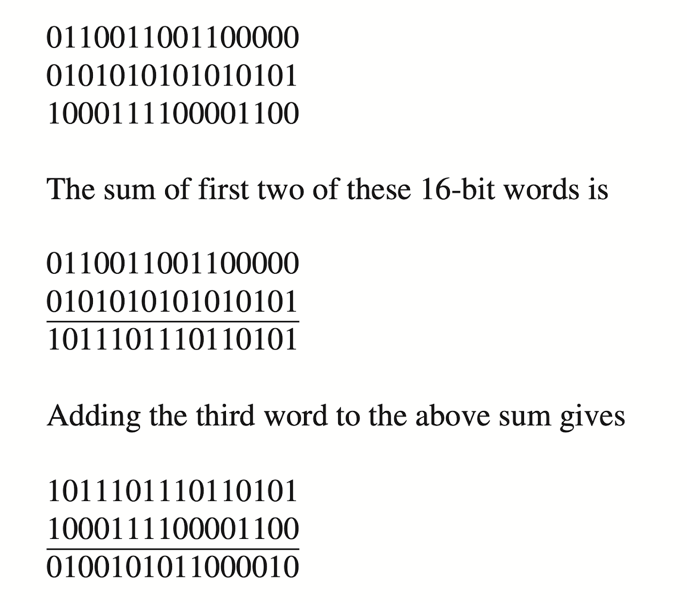

Use UDP when:
- Latency matters more than reliability (DNS, DHCP, gaming, VoIP)
- The application implements its own reliability (QUIC over UDP, DTLS)
- Multicast/broadcast is needed (UDP supports it; TCP does not)
- A single-request/response pattern makes connection overhead wasteful (NTP, DNS)

> [!WARNING]
> UDP has no congestion control. An application using UDP at full speed will happily fill and overflow router buffers, dropping other flows' packets. This is why high-throughput UDP applications (video streaming, QUIC) must implement their own congestion control or negotiate rate limits. Raw UDP flooding is one of the simplest DDoS attack vectors.

The key differences between UDP and TCP at a glance:

| Aspect | UDP | TCP |
| :--- | :--- | :--- |
| Service model | Unreliable, connectionless | Reliable, connection-oriented |
| Terminology | Datagram | Segment |
| Header size | 8 bytes | 20–60 bytes |
| Connection setup | None | 3-way handshake |
| Ordering | No | Yes (sequence numbers) |
| Flow control | No | Yes (rwnd) |
| Congestion control | No | Yes (cwnd, AIMD) |
| Multicast/broadcast | Yes | No |
| Typical uses | DNS, VoIP, gaming, QUIC | HTTP, SSH, SMTP, databases |

## Real-world Example

A Go HTTP server with tuned socket options — showing where TCP parameters are visible at the application level.

```go
package main

import (
	"fmt"
	"net"
	"net/http"
	"syscall"
	"time"
)

// newTCPListener creates a TCP listener with tuned socket options.
func newTCPListener(addr string) (net.Listener, error) {
	lc := net.ListenConfig{
		Control: func(network, address string, c syscall.RawConn) error {
			return c.Control(func(fd uintptr) {
				// SO_REUSEADDR: allow rapid server restart without TIME_WAIT blocking the port
				syscall.SetsockoptInt(int(fd), syscall.SOL_SOCKET, syscall.SO_REUSEADDR, 1)
				// TCP_NODELAY: disable Nagle's algorithm — send segments immediately
				// (critical for interactive protocols like SSH, Redis, game servers)
				syscall.SetsockoptInt(int(fd), syscall.IPPROTO_TCP, syscall.TCP_NODELAY, 1)
				// SO_KEEPALIVE: detect dead connections by sending keepalive probes
				syscall.SetsockoptInt(int(fd), syscall.SOL_SOCKET, syscall.SO_KEEPALIVE, 1)
			})
		},
		KeepAlive: 30 * time.Second,
	}
	return lc.Listen(nil, "tcp", addr) // uses context.Background() implicitly via nil
}

func main() {
	mux := http.NewServeMux()
	mux.HandleFunc("/", func(w http.ResponseWriter, r *http.Request) {
		fmt.Fprintf(w, "Hello from TCP port %s\n", r.Host)
	})

	ln, err := newTCPListener(":8080")
	if err != nil {
		panic(err)
	}
	srv := &http.Server{
		Handler:      mux,
		ReadTimeout:  5 * time.Second,
		WriteTimeout: 10 * time.Second,
		// IdleTimeout covers the TIME_WAIT-ish keepalive window
		IdleTimeout: 60 * time.Second,
	}
	fmt.Println("Listening on :8080")
	if err := srv.Serve(ln); err != nil {
		panic(err)
	}
}
```

> [!TIP]
> `TCP_NODELAY` disables Nagle's algorithm, which buffers small segments hoping to coalesce them into larger ones. Nagle is great for bulk transfers but terrible for interactive protocols (each keystroke in SSH, each Redis command). Always disable it for low-latency request/response workloads. HTTP/2 and gRPC multiplexers also need `TCP_NODELAY` to avoid HoL (head-of-line) blocking at the Nagle layer.

## In Practice

**TIME_WAIT accumulation** is a common production problem. A busy web server handling 100k short-lived connections per second accumulates TIME_WAIT sockets (each lasting 2 minutes). With a 2-minute TIME_WAIT, the server holds 100k × 120 = 12 million sockets in TIME_WAIT — far exceeding the kernel's default limits. Fixes: `SO_REUSEADDR`, `tcp_tw_reuse` (recycle TIME_WAIT sockets for new outbound connections when safe), or switching to HTTP/2 persistent connections.

**TCP buffer tuning for high-BDP paths:** The default Linux socket buffer (`net.core.rmem_default` = 212,992 bytes ≈ 208 KB) allows only 208 KB in-flight. On a 10 Gbps link with 80 ms RTT, the BDP is 100 MB — you are using 0.2% of the pipe. Set `net.core.rmem_max` and `net.ipv4.tcp_rmem` to allow 128 MB+ buffers, and enable `net.ipv4.tcp_window_scaling = 1` (enabled by default since Linux 2.6).

> [!CAUTION]
> On Linux, the `tcp_tw_recycle` sysctl (removed in Linux 4.12) was commonly recommended but **breaks NAT**. Multiple clients behind the same NAT device appear to have the same source IP but different ports; `tcp_tw_recycle` used a stricter timestamp check that caused silent drops of NATed connections. Never apply kernel tuning you found in a blog post without understanding its interaction with your network topology.

## Pitfalls

- **"TCP guarantees the message arrives intact."** — TCP guarantees every byte arrives in order exactly once. It does not guarantee message framing. Two `send()` calls may be coalesced into one `recv()`, or one `send()` may result in multiple `recv()` calls. You must implement your own message framing (length-prefixed, delimiter-terminated) on top of TCP's byte stream.
- **"RST is the same as FIN."** — FIN is a graceful close: the sender is done sending, but the connection can remain half-open for the other side to finish. RST abruptly terminates the connection with no guarantee that buffered data was delivered. RST sent by a firewall or TCP stack in error state causes `Connection reset by peer` errors on the application.
- **"UDP is always faster than TCP."** — For bulk data transfer, TCP with well-tuned cwnd often matches or exceeds UDP because congestion control avoids the drop-and-retransmit cycles that a naive UDP application triggers. UDP wins for latency-sensitive single-packet exchanges, not necessarily for throughput.
- **"cwnd is per-connection."** — True, but most congestion control algorithms (including BBR) also have per-path state. Multiple TCP connections between the same pair of hosts each have their own cwnd, which is why one slow TCP connection does not fix itself by having the application open more connections — it just multiplies the problem at the bottleneck.

## Exercises

### Exercise 1 — Three-way handshake sequence numbers

Client picks ISN = 1000. Server picks ISN = 5000. Trace the sequence and acknowledgment numbers for the three-way handshake and the first data exchange: client sends "GET /" (7 bytes), server responds "200 OK" (6 bytes).

#### Solution

**Segment 1: Client SYN**
```
Client → Server:  SYN, seq=1000, ack=0 (ACK flag not set)
```

**Segment 2: Server SYN-ACK**
```
Server → Client:  SYN+ACK, seq=5000, ack=1001
(ack=1001 means "I received your SYN which consumed seq 1000; next byte I expect from you is 1001")
```

**Segment 3: Client ACK**
```
Client → Server:  ACK, seq=1001, ack=5001
(ack=5001 means "I received your SYN which consumed seq 5000; next I expect 5001")
```

**Segment 4: Client HTTP GET (7 bytes)**
```
Client → Server:  seq=1001, ack=5001, data="GET /" (7 bytes)
Data occupies bytes 1001–1007.
```

**Segment 5: Server ACK + HTTP response (6 bytes)**
```
Server → Client:  seq=5001, ack=1008, data="200 OK" (6 bytes)
ack=1008 confirms receipt of all 7 bytes (1001–1007, next expected = 1008).
```

**Segment 6: Client ACK**
```
Client → Server:  seq=1008, ack=5007
ack=5007 confirms receipt of all 6 bytes (5001–5006, next expected = 5007).
```

---

### Exercise 2 — AIMD simulation

A TCP Reno connection has cwnd = 16 MSS and ssthresh = 24 MSS. It successfully transfers data for two RTTs (each RTT adds 1 MSS in congestion avoidance), then detects a triple duplicate ACK. Trace cwnd and ssthresh after each event.

#### Solution

**Initial state:** cwnd = 16 MSS, ssthresh = 24 MSS. Since cwnd (16) < ssthresh (24), we are in slow start... wait: cwnd = 16 < ssthresh = 24, but slow start ends when cwnd ≥ ssthresh. Let me re-read: cwnd starts at 16, ssthresh at 24. Since 16 < 24, we are still in **slow start**, so cwnd doubles each RTT (not linear!).

However, if the problem states "congestion avoidance adds 1 MSS/RTT," then we interpret cwnd = 16 ≥ ssthresh = some earlier threshold, meaning we ARE in congestion avoidance. Taking the problem at face value (already in CA):

**RTT 1 (congestion avoidance):** cwnd = 16 + 1 = 17 MSS
**RTT 2 (congestion avoidance):** cwnd = 17 + 1 = 18 MSS
**Triple duplicate ACK (fast retransmit):**
- ssthresh = ⌊cwnd/2⌋ = ⌊18/2⌋ = **9 MSS**
- cwnd = ssthresh = **9 MSS** (TCP Reno fast recovery: set cwnd = ssthresh, enter CA)

**After fast recovery:** cwnd = 9, ssthresh = 9. The next RTT in congestion avoidance: cwnd grows by 1 MSS/RTT: cwnd = 10, 11, 12 ... until the next event.

The sawtooth pattern — linear growth, multiplicative decrease — is the characteristic TCP throughput signature visible in any `wireshark` trace during bulk transfer.

---

### Exercise 3 — Bandwidth-delay product and window sizing

A TCP connection has a 1 Gbps link and 40 ms RTT. The receiver advertises rwnd = 1 MB. (a) What is the BDP? (b) Is rwnd sufficient to saturate the link? (c) If cwnd is currently 256 KB and no ACKs are pending, what is the maximum throughput?

#### Solution

**(a) BDP** = bandwidth × RTT = 1×10⁹ bps × 0.04 s = 40×10⁶ bits = **5 MB**.

**(b)** rwnd = 1 MB. BDP = 5 MB. Since rwnd (1 MB) < BDP (5 MB), the receive window is the bottleneck. The sender will exhaust rwnd after sending 1 MB and stall waiting for ACKs. Throughput ≤ rwnd/RTT = 1 MB / 0.04 s = **200 Mbps** — only 20% of the 1 Gbps link capacity.

To saturate the link, rwnd must be ≥ BDP = 5 MB. The application must ensure the socket receive buffer is set large enough via `SO_RCVBUF`, or the kernel's autotuning (`tcp_moderate_rcvbuf`) must expand it up to `net.ipv4.tcp_rmem[2]`.

**(c)** With cwnd = 256 KB, effective window = min(cwnd, rwnd) = min(256 KB, 1 MB) = 256 KB. Throughput ≤ 256 KB / 0.04 s = **51.2 Mbps** — about 5% of capacity. cwnd governs here; it will grow via congestion avoidance until it hits rwnd or a congestion event.

---

### Exercise 4 — TCP state machine

Describe the sequence of TCP states on the client side for: (a) initiating a connection, (b) the server initiating a close, (c) the client initiating a close. Draw the relevant state transitions.

#### Solution

**(a) Client initiates connection:**
CLOSED → (send SYN) → SYN_SENT → (receive SYN-ACK, send ACK) → ESTABLISHED

**(b) Server initiates close (passive close on client side):**
ESTABLISHED → (receive FIN, send ACK) → CLOSE_WAIT → (application closes socket, send FIN) → LAST_ACK → (receive ACK) → CLOSED

**(c) Client initiates close (active close):**
ESTABLISHED → (application closes socket, send FIN) → FIN_WAIT_1 → (receive ACK) → FIN_WAIT_2 → (receive FIN, send ACK) → TIME_WAIT → (wait 2×MSL ≈ 120 s) → CLOSED

**Why TIME_WAIT?** The final ACK from the client might be lost. If it is, the server retransmits its FIN. The client must still be in a state to respond to that retransmitted FIN — hence TIME_WAIT. After 2×MSL, all packets from this connection have surely expired, and the 4-tuple is safe to reuse.

`CLOSE_WAIT` on the server is a common application bug signal: if `ss -s` shows thousands of CLOSE_WAIT sockets, the application is receiving FINs (clients are closing) but the server application code is not calling `close()` on the socket — typically a resource leak.

## Sources

- RFC 793 — Transmission Control Protocol. https://www.rfc-editor.org/rfc/rfc793
- RFC 5681 — TCP Congestion Control. https://www.rfc-editor.org/rfc/rfc5681
- Jacobson, V. (1988). "Congestion avoidance and control." *SIGCOMM '88*. https://dl.acm.org/doi/10.1145/52324.52356
- Cardwell, N. et al. (2016). "BBR: Congestion-Based Congestion Control." *ACM Queue* 14(5). https://dl.acm.org/doi/10.1145/3012426.3022184
- Stevens, W. R. (1994). *TCP/IP Illustrated, Volume 1*. Chapters 17–24. Addison-Wesley.
- Material in this note draws on open-source notes at [VasanthVanan/computer-networking-top-down-approach-notes](https://github.com/VasanthVanan/computer-networking-top-down-approach-notes) (Kurose & Ross 8th ed.) and [karthick28/computer-networking-notes](https://github.com/karthick28/computer-networking-notes) (Coursera "Bits and Bytes of Computer Networking").

## Related

- [1 - What is Computer Networking](./1-what-is-networking.md)
- [2 - OSI and TCP/IP Models](./2-osi-and-tcp-ip.md)
- [4 - The Network Layer — IP, Subnetting, Routing](./4-network-layer-ip.md)
- [6 - Application Layer — HTTP, DNS, TLS](./6-application-layer.md)
- [8 - Performance — Latency, Throughput, Congestion](./8-performance.md)
