# 6 - Application Layer — HTTP, DNS, TLS

[toc]

> **TL;DR:** The Application layer is where user-visible protocols live. DNS translates human-readable names to IP addresses via a globally distributed hierarchy. HTTP has evolved from text-based 1.1 to multiplexed binary 2 to UDP-based 3 (QUIC), each iteration attacking a different latency bottleneck. TLS 1.3 secures both HTTP and most other application protocols with a 1-RTT handshake and forward-secrecy-by-default key exchange.

## Vocabulary

**DNS (Domain Name System)**: The globally distributed database that maps human-readable domain names (example.com) to IP addresses. RFC 1035.

---

**Recursive resolver**: A DNS server (typically run by your ISP or a public provider like 8.8.8.8) that performs the full iterative lookup on behalf of a client.

---

**Authoritative nameserver**: The DNS server that holds the actual records for a domain. It gives the definitive answer (not cached).

---

**DNS record types**: A (IPv4 address), AAAA (IPv6), CNAME (canonical name alias), MX (mail exchanger), TXT (arbitrary text, used for SPF/DKIM), NS (authoritative nameservers for a zone), PTR (reverse DNS).

---

**TTL (DNS)**: Time-to-live on a DNS record — how long resolvers cache the answer. A 300-second TTL means the record is re-queried every 5 minutes. Low TTL enables fast failover; high TTL reduces DNS load.

---

**HTTP (HyperText Transfer Protocol)**: The application-layer protocol for the Web. Defines request/response semantics, methods (GET, POST, PUT, DELETE, PATCH, HEAD, OPTIONS), status codes (200, 301, 404, 500), and headers.

---

**HTTP/1.1**: Text-based, persistent connections (keep-alive), no multiplexing. Head-of-line (HoL) blocking: a slow response stalls all subsequent requests on the same connection.

---

**HTTP/2**: Binary framing, full multiplexing of requests/responses on one TCP connection, header compression (HPACK), server push. Solves application-level HoL blocking but still has TCP-level HoL blocking.

---

**HTTP/3 (QUIC)**: HTTP/2 semantics over QUIC (UDP-based). Eliminates TCP-level HoL blocking. Integrates TLS 1.3 into the transport handshake, enabling 1-RTT and 0-RTT connection establishment.

---

**TLS (Transport Layer Security)**: The cryptographic protocol that provides confidentiality, integrity, and authentication for TCP connections. TLS 1.3 (RFC 8446) is the current standard.

---

**Certificate**: An X.509 document binding a public key to a domain name (or entity), signed by a Certificate Authority (CA). Presented by the server during the TLS handshake.

---

**Certificate Authority (CA)**: A trusted entity that signs certificates, vouching that the public key belongs to the domain owner. Root CAs are pre-installed in browsers/OS trust stores.

---

**Forward secrecy (PFS)**: A property of key exchange: the compromise of a long-term private key does not allow decryption of previously captured sessions. Achieved by using ephemeral keys (ECDHE) per session.

---

**HSTS (HTTP Strict Transport Security)**: A response header (`Strict-Transport-Security`) instructing browsers to always use HTTPS for a domain, preventing protocol downgrade attacks.

---

**QUIC**: A transport protocol built on UDP, developed by Google, standardized in RFC 9000. Provides streams, reliability, and TLS 1.3 natively. The substrate for HTTP/3.

---

**Socket**: The API boundary between the application layer and the transport layer. Processes send and receive messages through a socket; the OS handles the underlying TCP or UDP mechanics. A socket is identified by a (IP address, port number) pair.

---

**SMTP (Simple Mail Transfer Protocol)**: The push protocol used to transfer email between mail servers, and from a mail client to its outgoing mail server. Operates over TCP port 25.

---

**IMAP (Internet Message Access Protocol)**: A pull protocol that allows mail clients to retrieve and manage messages stored on a mail server. Supports folders, flags, and partial message fetching. HTTP-based webmail (Gmail) is the modern alternative.

---

## Intuition

Think of DNS as the Internet's phone book. You know someone's name (google.com) but need their phone number (IP address) before you can call them. The phone book is distributed — each company (registrar/nameserver) manages its own section, and the phone book directory (root + TLD servers) tells you which section to look in.

TLS is like sending a letter in a locked box. You and the server exchange lock combinations (key exchange) in a way that even a recording of the exchange cannot be replayed to open the box later (forward secrecy). Once the boxes are shared, all messages are encrypted.

HTTP's evolution from 1.1 to 2 to 3 is a story of progressively eliminating latency sources: 1.1 eliminated the overhead of a new TCP connection per request (keep-alive). 2 eliminated the constraint of one outstanding request per connection (multiplexing). 3 eliminated TCP-level HoL blocking by moving to a per-stream reliable transport (QUIC streams).

### Application layer architecture and the OSI model

The application layer is the topmost layer of both the OSI and TCP/IP models — it is the layer where user-visible services live. Protocols at this layer define the semantics of messages exchanged between processes on different hosts; lower layers handle delivery, routing, and physical transmission.

In the OSI model, two layers sit between the transport layer and the application layer: the **Session layer** (manages dialogue control and synchronization between application processes) and the **Presentation layer** (handles encoding, encryption/decryption, and data representation so that the application sees a consistent format regardless of the underlying host). In the TCP/IP model these responsibilities are folded into the application layer itself.

Network applications follow one of two architecture patterns:

- **Client-server**: A dedicated server with a fixed, well-known IP address services requests from multiple client hosts. Clients do not communicate with each other. Examples: the Web (HTTP), email (SMTP/IMAP), FTP, Telnet.
- **Peer-to-Peer (P2P)**: Minimal reliance on dedicated servers. Intermittently connected peers communicate directly with each other. P2P offers self-scalability — every new peer that downloads content also contributes upload capacity. Challenges: security, reliability, and NAT traversal.

Processes on different hosts communicate by exchanging messages through **sockets** — the OS-provided API that sits at the boundary between the application and transport layers. A socket is analogous to a door: the application pushes a message through it, and the OS handles the underlying TCP or UDP mechanics. Every socket is bound to a (IP address, port number) pair. Well-known port assignments: HTTP on 80, HTTPS on 443, SMTP on 25, DNS on 53.

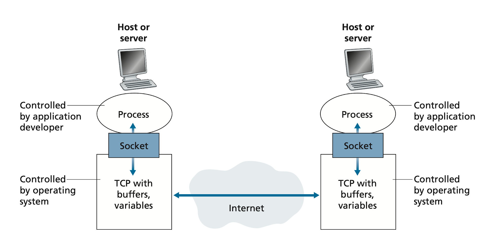

The end-to-end path of a browser request illustrates all layers working together:

- Computer 1 determines the destination is not in its local subnet and must reach gateway router A. It knows the router's IP but needs its MAC address to build an Ethernet frame, so it broadcasts an ARP request.

  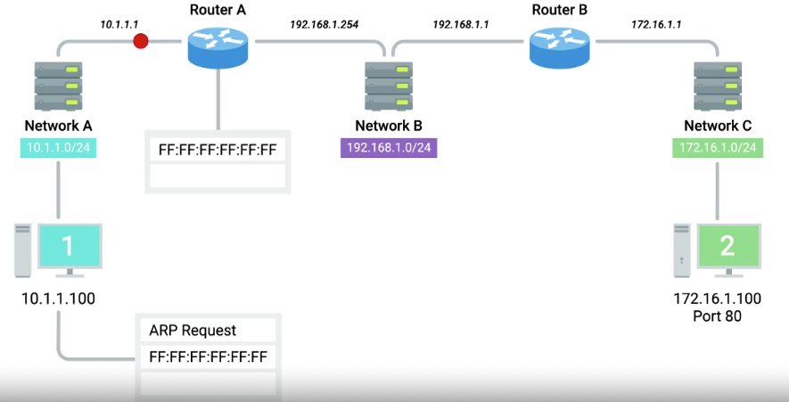

- The router recognizes the ARP target as its own IP and replies with its MAC address.

  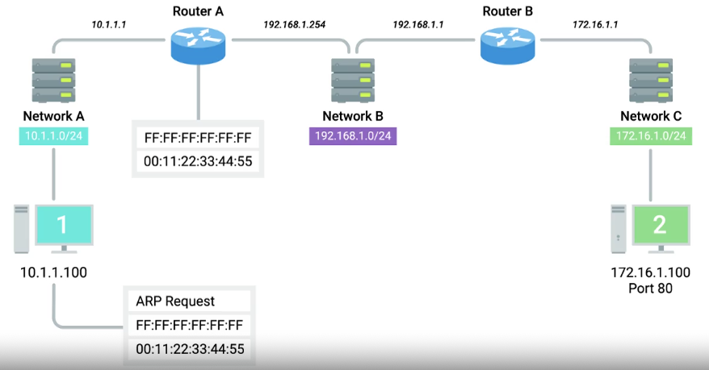

- The browser opens an ephemeral source port.

  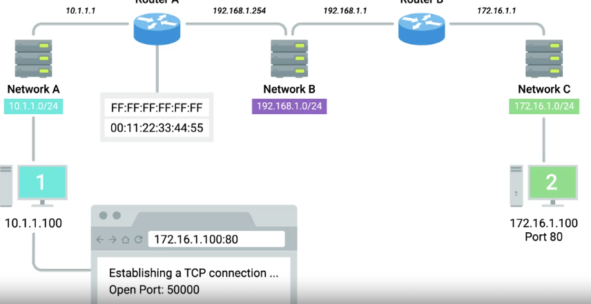

- A TCP segment is constructed encapsulating the HTTP request.

  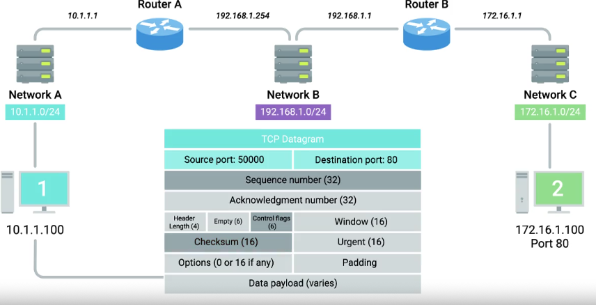

- The TCP segment is wrapped in an IP datagram.

  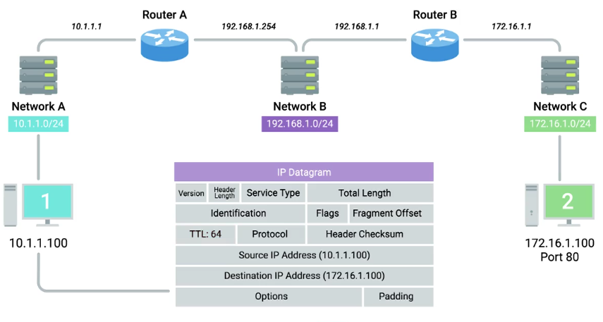

- The IP datagram is wrapped in an Ethernet frame.

  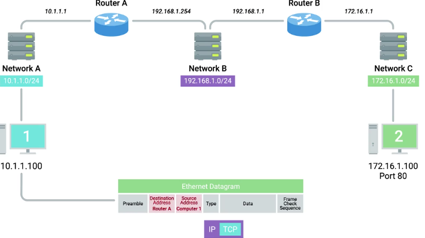

- The frame is transmitted as modulated 0/1 bits on the physical link. Switches forward it on the interface that connects to router A, which strips the Ethernet header, routes the IP datagram, and re-encapsulates it for the next hop.

  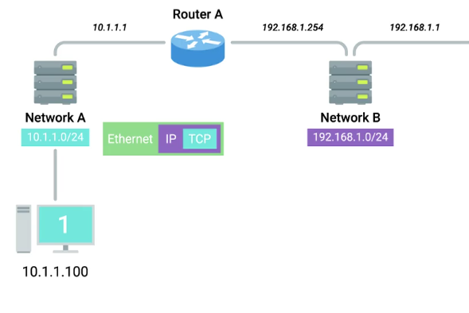

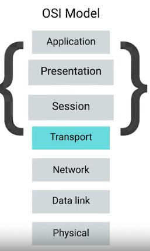

## DNS Resolution

### The hierarchy

DNS is a tree. The root (`"."`) is at the top. Top-Level Domains (TLDs) — `.com`, `.org`, `.uk` — hang below the root. Each domain operator's authoritative servers answer for their subtree.

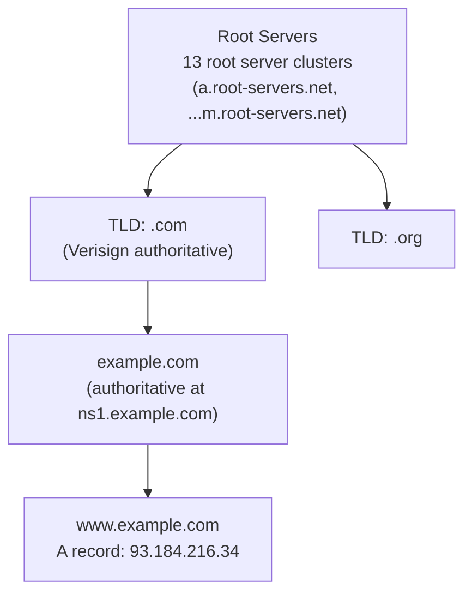

DNS uses three classes of servers: **root** DNS servers, **TLD** servers, and **authoritative** DNS servers. A **local DNS server** (run by an ISP or corporate network) acts as a proxy that forwards client queries into the hierarchy and caches responses. Root servers provide referrals to TLD servers; TLD servers provide referrals to authoritative servers; authoritative servers give the final answer. A **fully qualified domain name (FQDN)** is composed of subdomain + domain + TLD (e.g., `www.google.com`). Each label is limited to 63 characters; the full FQDN to 255 characters. DNS supports up to 127 levels of domain nesting.

DNS zones allow operators to manage sub-trees independently. A **zone file** declares all resource records for a zone. Special zone file entries include Start of Authority (SOA) records (declaring the zone and its primary nameserver) and NS records (identifying other nameservers for the zone). **Reverse lookup zone files** let resolvers query an IP address and get the FQDN back.

### Recursive resolution

A browser making its first request to example.com triggers the following chain:

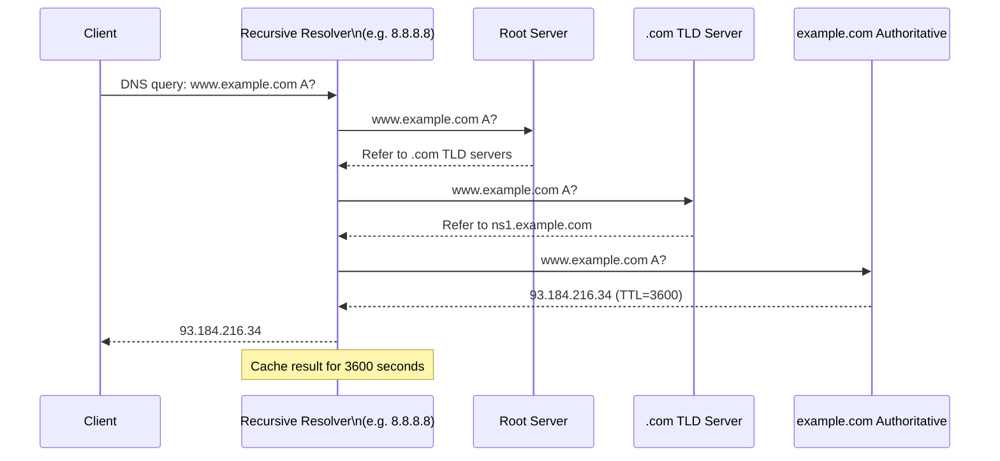

Root servers are critical infrastructure: 13 root server groups (anycast clusters) handle all DNS bootstrapping. **Anycast** routes traffic to the nearest cluster based on location, congestion, or link health. In practice, recursive resolvers cache TLD nameserver addresses, so root queries are rare — a warm resolver typically contacts only the authoritative server.

There are five primary DNS server roles in the resolution chain: caching name servers (store lookups for TTL duration only), recursive name servers (perform the full iterative walk and then cache), root name servers, TLD name servers, and authoritative name servers. A single resolver often plays the caching + recursive roles simultaneously.

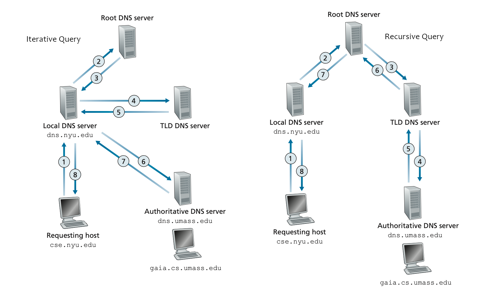

> [!NOTE]
> DNS over UDP is limited to 512 bytes per response. EDNS0 (RFC 2671) extended this to ~4096 bytes. DNS over TCP is used for large responses (DNSSEC, zone transfers). DNS over HTTPS (DoH, RFC 8484) and DNS over TLS (DoT, RFC 7858) encrypt DNS queries, preventing ISP interception and manipulation.

### Why DNS uses UDP

DNS is a textbook example of an application that deliberately chooses UDP over TCP for its transport. A full TCP-based DNS exchange would require: 3-way handshake (3 packets) + request + ACK + response + ACK + 4-packet teardown = roughly 11 packets per lookup. The UDP path requires just 1 packet for the query and 1 for the response — a 5× reduction. If the response is too large for a single UDP datagram, the resolver falls back to TCP automatically. If no response arrives, the resolver simply retransmits.

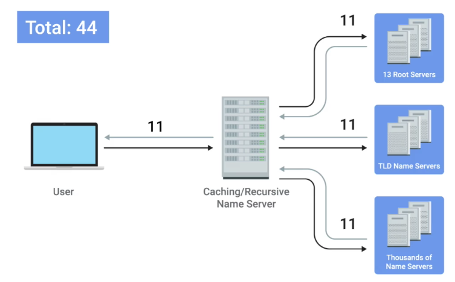

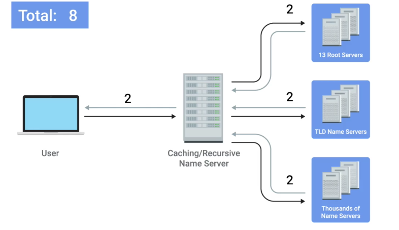

### DNS record types and messages

DNS servers store **resource records (RRs)** as four-tuples `(Name, Value, Type, TTL)`. The TTL field determines how long a record may be cached before it must be re-queried. Common record types:

| Type | Meaning | Example |
| :--- | :--- | :--- |
| `A` | Maps hostname → IPv4 address | `www.example.com → 93.184.216.34` |
| `AAAA` | Maps hostname → IPv6 address | `www.example.com → 2606:2800:220:1:...` |
| `CNAME` | Alias → canonical hostname | `enterprise.com → relay1.west-coast.enterprise.com` |
| `MX` | Domain → mail server hostname | `yahoo.com → relay1.west-coast.yahoo.com` |
| `NS` | Domain → authoritative nameserver hostname | `example.com → ns1.example.com` |
| `TXT` | Arbitrary text (SPF, DKIM, domain verification) | `"v=spf1 include:..."` |
| `SRV` | Service location (host + port) | Used by SIP, XMPP |
| `PTR` | Reverse DNS: IP → hostname | `34.216.184.93.in-addr.arpa → www.example.com` |

**DNS round-robin** is a simple load-distribution technique: publish multiple A records for the same name (e.g., four A records for `microsoft.com` with different IPs). Each successive resolver response rotates the IP ordering, so different clients connect to different servers.

DNS messages consist of a header section plus four variable-length sections: question, answer (RRs), authority (NS records for delegation), and additional (glue A records). Header flags include: query/reply bit (0 = query, 1 = reply), authoritative-answer bit, recursion-desired bit, and recursion-available bit.

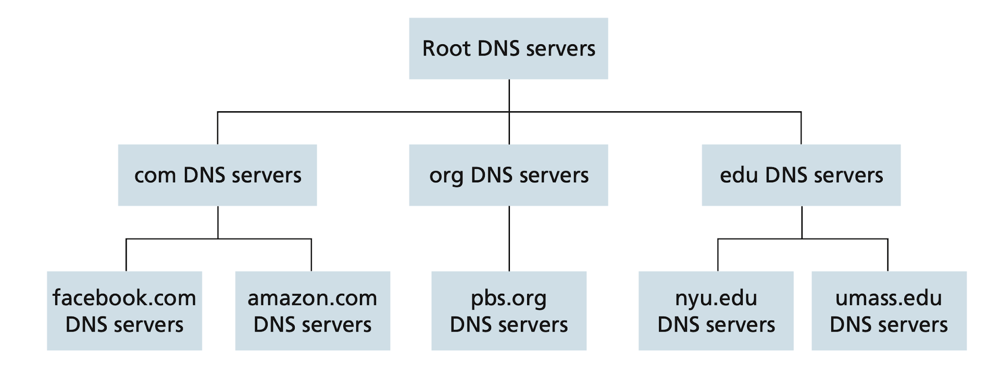

### Registering a domain and inserting DNS records

To register a domain, you provide a **registrar** (a commercial entity accredited by ICANN) with the hostnames and IP addresses of your authoritative nameservers. The registrar inserts NS and A records for your authoritative servers into the TLD zone. You then add your own A, MX, CNAME, and TXT records directly in your zone file. Domains cost money to register and expire if not renewed — lapsed domains are a common operational failure mode.

### DNS tools and public resolvers

The primary command-line tools for DNS inspection are `nslookup` and `dig`. Use `dig +trace <name>` to walk the full delegation chain from root to authoritative. Well-known public recursive resolvers: Google (8.8.8.8, 8.8.4.4), Cloudflare (1.1.1.1), and public Level 3 servers (4.2.2.1–4.2.2.6).

**Hosts files** predate DNS and are still present on every OS (`/etc/hosts` on Unix). A flat file maps IP addresses to hostnames; the OS checks it before querying DNS. The loopback entries `127.0.0.1 localhost` and `::1 localhost` are universal. Hosts files are useful for local development overrides but do not scale to the Internet.

## HTTP Protocol Evolution

### HTTP/1.1

HTTP/1.1 is text-based. A typical request:

```
GET /index.html HTTP/1.1\r\n
Host: example.com\r\n
User-Agent: Mozilla/5.0\r\n
Accept: text/html\r\n
\r\n
```

Response:

```
HTTP/1.1 200 OK\r\n
Content-Type: text/html\r\n
Content-Length: 1256\r\n
\r\n
<html>...</html>
```

HTTP is a **stateless** protocol: the server stores no per-client state between requests. Web pages are composed of objects (HTML, images, stylesheets, scripts), each identified by a URL consisting of a hostname and a path.

**Non-persistent vs. persistent connections**: In non-persistent mode (HTTP/1.0 default), a new TCP connection is created for each object — each incurring a full TCP handshake (1 RTT) before the object transfer (1 RTT), giving roughly 2 RTTs per object. Persistent connections (HTTP/1.1 default) reuse the same TCP connection for multiple objects, amortizing handshake cost.

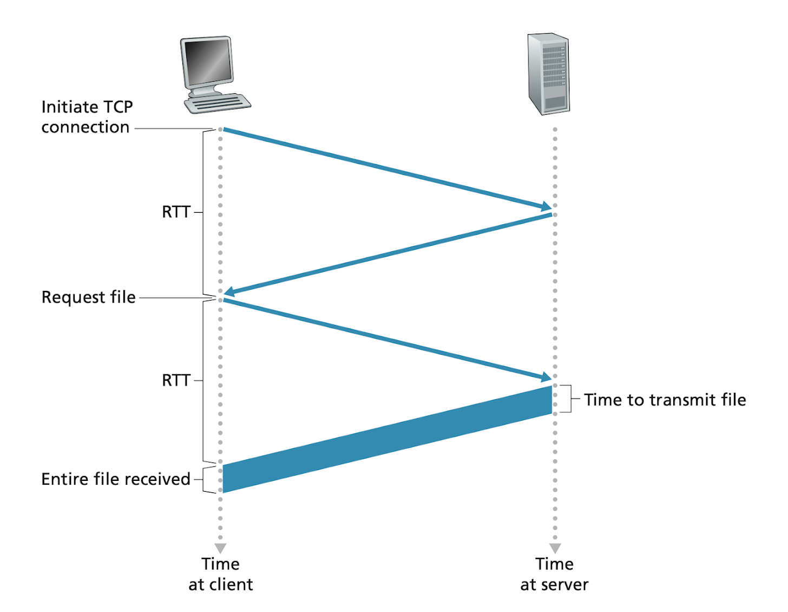

**Head-of-line (HoL) blocking**: one request/response pair per connection at a time. Mitigated by browsers opening up to 6 parallel connections per host — a crude workaround that increases server load.

**HTTP methods**: GET (retrieve), POST (submit data), PUT (replace resource), DELETE (remove resource), HEAD (retrieve headers only), OPTIONS (discover supported methods), PATCH (partial update). The entity body in request/response messages carries the payload.

**Status codes**: 2xx success (200 OK), 3xx redirection (301 Moved Permanently, 304 Not Modified), 4xx client error (400 Bad Request, 404 Not Found), 5xx server error (500 Internal Server Error).

### Cookies

HTTP's statelessness means the server cannot remember prior requests on its own. **Cookies** add a thin session layer on top. They have four components: a `Set-Cookie` header in the server's response, a `Cookie` header in subsequent client requests, a cookie file stored in the browser, and a back-end database on the server that maps cookie values to user state.

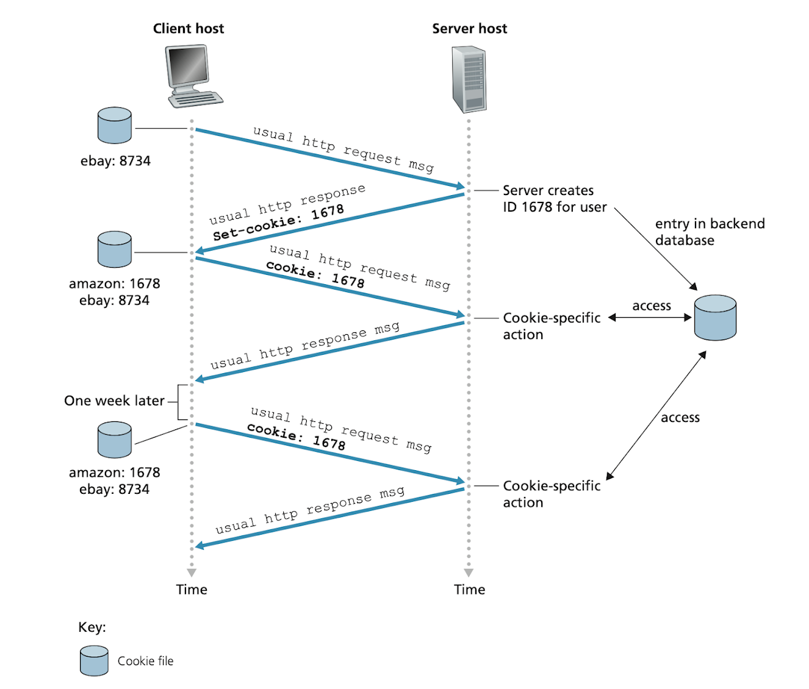

The flow: the server sends `Set-Cookie: id=1678` in its first response. The browser stores the value and sends `Cookie: id=1678` on every subsequent request to that domain. The server looks up `1678` in its database to retrieve the user's session state. Cookies enable shopping carts, authentication tokens, personalization, and user tracking. They are controversial because the tracking data can be aggregated and sold; browser privacy modes and third-party cookie restrictions (Chrome's Privacy Sandbox) aim to limit cross-site tracking.

### Web caching and conditional GET

**Web caches** (also called proxy caches) sit between clients and origin servers. When a client requests an object, the cache checks whether it holds a fresh copy. If yes, it returns the copy directly, saving the round trip to the origin. If no, it fetches the object from the origin, stores a copy, and forwards it to the client. The cache acts as both a server (to clients) and a client (to the origin server).

ISPs and enterprises deploy caches to reduce bandwidth costs and improve response times. **Content Distribution Networks (CDNs)** are large-scale distributed caches — covered in depth under Content distribution below.

**Conditional GET** lets caches validate freshness without transferring the full object:

```
GET /somedir/page.html HTTP/1.1
Host: www.someschool.edu
If-Modified-Since: Tue, 18 Aug 2015 15:11:03 GMT
```

The server replies with `304 Not Modified` (no body) if the object hasn't changed since the cached timestamp, allowing the cache to serve its stored copy. If the object has changed, the server returns `200 OK` with the new content. The `If-Modified-Since` value is taken from the `Last-Modified` header in the previous response.

### HTTP/2

HTTP/2 (RFC 9113, originally RFC 7540) introduces binary framing and full multiplexing. All communication happens in **frames** within **streams**, all multiplexed on a single TCP connection.

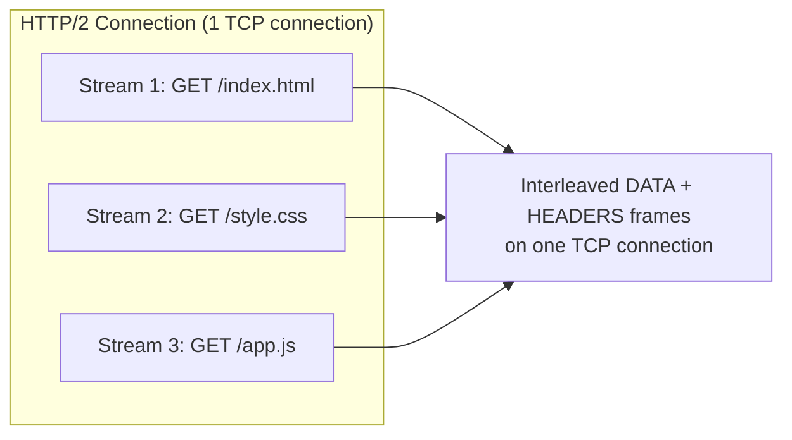

HTTP/2's primary motivation was to eliminate application-level HoL blocking caused by HTTP/1.1's serial request model. Breaking messages into independently interleaved frames is the core innovation. Additional features:

- **HPACK** compresses headers with a shared dynamic table, eliminating the overhead of repeating `User-Agent`, `Accept`, and `Cookie` on every request.
- **Stream prioritization**: clients assign weights (1–256) to streams; servers prioritize higher-weight responses. Clients can also declare stream dependencies.
- **Server Push**: the server proactively sends resources (e.g., `/style.css` when the client requests `/index.html`) without waiting for the client to discover and request them.

The TCP-level HoL blocking problem remains: if a TCP segment is lost, **all** HTTP/2 streams on that connection stall waiting for retransmission — TCP's byte-stream guarantee means no stream can advance past the gap.

### HTTP/3 and QUIC

QUIC (RFC 9000) eliminates TCP-level HoL blocking by implementing reliable streams in user space over UDP. Each QUIC stream is independently reliable: a lost packet only blocks the stream whose data is in that packet, not all streams.

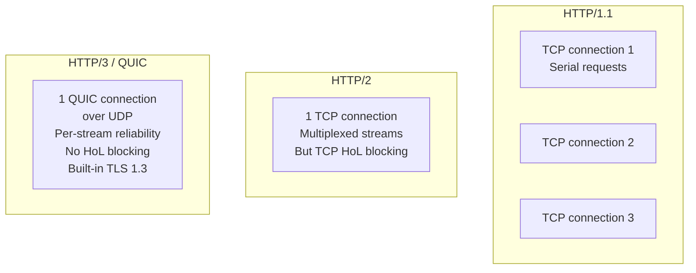

QUIC also integrates the TLS 1.3 handshake, achieving **1-RTT** connection establishment (vs 1 RTT TCP + 1 RTT TLS = 2 RTT for HTTP/2) and **0-RTT** for resumption.

> [!IMPORTANT]
> QUIC runs over UDP, but it is NOT an unreliable protocol. QUIC implements its own reliable delivery per-stream, its own congestion control, and its own flow control. "QUIC over UDP" means QUIC bypasses the OS TCP stack (for HoL blocking and connection migration reasons) but provides equivalent or stronger reliability guarantees itself.

## Application Protocols

### Email — SMTP, POP3, IMAP

Email delivery involves three components working together: **user agents** (clients like Outlook, Apple Mail, Gmail), **mail servers** (infrastructure that host mailboxes and relay messages), and **SMTP** (the push protocol that moves messages between servers).

A message travels from the sender's user agent → sender's mail server (via SMTP) → recipient's mail server (via SMTP) → recipient's user agent (via IMAP or HTTP). If the first delivery attempt to the recipient server fails, the sender's mail server queues the message and retries every 30 minutes.

**SMTP basics**: SMTP transfers messages between mail servers over TCP port 25. The protocol is text-based with a command/response structure:

```
S: 220 hamburger.edu
C: HELO crepes.fr
S: 250 Hello crepes.fr, pleased to meet you
C: MAIL FROM: <alice@crepes.fr>
S: 250 alice@crepes.fr ... Sender ok
C: RCPT TO: <bob@hamburger.edu>
S: 250 bob@hamburger.edu ... Recipient ok
C: DATA
S: 354 Enter mail, end with "." on a line by itself
C: Do you like ketchup?
C: How about pickles?
C: .
S: 250 Message accepted for delivery
C: QUIT
S: 221 hamburger.edu closing connection
```

SMTP uses persistent connections — multiple messages can be sent across a single TCP connection. The protocol supports the sender introducing itself (`HELO`/`EHLO`), specifying envelope sender and recipient, and transmitting the message body terminated by a line containing only `.`.

**Mail message structure**: Each message has a header section (containing `From:`, `To:`, `Subject:`, and other RFC 5322 fields) separated from the body by a blank line (CRLF). These header fields are distinct from the SMTP envelope commands used during server-to-server handshaking.

```
From: alice@crepes.fr
To: bob@hamburger.edu
Subject: Searching for the meaning of life.
```

**Mail access protocols**: SMTP is a push protocol — it cannot be used to retrieve messages already deposited in a mailbox. Retrieval requires a pull protocol.

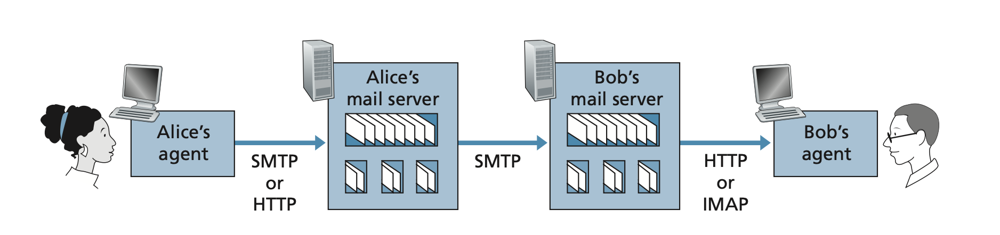

- **IMAP**: Manages messages stored on the server. Supports folders, flags, and partial fetch. Outlook, Thunderbird, and Apple Mail use IMAP.
- **HTTP**: Web-based email clients (Gmail, Outlook Web) use HTTP/HTTPS to retrieve and manage mail from the server. Both IMAP and HTTP-based clients allow folder management, deletion, flagging, and moving messages.

> [!NOTE]
> **DNS and email**: Mail routing uses MX records, not A records. When a mail server needs to deliver to `bob@yahoo.com`, it queries the MX record for `yahoo.com` to find `relay1.west-coast.yahoo.com`, then resolves that hostname to an IP via an A record. CNAME records must not be used for MX targets (RFC 2181).

### Content distribution — CDNs and P2P streaming

Modern content delivery separates the problem of generating content (origin servers) from the problem of delivering it at scale (CDNs and P2P).

**Content Distribution Networks (CDNs)** deploy thousands of servers at Internet exchange points and ISP facilities globally. When a user requests a video or web asset, DNS redirects the request to the CDN node geographically closest to the user. This reduces latency (fewer hops, shorter RTT) and reduces load on the origin. Web caching (proxy caches and CDN edge nodes) exploits the fact that popular objects are requested repeatedly — serving from cache is orders of magnitude cheaper than serving from origin.

CDNs tie directly into the DNS-based load distribution described in the DNS section: an authoritative DNS server for a CDN domain returns different A records depending on the client's geographic location (anycast or geoDNS). CDN HTTP caches use the same conditional GET / `If-Modified-Since` mechanism as browser caches.

**P2P file distribution** (BitTorrent-style): rather than a single server streaming to N clients (O(N) server bandwidth), a P2P system has each new peer download chunks from existing peers and simultaneously upload those chunks to other peers. Bandwidth scales with the number of peers — each peer contributes to the aggregate upload capacity. Challenges include peer churn (peers leaving mid-download), piece selection strategy (rarest-first), and choking/unchoking to incentivize upload contribution.

**Adaptive bitrate video streaming (DASH)**: Video is encoded at multiple quality levels and divided into small segments (2–10 seconds each). The client downloads a manifest, then fetches segments using plain HTTP GET requests. A client-side adaptation algorithm monitors measured throughput and buffer depth to select the highest quality level that will not cause a rebuffering stall. CDN edge nodes cache the segments; origin servers only serve segments on cache miss.

> [!TIP]
> Both CDN caching and DASH streaming are built on plain HTTP GET requests. There is no special streaming protocol — the HTTP infrastructure (proxies, caches, load balancers) works transparently. This is why virtually all video streaming (YouTube, Netflix, Twitch) runs over HTTPS.

### The socket interface

Sockets are the API through which application code interacts with the transport layer. A socket is identified by its (IP address, port number) pair. The OS exposes two socket types corresponding to the two Internet transport protocols:

- **Stream sockets (TCP)**: connection-oriented, reliable, ordered byte stream. The application calls `connect()` to establish a TCP connection, then `send()`/`recv()` to exchange data.
- **Datagram sockets (UDP)**: connectionless, unreliable, message-oriented. The application calls `sendto()`/`recvfrom()` with a destination address on each message.

The server-side pattern for TCP: `socket()` → `bind()` → `listen()` → `accept()` (blocks until a client connects) → `recv()`/`send()` in a loop → `close()`. The client-side pattern: `socket()` → `connect()` → `send()`/`recv()` → `close()`.

The socket API is the primary application programming interface (API) for network programming. All the protocols in this note — HTTP, DNS, SMTP — are ultimately implemented as sequences of `send()` and `recv()` calls on sockets. The Python `socket` module, Go's `net` package, and Java's `java.net` package all expose this same POSIX-derived interface.

> [!NOTE]
> Transport layer selection is a design decision made at socket creation time (`SOCK_STREAM` vs. `SOCK_DGRAM`). DNS uses UDP sockets for performance but falls back to TCP for large responses. HTTP uses TCP sockets. QUIC (HTTP/3) uses UDP sockets but implements its own reliability layer on top.

## TLS 1.3

TLS 1.3 (RFC 8446, released 2018) redesigned the handshake to eliminate a full RTT compared to TLS 1.2 and removed all legacy cipher suites.

### TLS 1.3 handshake

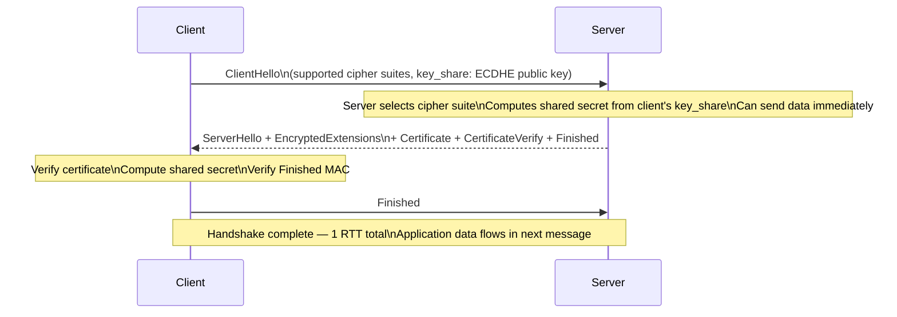

Forward secrecy is built in: TLS 1.3 mandates ECDHE key exchange. The server's long-term private key is only used to sign the key_share, not to encrypt session data. Each session uses fresh ephemeral keys.

**0-RTT resumption:** The client can include application data (e.g., an HTTP GET) in the first flight using a session ticket from a prior connection. This eliminates the handshake RTT entirely. Tradeoff: 0-RTT data has no replay protection — the server might process it twice if a replay occurs. Acceptable for idempotent requests (GET); dangerous for non-idempotent (POST that charges a card).

> [!CAUTION]
> TLS 0-RTT data is **not replay-safe**. A network adversary can capture the 0-RTT flight and replay it, causing the server to process the request again. Mitigations: use 0-RTT only for idempotent requests, implement server-side deduplication (anti-replay), or disable 0-RTT entirely for sensitive endpoints. RFC 8446 section 8 discusses this at length.

## Real-world Example

Using `curl -v` to observe the full HTTP/1.1 conversation, then `dig` to trace DNS resolution:

```bash
# Full verbose HTTP/1.1 + TLS handshake trace
$ curl -v --http1.1 https://example.com/ 2>&1 | head -60
*   Trying 93.184.216.34:443...
* Connected to example.com (93.184.216.34) port 443 (#0)
* ALPN: offers h2,http/1.1
* TLSv1.3 (OUT), TLS handshake, Client hello (1):
* TLSv1.3 (IN), TLS handshake, Server hello (2):
* TLSv1.3 (IN), TLS handshake, Encrypted Extensions (8):
* TLSv1.3 (IN), TLS handshake, Certificate (11):
* TLSv1.3 (IN), TLS handshake, CERT Verify (15):
* TLSv1.3 (IN), TLS handshake, Finished (20):
* TLSv1.3 (OUT), TLS change cipher, Change cipher spec (1):
* TLSv1.3 (OUT), TLS handshake, Finished (20):
* SSL connection using TLSv1.3 / TLS_AES_256_GCM_SHA384
* Server certificate: subject: C=US; ST=California; O=Internet Corporation for Assigned Names and Numbers; CN=www.example.org
> GET / HTTP/1.1
> Host: example.com
> User-Agent: curl/8.1.2
> Accept: */*
< HTTP/1.1 200 OK
< Content-Type: text/html; charset=UTF-8
< Content-Length: 1256
```

A Python client that makes an HTTPS request with explicit TLS inspection:

```python
import ssl
import socket
from typing import Optional

def https_get(host: str, path: str = "/", port: int = 443) -> tuple[int, dict, bytes]:
    """Make a raw HTTPS GET request and return (status_code, headers, body)."""
    context = ssl.create_default_context()
    # Optionally inspect the certificate
    with socket.create_connection((host, port)) as raw_sock:
        with context.wrap_socket(raw_sock, server_hostname=host) as tls_sock:
            # Inspect TLS parameters
            cipher = tls_sock.cipher()
            cert = tls_sock.getpeercert()
            print(f"TLS version: {tls_sock.version()}")
            print(f"Cipher suite: {cipher[0]}")
            print(f"Server cert CN: {cert.get('subjectAltName', 'N/A')}")

            # Send HTTP/1.1 GET
            request = (
                f"GET {path} HTTP/1.1\r\n"
                f"Host: {host}\r\n"
                "Connection: close\r\n"
                "\r\n"
            ).encode()
            tls_sock.sendall(request)

            # Receive response
            response = b""
            while chunk := tls_sock.recv(4096):
                response += chunk

    # Parse status line
    header_end = response.index(b"\r\n\r\n")
    header_section = response[:header_end].decode()
    body = response[header_end + 4:]
    status_line, *header_lines = header_section.split("\r\n")
    status_code = int(status_line.split()[1])
    headers = dict(h.split(": ", 1) for h in header_lines if ": " in h)
    return status_code, headers, body


status, headers, body = https_get("example.com")
print(f"Status: {status}, Content-Length: {headers.get('Content-Length')}")
```

> [!TIP]
> Use `openssl s_client -connect host:443 -tls1_3` for low-level TLS debugging. It shows the full handshake transcript including certificate chain, cipher suite, and session ticket. Invaluable for debugging mutual TLS (mTLS) failures.

## In Practice

**DNS is a production reliability concern.** A 500 ms DNS lookup adds 500 ms to every new connection. Mitigation: DNS caching (`nscd`, `systemd-resolved`), long TTLs for stable records, and using a fast recursive resolver close to the client (8.8.8.8, 1.1.1.1, or a local resolver). AWS Route 53, Cloudflare DNS, and Google Cloud DNS are all anycast networks, with sub-millisecond queries from most locations.

**Certificate management is an operational pain.** Let's Encrypt and ACME (RFC 8555) automated certificate issuance, but renewals still fail in production. A certificate expiry on a service causes hard failures — browsers refuse to connect, HTTPS APIs return `SSL_ERROR_EXPIRED_CERT`. Implement certificate expiry monitoring (alert at 30 days, 7 days, 1 day before expiry) and use automated renewal (`certbot renew --pre-hook` or cert-manager in Kubernetes).

**HTTP/2 multiplexing is not always a win.** For APIs with very few concurrent streams, HTTP/2's overhead (binary framing, HPACK table management) outweighs the multiplexing benefit. Profiling with `nghttp2` or `h2load` will reveal the crossover point for your workload.

> [!WARNING]
> HTTP/2 server push was removed from Chrome (and deprecated in the spec for HTTP/2) because real-world usage showed it often pushed resources the browser already had cached, wasting bandwidth. HTTP/3 inherits server push from HTTP/2 semantics but major browsers have also disabled it by default. Do not rely on server push in production.

## Pitfalls

- **"HTTPS means the site is safe."** — HTTPS means the connection is encrypted and the server's identity is verified by a CA. It does not mean the server itself is trustworthy, the software is secure, or the content is safe. A phishing site can have a valid TLS certificate.
- **"DNS TTL controls how long a record is cached."** — DNS TTL is an advisory, not a hard limit. Many resolvers and operating system stub resolvers ignore low TTLs or enforce minimum floors. A TTL change takes the TTL's current value to propagate globally — if your TTL is 86400 (1 day), allow 24 hours for your change to propagate before cutting over.
- **"HTTP/2 eliminates all HoL blocking."** — HTTP/2 eliminates application-level HoL blocking (one slow response no longer blocks others). But TCP-level HoL blocking remains: a lost TCP segment stalls all HTTP/2 streams. HTTP/3 (QUIC) eliminates this too.
- **"TLS 1.3 is the same as TLS 1.2 with newer ciphers."** — TLS 1.3 is a significant redesign: eliminated RSA key exchange (mandatory PFS), reduced handshake from 2 RTT to 1 RTT, removed all weak cipher suites and compression, added 0-RTT resumption. TLS 1.2 with weak configuration (RC4, export ciphers, static RSA) is categorically less secure.
- **"P2P scales infinitely."** — P2P self-scalability holds under ideal assumptions (peers stay connected and upload at full capacity). In practice, peer churn, asymmetric upload/download speeds (residential ISPs cap upload), and NAT traversal failures mean P2P performance degrades under adversarial conditions. CDNs are more predictable for popular content.

## Exercises

### Exercise 1 — DNS resolution trace

Trace the complete DNS resolution for `mail.google.com`. List every server contacted, in order, and what each returns.

#### Solution

Assuming a cold recursive resolver (no cached entries):

**Step 1 — Client queries recursive resolver (8.8.8.8).**
The resolver's cache is cold. It starts at the root.

**Step 2 — Resolver queries a root nameserver.**
Query: `mail.google.com A?` to any root server (e.g., a.root-servers.net).
Root response: `REFER to .com TLD nameservers` (NS records for .com: a.gtld-servers.net, etc.) — not authoritative, just a delegation.

**Step 3 — Resolver queries a .com TLD nameserver.**
Query: `mail.google.com A?` to a.gtld-servers.net.
TLD response: `REFER to google.com authoritative nameservers` (ns1.google.com, ns2.google.com, ns3.google.com, ns4.google.com) — delegation.

**Step 4 — Resolver queries google.com authoritative nameserver.**
Query: `mail.google.com A?` to ns1.google.com.
Authoritative response: `mail.google.com. 300 IN A 142.250.x.x` (an actual IPv4 address).

**Step 5 — Resolver caches and returns to client.**
The resolver caches the A record with TTL=300. Client receives the IP address in < 50 ms total (root + TLD + authoritative, all on fast Anycast networks).

In practice, the resolver has the .com TLD nameservers cached, so steps 2–3 are skipped and only one query to the authoritative server is needed. You can verify with: `dig +trace mail.google.com`.

---

### Exercise 2 — HTTP/1.1 vs HTTP/2 performance

A browser fetches a page that requires 10 resources (1 HTML + 9 assets). Each resource takes 100 ms to fetch (50 ms network RTT + 50 ms server processing). (a) How long does HTTP/1.1 take with 1 connection? (b) With 6 parallel connections (browser default)? (c) With HTTP/2 multiplexing on 1 connection?

#### Solution

**(a) HTTP/1.1 with 1 connection:**
Requests are serial: 1 TCP connection, one request at a time. Total = 1 TCP handshake (50 ms) + 10 × 100 ms = 1,050 ms.

**(b) HTTP/1.1 with 6 connections:**
6 parallel connections. Each connection costs one TCP handshake (50 ms). Fetching 10 resources:
- Batch 1: 6 resources in parallel, each 100 ms (plus one-time 50 ms handshake) = 150 ms.
- Batch 2: remaining 4 resources = 100 ms (connections already established).
Total ≈ 150 + 100 = **250 ms** (plus connection establishment overhead for the 6 sockets).

**(c) HTTP/2 multiplexed on 1 connection:**
One TCP handshake + TLS (assume ~100 ms combined). Then all 10 requests fly simultaneously, all responses return in parallel: 100 ms for all resources.
Total ≈ 100 ms (setup) + 100 ms (all requests) = **200 ms**.

The HTTP/2 advantage is most pronounced with many small resources and high latency. At low latency (datacenter, < 1 ms RTT), the differences shrink. HTTP/2 also eliminates the 6-connection-per-host hack, reducing server TCP state.

---

### Exercise 3 — TLS 1.3 handshake RTT count

How many RTTs does it take before the first application data byte flows for: (a) TLS 1.2 over TCP, (b) TLS 1.3 over TCP, (c) TLS 1.3 over QUIC (HTTP/3)?

#### Solution

**(a) TLS 1.2 over TCP:**
- 1 RTT: TCP three-way handshake (SYN + SYN-ACK + ACK — the ACK can be combined with the next message but the half-RTT happens).
- 1 RTT: TLS 1.2 full handshake (ClientHello + ServerHello/Certificate + ClientKeyExchange/Finished + server Finished).
Total: **2 RTTs** before application data flows (1 TCP + 1 TLS).

Note: TLS 1.2 actually took 2 full round trips within the TLS handshake for the full handshake, making it sometimes quoted as 2 RTT TCP setup + 1 RTT for TLS = total of effectively 3 half-RTTs, but commonly cited as **2 RTTs** total.

**(b) TLS 1.3 over TCP:**
- 1 RTT: TCP three-way handshake.
- 1 RTT: TLS 1.3 handshake (ClientHello with key_share in flight 1; ServerHello + Certificate + Finished in flight 2; client Finished in flight 3 — but the server can piggyback its Finished with the application response in the same RTT).
Total: **1 RTT** TCP + **1 RTT** TLS = **2 RTTs** for first connection, but TLS 1.3 is tighter: the application data can flow after the server's second flight, which takes 1 RTT after the TCP handshake. Correctly: **1 TCP RTT + 1 TLS RTT = 2 RTTs**, but with TLS session resumption: **1 TCP RTT + 0 TLS RTT = 1 RTT**.

**(c) TLS 1.3 over QUIC (HTTP/3):**
QUIC merges the transport and TLS handshakes. The ClientHello is sent in the first QUIC packet (no separate TCP SYN). The server responds with the TLS ServerHello + Certificate + Finished. The client can include application data in the next flight.
Total for new connection: **1 RTT**.
With 0-RTT resumption: **0 RTTs** — application data (HTTP GET) in the first packet sent.

This is the core performance argument for HTTP/3: halving the connection setup latency compared to HTTP/2 on high-RTT connections (mobile networks, international).

## Sources

- RFC 1035 — Domain Names: Implementation and Specification. https://www.rfc-editor.org/rfc/rfc1035
- RFC 8446 — TLS 1.3. https://www.rfc-editor.org/rfc/rfc8446
- RFC 9000 — QUIC. https://www.rfc-editor.org/rfc/rfc9000
- RFC 9113 — HTTP/2. https://www.rfc-editor.org/rfc/rfc9113
- RFC 9114 — HTTP/3. https://www.rfc-editor.org/rfc/rfc9114
- Grigorik, I. (2013). *High-Performance Browser Networking*. O'Reilly. https://hpbn.co/
- Cloudflare. "HTTP/3: the past, the present, and the future." https://blog.cloudflare.com/http3-the-past-present-and-future/
- Material in this note draws on the open-source notes at [VasanthVanan/computer-networking-top-down-approach-notes](https://github.com/VasanthVanan/computer-networking-top-down-approach-notes) (Kurose & Ross 8th ed.) and [karthick28/computer-networking-notes](https://github.com/karthick28/computer-networking-notes) (Coursera "Bits and Bytes of Computer Networking").

## Related

- [2 - OSI and TCP/IP Models](./2-osi-and-tcp-ip.md)
- [4 - The Network Layer — IP, Subnetting, Routing](./4-network-layer-ip.md)
- [5 - The Transport Layer — TCP and UDP](./5-tcp-and-udp.md)
- [8 - Performance — Latency, Throughput, Congestion](./8-performance.md)
- [9 - Network Security](./9-network-security.md)
