# 7 - Routing Protocols and the Internet

[toc]

> **TL;DR:** The Internet's routing system is a two-level hierarchy: within an autonomous system (AS), interior gateway protocols (OSPF, IS-IS) compute optimal paths using link-state algorithms; between ASes, BGP — a path-vector protocol — enforces policy-driven reachability. BGP is simultaneously the Internet's most critical infrastructure and its most fragile: a single misconfigured AS can reroute global traffic. Anycast and CDN placement build on these mechanisms to serve content from the nearest location.

## Vocabulary

**Interior Gateway Protocol (IGP)**: A routing protocol operating within a single autonomous system. Examples: OSPF, IS-IS, RIP, EIGRP.

---

**Exterior Gateway Protocol (EGP)**: A routing protocol operating between autonomous systems. BGP is the only EGP in use on the Internet today.

---

**Autonomous System (AS)**: A collection of networks under a single administrative control, identified by a globally unique Autonomous System Number (ASN) assigned by IANA / ICANN regional registries (e.g., IBM is AS19604; AS numbers are 32-bit integers). Non-routable RFC 1918 space (10.0.0.0/8, 172.16.0.0/12, 192.168.0.0/16) can be used freely within an AS but is never forwarded by exterior gateway protocols.

---

**OSPF (Open Shortest Path First)**: A link-state IGP. Each router floods its link-state advertisements (LSAs) to all other routers in the same area. All routers build an identical topology graph and run Dijkstra's shortest path algorithm to compute forwarding tables. RFC 2328 (OSPFv2), RFC 5340 (OSPFv3 for IPv6).

---

**IS-IS (Intermediate System to Intermediate System)**: A link-state IGP similar to OSPF but protocol-independent (runs directly over Layer 2, not over IP). Preferred in large ISP and datacenter networks.

---

**RIP (Routing Information Protocol)**: A distance-vector IGP. Routers exchange distance vectors with neighbors. Simple but slow to converge; count-to-infinity problem. RFC 2453. Largely obsolete.

---

**BGP (Border Gateway Protocol)**: A path-vector EGP. Routes carry full AS-path lists. Policies (import/export filters, local preference, MED) govern which routes are accepted and advertised. RFC 4271.

---

**AS path**: An ordered list of ASNs that a BGP route has traversed. `65001 65002 15169` means the route went through ASes 65001, 65002, then 15169 (Google). Used for loop detection (reject if your own ASN is in the path) and policy (prefer shorter paths).

---

**Routing table**: The per-router data structure used to forward packets. Each entry contains: the **destination network** (CIDR notation or IP + subnet mask), the **next hop** (IP address of next router, or "directly connected"), **total hops** (path cost), and the **egress interface**.

---

**Peering**: A bilateral arrangement between two ASes to exchange routes and traffic, typically settlement-free (no payment). Both ASes benefit from direct traffic exchange.

---

**Transit**: A provider–customer relationship where the provider carries the customer's traffic to/from the rest of the Internet, for payment.

---

**IXP (Internet Exchange Point)**: A physical facility where many networks interconnect to exchange traffic directly, reducing cost and latency. Examples: DE-CIX Frankfurt (largest), AMS-IX Amsterdam, LINX London.

---

**Anycast**: An addressing scheme where the same IP address is announced from multiple geographic locations. Routers deliver packets to the topologically nearest instance. Used for DNS root servers, CDN edge nodes, and Cloudflare's DDoS scrubbing.

---

**CDN (Content Delivery Network)**: A distributed network of edge servers that cache and serve content from locations close to users. Examples: Cloudflare, Akamai, Fastly, AWS CloudFront.

---

**BGP community**: A 32-bit tag attached to a BGP route that communicates policy intent between ASes (e.g., "do not re-advertise," "this is a customer route").

---

**RPKI (Resource Public Key Infrastructure)**: A cryptographic system for verifying that an AS is authorized to originate a given IP prefix. Route Origin Authorizations (ROAs) bind prefixes to originating ASNs.

---

**ICMP (Internet Control Message Protocol)**: A network-layer support protocol used primarily for error reporting and diagnostics. ICMP messages carry a **type** field (e.g., type 8 = Echo Request, type 0 = Echo Reply, type 11 = TTL Exceeded) and a **code** subfield. The payload includes the IP header and first 8 bytes of the offending datagram.

---

**SNMP (Simple Network Management Protocol)**: An application-layer protocol that lets a managing server query and configure managed devices through software agents. Devices expose state via a **Management Information Base (MIB)** — a tree of typed objects. SNMPv3 adds authentication and encryption.

---

**NETCONF / YANG**: A configuration management protocol (NETCONF) paired with a data-modelling language (YANG). NETCONF encodes operations as XML over TLS and supports atomic multi-device transactions; YANG precisely specifies the structure and semantics of the managed data.

---

## Intuition

Think of the Internet's routing as two separate games:

**Inside an AS (IGP):** It is like a city's internal road network. Every router knows the complete map of the city (thanks to link-state flooding). When a packet needs to go from A to B inside the city, every router independently runs Dijkstra's algorithm on the same map and reaches the same answer. The map changes when a road opens or closes (link comes up or down), and routers re-converge in seconds.

**Between ASes (BGP):** It is like international diplomacy. Each country (AS) announces "I can reach these destinations" to its neighbors. The announcement carries the full list of countries the packet would traverse (AS path). Each country applies its own policy — "I prefer this path, I distrust that peer, I will not carry traffic between these two rivals for free." Unlike IGP, there is no global map. Each AS has its own partial view, filtered through policy.

The control plane — the component that makes these decisions — sits above the forwarding plane. It processes routing protocol messages, runs algorithms, and pushes the resulting forwarding tables down to each router's data plane.

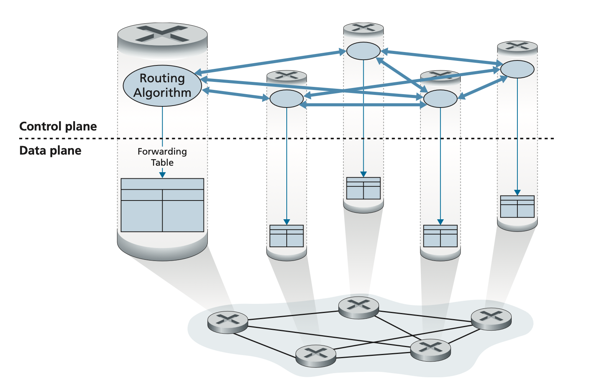

Anycast is the routing trick that makes DNS and CDNs fast: advertise the same prefix from 200 locations. Your local router automatically picks the nearest one based on shortest BGP path. The "nearest" server answers every query.

**Basic packet forwarding across AS boundaries** follows a three-step MAC swap at every hop: the source node sends to the router's MAC; the router decrements TTL, looks up the destination in its routing table, then rewrites the source MAC to its own and the destination MAC to the next hop.

## OSPF — Open Shortest Path First

OSPF is the dominant IGP in enterprise and ISP networks. It is a **link-state protocol**: every router builds a complete topological map of the autonomous system by flooding Link-State Advertisements (LSAs), then runs Dijkstra's algorithm locally to compute the shortest-path tree. This contrasts with distance-vector protocols (like RIP), which share only summarised distance information with neighbours. The table below summarises the trade-offs:

| Feature | Distance-Vector | Link-State |
| :--- | :--- | :--- |
| Information exchanged | Routing tables (distances) | Full link-state database |
| Update trigger | Periodic or triggered | Event-driven |
| Path selection | May miss shortest path | Always finds shortest path |
| Convergence | Slower | Faster |
| Memory usage | Lower | Higher |
| Bandwidth usage | Higher (periodic floods) | Lower (event-driven) |
| Loop prevention | Split horizon, poison reverse | SPF algorithm |
| Scalability | Limited | High |
| Examples | RIP, EIGRP | OSPF, IS-IS |

OSPF operates within an **area** hierarchy (backbone area 0, stub areas) to limit flooding scope. The network administrator configures link costs explicitly, allowing traffic engineering (e.g., prefer high-bandwidth links) rather than being locked into hop-count metrics.

### OSPF Link-State Algorithm

Every OSPF router maintains a **link-state database (LSDB)** — a complete graph of the AS topology. Each router floods **Link-State Advertisements (LSAs)** containing its router ID, connected interfaces, and link costs. When the topology changes, new LSAs are flooded immediately.

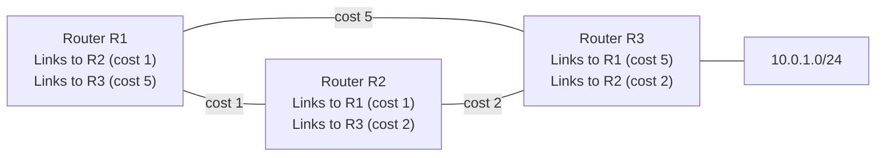

Dijkstra's algorithm run by R1:
- To R3: direct cost = 5. Via R2: 1 + 2 = 3. Best path: R1 → R2 → R3 (cost 3).
- To 10.0.1.0/24: same as path to R3 + the directly connected cost (0): cost 3.

OSPF converges in seconds on link failure (LSA flooding + Dijkstra recomputation). This is orders of magnitude faster than RIP's distance-vector convergence, which can take minutes.

> [!NOTE]
> OSPF cost is configurable per-interface but conventionally derived from bandwidth: cost = 10⁸ / interface_bandwidth_bps. A 100 Mbps interface has cost 1; a 1 Gbps interface also gets cost 1 by the default formula (capped). Many deployments override with explicit costs to steer traffic.

### OSPF Hierarchy

Large OSPF deployments use **areas** to limit LSA flooding. Each area is a connected set of routers. Area 0 (the backbone) connects all areas. Inter-area routing is summarised at **Area Border Routers (ABRs)**. An **AS Edge Router (ASBR)** redistributes routes from external routing domains (BGP, static) into OSPF.

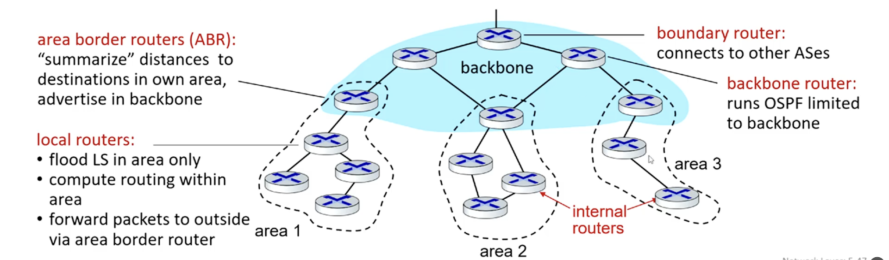

### OSPF Security and Additional Features

OSPF includes several features that go beyond basic shortest-path computation. Authentication prevents rogue routers from injecting false LSAs; OSPFv2 supports simple password and MD5 authentication, with sequence numbers guarding against replay attacks. OSPF also natively permits **equal-cost multipath (ECMP)** — when two or more paths share the same cost, OSPF can load-balance across them. **MOSPF** (Multicast OSPF) extends the protocol to support multicast routing using the same LSDB.

- **Authentication**: Simple or MD5 (with anti-replay sequence numbers).
- **Multiple equal-cost paths**: OSPF permits load-balancing across ties.
- **Multicast support**: MOSPF extends OSPF for multicast routing.
- **Hierarchy**: Area Border Routers summarise inter-area routes; the backbone area (area 0) is mandatory for multi-area deployments.

## RIP — Distance-Vector Routing

RIP is the canonical distance-vector IGP and the direct predecessor to understanding why link-state protocols dominate today. In a distance-vector scheme, each router maintains a table of (destination, distance, next-hop) entries. Periodically — and on topology changes — each router sends its full table to every directly connected neighbour. Neighbours incorporate the received table using the Bellman-Ford relaxation: if reaching destination D through neighbour N costs dist(me, N) + dist(N, D) < current best, update.

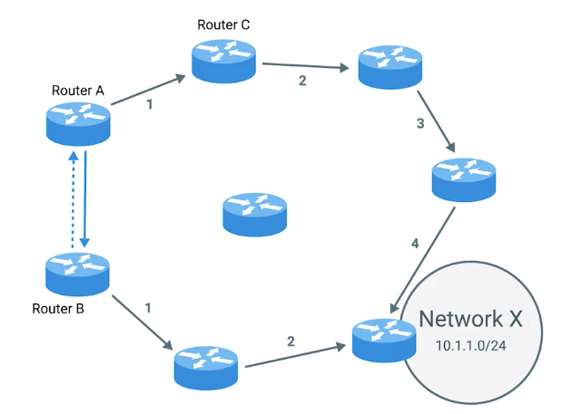

The diagram illustrates the iterative exchange: router A initially reaches destination X via a 4-hop path (1-2-3-4); when B shares its table showing X is 2 hops away, A recomputes and finds A → B → 1 → 2 is shorter.

### Bellman-Ford and Count-to-Infinity

The core update rule is: for each destination D and each neighbour N, if `cost(self → N) + cost(N → D) < best_known(D)`, update the best. Routers iterate until no entry changes — convergence.

The fatal weakness is **count-to-infinity**: when a link fails, distance-vector routers may keep incrementing the cost toward a destination, mistakenly believing a route still exists via another path that itself routes back through the failed link. Mitigations include **split horizon** (do not advertise a route back to the neighbour you learned it from) and **poison reverse** (advertise the route back but with infinite cost). Neither fully eliminates the problem for all topologies.

> [!WARNING]
> RIP defines "infinity" as 16 hops, limiting usable network diameter to 15 hops. Any destination more than 15 hops away is unreachable under RIP. This hard cap, combined with slow convergence, makes RIP unsuitable for large or dynamically changing networks. It survives only in small lab environments and legacy gear.

### Link-State Routing Visualised

For contrast with distance-vector, link-state routers share information about each of their interfaces (not a full distance table) with every other router in the AS. Each router then independently runs Dijkstra on the complete view.

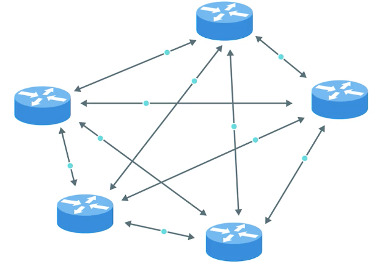

## BGP — Border Gateway Protocol

BGP is a path-vector protocol. Unlike distance-vector (which sends distance only) or link-state (which sends topology), BGP sends **paths** — sequences of ASNs. This allows loop detection (reject routes containing your own ASN) and policy enforcement. BGP is the glue binding thousands of ISPs together; it routes packets to **CIDRised prefixes**, each representing a subnet or collection of subnets, and carries the full list of ASes a packet would traverse (AS-PATH) along with the IP address of the entry point into the next AS (NEXT-HOP).

```
3d; AS3; X  →  2a; AS2 AS3; X
```

The line above shows how AS2 prepends its own ASN when re-advertising a route it learned from AS3: the new AS-PATH is `AS2 AS3` and the NEXT-HOP is updated to 2a's interface address.

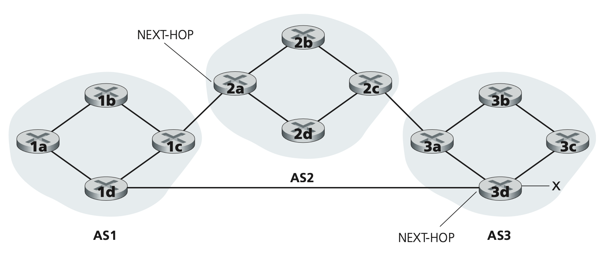

### BGP Session Types

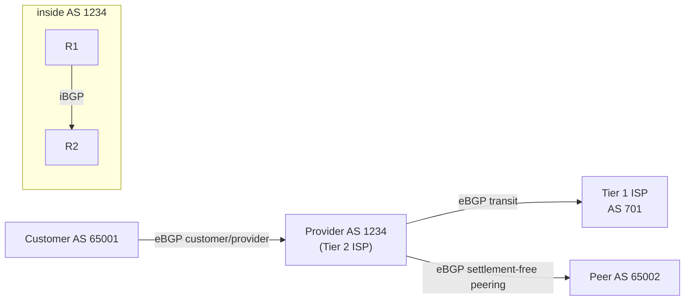

**eBGP** (external BGP) sessions run between different ASes. **iBGP** sessions run between routers within the same AS to propagate external routes. iBGP requires full mesh or a route reflector (one router that reflects routes to all others).

### BGP Route Selection

When a BGP router receives multiple paths to the same prefix, it selects the best one using a deterministic preference order:

1. Highest **Local Preference** (set by ingress policy — prefer customer routes over peer routes over transit routes).
2. Shortest **AS path length**.
3. Lowest **Origin type** (IGP < EGP < incomplete).
4. Lowest **MED** (Multi-Exit Discriminator — hint from the neighbouring AS about preferred entry point).
5. Prefer **eBGP** over iBGP learned routes.
6. Lowest **IGP cost** to the BGP next hop.
7. Tie-breaking by router ID.

> [!WARNING]
> BGP's default behaviour is to prefer the shortest AS-path route. This ignores actual latency, bandwidth, and reliability. A 2-hop path through a congested Tier 1 backbone may perform worse than a 4-hop path through uncongested regional ISPs. BGP optimisation overlays (traffic engineering, BGP communities, route servers) are used to achieve performance-aware routing.

### Hot-Potato Routing

Hot-potato routing is the BGP strategy of getting a packet out of your AS as quickly and cheaply as possible, regardless of what happens once it leaves. The name reflects the analogy of passing a burning potato to someone else immediately.

When a BGP router has learned multiple external routes to the same destination prefix — each with a different NEXT-HOP — it consults the intra-AS routing table (e.g., OSPF) to find the least-cost path to each NEXT-HOP. It then selects the NEXT-HOP that is cheapest to reach *within* the AS, even if that choice results in a longer overall end-to-end path. The forwarding table entry is `(prefix, egress interface toward nearest NEXT-HOP)`.

Hot-potato routing is intentionally selfish: it minimises the originating AS's internal cost while externalising the burden to neighbouring ASes. This is why large ISPs with multiple interconnect points carefully use BGP communities and MED values to influence which entry point peers use — to counter hot-potato behaviour in their neighbours.

### BGP Route Leaks and Hijacks

**Route hijack:** AS X announces a prefix (e.g., 8.8.8.8/32) that belongs to AS Y (Google). Routers that trust X will send traffic for 8.8.8.8 to X instead of Google. In 2010, China Telecom hijacked ~15% of the Internet's routes for 18 minutes.

**Route leak:** AS X re-advertises a route it received from its provider (AS P) to another provider (AS Q). Traffic that should stay within P's network now flows through X, potentially through suboptimal paths and congesting links.

**RPKI** (Resource Public Key Infrastructure) defends against hijacks. A Route Origin Authorization (ROA) is a cryptographically signed record stating "AS 15169 is authorised to originate 8.8.8.8/32." Routers that validate ROAs will reject invalid originations.

## Anycast Routing

Anycast exploits BGP's normal route selection. Multiple locations announce the same prefix. Each router in the Internet selects the "nearest" announcement based on BGP path attributes (primarily AS path length). The result: packets are delivered to the nearest instance without any application-level knowledge.

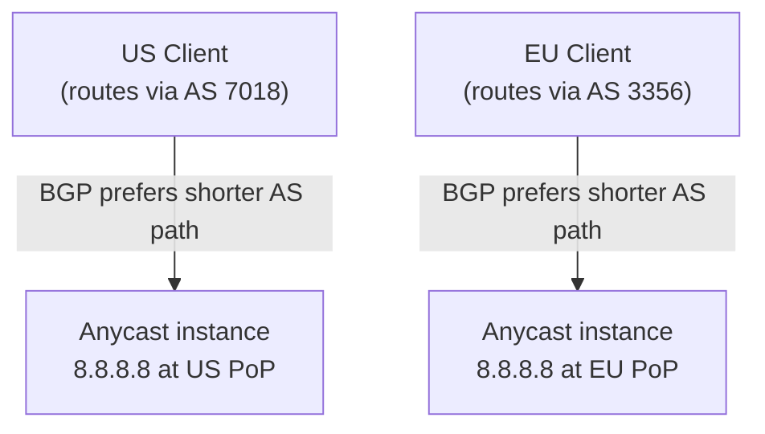

Google's DNS resolver 8.8.8.8 is anycast from over 100 locations. A query from Tokyo goes to Google's Tokyo PoP; from New York to Google's New York PoP. Same IP address, transparent load distribution.

### IP Anycast in CDNs

CDNs use IP anycast to replicate content across dispersed geographic locations so users automatically reach the nearest server. The mechanism is straightforward: the CDN assigns the same IP address to all its edge servers, then uses standard BGP to advertise that address from each server's location. BGP routers treat the multiple advertisements as different paths to the same destination and apply the local route-selection algorithm — typically preferring the lowest AS hop count. Each client's router independently picks the "closest" edge node. No application-layer load balancer, DNS-based steering, or explicit geographic mapping is required.

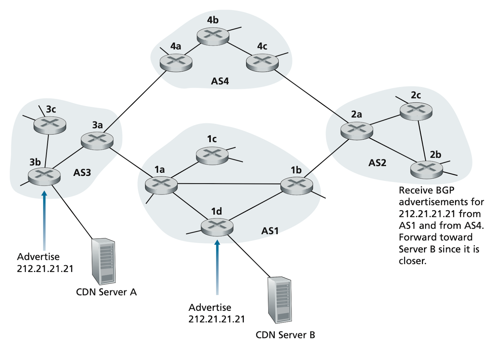

## ICMP — Control-Message Protocol

ICMP (Internet Control Message Protocol) is the network layer's built-in signalling channel. It is not used to carry application data; it is used to report errors and probe reachability. Routers and hosts generate ICMP messages when something goes wrong — a TTL expires, a destination is unreachable, or a packet is too large for an outgoing link — and send them back to the packet's original source.

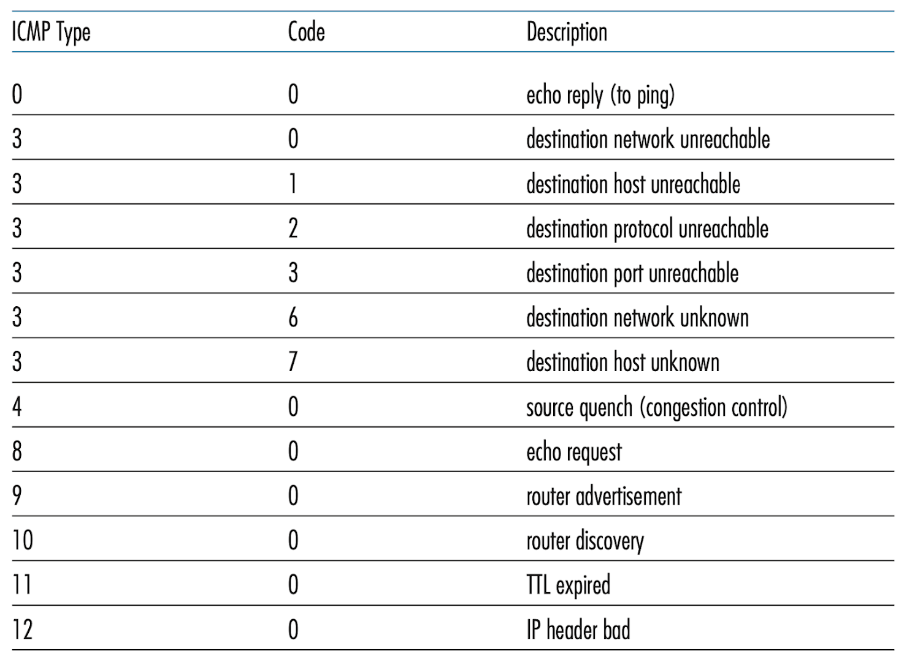

Every ICMP message carries a **type** and a **code** field, followed by the IP header and first 8 bytes of the datagram that triggered it (enough for the source to identify which flow caused the error).

**Key ICMP message types:**

| Type | Code | Meaning |
| :---: | :---: | :--- |
| 0 | 0 | Echo Reply (ping response) |
| 3 | 0–15 | Destination Unreachable (various codes: host unreachable, port unreachable, fragmentation needed) |
| 8 | 0 | Echo Request (ping probe) |
| 11 | 0 | TTL Exceeded — used by `traceroute` |

**`ping`** sends type-8 Echo Requests; the destination responds with type-0 Echo Replies. Round-trip time is measured from send to receive.

**`traceroute`** exploits TTL expiry: it sends UDP datagrams (or ICMP Echo Requests) with TTL=1, TTL=2, TTL=3, etc. Each router that decrements TTL to zero discards the packet and sends a type-11 ICMP "TTL Exceeded" back to the source, revealing the router's address and the round-trip time to that hop.

> [!NOTE]
> The **Source Quench** ICMP message (type 4) was originally intended for congestion control — a congested router could tell a sender to slow down. It was deprecated in RFC 6633 (2012) because it proved ineffective and is no longer used in practice. Modern congestion control operates at the transport layer (TCP's AIMD, QUIC's rate control).

## Network Management — SNMP, NETCONF, YANG

Network management is the discipline of monitoring, configuring, and controlling the network's hardware and software to meet performance and reliability requirements. Three components form the management architecture: a **managing server** (the centralised controller that collects data and issues commands), **managed devices** (routers, switches, hosts — any equipment with a management agent), and the **management protocol** that connects them.

Managed devices expose three categories of data: **configuration data** (explicitly set by the operator, e.g., interface IP assignments), **operational data** (acquired during operation, e.g., current OSPF neighbours), and **device statistics** (counters and status indicators, e.g., interface error rates).

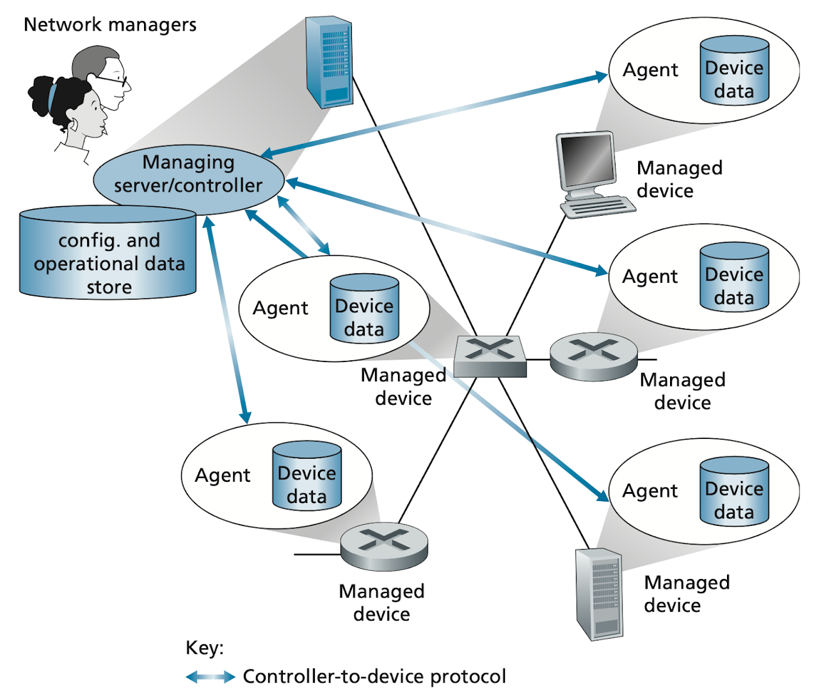

### SNMP

SNMP is the traditional management protocol. The managing server queries agents on managed devices using a request-response model; agents can also push unsolicited **trap** messages when exceptional events occur (e.g., a link goes down). Device state is exposed via the **MIB** (Management Information Base) — a hierarchical namespace of typed objects.

| SNMPv3 PDU Type | Sender → Receiver | Purpose |
| :--- | :---: | :--- |
| GetRequest | Manager → Agent | Read one or more MIB object values |
| GetNextRequest | Manager → Agent | Walk the MIB tree (next object) |
| GetBulkRequest | Manager → Agent | Read a large block (e.g., routing table) |
| SetRequest | Manager → Agent | Write one or more MIB object values |
| InformRequest | Manager → Manager | Share MIB data between managing servers |
| Response | Agent → Manager | Answer to any Get/Set |
| SNMPv2-Trap | Agent → Manager | Unsolicited event notification |

SNMPv3 adds authentication (HMAC-MD5 or HMAC-SHA) and privacy (DES / AES encryption), correcting the security weaknesses of SNMPv1/v2c, which sent community strings in plaintext.

### NETCONF and YANG

NETCONF and YANG represent a more modern, network-wide approach to management. NETCONF uses XML-encoded remote procedure calls transported over TLS, and critically supports **atomic transactions across multiple devices** — either all devices apply a config change or none do, avoiding partial failures that leave the network in an inconsistent state. YANG is the data-modelling language that precisely specifies the structure, syntax, and semantics of the configuration and operational data that NETCONF manipulates.

> [!TIP]
> In production, SNMP's GetBulkRequest is still heavily used for **monitoring** (polling interface counters, routing table sizes, CPU load). NETCONF/YANG has largely replaced CLI-based configuration scripts for **provisioning** in modern data-centre and carrier environments. The two coexist: use SNMP for read-heavy telemetry pipelines and NETCONF for transactional configuration pushes.

## Real-world Example

Reading a BGP routing table and tracing AS paths using command-line tools:

```bash
# Show BGP routes to 8.8.8.8 on a Linux router running FRR (Free Range Routing)
$ vtysh -c "show ip bgp 8.8.8.8/32"
BGP routing table entry for 8.8.8.8/32
Paths: (2 available, best #1, table Default-IP-Routing-Table)
  Advertised to non-peer-group peers:
    192.168.1.1
  15169
    203.0.113.1 from 203.0.113.1 (203.0.113.254)
      Origin IGP, metric 0, localpref 100, valid, external, best
      Community: 15169:15169
      Last update: Mon May 19 12:00:00 2026
  7018 15169
    198.51.100.1 from 198.51.100.1 (198.51.100.254)
      Origin IGP, metric 0, localpref 90, valid, external
      Last update: Mon May 19 12:01:00 2026
# Best path: direct 1-hop to Google AS15169 (localpref 100)
# Alternative: 2-hop via AT&T AS7018 (localpref 90, less preferred)

# Trace AS path using traceroute's TTL expiry
$ traceroute -A 8.8.8.8
traceroute to 8.8.8.8 (8.8.8.8), 64 hops max
 1  192.168.1.1 [AS64512]       1.1 ms
 2  10.0.0.1    [AS64512]       4.2 ms
 3  72.14.215.1 [AS15169]       8.3 ms   # Google AS boundary
 4  8.8.8.8     [AS15169]       9.1 ms
```

A Python script to query BGP data from the RIPE Routing Information Service API:

```python
import urllib.request
import json

def get_bgp_asn(ip: str) -> dict:
    """Query RIPE RIS for the ASN originating an IP prefix."""
    url = f"https://stat.ripe.net/data/prefix-overview/data.json?resource={ip}"
    with urllib.request.urlopen(url) as resp:
        data = json.loads(resp.read())
    asns = [a["asn"] for a in data["data"].get("asns", [])]
    prefix = data["data"].get("resource", "unknown")
    return {"ip": ip, "prefix": prefix, "asns": asns}

result = get_bgp_asn("8.8.8.8")
print(f"IP {result['ip']} is in prefix {result['prefix']}, originated by ASN(s): {result['asns']}")
# IP 8.8.8.8 is in prefix 8.8.8.0/24, originated by ASN(s): [15169]
```

> [!TIP]
> `bgpq4`, `routinator`, and RIPE Stat are essential tools for BGP troubleshooting and RPKI validation. For a quick AS lookup: `whois -h whois.radb.net -- '-i origin AS15169'` returns all prefixes originated by Google. The RIPE Routing Information Service (RIS) provides live global BGP table snapshots via API and the `ris-live` WebSocket feed.

## In Practice

BGP convergence after a failure is slow by Internet standards: seconds to minutes. When a link fails, BGP withdrawals propagate hop-by-hop around the world. During convergence, routes oscillate, traffic is temporarily misrouted, and applications may see packet loss or latency spikes. BGP Graceful Restart (RFC 4724) allows a router to maintain its forwarding table during a BGP session restart, reducing the convergence-related disruption.

**The Internet routing table is growing.** As of 2024, the global BGP table has ~1 million IPv4 prefixes and ~250k IPv6 prefixes. TCAM (Ternary Content-Addressable Memory) in routers holds the forwarding table; TCAM is expensive and space-limited. Prefix deaggregation (announcing more-specific /24s instead of covering /20s) inflates the table and contributes to TCAM pressure on mid-range routers.

> [!CAUTION]
> BGP's trust model is fundamentally based on prefix ownership declarations that lack cryptographic validation by default. Without RPKI, any AS can announce any prefix and attract traffic. RPKI adoption is growing (>50% of global prefixes covered as of 2024) but not universal. Until full adoption, BGP hijacks remain a real threat to Internet routing integrity. Always check RPKI status for your own prefixes: https://rpki.cloudflare.com/

## Pitfalls

- **"OSPF is better than BGP."** — They solve different problems. OSPF is an IGP optimised for fast convergence and loop-free paths within a single administrative domain. BGP is an EGP optimised for policy-based routing between independent organisations. Using OSPF as an EGP is impossible at Internet scale; using BGP as an IGP adds operational complexity without benefit.
- **"BGP chooses the fastest path."** — BGP chooses the path that scores best on its deterministic preference list (local preference, AS path length, etc.). Latency and bandwidth are not in the list. BGP is a policy engine, not a performance optimiser. Traffic engineering overlays (e.g., AWS Global Accelerator, Cloudflare Argo) sit on top of BGP to optimise for performance.
- **"Anycast means the nearest server always answers."** — Anycast routes to the nearest BGP hop, which does not always correspond to the lowest latency or highest bandwidth server. BGP's AS path metric is a hop count, not a latency measure. A geographically distant server with fewer AS hops may "win" the Anycast routing decision over a geographically closer server with more hops.
- **"OSPF area 0 is optional."** — Area 0 (the backbone area) is mandatory if you use multiple OSPF areas. All inter-area traffic must pass through area 0. A disconnected area 0 (split backbone) causes routing black holes. Single-area OSPF deployments (all routers in area 0) are common in smaller networks.
- **"Distance-vector and link-state converge at the same speed."** — They do not. Distance-vector protocols propagate information one hop at a time, each router waiting for its neighbours to settle before updating further. Link-state protocols flood the entire topology immediately, so every router sees the change simultaneously and recomputes independently. Link-state convergence is seconds; distance-vector convergence can be minutes or longer in pathological count-to-infinity scenarios.

## Exercises

### Exercise 1 — Dijkstra on a network graph

Given the following network:
- R1 — R2: cost 2
- R1 — R3: cost 8
- R2 — R3: cost 3
- R2 — R4: cost 1
- R3 — R5: cost 2
- R4 — R5: cost 5

Compute the shortest path tree from R1 to all other nodes using Dijkstra's algorithm. Show the distance table at each step.

#### Solution

Initial: dist[R1]=0, all others = ∞. Unvisited = {R1, R2, R3, R4, R5}.

**Step 1 — Visit R1 (dist=0):**
- Update R2: 0 + 2 = 2
- Update R3: 0 + 8 = 8
Distances: R1=0, R2=2, R3=8, R4=∞, R5=∞. Next: R2 (min unvisited).

**Step 2 — Visit R2 (dist=2):**
- Update R3: min(8, 2+3) = min(8, 5) = **5** (improved via R2)
- Update R4: min(∞, 2+1) = **3**
Distances: R1=0, R2=2, R3=5, R4=3, R5=∞. Next: R4 (dist=3).

**Step 3 — Visit R4 (dist=3):**
- Update R5: min(∞, 3+5) = **8**
Distances: R1=0, R2=2, R3=5, R4=3, R5=8. Next: R3 (dist=5).

**Step 4 — Visit R3 (dist=5):**
- Update R5: min(8, 5+2) = min(8, 7) = **7** (improved via R3)
Distances: R1=0, R2=2, R3=5, R4=3, R5=7. Next: R5 (dist=7).

**Step 5 — Visit R5 (dist=7):** No unvisited neighbours. Done.

**Final shortest paths from R1:**
- R1 → R2: cost 2, path R1–R2
- R1 → R3: cost 5, path R1–R2–R3
- R1 → R4: cost 3, path R1–R2–R4
- R1 → R5: cost 7, path R1–R2–R3–R5

R1's forwarding table: all packets to R2, R3, R4, R5 next-hop to R2.

---

### Exercise 2 — BGP path selection

A router receives three BGP routes to prefix 10.0.0.0/16:

| Path | Local Pref | AS Path | MED |
| :--- | :---: | :--- | :---: |
| A | 200 | 65001 65100 | 50 |
| B | 200 | 65002 | 100 |
| C | 150 | 65003 | 10 |

Which path is selected? Explain the decision at each step.

#### Solution

BGP selection runs through criteria in order, stopping at the first that differentiates:

**Step 1 — Highest Local Preference:** A=200, B=200, C=150. C is eliminated. Remaining: A and B.

**Step 2 — Shortest AS Path:** A has AS path length 2 (65001, 65100). B has AS path length 1 (65002). **B wins** (shorter AS path).

**Winner: Path B** (via AS 65002).

The MED values (A=50, C=10, B=100) are never consulted because AS path length differentiated A and B before MED was reached. MED is only compared between routes from the **same neighbouring AS** in standard BGP — since A and B are from different ASes (65001 vs 65002), MED comparison would not be applicable anyway per strict RFC interpretation.

---

### Exercise 3 — Anycast DNS

Explain how Anycast ensures that a DNS query for 8.8.8.8 from a client in Tokyo is answered by Google's Tokyo PoP rather than Google's New York PoP, even though both advertise the same IP address.

#### Solution

Google's Tokyo PoP and New York PoP both announce the prefix 8.8.8.8/32 (or the covering /24) into the global BGP table via their respective local ISP connections. The BGP announcement from Tokyo propagates to nearby ASes (Japan ISPs, APNIC region) with a short AS path. The BGP announcement from New York propagates to nearby ASes (US ISPs, North American region) with a short AS path.

A client in Tokyo, using an ISP (say, NTT Japan, AS2914), receives BGP routes from its upstream peers. The route to 8.8.8.8 via the Tokyo PoP has an AS path like `2914 15169` (2 hops). The route to 8.8.8.8 via the New York PoP, after crossing the Pacific, has an AS path like `2914 7018 15169` or similar (3+ hops). BGP's AS path length criterion (step 2 in selection) means the Tokyo route wins.

The Tokyo client's router selects the Tokyo next hop and forwards the DNS UDP packet there. The Tokyo PoP's DNS resolver receives it and responds in <5 ms. The entire process is automatic — no application-level load balancing, no explicit geographic routing. Anycast achieves location-aware routing as a natural consequence of BGP's shortest AS-path preference.

## Sources

- RFC 2328 — OSPF Version 2. https://www.rfc-editor.org/rfc/rfc2328
- RFC 4271 — BGP-4. https://www.rfc-editor.org/rfc/rfc4271
- RFC 6811 — BGP Prefix Origin Validation (RPKI). https://www.rfc-editor.org/rfc/rfc6811
- RFC 4724 — Graceful Restart Mechanism for BGP. https://www.rfc-editor.org/rfc/rfc4724
- Dijkstra, E. W. (1959). "A note on two problems in connexion with graphs." *Numerische Mathematik* 1(1):269–271.
- Kurose, J. F. & Ross, K. W. (2022). *Computer Networking: A Top-Down Approach* (8th ed.). Chapter 5. Pearson.
- Material in this note draws on open-source textbook notes at [VasanthVanan/computer-networking-top-down-approach-notes](https://github.com/VasanthVanan/computer-networking-top-down-approach-notes) (Kurose & Ross 8th ed.) and [karthick28/computer-networking-notes](https://github.com/karthick28/computer-networking-notes) (Coursera "Bits and Bytes of Computer Networking").

## Related

- [1 - What is Computer Networking](./1-what-is-networking.md)
- [4 - The Network Layer — IP, Subnetting, Routing](./4-network-layer-ip.md)
- [8 - Performance — Latency, Throughput, Congestion](./8-performance.md)
- [12 - Cloud and Datacenter Networking](./12-cloud-and-datacenter.md)
