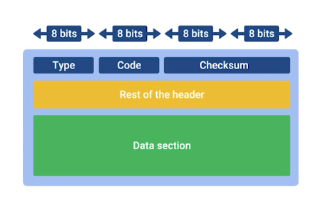

# 8 - Performance — Latency, Throughput, Congestion

[toc]

> **TL;DR:** Network performance is governed by three orthogonal metrics — latency, throughput, and packet loss — each with distinct causes and mitigations. Queueing theory (Little's Law, M/M/1 models) provides the mathematical foundation for predicting congestion behavior. The bandwidth-delay product determines TCP's fundamental efficiency ceiling; AIMD is the control law that multiple competing flows use to fairly share capacity without centralized coordination. Tail latency, not average latency, is what determines user-visible quality of service.

## Vocabulary

**End-to-end latency**: Total time for one packet to travel from sender to receiver. Sum of propagation, transmission, queueing, and processing delays.

---

**Throughput**: Effective data transfer rate from source to destination, measured over time. Bounded above by the bottleneck link's bandwidth.

---

**Goodput**: Throughput of useful payload data, excluding retransmitted bytes and protocol overhead. Goodput ≤ throughput ≤ bandwidth.

---

**Jitter**: Variation in packet inter-arrival delay. High jitter is problematic for real-time applications (VoIP, video): even if average latency is acceptable, jitter causes buffer starvation or overflow at the receiver.

---

**Little's Law**: A fundamental result in queueing theory: the average number of items in a system (L) equals the average arrival rate (λ) times the average time an item spends in the system (W).

```math
L = \lambda \cdot W
```

---

**M/M/1 queue**: The simplest queueing model: Markovian (Poisson) arrivals, Markovian service times, 1 server. Analytically tractable; a useful approximation for router output queues.

---

**Utilization (ρ)**: Ratio of arrival rate to service rate. A queue with ρ ≥ 1 is unstable — it grows without bound.

```math
\rho = \frac{\lambda}{\mu}
```

---

**Queueing delay (M/M/1)**: Expected time a packet spends waiting in the queue (not counting service).

```math
W_q = \frac{\rho}{\mu(1-\rho)}
```

---

**Bandwidth-delay product (BDP)**: The volume of data that can be "in flight" on a link simultaneously. The pipe's capacity.

```math
\text{BDP} = B \cdot \text{RTT}
```

---

**AIMD (Additive Increase Multiplicative Decrease)**: The TCP congestion control law. Each round-trip without loss: cwnd += α (additive increase, α ≈ 1 MSS). On loss: cwnd = cwnd × β (multiplicative decrease, β = 0.5 for Reno).

---

**Tail latency**: The latency at high percentiles — P99, P99.9. Real user experience is dominated by tail latency, not median. A service with P50=10 ms but P99=500 ms has a serious tail latency problem.

---

**Fan-out amplification**: In distributed systems, a request to a frontend triggers N requests to N backends. The response time is determined by the **max** over N backends, not the average — tail latency at the backend becomes average latency at the frontend.

---

**Fair queueing**: A packet scheduling algorithm that allocates link capacity fairly across flows, preventing any one flow from monopolizing bandwidth.

---

**Active Queue Management (AQM)**: Drop or mark packets proactively before the queue fills, based on queue length or delay measurements. Examples: RED (Random Early Detection), CoDel, FQ-CoDel.

---

## Intuition

A network is a pipe with two properties: width (bandwidth) and length (latency). Filling the pipe requires enough data in-flight to cover both. The BDP is the pipe's volume: bandwidth × RTT.

Queueing is the Internet's shock absorber. When more traffic arrives than a link can transmit, packets wait in a queue. A short queue absorbs bursts and adds little latency. A long queue (bufferbloat) adds enormous latency. The art of congestion control is keeping queues short while keeping the pipe full.

AIMD's sawtooth behavior is not a bug — it is the equilibrium where competing flows share capacity fairly. Each flow probes upward (additive increase), hits the bottleneck (loss), backs off (multiplicative decrease), and probes again. The long-term average throughput of a flow is determined by its loss rate and RTT.

## Delay Components at Scale

Every network path has four sources of delay, and their relative importance depends on the scenario.

| Delay type | Typical magnitude | Depends on | Reducible? |
| :--- | :--- | :--- | :--- |
| Propagation | 1–150 ms (cross-country) | Distance, medium | Only by moving closer (CDN, edge) |
| Transmission | 0.01–1 ms | Packet size / link rate | Yes — increase link rate |
| Queueing | 0–1000 ms | Load, buffer size | Yes — congestion control, AQM |
| Processing | 0.01–0.1 ms | Router silicon speed | Minimal at modern line rates |

The dominant variable in user-facing latency is usually queueing delay under load. Propagation delay sets the floor; queueing delay determines how far above the floor you sit in practice.

## Queueing Theory — M/M/1 Model

An M/M/1 queue is a reasonable first-order model for a router's output port: packets arrive as a Poisson process at rate λ (packets/sec), service time (transmission) is exponentially distributed with mean 1/μ.

### Stability Condition

The queue is stable only if ρ = λ/μ < 1. At ρ = 1, the queue grows to infinity. This is why a link at 100% utilization has infinite average delay in the M/M/1 model.

```math
\text{Stable if and only if: } \rho = \frac{\lambda}{\mu} < 1
```

### Key M/M/1 Results

Average number of packets in the **system** (queue + in service):

```math
L = \frac{\rho}{1 - \rho}
```

Average time in the **system** (from Little's Law: W = L/λ):

```math
W = \frac{1}{\mu - \lambda} = \frac{1}{\mu(1-\rho)}
```

Average time in the **queue** (waiting, not counting service):

```math
W_q = \frac{\rho}{\mu(1-\rho)}
```

The behavior near ρ = 1 is dramatic. At ρ = 0.5: W_q = 1/μ (equals one service time). At ρ = 0.9: W_q = 9/μ (nine service times). At ρ = 0.99: W_q = 99/μ. **Latency is hyperbolic in utilization.**

```
Queueing delay W_q (in units of 1/μ):
 100 |                                         .*
  90 |                                       .*
  80 |                                     .*
  70 |                                  .*
  60 |                               .*
  50 |                           .*
  40 |                      .*
  30 |                 .*
  20 |           .*
  10 |     .*
   0 +--.*--+--+--+--+--+--+--+--+--+--> ρ
     0  0.1 0.2 0.3 0.4 0.5 0.6 0.7 0.8 0.9 1.0
```

This is the central insight of queueing theory for networks: **you cannot run a link at 100% utilization and also have low latency**. Practical guidance: keep backbone links ≤ 70–80% utilization. Design network capacity to handle 2× peak traffic.

### Little's Law in Practice

Little's Law (L = λW) applies to any stable system, not just M/M/1. Practical uses:

- **Web server:** If arrival rate is 1,000 RPS and average response time is 50 ms, the average number of concurrent requests in the system is L = 1,000 × 0.05 = **50**. This is the minimum thread/goroutine count needed to achieve that throughput.
- **Database connection pool:** If 500 queries/sec arrive and each takes 10 ms, you need L = 500 × 0.01 = **5 concurrent connections** to keep up. Add safety margin for bursty arrivals.

## Bandwidth-Delay Product and TCP Efficiency

The BDP is the number of bytes that must be in-flight simultaneously to fully utilize a link. TCP's throughput is limited by:

```math
\text{Throughput} = \frac{\min(\text{cwnd}, \text{rwnd})}{\text{RTT}}
```

For TCP Reno under steady-state loss rate p (fraction of packets lost):

```math
\text{Throughput} \approx \frac{1.22 \cdot \text{MSS}}{\text{RTT} \cdot \sqrt{p}}
```

This is the **Mathis formula**. A connection with RTT = 100 ms, MSS = 1,460 bytes, and loss rate p = 0.001 (0.1%) achieves:

```math
\text{Throughput} \approx \frac{1.22 \times 1460}{0.1 \times \sqrt{0.001}} \approx \frac{1781}{0.00316} \approx 564 \text{ kbps}
```

Even moderate loss rates severely limit TCP throughput on high-latency paths. This is why wireless and satellite links, which have higher loss rates, benefit from protocols like BBR (which does not interpret loss as congestion) or QUIC (independent stream reliability).

## Tail Latency

Average latency is a misleading metric for user-facing services. What matters is the latency experienced by the slowest fraction of requests.

**Sources of tail latency:**
- Queueing spikes (a burst of arrivals fills the queue temporarily).
- Garbage collection pauses in JVM-based services.
- CPU scheduling jitter (OS preempting a service thread).
- TCP timeout retransmission (200 ms minimum RTO introduces sudden spikes).
- Lock contention, cache misses, page faults on the service path.

**Fan-out amplification:** A microservice that fans out to 100 backends has a P99 response time approximately equal to the P99.99 of a single backend (the maximum of 100 independent P99 samples). If each backend has P99 = 10 ms, the fan-out response time at P99 is approximately:

```math
P(\max(X_1, \ldots, X_{100}) > t) \approx 100 \cdot P(X > t)
```

So the fan-out P99 corresponds roughly to the single-backend P99.99.

> [!IMPORTANT]
> Hedged requests (send the same request to 2 backends, use whichever responds first) can dramatically reduce tail latency at the cost of double the load. Google's "The Tail at Scale" paper (Dean & Barroso, 2013) quantifies this: sending a tied second request after 95th-percentile timeout can reduce P99 latency by an order of magnitude. This technique is used in Google's distributed storage systems.

## Active Queue Management

Traditional drop-tail queues drop packets only when the buffer is full. This creates **bufferbloat**: excessive buffering causes RTT to balloon from milliseconds to seconds under load, paradoxically harming throughput (TCP thinks the path is fast and floods it, filling the buffer).

**CoDel (Controlled Delay)** targets a minimum sojourn time (5 ms by default). Packets that have waited longer than the target are marked or dropped. This keeps queues short, RTTs low, and throughput high.

**FQ-CoDel** (Fair Queue CoDel) combines fair queueing (each flow gets equal share) with CoDel's delay-based AQM. Default in Linux since 4.8 for Wi-Fi and home routers (as part of the `cake` qdisc). Solves bufferbloat without sacrificing throughput.

## Real-world Example

A Python simulation of AIMD congestion control showing the characteristic sawtooth, plus a tool to measure real TCP latency percentiles.

```python
import random
import statistics
from typing import List

def simulate_aimd(
    n_rounds: int = 100,
    initial_cwnd: float = 1.0,
    alpha: float = 1.0,        # additive increase per RTT (MSS)
    beta: float = 0.5,         # multiplicative decrease factor
    loss_prob: float = 0.05,   # per-RTT loss probability
    capacity: float = 32.0,    # link capacity in MSS
) -> List[float]:
    """Simulate TCP AIMD congestion control. Returns cwnd trace."""
    cwnd = initial_cwnd
    trace: List[float] = []
    for _ in range(n_rounds):
        # Transmit min(cwnd, capacity) — capacity represents the bottleneck
        effective = min(cwnd, capacity)
        trace.append(effective)
        # Loss event with probability loss_prob per RTT
        if random.random() < loss_prob:
            cwnd = cwnd * beta            # multiplicative decrease
        else:
            cwnd = cwnd + alpha           # additive increase
        cwnd = max(cwnd, 1.0)
    return trace

random.seed(42)
trace = simulate_aimd()
avg_throughput = statistics.mean(trace)
print(f"Average throughput: {avg_throughput:.1f} MSS/RTT")
print(f"Min: {min(trace):.1f}  Max: {max(trace):.1f}")
# The sawtooth pattern: throughput oscillates around capacity * (1 - loss_prob)

# Measuring tail latency with percentiles
import time
import socket

def measure_tcp_latencies(host: str, port: int, n: int = 100) -> dict:
    """Measure TCP connect latency over n trials, return percentiles."""
    latencies: List[float] = []
    for _ in range(n):
        t0 = time.perf_counter()
        try:
            with socket.create_connection((host, port), timeout=2):
                latencies.append((time.perf_counter() - t0) * 1000)
        except OSError:
            latencies.append(float("inf"))
    latencies.sort()
    def pct(p: float) -> float:
        return latencies[int(len(latencies) * p / 100)]
    return {
        "p50": pct(50),
        "p90": pct(90),
        "p95": pct(95),
        "p99": pct(99),
        "mean": statistics.mean(latencies),
    }

stats = measure_tcp_latencies("8.8.8.8", 443, n=50)
print(f"TCP latency percentiles (ms): {stats}")
```

> [!TIP]
> In production, use the `hdrhistogram` library (Python: `hdrh`) to record latency distributions with high precision at the tail. `hdrhistogram` uses a bucketed approach that efficiently records values from microseconds to minutes without memory growing with sample count. It is what Aeron, Chronicle, and LMAX use for latency profiling.

## In Practice

**Bufferbloat is real and widespread.** Most home routers use large drop-tail buffers to avoid drops under load. The result: during a large file download, interactive traffic (SSH, DNS, gaming) experiences 500–2000 ms latency because the download has filled every queue on the path. Solution: enforce `fq_codel` or `cake` at the router; configure traffic shaping to keep buffers small. The `dslreports.com/speedtest` bufferbloat test measures this.

**Percentile SLOs, not averages.** Cloud SLAs (AWS, GCP, Azure) are written in terms of P99 or P99.9 latency. A service that meets its P50 SLO but violates its P99 SLO is failing its users in production. Always instrument with histogram-based percentiles; mean latency is meaningless for tail-sensitive services.

> [!WARNING]
> The M/M/1 model assumes Poisson arrivals (memoryless inter-arrival times). Real network traffic is **bursty** and **self-similar** — not Poisson. TCP's bursty nature (sending a window's worth of packets in quick succession) creates correlated arrivals that M/M/1 underestimates. At high utilization, real queues behave worse than M/M/1 predicts. Use simulation (or measurement) rather than M/M/1 formulas for capacity planning at ρ > 0.8.

### Connectivity-debugging tools — ping, traceroute, MTR

When a path exhibits unexpected latency or loss, the first step is locating where in the path the problem occurs. Three tools cover most of the ground.

**ICMP and ping.** The Internet Control Message Protocol (ICMP) is a network-layer protocol used by routers and remote hosts to report delivery failures back to the origin. The ICMP header carries a Type field (8 bits) that identifies the message category — *Echo Request/Reply*, *Destination Unreachable*, *Time Exceeded* — and a Code field (8 bits) that refines it (e.g., "destination network unreachable" vs. "destination port unreachable"). The Data section of an ICMP error message contains the full IP header plus the first 8 bytes of the offending packet's payload, giving the sender enough context to identify which flow triggered the error.



`ping` exploits ICMP Echo Request / Echo Reply to measure round-trip time to a host. It tells you whether the destination is reachable and what the baseline RTT looks like, but it says nothing about which intermediate hop is the source of latency.

**Traceroute.** `traceroute` (Unix/macOS) and `tracert` (Windows) reveal the per-hop path by sending packets with incrementally increasing TTL values (starting at 1). Each router decrements TTL; when TTL hits 0 the router discards the packet and sends an ICMP Time Exceeded back to the sender. By recording the source address and RTT of each ICMP response, `traceroute` reconstructs the full path hop by hop.

> [!TIP]
> If a hop shows `* * *` (no response), the router is either blocking ICMP or rate-limiting it — this does not necessarily indicate packet loss on the data path. Check whether subsequent hops respond normally before concluding the path is broken.

**MTR and pathping.** `mtr` (Linux/macOS) and `pathping` (Windows) combine the path discovery of `traceroute` with continuous per-hop loss and latency statistics. Running `mtr --report --report-cycles 100 <host>` for 100 cycles gives statistically meaningful loss rates at each hop — far more useful than a single traceroute snapshot for diagnosing intermittent congestion.

**Testing port reachability.** RTT and path data do not confirm that a specific application port is reachable. Use `nc` (netcat) on macOS/Linux or `Test-NetConnection` on Windows to probe TCP connectivity to a specific port:

```bash
# macOS / Linux: test TCP port reachability
nc -zv 8.8.8.8 443

# Windows equivalent
Test-NetConnection -ComputerName 8.8.8.8 -Port 443
```

**MTU probing.** Path MTU mismatches cause silent packet drops when a host sends packets larger than an intermediate link's MTU and the packet has the DF (Don't Fragment) bit set. The router drops the packet and sends an ICMP "Fragmentation Needed" message, but many firewalls block ICMP, so the sender never learns the correct MTU. Use `ping` with a fixed packet size and DF set to probe the path MTU manually:

```bash
# macOS: send a 1472-byte payload (1500 - 20 IP - 8 ICMP = 1472) with DF
ping -D -s 1472 8.8.8.8
# If this fails, reduce size until it succeeds — that size + 28 is the path MTU
```

## Pitfalls

- **"High bandwidth implies low latency."** — Bandwidth and latency are independent. A 10 Gbps satellite link has 600 ms RTT. A 1 Mbps local Wi-Fi link has 1 ms RTT. Upgrading bandwidth does not reduce propagation latency.
- **"99% uptime SLO means 99% of requests succeed."** — An availability SLO (99% uptime = 87.6 hours downtime/year) is different from a latency SLO (P99 latency < 100 ms). A service can be "up" but answer 1% of requests in 10 seconds. Specify both availability and latency SLOs explicitly.
- **"Adding more buffer capacity reduces packet drops."** — Larger buffers reduce drops but increase queueing latency. Bufferbloat is the result of over-buffering. The correct fix is to add capacity (faster links) or implement AQM, not to add larger buffers.
- **"Throughput is maximized when cwnd = BDP."** — True only if there is no queuing delay. In practice, cwnd should be set to slightly less than BDP to keep the queue from filling. BBR specifically targets cwnd ≈ 2 × BDP to ensure both directions of the pipe are filled without building queue depth.

## Exercises

### Exercise 1 — Little's Law

A web server receives 500 requests per second. A performance profile shows the average time to handle one request is 80 ms. (a) What is the average number of requests in flight? (b) If the server is single-threaded, is this sustainable?

#### Solution

**(a)** By Little's Law: L = λ × W = 500 req/s × 0.080 s = **40 requests in flight** on average.

**(b)** A single-threaded server handles one request at a time. Its effective service rate μ = 1/0.080 = 12.5 req/s. With λ = 500 req/s >> μ = 12.5 req/s, utilization ρ = 500/12.5 = **40**. This is vastly greater than 1 — the queue is unstable and the system collapses. The server needs at least ⌈λ/μ⌉ = ⌈500/12.5⌉ = **40 concurrent threads/goroutines** to handle the load at 100% utilization. Realistically, add 50–100% headroom: 60–80 threads for a comfortable operating point at ρ ≈ 0.5–0.67.

---

### Exercise 2 — M/M/1 queueing delay

A router output port has link rate 100 Mbps. Average packet size is 1,000 bytes (8,000 bits). Traffic arrives at 80 Mbps. Calculate: (a) utilization ρ, (b) average queueing delay W_q, (c) average total delay W.

#### Solution

Service rate μ: a 100 Mbps link serves 100×10⁶ / 8000 = **12,500 packets/sec**.
Arrival rate λ: 80×10⁶ / 8000 = **10,000 packets/sec**.

**(a) ρ** = λ/μ = 10,000 / 12,500 = **0.8**.

**(b) W_q** = ρ / (μ(1−ρ)) = 0.8 / (12,500 × 0.2) = 0.8 / 2,500 = **0.00032 s = 0.32 ms**.

**(c) W** (total time in system = W_q + service time 1/μ) = 0.32 ms + 1/12,500 × 1000 = 0.32 ms + 0.08 ms = **0.40 ms**.

Sanity check with W = 1/(μ−λ) = 1/(12,500−10,000) = 1/2,500 = 0.0004 s = **0.40 ms** ✓.

Now suppose traffic increases to 95 Mbps (ρ = 0.95): W = 1/(μ−λ) = 1/(12,500 − 11,875) = 1/625 = 1.6 ms — four times higher for a 19% traffic increase. This nonlinear degradation is why you must operate well below 100% utilization.

---

### Exercise 3 — TCP throughput under loss

A TCP Reno connection has RTT = 50 ms and MSS = 1,460 bytes. The link has 0.01% packet loss rate (p = 0.0001). Estimate the maximum throughput using the Mathis formula.

#### Solution

The Mathis formula for TCP Reno steady-state throughput:

```math
\text{Throughput} = \frac{1.22 \cdot \text{MSS}}{\text{RTT} \cdot \sqrt{p}}
```

Substituting values:
- MSS = 1,460 bytes = 11,680 bits
- RTT = 0.050 s
- p = 0.0001, so √p = 0.01

```math
\text{Throughput} = \frac{1.22 \times 11{,}680 \text{ bits}}{0.050 \text{ s} \times 0.01} = \frac{14{,}250}{0.0005} = 28{,}500{,}000 \text{ bps} \approx 28.5 \text{ Mbps}
```

This is a 50 ms RTT path with only 0.01% loss — and TCP can only achieve 28.5 Mbps. If you have a 1 Gbps link but 0.01% loss rate, TCP Reno will throttle to 28.5 Mbps regardless. This is the fundamental argument for loss-tolerant protocols (BBR, QUIC) on lossy paths (wireless, long-haul satellite).

---

### Exercise 4 — Tail latency and fan-out

A microservice fans out each request to 10 backend shards. Each shard has P99 latency of 10 ms (Gaussian-like distribution). Estimate the expected P99 latency of the fan-out response. What about 100 shards?

#### Solution

The fan-out response time is the maximum over N independent shard responses. If each shard's P99 is 10 ms, that means P(X > 10 ms) = 0.01 for each shard.

For N shards, the probability that at least one exceeds 10 ms:

```math
P(\max > 10\text{ ms}) = 1 - P(\text{all} \leq 10\text{ ms}) = 1 - (1 - 0.01)^N
```

For **N = 10 shards**: P(max > 10 ms) = 1 − 0.99^10 ≈ 1 − 0.904 ≈ **9.6%**. So the fan-out P90 is around 10 ms (the single-shard P99 becomes the 10-shard P90).

For **N = 100 shards**: P(max > 10 ms) = 1 − 0.99^100 ≈ 1 − 0.366 ≈ **63.4%**. The single-shard P99 is now the median (P50) of the 100-shard fan-out. You need to look at the single-shard P99.9 to understand the 100-shard P90.

The engineering implication: for a system with 100 shards and a P99 SLO of 50 ms, each shard must have P99.99 latency under 50 ms. Building fast tails is more important than building a fast median. Techniques: timeouts + retries, hedged requests, speculative execution, and minimizing GC pauses.

## Sources

- Dean, J. & Barroso, L. (2013). "The Tail at Scale." *Communications of the ACM* 56(2). https://research.google/pubs/pub40801/
- Nichols, K. & Jacobson, V. (2012). "Controlling Queue Delay." *ACM Queue*. https://dl.acm.org/doi/10.1145/2208917.2209336
- Mathis, M. et al. (1997). "The macroscopic behavior of the TCP congestion avoidance algorithm." *SIGCOMM CCR* 27(3).
- Kleinrock, L. (1975). *Queueing Systems, Volume 1: Theory*. Wiley.
- Kurose, J. F. & Ross, K. W. (2022). *Computer Networking: A Top-Down Approach* (8th ed.). Chapter 7. Pearson.
- Material in this note draws on open-source course notes at [karthick28/computer-networking-notes](https://github.com/karthick28/computer-networking-notes) (Coursera "Bits and Bytes of Computer Networking").

## Related

- [1 - What is Computer Networking](./1-what-is-networking.md)
- [5 - The Transport Layer — TCP and UDP](./5-tcp-and-udp.md)
- [7 - Routing Protocols and the Internet](./7-routing-protocols.md)
- [9 - Network Security](./9-network-security.md)
- [12 - Cloud and Datacenter Networking](./12-cloud-and-datacenter.md)
