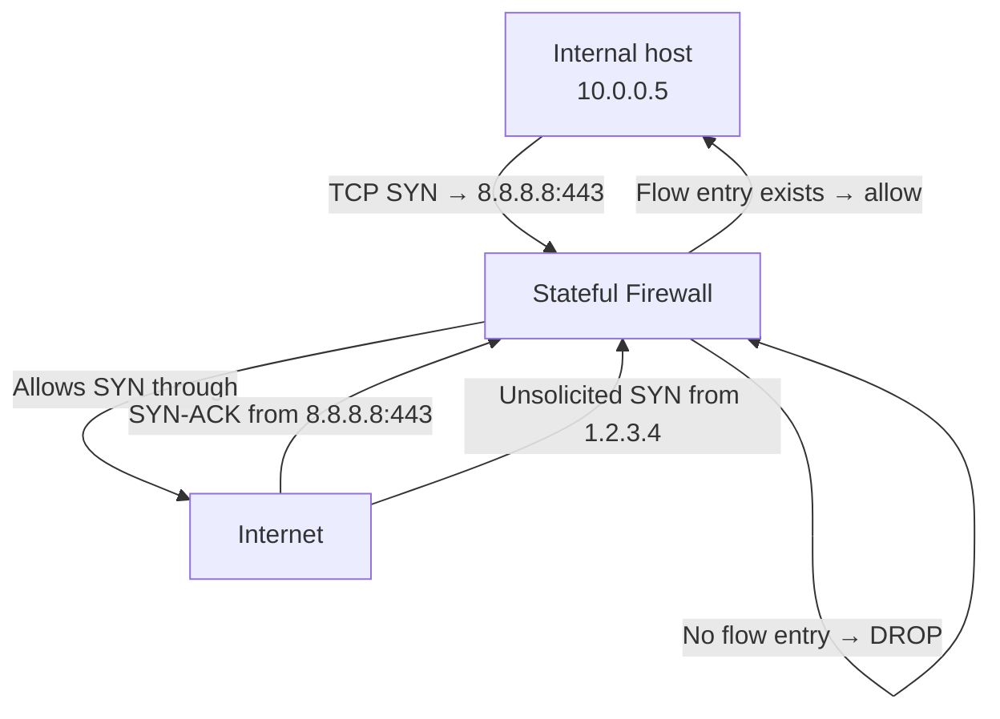
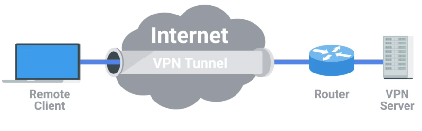
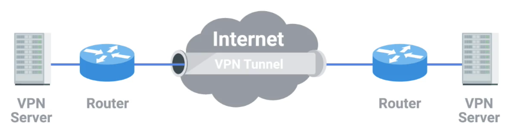
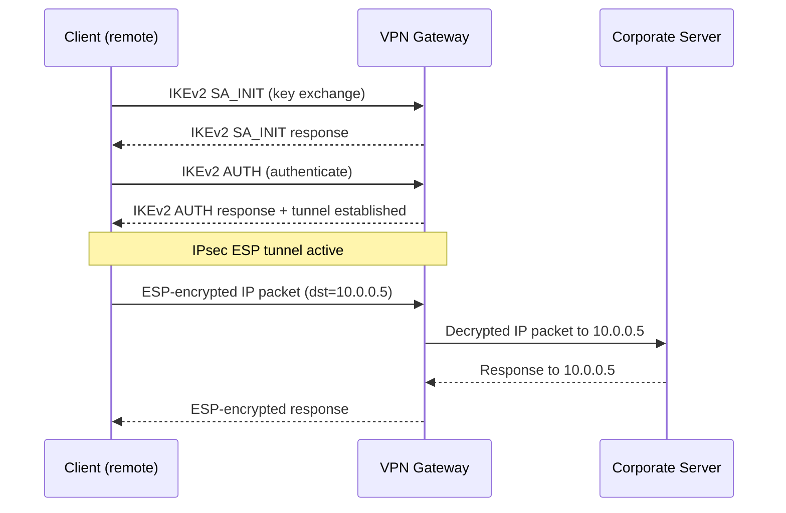
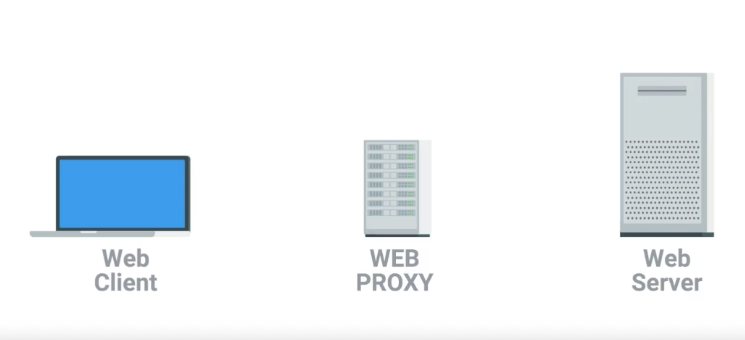
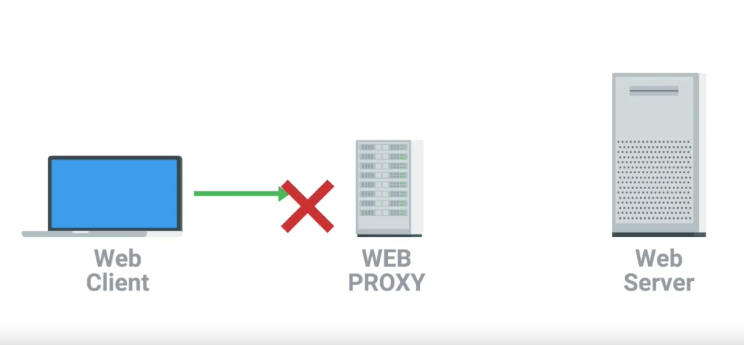
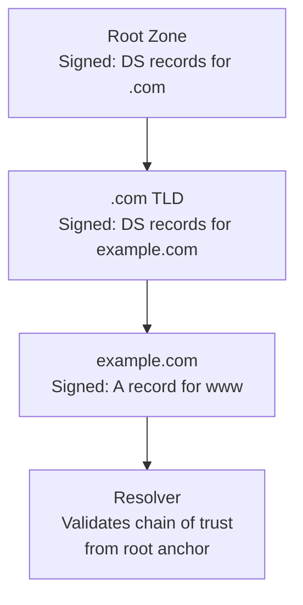

# 9 - Network Security

[toc]

> **TL;DR:** Network security is the discipline of protecting the confidentiality, integrity, and availability of network communications and infrastructure. The threat model spans passive eavesdropping, active man-in-the-middle attacks, denial of service, and application-layer exploitation. Defense-in-depth layered security — TLS for encryption, firewalls for perimeter control, DNSSEC for DNS integrity, IPsec for network-layer VPNs, and zero-trust architecture for lateral movement containment — is the modern approach.

## Vocabulary

**CIA triad**: The three goals of information security: Confidentiality (data is accessible only to authorized parties), Integrity (data is not tampered with), Availability (the service is accessible when needed).

---

**Threat model**: A structured description of what adversaries you are defending against, their capabilities, and their goals. Good security design starts from the threat model.

---

**MITM (Man-in-the-Middle)**: An attack where the adversary intercepts communication between two parties, reading and/or modifying messages without detection. ARP spoofing and BGP hijacking are MITM attacks at different layers.

---

**DDoS (Distributed Denial of Service)**: A coordinated attack using thousands of compromised hosts (a botnet) to overwhelm a target with traffic, exhausting its bandwidth, CPU, or memory.

---

**Firewall**: A network device that filters traffic based on rules. Stateless firewalls match packet headers independently; stateful firewalls track connection state and allow replies to established connections.

---

**Stateful inspection**: A firewall capability that tracks the state of each TCP/UDP flow. Allows return traffic for established connections without explicit rules; blocks unsolicited inbound packets.

---

**VPN (Virtual Private Network)**: An encrypted tunnel that extends a private network over a public network. Provides confidentiality and integrity for traffic crossing untrusted links.

---

**IPsec**: A suite of protocols for securing IP traffic at Layer 3. Provides AH (Authentication Header, integrity only) and ESP (Encapsulating Security Payload, encryption + integrity). RFC 4301.

---

**DNSSEC**: DNS Security Extensions. Adds cryptographic signatures to DNS records so resolvers can verify record authenticity. Prevents DNS cache poisoning. RFC 4033.

---

**PKI (Public Key Infrastructure)**: The system of CAs, certificates, and validation procedures that enables TLS certificate verification. Roots of trust are the pre-installed CA certificates in browsers and OS trust stores.

---

**Zero trust networking**: A security model that abandons the perimeter assumption. Every request is authenticated and authorized regardless of source network. "Never trust, always verify."

---

**ACL (Access Control List)**: An ordered list of permit/deny rules applied to network traffic. Used on router interfaces, firewall policies, and cloud security groups.

---

**BGP RPKI (Resource Public Key Infrastructure)**: Cryptographic authorization of which ASes may originate which IP prefixes. Defends against BGP prefix hijacking. See [7 - Routing Protocols](./7-routing-protocols.md).

---

**mTLS (Mutual TLS)**: TLS where both the client and server present certificates. Provides bidirectional authentication. Standard in service mesh (Istio, Linkerd) and zero-trust environments.

---

## Intuition

Network security is an arms race between defenders who must protect all surfaces and attackers who only need one opening. The key insight of defense-in-depth: assume each layer will eventually be breached and build so that a breach in one layer does not give full access. TLS prevents eavesdropping but does not stop DDoS. A firewall stops unsolicited connections but does not prevent an authenticated user from exfiltrating data. Zero trust prevents lateral movement but requires every service to implement auth correctly.

The fundamental asymmetry of DDoS: a botnet of 100,000 hosts each sending 1 Mbps generates 100 Gbps of attack traffic. Defending requires either scrubbing infrastructure at the same scale (Cloudflare, Akamai) or pushing the defense upstream to the network provider.

## Firewalls

### Stateless vs. Stateful

A stateless firewall applies rules to each packet independently. Rule: `allow TCP dstport=443`. This passes any packet with TCP dstport=443, including unsolicited SYNs from external hosts and out-of-sequence packets. Simple and fast (hardware TCAM), but inflexible.

A stateful firewall tracks connection state in a flow table. When an internal host initiates a TCP connection, the firewall creates a flow entry. Return traffic matching that flow is automatically allowed. Unsolicited inbound TCP SYNs are dropped (no flow entry). This implements the "default deny inbound" model without requiring explicit return rules.



### Next-Generation Firewall (NGFW)

NGFWs add Layer 7 inspection (application identification, URL filtering, SSL/TLS inspection) to traditional stateful firewalling. They can identify and block application traffic (Zoom, BitTorrent, specific SaaS applications) regardless of port number.

> [!WARNING]
> TLS inspection (SSL decryption) at a firewall MITM-s every HTTPS connection. The firewall terminates the TLS session from the client, inspects the plaintext, re-encrypts, and forwards to the server. This breaks end-to-end security guarantees — the firewall sees all traffic, including credentials, healthcare data, and financial information. Certificate pinning and HPKP explicitly prevent this. Ensure your organization has a documented legal basis and user consent before deploying TLS inspection.

## VPNs and IPsec

A VPN creates an encrypted tunnel over a public network, extending a private or local network to hosts that are not physically on that network. The remote client is assigned a virtual interface with an IP address in the corporate address space — from the perspective of every internal service, the client appears local. Most VPN implementations carry their encrypted payload inside the transport layer (UDP port 1194 for OpenVPN, UDP port 51820 for WireGuard), allowing traversal through NAT and most firewalls.




IPsec is the Layer 3 VPN standard.

**IPsec modes:**
- **Transport mode:** Encrypts the IP payload (TCP/UDP segment) but not the IP header. Used for host-to-host.
- **Tunnel mode:** Encrypts the entire original IP packet and encapsulates it in a new IP header. Used for gateway-to-gateway and client VPN (SSL VPN).

**IKE (Internet Key Exchange):** The protocol used to establish IPsec security associations (SAs) — negotiating algorithms and exchanging keys. IKEv2 (RFC 7296) is the current standard. WireGuard is a modern alternative that replaces IPsec + IKE with a simpler kernel-space implementation using Noise protocol handshake.



> [!NOTE]
> WireGuard (Linux kernel 5.6+, RFC-like but not standardized) is increasingly replacing IPsec for site-to-site VPNs and client VPNs. It is 4,000 lines of code vs IPsec's ~400,000, uses only modern cryptography (ChaCha20-Poly1305, Curve25519 ECDH), and has performance comparable to raw IPsec. Tailscale and Mullvad VPN are both built on WireGuard.

### Forward and reverse proxies

A proxy server acts on behalf of a client to access another service. Proxies decouple the client from the origin, enabling caching, filtering, access control, and traffic inspection — similar in concept to a gateway, but operating at the application layer.

**Forward proxy** — sits between internal clients and the internet. The client directs its requests to the proxy; the proxy forwards them on behalf of the client. Typical uses:

- **Caching:** The proxy retrieves web content from the origin server and caches it locally. Subsequent requests for the same resource are served from cache, reducing latency and bandwidth.
- **Content filtering:** The proxy inspects requests and can block categories of content (malware domains, social media, bandwidth-heavy video) before they reach the client.




**Reverse proxy** — sits in front of one or more backend servers and appears to external clients as a single server. Clients connect to the reverse proxy; it routes requests to the appropriate backend. Typical uses: TLS termination, load balancing, rate limiting, and shielding backend topology from external clients. Nginx, HAProxy, and Cloudflare's edge network all function as reverse proxies.

> [!TIP]
> The key distinction is perspective: a forward proxy hides the client from the server (the server sees the proxy's IP, not the client's); a reverse proxy hides the server from the client (the client sees the proxy's IP, not the backend's). Both can cache, but their trust relationships are opposite.

## DDoS Attacks and Mitigation

DDoS attacks target one of three resources: **bandwidth** (volumetric, filling the pipe), **CPU/state** (protocol exploitation, SYN floods), or **application** (HTTP floods targeting expensive endpoints).

### SYN Flood

A SYN flood exploits TCP's three-way handshake. The attacker sends millions of SYNs with spoofed source IPs. The server allocates state (half-open connection) for each SYN and waits for the final ACK, which never comes. The half-open connection table fills up, and legitimate connections are rejected.

**Defense: SYN cookies.** Instead of allocating state on SYN receipt, the server encodes the connection state into the SYN-ACK's sequence number (a cryptographic hash of src/dst IP, port, and a timestamp). Only when the ACK arrives with the correct sequence number does the server allocate state. Linux enables SYN cookies when the backlog is full (`tcp_syncookies = 1`).

### Amplification Attacks

DNS amplification: the attacker sends a spoofed DNS query (small request) to an open resolver, which sends a large DNS response to the victim's IP. Amplification factor: a 40-byte UDP query elicits a 3,000-byte DNSSEC response (75× amplification). Combined with thousands of resolvers, this generates terabits of attack traffic at minimal attacker cost.

```math
\text{Amplification factor} = \frac{\text{response size}}{\text{request size}}
```

Defenses: ingress filtering (BCP 38, RFC 2827) prevents IP spoofing at ISPs. Rate limiting at open resolvers. Anycast scrubbing (Cloudflare, Akamai) absorbs attack traffic at globally distributed scrubbing centers.

## DNSSEC

DNSSEC adds digital signatures to DNS records. Each zone signs its records with its private key; resolvers with the zone's public key can verify authenticity.



DNSSEC prevents **cache poisoning** attacks (Kaminsky attack): an attacker flooding a resolver with forged responses cannot succeed because the responses lack valid signatures. DNSSEC does NOT encrypt DNS queries — it only authenticates responses. DNS-over-HTTPS (DoH) and DNS-over-TLS (DoT) provide confidentiality.

> [!CAUTION]
> DNSSEC deployment requires every zone in the chain to be signed. If a TLD or intermediate zone does not sign its records, validation fails for all domains under it. Misconfigured DNSSEC (expired signatures, key rollover failures) causes complete DNS resolution failure for a domain — worse than no DNSSEC. Test DNSSEC configurations carefully before enabling DNSSEC validation in production resolvers.

## Zero Trust Networking

Zero trust abandons the "trusted internal network" model. Every request — whether from inside the corporate network or from a remote laptop — is authenticated, authorized, and encrypted. No implicit trust based on source IP.

**Zero trust principles:**
1. Verify explicitly — authenticate every user, every device, every service.
2. Use least-privilege access — grant only the permissions required for the specific task.
3. Assume breach — segment networks so a compromised host cannot reach everything.

**Implementation:** mTLS between all services (service mesh: Istio, Linkerd). Device certificates for endpoint authentication (Google BeyondCorp, Cloudflare Access). Microsegmentation: fine-grained network policies that allow only specific service-to-service flows. Identity-aware proxy instead of VPN.

## Real-world Example

Configuring `iptables` (Linux stateful firewall) to implement a basic stateful firewall policy, then testing a simple port scan to verify the rules:

```bash
#!/bin/bash
# Basic stateful iptables firewall setup
# Allows established connections, SSH, HTTPS, and ICMP; drops everything else inbound

# Flush existing rules
iptables -F INPUT
iptables -F FORWARD
iptables -F OUTPUT

# Default policies: accept outbound, drop inbound, drop forward
iptables -P INPUT DROP
iptables -P FORWARD DROP
iptables -P OUTPUT ACCEPT

# Allow established and related connections (stateful — return traffic)
iptables -A INPUT -m conntrack --ctstate ESTABLISHED,RELATED -j ACCEPT

# Allow loopback
iptables -A INPUT -i lo -j ACCEPT

# Allow ICMP ping (needed for PMTU discovery — see note 3)
iptables -A INPUT -p icmp --icmp-type echo-request -j ACCEPT
# CRITICAL: allow ICMP type 3 (fragmentation needed) for PMTU
iptables -A INPUT -p icmp --icmp-type destination-unreachable -j ACCEPT

# Allow SSH from anywhere (in production, restrict to known IPs)
iptables -A INPUT -p tcp --dport 22 -m conntrack --ctstate NEW -j ACCEPT

# Allow HTTPS
iptables -A INPUT -p tcp --dport 443 -m conntrack --ctstate NEW -j ACCEPT

# Log dropped packets for audit
iptables -A INPUT -j LOG --log-prefix "iptables DROP: " --log-level 4

# Show the resulting rules
iptables -L INPUT -v --line-numbers
```

Python script to test that the firewall correctly blocks port scanning:

```python
import socket
import concurrent.futures
from typing import List

def scan_port(host: str, port: int, timeout: float = 0.5) -> tuple[int, bool]:
    """Return (port, is_open) for a given host:port."""
    try:
        with socket.create_connection((host, port), timeout=timeout):
            return port, True
    except (OSError, TimeoutError):
        return port, False

def port_scan(host: str, ports: List[int]) -> dict[int, bool]:
    """Scan a list of ports concurrently."""
    with concurrent.futures.ThreadPoolExecutor(max_workers=50) as executor:
        results = list(executor.map(lambda p: scan_port(host, p), ports))
    return {port: is_open for port, is_open in results}

# Scan common ports on localhost (after applying the firewall above)
# Expect: 22=open, 443=open (if running), everything else filtered
common_ports = [22, 80, 443, 8080, 3306, 5432, 6379, 27017]
results = port_scan("127.0.0.1", common_ports)
for port, is_open in sorted(results.items()):
    status = "OPEN" if is_open else "filtered"
    print(f"  Port {port:5d}: {status}")
```

> [!TIP]
> Use `nmap -sV -sC -p 1-65535 target` for comprehensive port scanning in security audits. Use `ss -tlnp` on the target to see which processes are listening on which ports (requires local access). The difference between a port appearing "filtered" (no response — dropped by firewall) vs "closed" (RST returned — no service listening) is important: filtered means a firewall is present; closed means the port is reachable but nothing is listening.

## In Practice

**Certificate expiry is a persistent production incident cause.** Let's Encrypt certificates expire every 90 days. Even with automated renewal (certbot, cert-manager), renewal failures go unnoticed until users see browser errors. Monitoring: check `openssl s_client -connect host:443 2>/dev/null | openssl x509 -noout -dates` daily; alert 30 days before expiry.

**mTLS operational complexity is real.** Every service in a mesh needs a certificate; certificate rotation must happen transparently without downtime; certificate validation errors produce cryptic connection failures. Managed service meshes (Istio + cert-manager, Linkerd's automatic mTLS) handle this, but misconfigurations (wrong SAN, expired CA, clock skew >60s) are common causes of production outages in zero-trust environments.

> [!CAUTION]
> Weak TLS configurations are a critical risk. TLS 1.0 and 1.1 are deprecated (RFC 8996). Cipher suites using RC4, 3DES, export ciphers, or static RSA key exchange are broken. Run `nmap --script ssl-enum-ciphers -p 443 host` or use SSL Labs (ssllabs.com/ssltest/) to audit your TLS configuration. A server accepting TLS 1.0 or RC4 is vulnerable to BEAST, POODLE, and CRIME attacks.

## Pitfalls

- **"A firewall provides security."** — A firewall is one component of a defense-in-depth strategy. It filters at the network boundary; it cannot prevent attacks on services running behind it (SQLi, XSS, authenticated API abuse). "Perimeter security" as the only defense is a broken model since 2010.
- **"VPNs provide anonymity."** — A VPN shifts trust from your ISP to the VPN provider. The VPN provider sees your traffic. "No-log" VPNs are unverifiable claims. For anonymity, Tor is more appropriate (but has significant latency and throughput costs). VPNs provide a trusted encrypted link; they do not provide anonymity.
- **"DNSSEC is optional."** — DNSSEC-signed domains are only protected if the resolver validates signatures. Most public resolvers (8.8.8.8, 1.1.1.1) validate DNSSEC by default. An organization running its own resolver that does not validate DNSSEC provides no protection against cache poisoning attacks even for signed domains.
- **"IPsec and SSL VPN are equivalent."** — IPsec operates at Layer 3, tunneling raw IP packets. SSL/TLS VPNs (OpenVPN, WireGuard over TLS) operate at Layer 4–7, typically routing only specific traffic. IPsec is more complex to configure; SSL VPNs are easier to deploy through NAT. Choose based on your topology.

## Exercises

### Exercise 1 — SYN flood mechanics

Explain why a SYN flood depletes server resources. Describe the SYN cookie defense and why it works. What is the drawback of SYN cookies?

#### Solution

**Why SYN floods deplete resources:** When a server receives a TCP SYN, it allocates a **Transmission Control Block (TCB)** — a kernel data structure (~280 bytes on Linux) representing the half-open connection. It then sends a SYN-ACK and waits for the final ACK (state: SYN_RECEIVED). The Linux SYN backlog (controlled by `net.ipv4.tcp_max_syn_backlog`) is typically 512–8,192 entries. An attacker sending millions of SYNs per second from spoofed IPs fills this table instantly. Legitimate SYN packets are then rejected with `ECONNREFUSED` or silently dropped.

**SYN cookies defense:** Instead of allocating a TCB on SYN receipt, the server encodes the connection parameters into the initial sequence number (ISN) of the SYN-ACK:

```
ISN = HMAC(key, src_ip, src_port, dst_ip, dst_port, timestamp) mod 2^32
```

No state is stored. When the ACK arrives, the server re-derives the expected ISN from the ACK number and connection tuple. If it matches, the connection is legitimate and the server creates the TCB then. Forged SYNs never produce a valid ACK with the correct ISN (HMAC prevents forgery), so they consume zero server state.

**Drawback:** TCP options negotiated in the SYN (window scaling, SACK, timestamps) are not preserved in the SYN cookie — there is no state to store them in. When SYN cookies are active, connections fall back to TCP-without-options (MSS = 536 bytes, no SACK, no window scaling), reducing throughput. This degradation only affects connections established during the attack.

---

### Exercise 2 — Firewall rule ordering

A stateful firewall has these rules (evaluated top-to-bottom, first match wins):
1. ALLOW TCP established,related
2. ALLOW TCP src=10.0.0.0/8 dstport=22
3. ALLOW TCP dstport=443
4. DROP all

Trace what happens for: (a) a TCP SYN from 8.8.8.8 to port 443, (b) a return packet for an established HTTP session, (c) a TCP SYN from 10.0.0.5 to port 22, (d) a UDP packet to port 53.

#### Solution

**(a) TCP SYN from 8.8.8.8 to port 443:**
Rule 1: Not established/related (this is a new SYN). No match.
Rule 2: src=8.8.8.8, not in 10.0.0.0/8. No match.
Rule 3: dstport=443 → **MATCH → ALLOW**. The SYN passes; firewall creates a flow entry for this connection.

**(b) Return packet for established HTTP session:**
Rule 1: The flow exists in the connection table; state is ESTABLISHED → **MATCH → ALLOW**. Allowed without checking further rules.

**(c) TCP SYN from 10.0.0.5 to port 22:**
Rule 1: Not established. No match.
Rule 2: src=10.0.0.5 ∈ 10.0.0.0/8, dstport=22 → **MATCH → ALLOW**.

**(d) UDP packet to port 53:**
Rule 1: No established UDP flow (this assumes no prior DNS from this src). No match. Note: stateful firewalls do track UDP "connections" by (src IP, src port, dst IP, dst port) — but if there is no prior outbound DNS query, there is no flow entry.
Rule 2: dstport is 53, not 22. No match.
Rule 3: dstport=443, not 53. No match.
Rule 4: **DROP**. The DNS query is dropped. If the DNS query originated from an internal client going outbound, the response would match Rule 1. The scenario here implies an **inbound** UDP to port 53 (someone probing your DNS server) — correctly dropped.

---

### Exercise 3 — Zero trust design

Design a zero-trust network for a three-tier web application: load balancer → application servers → database. What authentication mechanism is used between each tier? What happens if the application server is compromised?

#### Solution

**Architecture:**

```
Internet → TLS terminating LB → App Servers → PostgreSQL DB
```

**Between Internet and Load Balancer:**
Standard TLS 1.3 with a publicly trusted certificate. The load balancer terminates TLS — only encrypted connections from the internet are accepted. Rate limiting and WAF (Web Application Firewall) rules filter malicious requests.

**Between Load Balancer and App Servers (mTLS):**
The load balancer and each app server possess certificates issued by an internal CA (e.g., cert-manager issuing from an internal CFSSL root). Every request from the LB to an app server uses mTLS: the app server verifies the LB's certificate (proves the request came from a legitimate LB, not a rogue internal machine) and the LB verifies the app server's certificate (proves it is talking to a legitimate app server, not an attacker on the internal network). Even within the internal network, no implicit trust.

**Between App Servers and Database (mTLS + AuthN):**
App servers connect to PostgreSQL using a client certificate (PostgreSQL supports SSL client certificates). The DB only accepts connections from certificates issued by the internal CA with a specific organizational unit (OU=appserver). Additionally, the PostgreSQL role grants only necessary permissions (SELECT/INSERT/UPDATE on specific tables; no DDL, no system catalog access).

**What happens if an app server is compromised:**
Without zero trust: a compromised app server has full access to the DB (same internal network = trusted), can reach all other app servers, can probe the LB's admin interface. Lateral movement is unconstrained.

With zero trust: the compromised app server has a certificate that the DB validates — but the cert only grants access to the specific DB role. The attacker cannot: query other databases, reach the LB admin interface (no cert for that service), or reach other internal services (microsegmentation blocks cross-service connections not explicitly allowed). The blast radius is limited to the app server's specific permissions.

## Sources

- RFC 4301 — Security Architecture for the Internet Protocol (IPsec). https://www.rfc-editor.org/rfc/rfc4301
- RFC 4033 — DNS Security Introduction (DNSSEC). https://www.rfc-editor.org/rfc/rfc4033
- RFC 2827 — Network Ingress Filtering (BCP 38). https://www.rfc-editor.org/rfc/rfc2827
- RFC 8446 — TLS 1.3. https://www.rfc-editor.org/rfc/rfc8446
- RFC 7296 — IKEv2. https://www.rfc-editor.org/rfc/rfc7296
- NIST SP 800-207 — Zero Trust Architecture. https://csrc.nist.gov/publications/detail/sp/800-207/final
- Donenfeld, J. A. (2017). "WireGuard: Next Generation Kernel Network Tunnel." *NDSS 2017*. https://www.wireguard.com/papers/wireguard.pdf
- Material on VPN tunneling and proxy types draws on [karthick28/computer-networking-notes](https://github.com/karthick28/computer-networking-notes), course notes from Google's *The Bits and Bytes of Computer Networking* (Coursera).

## Related

- [2 - OSI and TCP/IP Models](./2-osi-and-tcp-ip.md)
- [3 - Physical and Link Layer](./3-physical-and-link-layer.md)
- [5 - The Transport Layer — TCP and UDP](./5-tcp-and-udp.md)
- [6 - Application Layer — HTTP, DNS, TLS](./6-application-layer.md)
- [10 - Modern Networking — SDN, gRPC, Service Mesh](./10-modern-networking.md)
