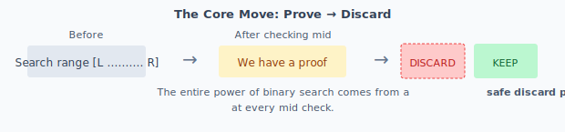
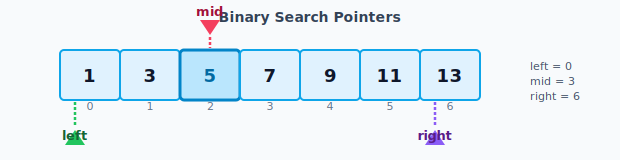
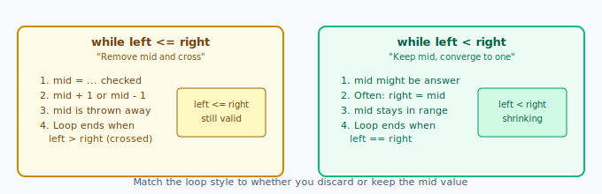
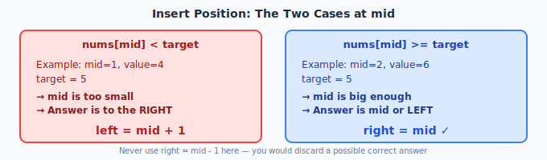
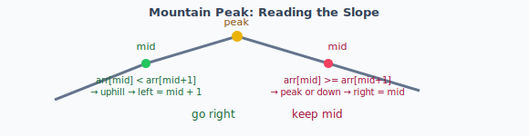
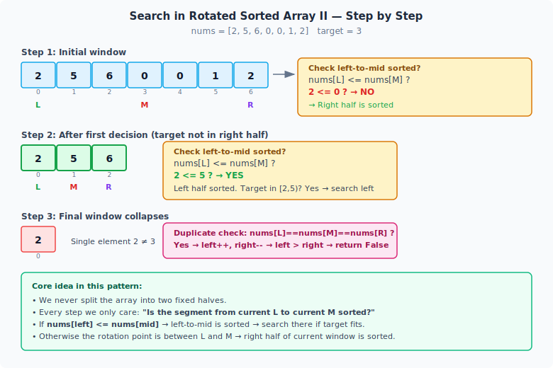

# Binary Search

[toc]

Binary search finds answers in sorted data by repeatedly cutting the search space in half.

The key is not the midpoint math. It is knowing what you can safely **prove** from the check at mid, then discarding the impossible half.



> [!TIP]
> Every binary search pattern comes down to one question: "What does the value at mid tell me I can throw away?"

## The Basics

Binary search only works when the data is **sorted** and each check at the middle lets you eliminate half the remaining possibilities.

### Simple Example

Search for target = 5 in `[1, 3, 5, 7, 9, 11, 13]`.

```
indexes: 0  1  2  3  4  5  6
values:  [1, 3, 5, 7, 9, 11, 13]
```

Start with the full range:

- `left = 0`
- `right = 6`

**Step 1**  
`mid = 3`, value = 7  
7 > 5 → answer is on the left → `right = 2`

**Step 2**  
`mid = 1`, value = 3  
3 < 5 → answer is on the right → `left = 2`

**Step 3**  
`mid = 2`, value = 5 → found.



The three pointers are:

- `left` — start of the current search range
- `right` — end of the current search range
- `mid` — the position we inspect

### Basic Template (Exact Search)

```python
def binary_search(nums, target):
    left = 0
    right = len(nums) - 1

    while left <= right:
        mid = left + (right - left) // 2

        if nums[mid] == target:
            return mid
        elif nums[mid] < target:
            left = mid + 1
        else:
            right = mid - 1

    return -1
```

This version completely removes `mid` after checking it. It uses `while left <= right`.

## Loop Conditions: The Most Important Decision

After checking mid, you have two choices:

- Discard `mid` completely → use `while left <= right`
- Keep `mid` as a possible answer → use `while left < right`



**Rule of thumb**

| What you do after checking mid          | Loop to use            |
|-----------------------------------------|------------------------|
| `left = mid + 1` and `right = mid - 1`  | `while left <= right`  |
| `right = mid` (keep the candidate)      | `while left < right`   |

The rest of binary search is just different ways to decide "do I keep mid or discard it?"

## Core Patterns

This table shows the most common situations. Learn the check at mid and the move that follows.

| Situation                  | Key check at mid             | What this proves                              | Move                  | Why |
|----------------------------|------------------------------|-----------------------------------------------|-----------------------|-----|
| Exact match                | `nums[mid] == target`        | Found it                                      | return `mid`          | Done |
| Insert position (lower bound) | `nums[mid] < target`      | mid and everything before it is too small     | `left = mid + 1`      | Answer is after mid |
| Insert position            | `nums[mid] >= target`        | mid is big enough, answer is mid or earlier   | `right = mid`         | Keep mid as candidate |
| Largest valid (e.g. sqrt)  | `mid * mid <= x`             | mid works, but a bigger one might exist       | `ans = mid`, `left = mid + 1` | Try right for better |
| Largest valid              | `mid * mid > x`              | mid is too big                                | `right = mid - 1`     | Discard mid and right |
| Mountain peak (uphill)     | `arr[mid] < arr[mid + 1]`    | Still climbing, peak is right                 | `left = mid + 1`      | Peak cannot be here |
| Mountain peak (at or past) | `arr[mid] >= arr[mid + 1]`   | At peak or past it                            | `right = mid`         | Peak is here or left |
| Rotated minimum            | `nums[mid] > nums[right]`    | Minimum is on the right side                  | `left = mid + 1`      | Minimum not here |
| Rotated minimum            | `nums[mid] <= nums[right]`   | mid could be the minimum                      | `right = mid`         | Keep mid |
| Search in rotated w/ dups  | left-sorted check + dup shrink | target fits in sorted half (or shrink both)  | left/right update     | dups can force O(n) worst case |
| First true / boundary      | condition is true at mid     | First true is mid or earlier                  | record, search left   | Look left for earlier |
| First true / boundary      | condition is false at mid    | Everything before mid is also false           | `left = mid + 1`      | First true is after mid |

## Key Patterns in Detail

### Exact Search
Use `while left <= right`.  
When you see the target, return it.  
When you don't, `mid` is useless — discard it with `mid + 1` or `mid - 1`.

### Insert Position (Lower Bound)

Goal: find the **smallest index** `i` where `nums[i] >= target`.  
(This is also called the lower bound.)

```python
left = 0
right = len(nums)          # allow answer to be n (after last element)

while left < right:
    mid = left + (right - left) // 2

    if nums[mid] < target:
        left = mid + 1
    else:
        right = mid

return left
```

**Correct logic:**

- `nums[mid] < target` → everything up to mid is too small → `left = mid + 1`
- `nums[mid] >= target` → mid is acceptable → answer is mid or earlier → `right = mid`

> [!TIP]
> Never do `right = mid - 1` here. You would throw away a valid possible answer.



### Maximize a Valid Answer (e.g. Square Root)

Find the largest `x` such that `x * x <= n`.

```python
left = 0
right = n
ans = 0

while left <= right:
    mid = left + (right - left) // 2
    if mid * mid <= n:
        ans = mid
        left = mid + 1          # try for something bigger
    else:
        right = mid - 1
```

When the check passes, `mid` is valid — remember it and look right for a better answer.

### Slope / Mountain Peak

We don't compare to a target. We look at the neighbor to read direction.

```python
while left < right:
    mid = left + (right - left) // 2

    if arr[mid] < arr[mid + 1]:
        left = mid + 1          # still going up
    else:
        right = mid             # at or past the peak
```



- Uphill → peak is to the right.
- Not uphill → peak is at mid or to the left.

Use `while left < right` so `mid + 1` is always safe.

### Finding the minimum in a rotated sorted array

The array was sorted then rotated. Compare mid to the **right end** — not the left. The minimum is the **pivot** where the array drops (e.g. `…, 7, 0, 1, …`).

```python
while left < right:
    mid = left + (right - left) // 2

    if nums[mid] > nums[right]:
        left = mid + 1          # minimum is on the right
    else:
        right = mid             # mid might be the minimum
```

#### How to know which operator (`>` vs `<`)?

| Condition | Meaning | Action |
| :--- | :--- | :--- |
| `nums[mid] > nums[right]` | Big drop is on the right | `left = mid + 1` |
| `nums[mid] < nums[right]` | Right side is sorted → min is on the left (or at mid) | `right = mid` |
| `nums[mid] == nums[right]` | Duplicates — can't be sure which side | `right -= 1` (shrink) |

**Simple mental model**

- The minimum is the pivot where the array **drops**.
- If mid is **bigger** than the rightmost element → there must be a drop on the **right** → go right (`left = mid + 1`).
- If mid is **smaller** than the rightmost element → the right side is sorted → minimum is on the **left** (including mid) → go left (`right = mid`).
- When equal (duplicates), shrink carefully — you can't prove which half holds the min.

> [!TIP]
> Always compare to `nums[right]`, not `nums[left]`. The right end is a stable anchor: if mid is larger than it, the rotation (the drop) is definitely to the right of mid.

When `nums[mid] <= nums[right]` (no dups, or you folded equals into the keep-mid branch), mid has not been ruled out, so keep it with `right = mid`.

### Searching for a target in a rotated sorted array with duplicates

Duplicates make it impossible to tell which side is sorted in some cases.

```python
def search_rotated_with_duplicates(nums, target):
    left = 0
    right = len(nums) - 1

    while left <= right:
        mid = (left + right) // 2

        if nums[mid] == target:
            return True

        # Duplicate hides the sorted side — shrink both
        if nums[left] == nums[mid] == nums[right]:
            left += 1
            right -= 1
            continue

        # Left side is sorted
        if nums[left] <= nums[mid]:
            if nums[left] <= target < nums[mid]:
                right = mid - 1
            else:
                left = mid + 1
        # Right side is sorted
        else:
            if nums[mid] < target <= nums[right]:
                left = mid + 1
            else:
                right = mid - 1

    return False
```

**Logic (follows your drawing):**

- First check if `nums[left] == nums[mid] == nums[right]`. If so, we can't decide — shrink both ends.
- Then ask: is the left half sorted (`nums[left] <= nums[mid]`)?
  - If yes, check if target belongs in that sorted range.
- Otherwise the right half must be sorted — check there.

> [!TIP]
> The only line that breaks the log n guarantee is the duplicate shrink. In the worst case (all elements the same) it becomes linear.

**Example (your drawing array):**

`nums = [2, 5, 6, 0, 0, 1, 2]`, target = 3

You are thinking of the two logical sorted segments created by the rotation:

- Left segment: `[2, 5, 6]`
- Right segment (wrapped): `[0, 0, 1, 2]`

The algorithm never explicitly splits the array into these two. It uses the current window `[left, right]` and the mid inside it.

### What happens to mid + "is left sorted?"

At every step we ask one question: **"Is the part from current left to mid still increasing?"**

- If `nums[left] <= nums[mid]` → yes, left half of current window is sorted → we can binary-search inside it if the target belongs there.
- Else → the rotation point is inside left-to-mid, so the right half of the current window must be the sorted one.

**Detailed trace:**

**Iteration 1**
- Current window: indices [0..6] → values `[2,5,6,0,0,1,2]`
- `mid = 3`, value = `0`
- `nums[left=0]=2 <= nums[mid=0]` ? **False**
  - → Left side of window is **not** sorted (it crosses the rotation point: 6→0)
  - Therefore the right side `[0,0,1,2]` is sorted.
- Is target 3 in the sorted right half? `0 < 3 <= 2` ? No.
- So target must be somewhere in the left part of the window → `right = mid - 1 = 2`

Now window is `[0..2]` = `[2,5,6]` (one clean logical segment).

**Iteration 2**
- Current window: [0..2], `mid=1`, value=5
- `nums[left=0]=2 <= nums[mid=5]` ? **True** → left side is sorted.
- Is 3 in `[2 .. 5)` ? `2 <= 3 < 5` ? Yes → `right = mid-1 = 0`

**Iteration 3**
- Window is now a single element: left=0, mid=0, right=0, value=2
- `nums[left] == nums[mid] == nums[right]` ? Yes → we shrink both ends (the duplicate case)
- left becomes 1, right becomes -1 → range is now invalid → return False.

The drawing `[2,5,6] L` and `[0,1,2] R` (and the later `[5,6,0]`) is a good mental model of the logical segments, but the code figures out which segment the current mid belongs to by the single comparison `nums[left] <= nums[mid]`.

**Visual of the actual mid positions + left-to-mid sorted? decisions:**



### First True (Boundary Search)

Find the first index where a condition becomes true.

```python
left = 0
right = len(arr) - 1
ans = -1

while left <= right:
    mid = left + (right - left) // 2

    if condition_is_true(arr[mid]):
        ans = mid
        right = mid - 1         # look for an earlier true
    else:
        left = mid + 1
```

This has the same spirit as insert position: when the condition holds, search left while keeping the candidate.

## Quick Reference

**Loop choice**

- Discard mid completely → `while left <= right`
- Might keep mid → `while left < right`

**Common moves**

- Too small → `left = mid + 1`
- Good enough → `right = mid` (keep the candidate)

**When to use `right = len(nums)`**  
When the answer can legally be one past the last element (insert position, some boundary searches).

---

That's the whole idea: check mid, prove half is useless, discard it safely. The patterns are just different proofs.