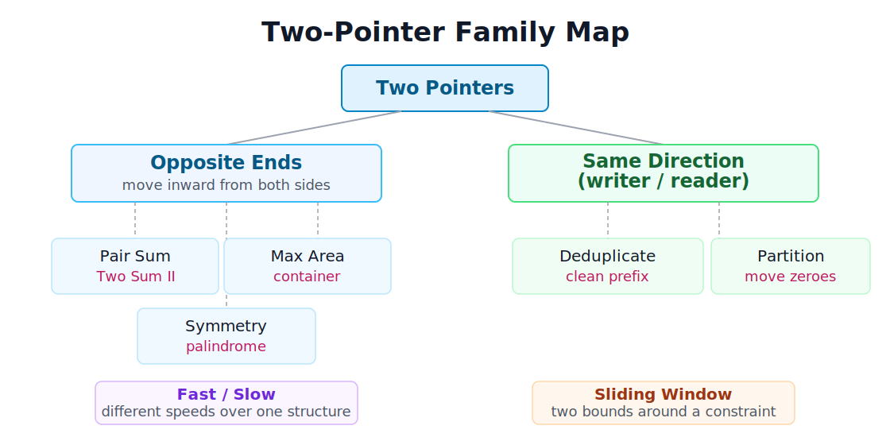
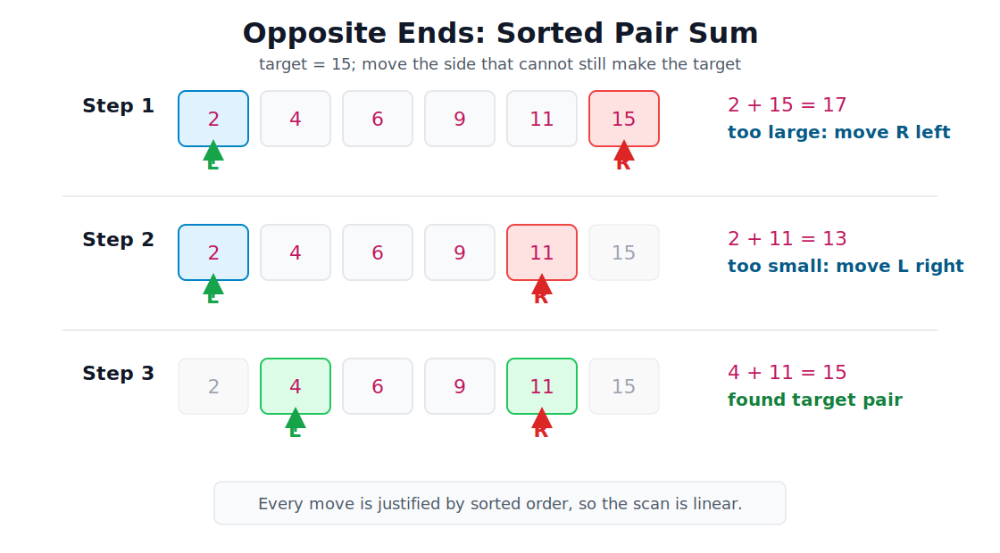
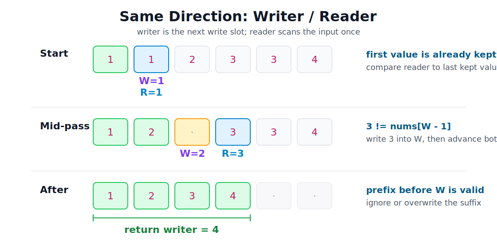

# Two Pointers

[toc]

> **TL;DR:** Two pointers turns many array and string problems into one linear scan. At every step, the invariant tells you which pointer can move without losing a valid or better answer.

## Vocabulary

**Pointer**

An integer index into an array or string. In two-pointer problems, the pointers usually move in one direction and never reset.

**Opposite ends**

Two indices start at the left and right ends of a range and move inward. This works when sorted order, symmetry, or a bottleneck rule lets you discard one side safely.

**Writer / reader**

The reader scans every element. The writer marks the next slot where a kept value should be written. This is the standard shape for in-place filtering and deduplication.

**Invariant**

The fact that must be true when a loop iteration starts and true again when that iteration ends. It may be temporarily broken while the loop body is doing work.

**Safe discard**

A pointer move that cannot skip the answer. This is the core proof obligation for every two-pointer solution.

## Understanding Invariants

Before going deeper into two pointers, keep one general algorithm idea in view: every correct loop maintains an invariant.

An invariant is a statement that must stay true as the loop runs. The algorithm may move pointers, update variables, and mutate arrays, but the invariant must be restored before the next iteration begins. If you cannot state the invariant, there is a good chance you are following a pattern mechanically instead of understanding why it works.

### Tiny Example: Moving Items from A to B

Imagine moving items from box A to box B one at a time. A useful invariant is: after each full loop iteration, the total number of items in A and B is still the original total.

During the middle of an iteration, that visible total can be temporarily wrong because one item is in your hand. Once the item is placed into B, the invariant is restored.

```python
total = len(A) + len(B)

while A:
    item = A.pop()      # A + B is temporarily short by one
    B.append(item)      # invariant is restored

    assert len(A) + len(B) == total
```

The important point is timing: the statement is true before an iteration starts and true again when that iteration ends.

### Common Invariant Shapes

Many algorithm loops reuse the same few invariant shapes. When a new loop feels confusing, ask which of these shapes it resembles.

| Shape | Invariant | Update | Example |
| :--- | :--- | :--- | :--- |
| Finished region is correct | The completed prefix already contains the correct result so far. | Extend that region by one safe step. | Merge two sorted arrays; writer/reader prefix |
| Remaining candidates still contain the answer | If the answer exists, it is still inside the current range. | Discard the part that cannot contain it. | Binary search; opposite-ends pair search |
| Active state is valid | The live state satisfies the rule you need before using it. | Change the state, then repair it if needed. | No-repeat sliding window |
| Variables keep a meaningful relationship | The variables preserve the relationship your proof depends on. | Move them in a coordinated way. | Fast/slow pointers; gap pointers |

In merge, the finished region is the output already built. If the next unused values are `5` and `4`, appending `4` keeps the output sorted because `4` is the smallest value that can appear next.

In binary search, the invariant is not "we know the answer." The invariant is weaker and more useful: if the answer exists, it is still inside the current candidate range. If `mid` is too small, discarding the left side preserves that statement.

In a no-repeat sliding window, expanding `right` may introduce a duplicate and temporarily break the valid-window invariant. The algorithm moves `left` until the duplicate is gone, then uses the window only after it is valid again.

In fast/slow pointer problems, the important invariant is the relationship between variables. If `slow` always moves one step and `fast` always moves two, that relationship is what makes midpoint and cycle-detection reasoning work.

> [!IMPORTANT]
> Bookmark this for two pointers: do not ask "which pointer does this pattern usually move?" Ask "which move preserves the invariant?"

## Intuition

Two pointers is useful when the current pair of positions gives enough information to make one irreversible move. You are not guessing; you are using structure in the input to prove that one side no longer needs to be searched.

There are two primary families:

- **Opposite ends**: move inward from both sides.
- **Same direction**: one pointer reads and one pointer writes or tracks state.



> [!TIP]
> The whole technique reduces to one question: "Given the values I see right now, which pointer can I move without missing the answer?"

## Opposite Ends

Place `left` at the start and `right` at the end. At each step, inspect the current pair and use the problem's structure to decide which side can move inward.

This is most common for sorted arrays, palindrome checks, and "best pair" problems where the answer depends on both ends.



### Core Loop Shape

The loop below is the template for a sorted pair-sum problem. The important detail is not the syntax; it is the move rule after each comparison.

```python
left = 0
right = len(nums) - 1

while left < right:
    current = nums[left] + nums[right]

    if current == target:
        return [left, right]
    if current < target:
        left += 1      # need a bigger sum
    else:
        right -= 1     # need a smaller sum
```

Each pointer moves at most `n` total positions, so the scan is O(n) after any sorting cost.

### Example: Two Sum II

In a sorted array, a too-small sum means the left value is too small to pair with anything inside the remaining range. A too-large sum means the right value is too large.

```python
def two_sum(numbers: list[int], target: int) -> list[int]:
    left, right = 0, len(numbers) - 1

    while left < right:
        total = numbers[left] + numbers[right]
        if total == target:
            return [left + 1, right + 1]  # problem asks for 1-based indices
        if total < target:
            left += 1
        else:
            right -= 1

    return []
```

The sorted order is the proof. Without it, moving `left` or `right` would be a guess.

### Example: Container With Most Water

For the container problem, the current area is limited by the shorter line. Moving the taller line can only shrink the width while keeping the same bottleneck, so the only useful move is to advance the shorter side.

```python
def max_area(height: list[int]) -> int:
    left, right = 0, len(height) - 1
    best = 0

    while left < right:
        width = right - left
        best = max(best, width * min(height[left], height[right]))

        if height[left] < height[right]:
            left += 1
        else:
            right -= 1

    return best
```

> [!IMPORTANT]
> Do not memorize "always move left" or "always move right." Memorize the invariant: move the side that cannot improve the answer under the current rule.

### Example: Palindrome Check

For strings, the structure is symmetry instead of sorted order. A mismatch at the outer characters proves the string is not a palindrome.

```python
def is_palindrome(s: str) -> bool:
    left, right = 0, len(s) - 1

    while left < right:
        if s[left] != s[right]:
            return False
        left += 1
        right -= 1

    return True
```

Problem variants often add preprocessing or skip non-alphanumeric characters, but the invariant stays the same: the unchecked middle is the only part still in question.

## Same Direction: Writer / Reader

In this family, `reader` walks the input once. `writer` only advances when you keep a value, so the prefix before `writer` is always the valid output built so far.

This pattern is ideal for in-place filtering, deduplication, and stable partitioning.



### Example: Remove Duplicates from Sorted Array

Because duplicates are adjacent in a sorted array, each new distinct value should be written after the previous distinct value.

```python
def remove_duplicates(nums: list[int]) -> int:
    if not nums:
        return 0

    writer = 1
    for reader in range(1, len(nums)):
        if nums[reader] != nums[writer - 1]:
            nums[writer] = nums[reader]
            writer += 1

    return writer
```

After the loop, `nums[:writer]` is the unique prefix. The values after `writer` do not matter unless the problem explicitly asks you to overwrite them.

### Example: Move Zeroes

Move Zeroes is a stable partition: keep all non-zero values in order, then fill the rest with zeroes.

```python
def move_zeroes(nums: list[int]) -> None:
    writer = 0

    for reader in range(len(nums)):
        if nums[reader] != 0:
            nums[writer] = nums[reader]
            writer += 1

    for i in range(writer, len(nums)):
        nums[i] = 0
```

The swap version is shorter, but it is only worth using when you are comfortable with the fact that it writes more often.

```python
def move_zeroes_swap(nums: list[int]) -> None:
    writer = 0

    for reader in range(len(nums)):
        if nums[reader] != 0:
            nums[writer], nums[reader] = nums[reader], nums[writer]
            writer += 1
```

Both versions are O(n) time and O(1) extra space.

## Recognition Checklist

Use this checklist before reaching for two pointers. If none of these apply, a hash map, binary search, stack, or sliding window may be a better fit.

| Situation | Pattern | Key property | Move rule |
| :--- | :--- | :--- | :--- |
| Sorted array plus target pair | Opposite ends | Monotonic sums | Too small: `left += 1`; too big: `right -= 1` |
| Maximize area using two endpoints | Opposite ends | Shorter side is the bottleneck | Move the shorter side |
| Check symmetry | Opposite ends | Matching outer characters | Mismatch fails; match moves both |
| Deduplicate sorted input | Writer / reader | Duplicates are adjacent | Write only when value differs from last kept |
| Stable filter or partition | Writer / reader | Keep/discard predicate | Write each kept value once |

## Common Gotchas

- Using `left <= right` when the problem needs two different elements. Most converging pair problems use `left < right`.
- Applying opposite-ends logic to an unsorted array without another monotonic property.
- Moving the pointer that is easier to move instead of the pointer that is safe to discard.
- Forgetting that `writer` usually points to the next write slot, not the last valid element.
- Reading the suffix after `writer` in in-place problems. The answer is usually only the prefix length.

> [!NOTE]
> Two pointers is often combined with sorting. The sort costs O(n log n), and the following scan is O(n), so the sort dominates total time.

## Interview Questions and Answers

**What is an invariant?**

An invariant is a statement that is true when each loop iteration starts and true again when that iteration ends. It may be temporarily broken inside the loop body, but the loop must restore it before continuing.

**How do you recognize a two-pointer problem?**

Look for an array or string where each step can safely discard one side, compare symmetric positions, or build an in-place prefix while scanning once.

**Which invariant shapes show up in two pointers?**

Opposite-ends problems usually preserve "remaining candidates still contain the answer." Writer/reader problems usually preserve "the finished prefix is correct."

**Why does Two Sum II need sorted input?**

Sorted order makes the sum monotonic. If the sum is too small, increasing `left` is the only move that can increase it; if it is too large, decreasing `right` is the only move that can decrease it.

**Why move the shorter side in Container With Most Water?**

The shorter line limits the area. Moving the taller line shrinks width while keeping the same height limit, so it cannot improve the current area.

**What invariant should you say for writer/reader?**

Everything before `writer` is already valid output. `reader` scans the remaining input and decides whether the current value should be copied into that prefix.

**How is this different from sliding window?**

Sliding window tracks a range whose width grows and shrinks around a constraint. Basic two pointers usually moves each pointer in one direction according to a direct pair or prefix invariant.

## Sources

- Conversation with user on 2026-07-08.

## Related

- [Binary Search](./01-binary-search.md) — another technique for discarding impossible ranges.
