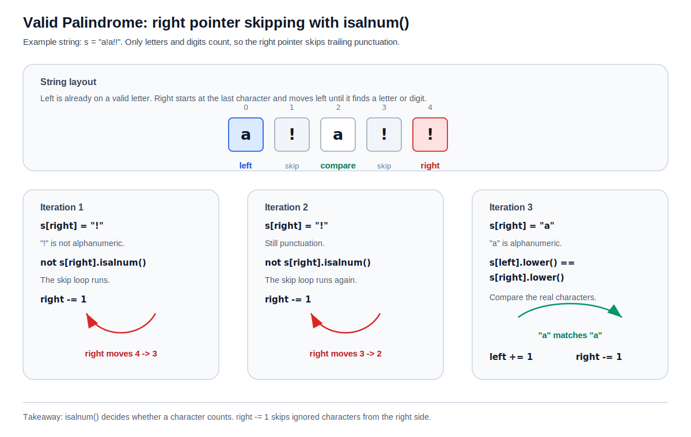

# Valid Palindrome

[toc]

> **TL;DR:** Use one pointer at the start and one at the end. Skip non-alphanumeric characters, compare lowercase characters, and move inward until the pointers cross.

## Vocabulary

**Palindrome**

A sequence that reads the same forward and backward after applying the problem's cleanup rules.

**Alphanumeric character**

A letter or digit. In Python, `char.isalnum()` checks this. Letters like `a` and `Z` return `True`, digits like `7` return `True`, and spaces or punctuation like `" "`, `","`, and `"?"` return `False`.

**Two inward pointers**

One pointer starts on the left, one starts on the right, and both move toward the center.

## Underlying Concept

The brute force idea is to build a cleaned string, reverse it, and compare. That works, but it uses extra memory.

The two-pointer version checks the same mirrored pairs directly in the original string.

```text
"Was it a car or a cat I saw?"

left compares with right:
w ... w
a ... a
s ... s
```

The key idea is that punctuation and spaces do not matter, so each pointer skips anything that is not a letter or digit.

> [!IMPORTANT]
> Normalize only the characters you compare. You do not need to build a separate cleaned string.

## Pointer Logic

Each loop moves the pointers to the next meaningful characters. Then it compares those characters in lowercase.

```python
while left < right and not s[left].isalnum():
    left += 1

while left < right and not s[right].isalnum():
    right -= 1
```

### What Is `isalnum()`

`isalnum()` means "is alphanumeric?" It returns `True` when the character is a letter or number, and `False` for spaces, punctuation, and symbols.

```python
"a".isalnum()   # True
"Z".isalnum()   # True
"7".isalnum()   # True
" ".isalnum()   # False
"?".isalnum()   # False
```

In this problem, only alphanumeric characters count toward the palindrome check. So `not s[right].isalnum()` means "the character at `right` should be ignored."

### Why `right -= 1`

The right pointer starts at the end of the string and moves left toward the center. When the current right-side character is punctuation or a space, it cannot be part of the comparison.

```python
while left < right and not s[right].isalnum():
    right -= 1
```

`right -= 1` means "move the right pointer one step left." The loop keeps doing that until `right` lands on a letter or digit.

```text
s = "ab!!"

right starts at index 3 -> "!" -> ignore, right -= 1
right moves to index 2  -> "!" -> ignore, right -= 1
right moves to index 1  -> "b" -> compare this character
```

This diagram shows the same idea with `s = "a!a!!"`: the right pointer skips trailing punctuation until it reaches a real character to compare.



After both pointers land on alphanumeric characters, compare them.

```python
if s[left].lower() != s[right].lower():
    return False
```

If they match, move both inward.

## Full Python Solution

This version uses constant extra space. It never creates a full cleaned copy of the input.

```python
class Solution:
    def isPalindrome(self, s: str) -> bool:
        left = 0
        right = len(s) - 1

        while left < right:
            while left < right and not s[left].isalnum():
                left += 1

            while left < right and not s[right].isalnum():
                right -= 1

            if s[left].lower() != s[right].lower():
                return False

            left += 1
            right -= 1

        return True
```

The loop stops when the pointers cross or meet. At that point every mirrored character pair has already matched.

## Dry Run

Use `s = "Was it a car or a cat I saw?"`. After ignoring spaces and punctuation, the meaningful string is a palindrome.

```text
left side starts at W
right side skips ? and lands at w
W lowercased equals w
```

The same process continues inward.

| Step | Left char | Right char | Decision |
| ---: | :--- | :--- | :--- |
| 1 | `W` | `w` | match |
| 2 | `a` | `a` | match |
| 3 | `s` | `s` | match |
| 4 | `i` | `i` | match |

If any pair does not match, the function returns `False` immediately.

## Edge Cases

These cases explain why the skip loops and lowercase comparison matter.

| Case | Example | Result |
| :--- | :--- | :--- |
| Spaces and punctuation | `"A man, a plan, a canal: Panama"` | `True` |
| Mixed case | `"Aa"` | `True` |
| Only punctuation | `".,!"` | `True` |
| One character | `"a"` | `True` |
| Clear mismatch | `"tab a cat"` | `False` |

> [!WARNING]
> Do not compare raw characters before skipping non-alphanumeric characters. Spaces and punctuation are ignored by the problem.

## Complexity

Each pointer only moves inward, so every character is visited at most once.

| Resource | Complexity | Reason |
| :--- | :--- | :--- |
| Time | `O(n)` | One pass from both ends. |
| Space | `O(1)` | No cleaned copy is built. |

## Interview Questions and Answers

**Q: What is the underlying concept?**  
A: Two inward pointers comparing mirrored meaningful characters.

**Q: Why skip characters instead of cleaning first?**  
A: Skipping keeps the solution at constant extra space.

**Q: Why use `lower()`?**  
A: The problem is case-insensitive, so `A` and `a` should match.

**Q: What should you say out loud in an interview?**  
A: "I move two pointers inward, skip non-alphanumeric characters, compare lowercase characters, and fail on the first mismatch."

## Sources

- [NeetCode: Valid Palindrome](https://neetcode.io/problems/is-palindrome/question?list=neetcode150)
- Problem request from user on 2026-07-15.

## Related

- [Two Pointers](../../02-two-pointers.md)
- [Two Sum II Input Array Is Sorted](./two-sum-ii-input-array-is-sorted.md)
