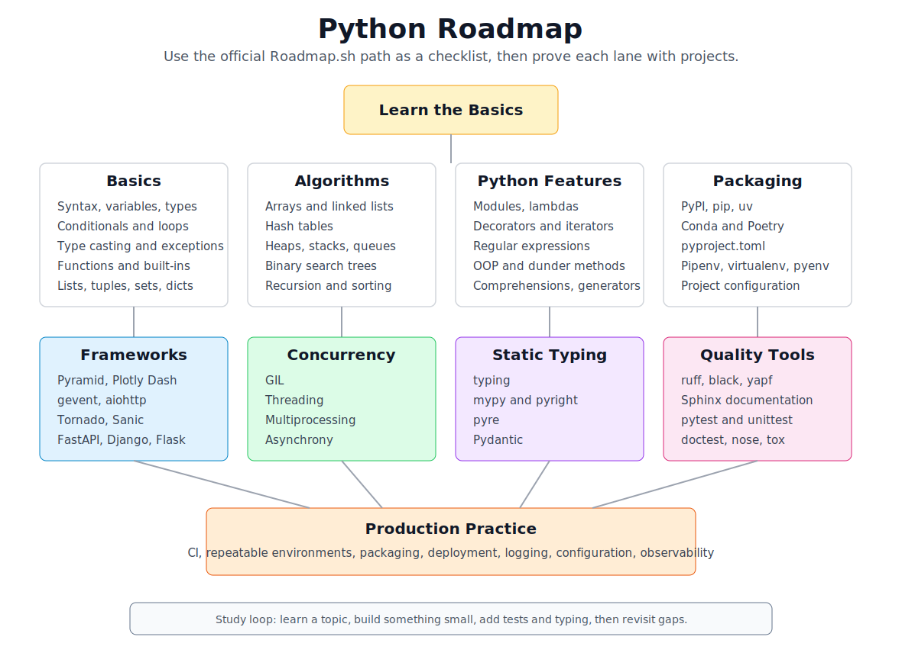

# Python Road Map

[toc]

> **TL;DR:** The Python roadmap is a progression from syntax and core data structures into Python-specific language features, packaging, frameworks, concurrency, typing, formatting, testing, documentation, and deployment-adjacent skills. Use this as a checklist, not a strict order.

## Vocabulary

**Roadmap**

A learning path that groups related skills into a sequence. It is useful for coverage, but it does not replace building projects.

**Package manager**

A tool that installs and resolves third-party Python packages. Common options include `pip`, `uv`, Poetry, Conda, and Pipenv.

**Virtual environment**

An isolated Python environment for one project. It keeps dependencies from different projects from interfering with each other.

**Static typing**

Optional type annotations plus type checkers such as mypy, pyright, or pyre. Static typing catches many interface mistakes before runtime.

**Concurrency**

Techniques for making progress on multiple tasks. In Python this includes threads, processes, async I/O, and the constraints created by the GIL.

**Framework**

A library that supplies the structure for a larger application. In Python web work, common examples include Django, Flask, and FastAPI.

## Visual Map

This local overview keeps the Roadmap.sh structure readable inside the vault. The original full-size image is linked below when you want the official visual.



> [!NOTE]
> Official image: [Roadmap.sh Python PNG](https://roadmap.sh/roadmaps/python.png). Official PDF: [Roadmap.sh Python PDF](https://roadmap.sh/pdfs/roadmaps/python.pdf).

When you want the exact original visual, Typora can render the Roadmap.sh PNG below while you are online.


## Roadmap Checklist

The Roadmap.sh version groups Python learning into broad lanes. Work through each lane with small programs, then connect the lanes in a real project.

### 1. Learn the Basics

Start with enough Python to read and write simple scripts. Do not over-optimize this phase; the goal is fluency with the shape of the language.

- Basic syntax
- Variables and data types
- Conditionals
- Loops
- Type casting
- Exceptions
- Functions and built-in functions
- Lists, tuples, and sets
- Dictionaries

### 2. Data Structures and Algorithms

This lane builds the problem-solving vocabulary you need for interviews, performance work, and reading more advanced code. Python hides many implementation details, but you still need the tradeoffs.

- Arrays and linked lists
- Hash tables
- Heaps, stacks, and queues
- Binary search trees
- Recursion
- Sorting algorithms

### 3. Core Python Language Features

Once the basics are comfortable, learn the features that make Python code idiomatic. These show up constantly in real libraries.

- Modules: built-in and custom modules
- Lambdas
- Decorators
- Iterators
- Regular expressions
- Object-oriented programming
- Classes
- Inheritance
- Methods and dunder methods
- List comprehensions
- Generator expressions
- Programming paradigms
- Context managers

### 4. Package Managers and Project Layout

Modern Python work depends on reproducible environments and clear project configuration. Learn one workflow deeply, then recognize the others.

- PyPI
- `pip`
- Conda
- `uv`
- Poetry
- `pyproject.toml`
- Configuration
- Pipenv
- `virtualenv`
- `pyenv`
- Common packages

### 5. Frameworks

Pick a framework based on the kind of project you want to build. You do not need to learn every framework at once.

- Synchronous-oriented frameworks and tools: Pyramid, Plotly Dash
- Asynchronous-oriented frameworks and libraries: gevent, aiohttp, Tornado, Sanic
- Mixed synchronous/asynchronous web frameworks: FastAPI, Django, Flask

### 6. Concurrency

Concurrency is where Python's runtime model starts to matter. Learn the difference between I/O-bound and CPU-bound work before choosing a tool.

- GIL
- Threading
- Multiprocessing
- Asynchrony

### 7. Static Typing

Typing is optional in Python, but it becomes valuable as codebases grow. Treat type hints as executable documentation for interfaces.

- `typing`
- mypy
- pyright
- pyre
- Pydantic

### 8. Formatting, Documentation, and Testing

These tools make Python code easier to maintain. They are also what turn scripts into projects other people can trust.

- Code formatting: ruff, black, yapf
- Documentation: Sphinx
- Testing: pytest, unittest / pyUnit, doctest, nose, tox

### 9. DevOps and Production Practice

The roadmap ends by pointing toward DevOps. For Python, that usually means learning how code runs outside your laptop.

- Build repeatable environments.
- Run tests in CI.
- Package and deploy services or jobs.
- Understand logging, configuration, secrets, and observability.

## How to Study This Roadmap

The efficient path is to move in loops: learn a small concept, use it in a project, then come back and fill the gaps. Avoid spending months only reading syntax.

1. Finish the basics with small scripts.
2. Build a command-line tool that reads files and calls an API.
3. Add tests, formatting, type checking, and packaging.
4. Build a small web API with FastAPI, Flask, or Django.
5. Add persistence, background work, and deployment practice.
6. Revisit data structures and algorithms alongside project work.

## Real-World Example: Track Roadmap Progress

A simple tracker turns the roadmap into something measurable. This is intentionally small: it keeps the learning plan in code, prints unfinished topics, and can later be expanded into a CLI.

```python
from dataclasses import dataclass


@dataclass
class Topic:
    lane: str
    name: str
    done: bool = False


topics = [
    Topic("Basics", "Functions", True),
    Topic("Basics", "Exceptions", False),
    Topic("Tooling", "pyproject.toml", False),
    Topic("Testing", "pytest", False),
    Topic("Typing", "pyright", False),
]

for topic in topics:
    if not topic.done:
        print(f"{topic.lane}: {topic.name}")
```

## Interview Questions and Answers

**What should a beginner learn first in Python?**

Learn syntax, variables, common data types, control flow, functions, exceptions, lists, tuples, sets, and dictionaries. That is enough to start writing useful scripts.

**When should you learn data structures and algorithms?**

Start after the basics are comfortable, then keep revisiting them. You do not need to master every algorithm before building projects.

**Which package manager should you use first?**

Start with `pip` plus a virtual environment because it is universal. Then learn `uv` or Poetry when you want faster installs or more structured project management.

**Should you learn Django, Flask, or FastAPI first?**

Pick based on project shape. Django is strong for full web apps, Flask is minimal and flexible, and FastAPI is strong for typed APIs and async-friendly services.

**Why does Python concurrency feel different from other languages?**

The GIL affects CPU-bound threaded Python code. For I/O-bound work, async I/O or threads can still help; for CPU-bound work, multiprocessing or native extensions are often more appropriate.

## Sources

- [Roadmap.sh Python Developer roadmap](https://roadmap.sh/python)
- [Roadmap.sh Python roadmap image](https://roadmap.sh/roadmaps/python.png)
- [Roadmap.sh Python roadmap PDF](https://roadmap.sh/pdfs/roadmaps/python.pdf)

## Related

- [Binary Search](../../Data-Structures-and-Algorithms/01-binary-search.md) — one of the algorithm topics called out by the roadmap.
- [Two Pointers](../../Data-Structures-and-Algorithms/02-two-pointers.md) — a reusable array/string pattern to study after Python basics.
