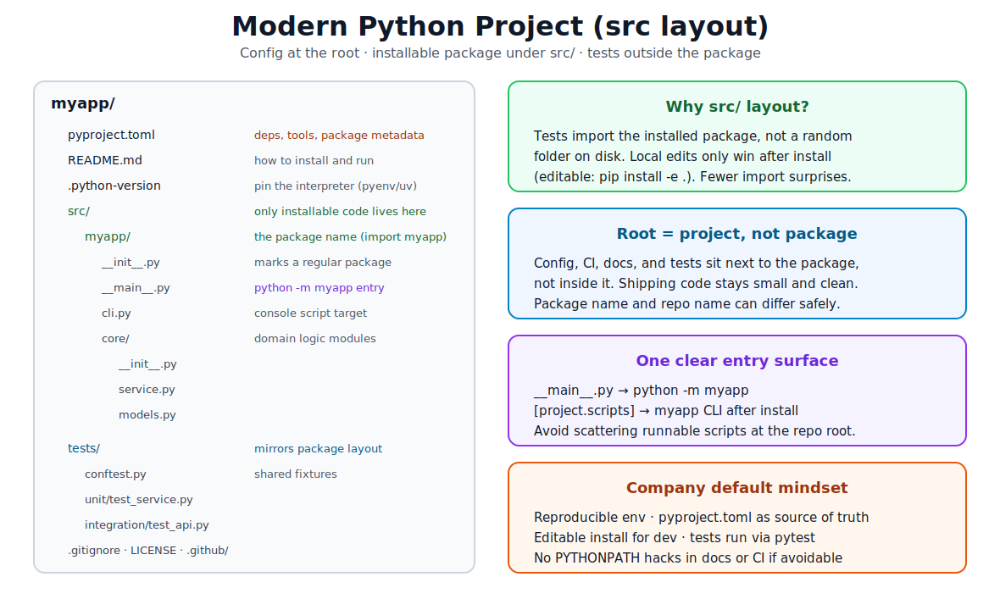
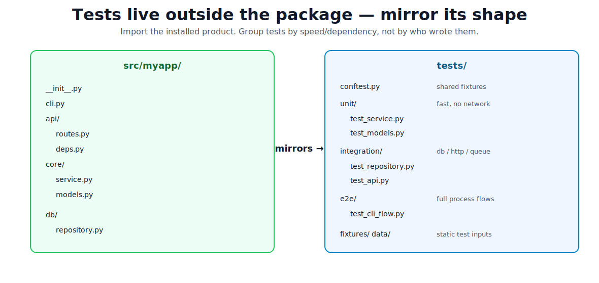
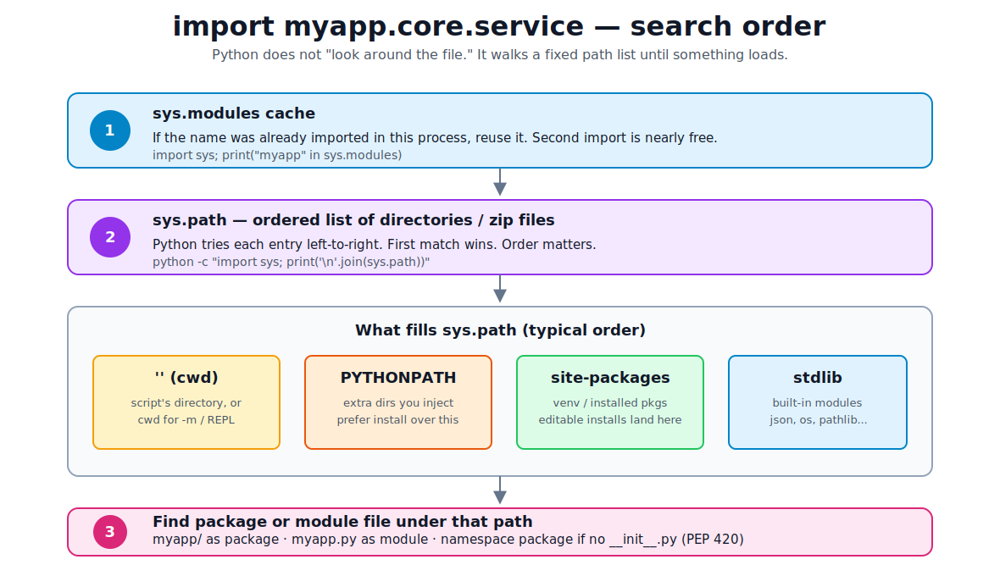
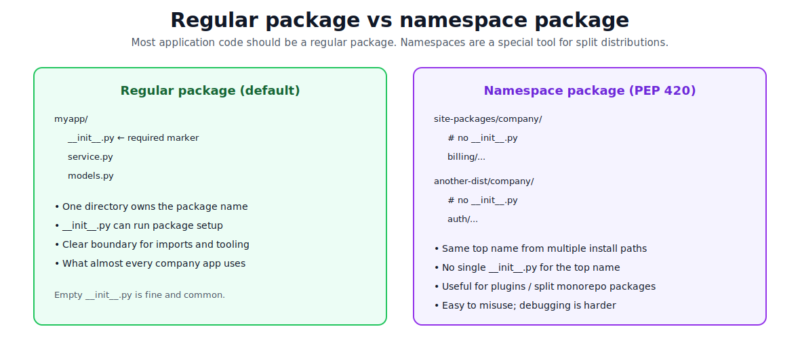
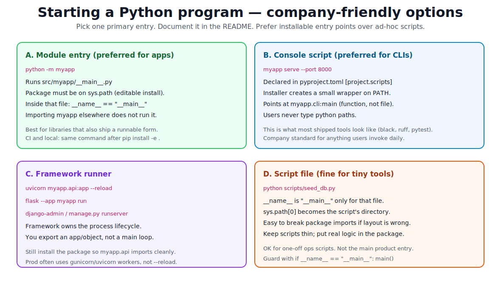

# Project Structure and Environment

[toc]

> **TL;DR:** Treat every non-trivial Python repo as an *installable package* with config at the root, code under `src/`, tests outside the package, and one clear way to run it. Environments isolate dependencies; imports follow `sys.path`; you start the app with `python -m package`, a console script, or a framework runner — not ad-hoc `PYTHONPATH` hacks.

## The Core Idea

A **project** is the whole repository (config, tests, CI, docs). A **package** is the importable product (`import myapp`). Companies keep those separate so shipping code stays clean and imports behave the same on your laptop, in CI, and in production.



> [!IMPORTANT]
> The default company pattern today: **src layout** + **`pyproject.toml`** + **virtual environment** + **editable install** + **pytest from the repo root**. If you learn only one workflow, learn this.

### What “installable package” means

An **installable package** is project code set up so tools (`pip` / `uv`) can **register** it into a virtual environment and Python can **`import` it by a stable name** from any working directory — the same way you import `requests` or `pytest`.

Two related meanings of “package”:

| Word | Meaning |
| :--- | :--- |
| **Package (code)** | A folder you import, e.g. `myapp/` with modules → `import myapp` |
| **Installable package** | That code **plus** metadata (`pyproject.toml`, build backend) so installers can put it in an env |

**Install** does not require publishing to PyPI. Local `pip install -e .` is enough. Publishing is optional later.

```text
Before install:
  files on disk  →  Python may only find them via cwd / PYTHONPATH luck

After install:
  files on disk  →  registered in the venv  →  import name is stable
```

```bash
# Not installable behavior (folder of scripts only)
cd myproject && python app.py          # often works
cd .. && python -c "import utils"      # usually fails

# Installable behavior
pip install -e .
python -c "from myapp.core.service import create_order"  # works from any cwd
```

| Without install | With install (`pip install -e .`) |
| :--- | :--- |
| Imports depend on cwd and luck | `import myapp` works with the env active |
| Tests/CI break differently per machine | Same import story laptop → CI → prod |
| No reliable CLI entry on PATH | `[project.scripts]` can create `myapp` command |

**Editable install (`-e`)** links `site-packages` to your working tree so edits apply immediately. A normal `pip install .` copies/builds a wheel (better for deploy, less convenient while coding).

> [!NOTE]
> One-line definition: *installable package* = project code packaged so `pip`/`uv` can put it in a virtualenv and Python can import it by a stable name.

---

## 1. Modern, Scalable Project Structure

### Why structure matters

Without structure, imports work “by accident” (because you ran from the right folder), tests import half-written local files instead of the real package, and new teammates cannot tell where to put code. Structure is not aesthetics — it is how the interpreter and install tools find things.

### The layout you should default to

```text
myapp/                          # repo root (project)
├── pyproject.toml              # package metadata, deps, tool config
├── README.md
├── .python-version             # pin interpreter (optional but useful)
├── .gitignore
├── src/
│   └── myapp/                  # the package (import myapp)
│       ├── __init__.py
│       ├── __main__.py         # python -m myapp
│       ├── cli.py              # console script target
│       └── core/
│           ├── __init__.py
│           ├── models.py
│           └── service.py
├── tests/
│   ├── conftest.py
│   ├── unit/
│   └── integration/
└── scripts/                    # optional thin ops scripts
    └── seed_db.py
```

| Piece | Role |
| :--- | :--- |
| `pyproject.toml` | Single source of truth for name, version, dependencies, scripts, and tool settings (ruff, pytest, mypy). |
| `src/myapp/` | Installable package only. Nothing that is not part of the product. |
| `tests/` | Lives next to the package, not inside it. Imports `myapp` like a user would. |
| `scripts/` | Thin wrappers for ops; real logic stays in the package. |
| `.python-version` | Pins the interpreter for `pyenv` / `uv` so everyone runs the same Python. |

### src layout vs flat layout

A **flat layout** puts `myapp/` next to `tests/` at the repo root. It is simpler for tiny repos, but Python often picks up the local folder before the installed package, so tests can pass against uninstalled or broken packaging.

**src layout** puts the package under `src/` so it is *not* on `sys.path` until you install it (usually editable). That is the scalable default for libraries and most services.

```toml
# pyproject.toml (minimal shape)
[project]
name = "myapp"
version = "0.1.0"
requires-python = ">=3.11"
dependencies = [
  "httpx>=0.27",
]

[project.optional-dependencies]
dev = ["pytest>=8", "ruff>=0.6"]

[project.scripts]
myapp = "myapp.cli:main"

[build-system]
requires = ["hatchling"]
build-backend = "hatchling.build"

[tool.hatch.build.targets.wheel]
packages = ["src/myapp"]

[tool.pytest.ini_options]
testpaths = ["tests"]
```

> [!TIP]
> Scale by **packages and modules**, not by dumping everything into one folder: `myapp/api/`, `myapp/core/`, `myapp/db/`. Keep public API small (`__init__.py` re-exports only what callers need).

### What to avoid in layout

- Putting tests *inside* the installable package (they ship with the wheel unless you carefully exclude them).
- Many top-level runnable `.py` files that import each other with relative path tricks.
- A package named differently in every place (`my_app` folder, `myapp` import, `MyApp` project name with no mapping).
- Committing `.venv/` or `venv/` to git.

---

## 2. Python Environments and Tooling

A **virtual environment** is an isolated directory with its own Python interpreter and `site-packages`. Each project gets one so dependency versions do not fight across repos.

### Creating an env does **not** read `pyproject.toml`

`pyproject.toml` is a **recipe**. The venv is an **empty kitchen**. Install is **cooking the recipe into that kitchen**.

| Step | Example command | What happens |
| :--- | :--- | :--- |
| Create env | `python -m venv .venv` or `uv venv` | Empty-ish private Python + empty `site-packages`. **Project not installed.** |
| Activate | `source .venv/bin/activate` | Shell `python` / `pip` point at that env. Still no project install. |
| Install project | `pip install -e ".[dev]"` | **Now** installers read `pyproject.toml` and put package + deps into the env. |

```bash
uv venv && source .venv/bin/activate
python -c "import myapp"          # FAILS — toml not applied yet

uv pip install -e ".[dev]"        # pyproject.toml is read here
python -c "import myapp"          # works
```

Who reads `pyproject.toml`, and when:

| Reader | When | What it uses |
| :--- | :--- | :--- |
| `pip` / `uv pip` | On **install** | `[project]`, deps, scripts, build backend |
| `pytest` / `ruff` / `mypy` | When **you run the tool** | `[tool.pytest]`, `[tool.ruff]`, `[tool.mypy]` |
| `venv` / `uv venv` | On create | Basically **ignores** project deps |

> [!IMPORTANT]
> Activating a venv only switches which Python you use. It does **not** auto-install your project. If imports fail after `venv`, the usual fix is `pip install -e ".[dev]"`, not `PYTHONPATH`.

(`uv sync` is a smarter workflow that can create/sync from `pyproject.toml` + lockfile in one go. Classic `venv` never does that alone.)

### Everyday company workflow (pick one stack and stick to it)

**Modern default (recommended to learn first): `uv`**

```bash
# once: install uv (see https://docs.astral.sh/uv/)
cd myapp
uv venv                     # creates .venv
source .venv/bin/activate   # Windows: .venv\Scripts\activate
uv pip install -e ".[dev]"  # editable install of this project + dev tools
pytest
```

**Classic / still common everywhere: `venv` + `pip`**

```bash
python3.12 -m venv .venv
source .venv/bin/activate
python -m pip install -U pip
pip install -e ".[dev]"
pytest
```

**Also seen in industry**

| Tool | What it is for |
| :--- | :--- |
| `pyenv` | Install and switch *Python versions* on the machine. |
| `poetry` | Dependency resolution + packaging workflow around `pyproject.toml`. |
| `conda` / `mamba` | Common in data science; manages non-Python binaries too. |
| `pip-tools` | Compile locked requirements from input files. |
| `ruff` | Fast linter/formatter (often replaces flake8 + isort + black). |
| `mypy` / `pyright` | Static type checking. |
| `pytest` | Default test runner in most companies. |

### Mental model

1. Activate (or use `uv run`) so `python` and `pip` point at the project env.
2. Install the project **editable** (`-e`) so `import myapp` works and source edits are live.
3. Install third-party deps from `pyproject.toml` / lockfile — not random global packages.
4. Run tools *from the repo root* with that env active.

```bash
# Prove you are in the right place
which python
python -c "import sys; print(sys.executable)"
python -c "import myapp; print(myapp.__file__)"
```

> [!NOTE]
> **Editable install** means the package is linked into `site-packages` so imports resolve to your working tree. Without it, `import myapp` often fails under src layout — that is intentional.

### Environment files people confuse

| File | Purpose |
| :--- | :--- |
| `pyproject.toml` | Project + tool config (modern standard). |
| `requirements.txt` | Pinned install list (still used a lot in apps/deploy). |
| `uv.lock` / `poetry.lock` | Exact resolved versions for reproducible installs. |
| `.python-version` | Which interpreter version this project wants. |
| `.env` | Runtime secrets/config for the *app* (not Python packaging). Never commit secrets. |

---

## 3. Organized Test Folders

Tests should **import the package like production code does**. They should not reach into private folders via `sys.path` hacks.



### Recommended shape

```text
tests/
├── conftest.py                 # shared pytest fixtures
├── unit/                       # fast, no network/db
│   ├── test_service.py
│   └── test_models.py
├── integration/                # real db/http/queue (or testcontainers)
│   ├── test_repository.py
│   └── test_api.py
├── e2e/                        # full flows / CLI / process
│   └── test_cli_flow.py
└── fixtures/                   # static JSON, sample files
    └── sample_payload.json
```

### Naming and discovery rules

- File names: `test_*.py` or `*_test.py` (pytest default).
- Test functions: `test_*`.
- Mirror package modules: `core/service.py` → `unit/test_service.py`.
- Put **shared fixtures** in `conftest.py` near the tests that need them (pytest loads these automatically).
- Prefer package imports:

```python
# tests/unit/test_service.py
from myapp.core.service import create_order

def test_create_order_total():
    order = create_order(items=[(10, 2)])
    assert order.total == 20
```

### Fixtures and `conftest.py`

A **fixture** is a pytest-managed setup (and optional teardown) helper. You declare `@pytest.fixture`, then put the fixture **name as a test argument**. pytest injects the value — you do not call the fixture yourself.

```python
import pytest

@pytest.fixture
def user():
    return {"id": 1, "name": "ada"}

def test_user_name(user):  # pytest calls the fixture and passes the result in
    assert user["name"] == "ada"
```

**Why fixtures instead of a plain helper?** They support dependency injection by argument name, **scopes** (per test / module / session), **teardown** via `yield`, composition (fixtures depending on fixtures), and sharing through `conftest.py`.

```python
@pytest.fixture
def db_connection():
    conn = open_connection()   # setup
    yield conn                 # test runs with this value
    conn.close()               # teardown even if the test failed
```

| Scope | Meaning |
| :--- | :--- |
| `function` (default) | New instance for every test |
| `module` | Once per test file |
| `session` | Once for the whole pytest run |

Prefer `function` unless setup is slow and safe to share.

**`conftest.py`** is a special pytest file that is **auto-loaded**. Fixtures defined there are available to tests in that directory **and below** — no `from tests.conftest import user`.

```text
tests/
├── conftest.py              # fixtures for all of tests/
├── unit/
│   ├── conftest.py          # only for unit/ (and deeper)
│   └── test_service.py
└── integration/
    └── conftest.py          # e.g. real DB client for integration only
```

```python
# tests/conftest.py
import pytest

@pytest.fixture
def sample_name() -> str:
    return "ada"
```

```python
# tests/unit/test_greet.py
def test_greet(sample_name):
    assert sample_name == "ada"
```

What belongs in `conftest.py`: shared fixtures, small factories, occasional pytest hooks.  
What does **not**: actual `test_*` functions, production business logic, random helpers you would rather import from a plain `helpers.py`.

pytest also ships built-in fixtures (`tmp_path`, `capsys`, `monkeypatch`, …) that you request the same way by argument name.

> [!TIP]
> Start with an empty `tests/conftest.py`. Add fixtures only when two or more tests need the same setup. Keep static files (JSON samples) in `tests/fixtures/` — that folder name is unrelated to pytest fixtures.

### How to run

```bash
# from repo root, env active, package installed editable
pytest
pytest tests/unit -q
pytest tests/integration -m integration
pytest -k create_order
```

Configure defaults in `pyproject.toml`:

```toml
[tool.pytest.ini_options]
testpaths = ["tests"]
pythonpath = []   # prefer real install; avoid soft-hacks when you can
addopts = "-q"
```

> [!TIP]
> Split by **cost and dependency**, not by team name. Unit tests run on every commit; integration/e2e may run in CI only or nightly.

### Test layout anti-patterns

- `tests` as a *package* that imports sibling modules with relative imports and never installs `myapp`.
- Copying production modules into `tests/` instead of importing them.
- One giant `test_all.py`.
- Needing `cd src` before tests work.

---

## 4. Proper Python Imports

### Modules and packages (terms where they matter)

A **module** is anything Python can import once — usually a `something.py` file. After import it becomes an object in `sys.modules` with attributes (functions, classes, variables).

A **package** is a module that contains other modules — typically a directory with `__init__.py` (regular package). You import with dotted names: `myapp.core.service`.

```python
# absolute imports (preferred inside applications)
from myapp.core.service import create_order
from myapp.core import models

# relative imports (only inside a package, for nearby siblings)
from .models import Order
from ..db.repository import save
```

> [!IMPORTANT]
> Prefer **absolute imports** for app code (`from myapp...`). Use **relative imports** sparingly inside a package when renaming the top package would be painful. Never mix “half path” imports that only work from one working directory.

### How import actually finds code



When you write `import myapp.core.service`, Python roughly:

1. Reuses the module if it is already in **`sys.modules`** (cache).
2. Walks **`sys.path`** in order (first hit wins).
3. Loads a package directory or module file through finders/loaders.

Inspect it anytime:

```bash
python -c "import sys; print('\n'.join(sys.path))"
python -c "import myapp, inspect; print(myapp.__file__)"
```

### PYTHONPATH

**`PYTHONPATH`** is an environment variable: a list of extra directories prepended into `sys.path` when the interpreter starts.

```bash
# Unix — colon-separated
export PYTHONPATH="/path/to/src:$PYTHONPATH"
python -c "import myapp"

# temporary for one command
PYTHONPATH=src pytest   # works, but trains a bad habit if it is your only fix
```

| When it is OK | When to avoid |
| :--- | :--- |
| Quick local experiment | Documented as the *normal* way to run the app |
| Rare debugging | CI depends on a hand-built `PYTHONPATH` |
| Teaching / REPL demos | Hiding a broken package layout |

Company standard: **install the package (editable in dev)** so `site-packages` makes imports work. If you need `PYTHONPATH` forever, the project structure is wrong.

### Namespace packages (PEP 420)

A **namespace package** is a package **without** `__init__.py` that can be assembled from *multiple directories* on `sys.path`. Different distributions can each contribute `company.billing` and `company.auth` under the shared top name `company`.



```text
# two installed distributions cooperate:
site-packages/company/billing/...   # no company/__init__.py
site-packages/company/auth/...      # no company/__init__.py
# import company.billing and company.auth both work
```

Use namespace packages for **plugin ecosystems** or **split libraries** that share a top-level brand. Do **not** use them for a normal application just to skip writing `__init__.py`. Regular packages are easier to reason about, type-check, and package.

### Clean import structure

```text
Good directions of dependency:

cli / api  -->  core  -->  models
                |
                v
               db

Avoid:
core --> api     (business logic depending on HTTP layer)
tests importing private scripts via relative file paths
```

Rules that scale:

1. **One package root** (`myapp`) — everything importable hangs under it.
2. **Absolute imports** from that root in application code.
3. **No circular imports** — if A imports B and B imports A, extract a third module (often types/models).
4. **Do not mutate `sys.path`** in library code.
5. **Do not use `from module import *`** outside a REPL or a tightly controlled `__init__.py` re-export list.

### Import pitfalls

| Pitfall | What goes wrong | Fix |
| :--- | :--- | :--- |
| Running scripts inside `src/myapp/` | Wrong `sys.path[0]`; sibling imports break | `python -m myapp` from repo root after install |
| Shadowing stdlib names | `import json` loads *your* `json.py` | Never name modules `json`, `test`, `email`, `typing`, etc. |
| Shadowing third-party names | Local `requests.py` hides real library | Rename local module |
| Circular imports | `ImportError` / partial init | Push shared types down; lazy import only if you must |
| Relying on cwd | Works on your machine only | Editable install + absolute package imports |
| Relative import in a script | `ImportError: attempted relative import with no known parent package` | Script is not a package module; use `-m` or absolute imports |
| Editing without reinstall in non-editable mode | Old code still imported | Use `pip install -e .` during development |

```python
# Anti-pattern — do not do this in production code
import sys
from pathlib import Path
sys.path.append(str(Path(__file__).resolve().parents[1]))
from utils import helper  # now "works" until packaging/CI breaks
```

---

## 5. `__main__`, Running Programs, and Starting an App

### What `__name__` is

Every module has a **`__name__`** string.

- If the file is **imported**, `__name__` is the module’s dotted path (`myapp.cli`).
- If the file is the **entry module** of the process, `__name__` is the special value `"__main__"`.

That is why this guard exists:

```python
# myapp/cli.py
def main() -> None:
    print("app started")

if __name__ == "__main__":
    main()
```

When another module does `from myapp.cli import main`, the guard blocks accidental startup. When you run the file as a program, `main()` runs.

### `__main__.py` on a package

If a package contains **`__main__.py`**, this works:

```bash
python -m myapp
```

Python loads `myapp/__main__.py` as `__main__`. That is the clean “run this package” entry for libraries and many services.

```python
# src/myapp/__main__.py
from myapp.cli import main

if __name__ == "__main__":
    raise SystemExit(main())
```

### Ways to start a program (company menu)



| Method | Command | When companies use it |
| :--- | :--- | :--- |
| Package module | `python -m myapp` | Libraries, tools, many services |
| Console script | `myapp serve` | Shipped CLIs (declared in `[project.scripts]`) |
| Framework runner | `uvicorn myapp.api:app` | FastAPI/Starlette, etc. |
| Manage script | `python manage.py runserver` | Django ecosystem |
| Thin script | `python scripts/seed_db.py` | Ops/one-offs only |

**Console script wiring:**

```toml
# pyproject.toml
[project.scripts]
myapp = "myapp.cli:main"
```

```python
# src/myapp/cli.py
import argparse

def main(argv: list[str] | None = None) -> int:
    parser = argparse.ArgumentParser(prog="myapp")
    parser.add_argument("command", choices=["serve", "worker"])
    args = parser.parse_args(argv)
    print(f"running {args.command}")
    return 0

if __name__ == "__main__":
    raise SystemExit(main())
```

After `pip install -e .` (or `uv pip install -e .`), the `myapp` command is on your PATH inside the venv.

### A full “day one” company checklist

```bash
# 1. Clone and enter
git clone <repo> && cd myapp

# 2. Create / activate environment
uv venv && source .venv/bin/activate

# 3. Install project + dev tools (editable)
uv pip install -e ".[dev]"

# 4. Sanity: package imports from site-packages link
python -c "import myapp; print(myapp.__file__)"

# 5. Run tests
pytest

# 6. Run the app (one of these — README will say which)
python -m myapp
myapp serve
uvicorn myapp.api:app --reload
```

If step 4 fails under src layout, you are not installed — do not “fix” it with `PYTHONPATH=src` in the official docs.

### Framework-style entry (web services)

You often do **not** write a forever `while` loop. You expose an application object; the server process imports it.

```python
# src/myapp/api.py
from fastapi import FastAPI

app = FastAPI()

@app.get("/health")
def health() -> dict[str, str]:
    return {"status": "ok"}
```

```bash
uvicorn myapp.api:app --reload   # local
# production: gunicorn/uvicorn workers, no --reload
```

### `python file.py` vs `python -m package`

| | `python path/to/file.py` | `python -m myapp` |
| :--- | :--- | :--- |
| `__name__` | `"__main__"` | `"__main__"` (for `__main__.py`) |
| `sys.path[0]` | Directory containing the *file* | Current working directory |
| Package context | Easy to lose | Package imports work if installed |
| Company preference for product entry | Rare | Common |

### Runnable knowledge — keep this in your head

1. **Activate env** (or `uv run`) — always know which `python` you are on.
2. **Editable install** — `import myapp` must work from any cwd.
3. **One documented entry command** in the README.
4. **`if __name__ == "__main__":`** wraps CLI entrypoints; logic lives in functions.
5. **Tests** run with `pytest` from repo root, importing the package.
6. **No permanent PYTHONPATH** in team docs if packaging can solve it.

---

## Pitfalls (Quick List)

- Treating the repo root as a package and scattering imports that only work from one directory.
- Committing virtualenvs or `.env` secrets.
- Using namespace packages (no `__init__.py`) for a normal single app.
- Fixing `ModuleNotFoundError` with `sys.path.append` instead of fixing layout/install.
- Running production code paths only via IDE “run button” with a custom working directory — teammates and CI will not have that.
- Putting heavy side effects at import time (DB connects, threads). Import should be cheap; start work in `main()` or framework startup hooks.

---

## Minimal End-to-End Example

```text
hello-svc/
├── pyproject.toml
├── src/hello_svc/
│   ├── __init__.py
│   ├── __main__.py
│   └── greet.py
└── tests/unit/test_greet.py
```

```python
# src/hello_svc/greet.py
def greet(name: str) -> str:
    return f"hello, {name}"
```

```python
# src/hello_svc/__main__.py
from hello_svc.greet import greet

def main() -> int:
    print(greet("world"))
    return 0

if __name__ == "__main__":
    raise SystemExit(main())
```

```python
# tests/unit/test_greet.py
from hello_svc.greet import greet

def test_greet():
    assert greet("ada") == "hello, ada"
```

```bash
uv venv && source .venv/bin/activate
uv pip install -e ".[dev]"
python -m hello_svc
pytest
```

---

## Sources

- [Python Packaging User Guide — Packaging namespace packages](https://packaging.python.org/en/latest/guides/packaging-namespace-packages/)
- [Python docs — The import system](https://docs.python.org/3/reference/import.html)
- [Python docs — `__main__` — Top-level code environment](https://docs.python.org/3/library/__main__.html)
- [Python Packaging User Guide — Writing your `pyproject.toml`](https://packaging.python.org/en/latest/guides/writing-pyproject-toml/)
- [pytest — Good Integration Practices](https://docs.pytest.org/en/stable/explanation/goodpractices.html)
- [Hatch / src layout discussion](https://packaging.python.org/en/latest/discussions/src-layout-vs-flat-layout/)
- [uv documentation](https://docs.astral.sh/uv/)

## Related

- [Starter Scaffold and Tooling](./02.5-starter-scaffold-and-tooling.md) — copy-paste tree, full `pyproject.toml`, day-one commands
- [Understanding pyproject.toml](./02.6-understanding-toml-file.md) — TOML tables, PEP 621 fields, who reads what
- [Packages, Modules, and Imports](./03-packages-modules-imports.md) — import styles, `__init__.py`, absolute vs relative
- [Python Road Map](./01-python-road-map.md)
