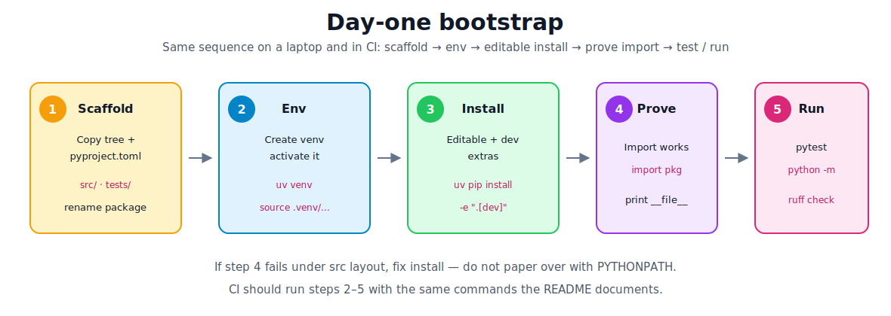
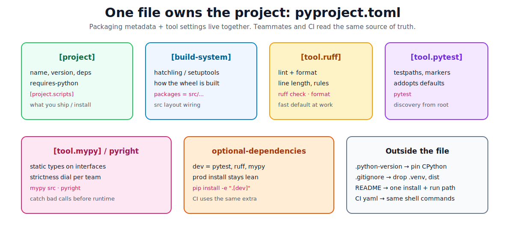

# Starter Scaffold and Tooling

[toc]

> **TL;DR:** Copy one small src-layout tree, put packaging + tool config in a single `pyproject.toml`, install editable with a dev extra, then prove the loop: `import` works → `pytest` green → `python -m pkg` / CLI runs. This note is the copy-paste companion to [project structure and environment](./02-project-structure-and-environment.md).

## Why this note exists

The previous note explains *why* companies use src layout, envs, and clean imports. This one is the **working template**: files you can paste, settings that match common team standards, and the exact commands that should work on day one and in CI.



---

## 1. Copy-paste project tree

Rename `hello_svc` everywhere to your package name (letters, numbers, underscores — importable).

```text
hello-svc/                         # repo / directory name (can have hyphens)
├── .gitignore
├── .python-version                # e.g. 3.12
├── README.md
├── pyproject.toml                 # packaging + tools (source of truth)
├── src/
│   └── hello_svc/                 # import name (underscores)
│       ├── __init__.py
│       ├── __main__.py            # python -m hello_svc
│       ├── cli.py                 # console script target
│       └── greet.py               # domain module
└── tests/
    ├── conftest.py                # optional shared fixtures
    └── unit/
        └── test_greet.py
```

**Naming rule:** repo folder can be `hello-svc`; the **Python package** must be a valid identifier (`hello_svc`). Console script names can be hyphenated again (`hello-svc`).

---

## 2. Full `pyproject.toml` (starter)

This is a realistic company-ish baseline: hatchling + src layout, console script, dev extras, ruff, pytest, mypy.

### Reminder: env create ≠ apply `pyproject.toml`

Creating `.venv` does **not** install this file. You still need an install step into the active env:

```bash
uv venv && source .venv/bin/activate   # empty kitchen
uv pip install -e ".[dev]"             # cook from this recipe
```

| Block in this file | Applied when |
| :--- | :--- |
| `[project]` / deps / scripts / build | `pip install -e ".[dev]"` (or `uv pip install ...`) |
| `[tool.ruff]` / `[tool.pytest]` / `[tool.mypy]` | When you run `ruff`, `pytest`, `mypy` |

Full conceptual walkthrough: [Creating an env does not read pyproject.toml](./02-project-structure-and-environment.md#creating-an-env-does-not-read-pyprojecttoml) in the parent note.

```toml
[project]
name = "hello-svc"
version = "0.1.0"
description = "Minimal installable Python service/tool scaffold"
readme = "README.md"
requires-python = ">=3.11"
dependencies = [
  # add runtime deps here, e.g. "httpx>=0.27",
]

[project.optional-dependencies]
dev = [
  "pytest>=8",
  "ruff>=0.6",
  "mypy>=1.11",
]

[project.scripts]
hello-svc = "hello_svc.cli:main"

[build-system]
requires = ["hatchling"]
build-backend = "hatchling.build"

[tool.hatch.build.targets.wheel]
packages = ["src/hello_svc"]

# --- quality tools (same file on purpose) ---

[tool.ruff]
target-version = "py311"
line-length = 88
src = ["src", "tests"]

[tool.ruff.lint]
select = [
  "E",   # pycodestyle errors
  "F",   # pyflakes
  "I",   # isort
  "UP",  # pyupgrade
  "B",   # bugbear
]
ignore = []

[tool.ruff.format]
quote-style = "double"

[tool.pytest.ini_options]
testpaths = ["tests"]
addopts = "-q"
# Prefer a real editable install over pythonpath hacks.

[tool.mypy]
python_version = "3.11"
files = ["src"]
strict = true
warn_unused_ignores = true
show_error_codes = true
```



> [!NOTE]
> **Hatchling** is one common build backend. Teams also use **setuptools** or **flit**. The idea is the same: declare how the wheel is built so `pip install -e .` works. If hatchling is not available in your environment, switch the `[build-system]` block — do not abandon src layout.

### setuptools alternative (if your team prefers it)

```toml
[build-system]
requires = ["setuptools>=68", "wheel"]
build-backend = "setuptools.build_meta"

[tool.setuptools.packages.find]
where = ["src"]
```

---

## 3. Package source files

```python
# src/hello_svc/__init__.py
"""hello_svc public package."""

__version__ = "0.1.0"
```

```python
# src/hello_svc/greet.py
def greet(name: str) -> str:
    """Return a short greeting."""
    cleaned = name.strip()
    if not cleaned:
        raise ValueError("name must not be empty")
    return f"hello, {cleaned}"
```

```python
# src/hello_svc/cli.py
from __future__ import annotations

import argparse

from hello_svc.greet import greet


def build_parser() -> argparse.ArgumentParser:
    parser = argparse.ArgumentParser(prog="hello-svc")
    parser.add_argument("name", nargs="?", default="world")
    return parser


def main(argv: list[str] | None = None) -> int:
    args = build_parser().parse_args(argv)
    print(greet(args.name))
    return 0


if __name__ == "__main__":
    raise SystemExit(main())
```

```python
# src/hello_svc/__main__.py
from hello_svc.cli import main

if __name__ == "__main__":
    raise SystemExit(main())
```

```python
# tests/unit/test_greet.py
import pytest

from hello_svc.greet import greet


def test_greet_strips_whitespace() -> None:
    assert greet("  ada  ") == "hello, ada"


def test_greet_rejects_empty() -> None:
    with pytest.raises(ValueError):
        greet("   ")
```

```python
# tests/conftest.py
"""Shared pytest fixtures for this repo.

pytest auto-loads this file for tests/ and subfolders.
You do not import fixtures — request them as test arguments.
"""

from __future__ import annotations

import pytest

from hello_svc.greet import greet


@pytest.fixture
def sample_name() -> str:
    return "ada"


@pytest.fixture
def greeter():
    """Provide the greet function (toy example of a shared dependency)."""
    return greet
```

```python
# tests/unit/test_greet_with_fixture.py  (optional second test file)
def test_greet_via_fixture(greeter, sample_name) -> None:
    assert greeter(sample_name) == "hello, ada"
```

**Fixture** = `@pytest.fixture` setup helper injected by argument name.  
**`conftest.py`** = shared home for those helpers (auto-discovered, no import).  
Deeper explanation: [Fixtures and conftest.py](./02-project-structure-and-environment.md#fixtures-and-conftestpy).

---

## 4. Supporting root files

### `.python-version`

```text
3.12
```

### `.gitignore` (minimum)

```gitignore
.venv/
venv/
__pycache__/
*.py[cod]
.pytest_cache/
.mypy_cache/
.ruff_cache/
dist/
build/
*.egg-info/
.coverage
htmlcov/
.env
.DS_Store
```

### `README.md` skeleton (what companies expect)

````markdown
# hello-svc

## Setup

```bash
uv venv && source .venv/bin/activate
uv pip install -e ".[dev]"
```

## Run

```bash
python -m hello_svc
hello-svc Ada
```

## Test / lint / types

```bash
pytest
ruff check src tests
ruff format --check src tests
mypy
```
````

> [!IMPORTANT]
> The README should document **one** install path and **one** run path. Custom IDE run configurations are optional extras, not the team standard.

---

## 5. Day-one commands (memorize this loop)

This installs an **installable package** into the env: after step “editable install”, `import hello_svc` works because `pyproject.toml` was applied — not because the venv existed.

```bash
cd hello-svc

# Environment (does NOT read pyproject.toml yet)
uv venv
source .venv/bin/activate          # Windows: .venv\Scripts\activate

# Editable install + dev tools  ← pyproject.toml applied here
uv pip install -e ".[dev]"
# classic equivalent:
# python -m venv .venv && source .venv/bin/activate
# python -m pip install -U pip && pip install -e ".[dev]"

# Prove packaging / imports
python -c "import hello_svc, inspect; print(hello_svc.__file__)"
# should show .../src/hello_svc/__init__.py (via editable link)

# Run
python -m hello_svc
hello-svc Ada

# Quality gate (local = CI)
pytest
ruff check src tests
ruff format src tests
mypy
```

Without `uv`:

```bash
python3.12 -m venv .venv
source .venv/bin/activate
python -m pip install -U pip
pip install -e ".[dev]"
```

> [!TIP]
> `uv run pytest` can skip manual activate if your team standardizes on uv. The important part is still: **same env, same install, same commands**.

---

## 6. Tooling: what each tool is for

| Tool | Job | Typical command |
| :--- | :--- | :--- |
| **ruff** | Lint + format (fast). Often replaces flake8, isort, black. | `ruff check` · `ruff format` |
| **pytest** | Tests and fixtures. | `pytest` |
| **mypy** | Static type check (common in backend teams). | `mypy` |
| **pyright** / Pylance | Alternate type checker (common in VS Code). | `pyright` |
| **uv** / **pip** | Install env + project. | `uv pip install -e ".[dev]"` |

### Company-ish quality gate order

1. **Format** — `ruff format` (or check in CI).
2. **Lint** — `ruff check`.
3. **Types** — `mypy` (start less strict if migrating a legacy tree; `strict = true` is fine for greenfield).
4. **Tests** — `pytest`.

Do not invent a second config format if the tool can read `pyproject.toml`.

### Optional `Makefile` (thin glue only)

```makefile
.PHONY: install test lint typecheck check

install:
	uv pip install -e ".[dev]"

test:
	pytest

lint:
	ruff check src tests
	ruff format --check src tests

typecheck:
	mypy

check: lint typecheck test
```

Teams use Make, `just`, or npm-style scripts — the value is a **short name for the same commands**, not a new build system.

---

## 7. Tiny CI shape (same commands)

GitHub Actions sketch — notice it mirrors the README:

```yaml
# .github/workflows/ci.yml
name: ci
on: [push, pull_request]
jobs:
  test:
    runs-on: ubuntu-latest
    steps:
      - uses: actions/checkout@v4
      - uses: actions/setup-python@v5
        with:
          python-version-file: ".python-version"
      - name: Install
        run: |
          python -m pip install -U pip
          pip install -e ".[dev]"
      - name: Ruff
        run: |
          ruff check src tests
          ruff format --check src tests
      - name: Mypy
        run: mypy
      - name: Pytest
        run: pytest
```

If local works and CI fails, the usual causes are: wrong Python version, forgot `.[dev]`, or a path that only exists on your machine.

---

## 8. Growing the scaffold without wrecking it

| Need | Where it goes |
| :--- | :--- |
| New domain logic | `src/hello_svc/<area>/` with `__init__.py` |
| HTTP API | `src/hello_svc/api.py` + framework runner in README |
| DB access | `src/hello_svc/db/` — imported by core, not by tests via path hacks |
| Integration tests | `tests/integration/` + markers if you want `pytest -m integration` |
| Ops one-offs | `scripts/` thin wrappers calling package functions |
| Runtime secrets | `.env` (gitignored) + app config loader — not `pyproject.toml` |
| Lockfile | `uv lock` / `requirements.txt` for deploy reproducibility |

**Keep the rule:** production code under `src/`, tests outside, one installable name, tools configured in `pyproject.toml`.

### Markers for slower tests (when you need them)

```toml
# in pyproject.toml
[tool.pytest.ini_options]
testpaths = ["tests"]
addopts = "-q"
markers = [
  "integration: hits network, db, or docker",
]
```

```python
import pytest

@pytest.mark.integration
def test_against_db() -> None:
    ...
```

```bash
pytest -m "not integration"   # fast PR check
pytest -m integration         # fuller suite
```

---

## 9. Common bootstrap failures

| Symptom | Likely cause | Fix |
| :--- | :--- | :--- |
| `ModuleNotFoundError: hello_svc` | Not installed editable | `pip install -e ".[dev]"` from repo root |
| Import works only from `src/` | Running with wrong cwd / no package install | Install + `python -m hello_svc` |
| `hello-svc: command not found` | Script not installed or venv inactive | Activate env; reinstall editable |
| Ruff/mypy not found | Dev extra missing | Install `".[dev]"` |
| Pytest collects nothing | Wrong `testpaths` or naming | `test_*.py` under `tests/` |
| Hatchling / build errors | Backend missing or wrong package path | Check `[build-system]` and `packages = ["src/hello_svc"]` |
| Types pass locally, fail in CI | Different mypy/Python version | Pin tools in dev deps; use `.python-version` |

---

## 10. Checklist: “is this project company-shaped?”

- [ ] `src/<package>/` is the only import root for product code
- [ ] `tests/` imports the package (no `sys.path` append)
- [ ] `pyproject.toml` declares deps, scripts, and tool config
- [ ] Dev tools live in an optional extra (`dev`)
- [ ] README has one setup + one run path
- [ ] `python -c "import <package>"` works after install from any cwd
- [ ] `pytest`, `ruff`, and typecheck run from repo root
- [ ] `.venv` and caches are gitignored
- [ ] CI runs the same commands as the README

---

## Sources

- [Packaging Python Projects](https://packaging.python.org/en/latest/tutorials/packaging-projects/)
- [src layout vs flat layout](https://packaging.python.org/en/latest/discussions/src-layout-vs-flat-layout/)
- [Writing your pyproject.toml](https://packaging.python.org/en/latest/guides/writing-pyproject-toml/)
- [Ruff documentation](https://docs.astral.sh/ruff/)
- [pytest good practices](https://docs.pytest.org/en/stable/explanation/goodpractices.html)
- [mypy getting started](https://mypy.readthedocs.io/en/stable/getting_started.html)
- [uv documentation](https://docs.astral.sh/uv/)
- [Hatchling config](https://hatch.pypa.io/latest/config/build/)

## Related

- [Project Structure and Environment](./02-project-structure-and-environment.md)
- [Understanding pyproject.toml](./02.6-understanding-toml-file.md) — deep dive on TOML tables, PEP 621, setup
- [Packages, Modules, and Imports](./03-packages-modules-imports.md) — import styles and `__init__.py`
- [Python Road Map](./01-python-road-map.md)
