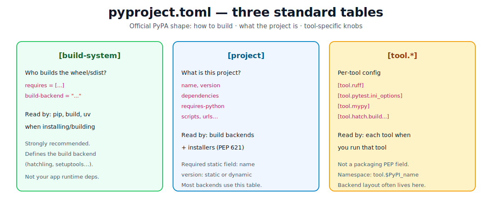
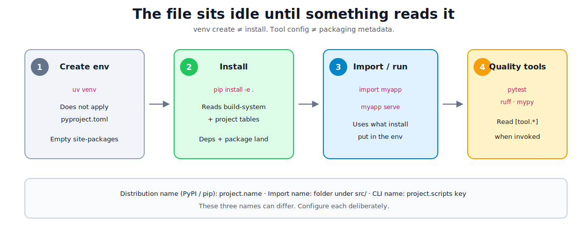
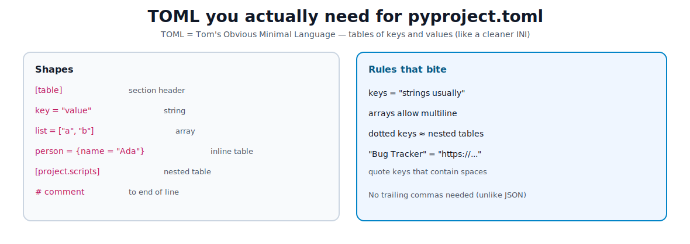

# Understanding pyproject.toml

[toc]

> **TL;DR:** `pyproject.toml` is the modern, standardized config file for a Python project. It declares **how to build** the package (`[build-system]`), **what the project is** (`[project]` — name, deps, scripts), and **tool settings** (`[tool.*]`). Creating a venv does not apply it; install and tools do. Written in **TOML**.

This note digs into the file itself. Layout and day-one scaffold live in [02](./02-project-structure-and-environment.md) and [02.5](./02.5-starter-scaffold-and-tooling.md).

---

## The core idea

**TOML** (Tom’s Obvious Minimal Language) is a simple config format: tables, keys, strings, arrays. Python packaging standardized on a file named **`pyproject.toml`** at the **repo root**.

Official packaging docs describe **three tables**:

| Table | Job |
| :--- | :--- |
| `[build-system]` | Which **build backend** builds wheels/sdists, and what it needs to run |
| `[project]` | Standard project metadata (PEP 621): name, version, deps, scripts… |
| `[tool.*]` | Settings for ruff, pytest, mypy, hatch, poetry, … |



> [!IMPORTANT]
> The file is a **recipe**, not a live environment. `uv venv` / `python -m venv` creates an empty kitchen. `pip install -e ".[dev]"` cooks from the recipe. Running `pytest` / `ruff` reads only the `[tool.*]` slices they care about.



---

## Tiny TOML grammar (only what you need)

You do not need the whole TOML spec. These shapes cover almost every `pyproject.toml` line:



```toml
# comment

[project]                          # table
name = "hello-svc"                 # string
version = "0.1.0"
dependencies = [                   # array of strings
  "httpx>=0.27",
  "pydantic>=2",
]

authors = [                        # array of inline tables
  {name = "Ada", email = "ada@example.com"},
]

[project.scripts]                  # nested table
hello-svc = "hello_svc.cli:main"   # key = "module.path:callable"

[project.urls]
Homepage = "https://example.com"
"Bug Tracker" = "https://github.com/me/hello-svc/issues"  # spaces → quote key
```

---

## Table 1 — `[build-system]`

A **build backend** is the library that knows how to turn your source tree into installable artifacts (wheel / sdist). Installers (`pip`, `uv`, `build`) read this table **first**, install the backend in an isolated build env, then ask it to build.

```toml
[build-system]
requires = ["hatchling >= 1.26"]
build-backend = "hatchling.build"
```

| Backend | Typical block |
| :--- | :--- |
| **Hatchling** | `requires = ["hatchling"]` · `build-backend = "hatchling.build"` |
| **setuptools** | `requires = ["setuptools >= 61"]` · `build-backend = "setuptools.build_meta"` |
| **Flit** | `requires = ["flit_core >= 3.12, <4"]` · `build-backend = "flit_core.buildapi"` |
| **PDM** | `requires = ["pdm-backend"]` · `build-backend = "pdm.backend"` |

> [!NOTE]
> PyPA strongly recommends always declaring `[build-system]`. For pure Python projects, any modern PEP 517 + PEP 621 backend is fine — pick one your team knows. Runtime deps do **not** go here; only tools needed to *build*.

**src layout** often needs a small backend-specific hint (this is *not* standardized in `[project]`):

```toml
# Hatchling
[tool.hatch.build.targets.wheel]
packages = ["src/hello_svc"]

# setuptools
[tool.setuptools.packages.find]
where = ["src"]
```

---

## Table 2 — `[project]` (PEP 621)

**PEP 621** defines standard metadata most backends understand. Prefer this table for new projects (instead of only `setup.py` / `setup.cfg`, or only Poetry’s old `[tool.poetry]` layout).

### Required-ish fields

| Field | Rule |
| :--- | :--- |
| `name` | **Required**, must be static (cannot be `dynamic`). Distribution / PyPI name. |
| `version` | Required, but may be **static** *or* listed under `dynamic` for the backend to fill. |

```toml
[project]
name = "hello-svc"       # pip install hello-svc
version = "0.1.0"
```

**Name rules (short):** ASCII letters, digits, `_`, `-`, `.` — not starting/ending with `_` / `-` / `.`. Names are compared case-insensitively; runs of `-` / `_` / `.` normalize as equal (`cool-stuff` ≈ `cool_stuff`).

### Three names people mix up

| Name | Where set | Example |
| :--- | :--- | :--- |
| **Distribution name** | `project.name` | `hello-svc` (`pip install hello-svc`) |
| **Import package** | Folder under `src/` | `import hello_svc` |
| **Console script** | key in `[project.scripts]` | shell command `hello-svc` |

They can differ on purpose (Pillow installs as `pillow`, imports as `PIL`).

### Dependencies

```toml
[project]
requires-python = ">=3.11"
dependencies = [
  "httpx>=0.27",
  "gidgethub[httpx]>4.0.0",
  "django>2.1; os_name != 'nt'",   # environment marker
]

[project.optional-dependencies]
dev = ["pytest>=8", "ruff>=0.6", "mypy>=1.11"]
gui = ["PyQt5"]
```

- **`dependencies`** — always installed with the project (runtime).
- **`optional-dependencies`** — named **extras**. Install with `pip install ".[dev]"` or `pip install "hello-svc[gui]"`.
- **`requires-python`** — real install constraint. Classifiers on PyPI are for browsing/search only; they do **not** block installs.

> [!TIP]
> Company apps often keep runtime deps lean and put pytest/ruff/mypy in a `dev` extra (or a lockfile workflow). That matches [02.5](./02.5-starter-scaffold-and-tooling.md).

### Scripts (CLI entry points)

```toml
[project.scripts]
hello-svc = "hello_svc.cli:main"
```

After install, the env gets a `hello-svc` executable that effectively does:

```python
from hello_svc.cli import main
raise SystemExit(main())
```

Use `[project.gui-scripts]` instead when you need Windows GUI apps without a console window. Difference mainly matters on Windows.

### Metadata you add when publishing (optional for private apps)

```toml
[project]
description = "Short one-line summary"
readme = "README.md"
license = "MIT"                          # modern: SPDX expression (PEP 639)
license-files = ["LICEN[CS]E*"]
authors = [{name = "Ada", email = "ada@example.com"}]
keywords = ["example", "cli"]
classifiers = [
  "Development Status :: 4 - Beta",
  "Programming Language :: Python :: 3",
]

[project.urls]
Homepage = "https://example.com"
Repository = "https://github.com/me/hello-svc"
Documentation = "https://example.com/docs"
```

**License today:** prefer `license = "MIT"` (SPDX string) + `license-files`, not the old `license = {text = "MIT"}` table (deprecated by PEP 639). Older backends may still want the table form — upgrade the backend if you hit errors.

### Static vs dynamic metadata

Most fields you write directly (**static**). Sometimes the backend should compute a value (version from git tag or `__version__`):

```toml
[project]
name = "hello-svc"
dynamic = ["version"]
# no version = "..." here — backend fills it
```

Rules of thumb:

- `name` **cannot** be dynamic.
- If a field is not in `dynamic`, the backend must **not** invent it.
- If it **is** in `dynamic`, the backend **must** be able to supply it or fail clearly.

---

## Table 3 — `[tool.*]`

Anything under `[tool.NAME]` is owned by the tool that owns the PyPI project `NAME`. Packaging PEPs do not define ruff/pytest keys — the tools do.

```toml
[tool.ruff]
line-length = 88
src = ["src", "tests"]

[tool.ruff.lint]
select = ["E", "F", "I", "UP", "B"]

[tool.pytest.ini_options]
testpaths = ["tests"]
addopts = "-q"

[tool.mypy]
python_version = "3.11"
files = ["src"]
strict = true
```

| When you run… | Table that matters |
| :--- | :--- |
| `pip install -e .` | `[build-system]`, `[project]`, sometimes `[tool.hatch]` / `[tool.setuptools]` for discovery |
| `pytest` | `[tool.pytest.ini_options]` |
| `ruff check` | `[tool.ruff]` |
| `mypy` | `[tool.mypy]` |

Poetry historically stored metadata under `[tool.poetry]`; Poetry 2+ also supports standard `[project]`. Prefer `[project]` for new greenfield work unless the team is standardized on Poetry’s full workflow.

---

## Minimal working file → realistic file

### Minimal (enough to install a package)

```toml
[build-system]
requires = ["hatchling"]
build-backend = "hatchling.build"

[project]
name = "hello-svc"
version = "0.1.0"
requires-python = ">=3.11"

[tool.hatch.build.targets.wheel]
packages = ["src/hello_svc"]
```

```bash
uv venv && source .venv/bin/activate
uv pip install -e .
python -c "import hello_svc; print(hello_svc.__file__)"
```

### Company-shaped (deps + scripts + tools)

```toml
[build-system]
requires = ["hatchling >= 1.26"]
build-backend = "hatchling.build"

[project]
name = "hello-svc"
version = "0.1.0"
description = "Example installable service"
readme = "README.md"
requires-python = ">=3.11"
dependencies = [
  "httpx>=0.27",
]
license = "MIT"

[project.optional-dependencies]
dev = ["pytest>=8", "ruff>=0.6", "mypy>=1.11"]

[project.scripts]
hello-svc = "hello_svc.cli:main"

[project.urls]
Repository = "https://github.com/me/hello-svc"

[tool.hatch.build.targets.wheel]
packages = ["src/hello_svc"]

[tool.ruff]
target-version = "py311"
line-length = 88
src = ["src", "tests"]

[tool.pytest.ini_options]
testpaths = ["tests"]

[tool.mypy]
python_version = "3.11"
files = ["src"]
strict = true
```

Full copy-paste tree: [02.5 Starter Scaffold](./02.5-starter-scaffold-and-tooling.md).

---

## How to set up (checklist)

1. **Repo root** — put `pyproject.toml` next to `README`, not inside `src/`.
2. **Pick a backend** — hatchling or setuptools are common defaults.
3. **Fill `[project]`** — at least `name`, `version`, `requires-python`.
4. **Point at your package** — src layout config for that backend.
5. **List runtime `dependencies`** — optional `dev` extra for tools.
6. **Add `[project.scripts]`** if you want a CLI on PATH after install.
7. **Add `[tool.*]`** for ruff / pytest / mypy so CI and laptops share one config.
8. **Create env, then install** — not the other way around as “magic”:

```bash
uv venv && source .venv/bin/activate
uv pip install -e ".[dev]"
python -c "import hello_svc; print('ok')"
pytest
ruff check src tests
```

9. **Build artifacts** (when you need a wheel/sdist):

```bash
pip install build
python -m build          # creates dist/*.whl and dist/*.tar.gz
```

---

## `pyproject.toml` vs other files

| File | Role now |
| :--- | :--- |
| `pyproject.toml` | Standard home for packaging + many tools |
| `setup.py` / `setup.cfg` | Legacy; still valid. Keep `setup.py` only if you need programmatic build steps (e.g. C extensions). |
| `requirements.txt` | Pinned install lists for apps/deploy; complements, does not replace, `[project]` for libraries |
| Lockfiles (`uv.lock`, `poetry.lock`) | Exact resolved versions for reproducible envs |
| `.python-version` | Which interpreter to use — not packaging metadata |

**Library vs app:** libraries should declare abstract deps in `[project]`. Applications often *also* freeze exact versions in a lockfile or requirements for deploy. Both can coexist.

---

## Common gotchas

| Symptom | Cause | Fix |
| :--- | :--- | :--- |
| `ModuleNotFoundError` after `venv` | Never installed the project | `pip install -e ".[dev]"` |
| Package installs as wrong import name | Backend packaged `src` itself | Set hatch `packages = ["src/pkg"]` or setuptools `where = ["src"]` |
| `license` must be a table | Old backend / old PEP 621 table form | Upgrade backend or use temporary legacy form |
| Extra not found | Typo in extra name | `pip install ".[dev]"` matches `[project.optional-dependencies] dev` |
| Scripts missing | Forgot install or inactive venv | Activate env; reinstall editable |
| Tool ignores config | Wrong table name | e.g. pytest wants `[tool.pytest.ini_options]` |
| Poetry-only metadata | Old `[tool.poetry]` without `[project]` | Prefer PEP 621 `[project]` for portable metadata |

> [!WARNING]
> Do not treat `PYTHONPATH=src` as a substitute for a correct `pyproject.toml` + install. The toml is how packaging stays honest; path hacks hide broken packaging.

---

## History in one glance (why this file exists)

| When | What |
| :--- | :--- |
| PEP 518 (2016) | `[build-system]` + `[tool]` — declare build deps without running arbitrary `setup.py` first |
| PEP 517 | Standard build-backend interface frontends call |
| PEP 621 (2020) | Standard `[project]` metadata table |
| PEP 639 | Modern `license` / `license-files` (SPDX) |
| Today | One file for packaging + tooling; `setup.py` optional |

---

## Sources

Primary references used for this note:

- [Writing your pyproject.toml (PyPA User Guide)](https://packaging.python.org/en/latest/guides/writing-pyproject-toml/)
- [pyproject.toml specification](https://packaging.python.org/en/latest/specifications/pyproject-toml/)
- [PEP 621 – Storing project metadata in pyproject.toml](https://peps.python.org/pep-0621/)
- [PEP 518 – Specifying Minimum Build System Requirements](https://peps.python.org/pep-0518/)
- [PEP 517 – A build-system independent format for source trees](https://peps.python.org/pep-0517/)
- [PEP 639 – Improving License Clarity with Better Package Metadata](https://peps.python.org/pep-0639/)
- [src layout vs flat layout](https://packaging.python.org/en/latest/discussions/src-layout-vs-flat-layout/)
- [TOML specification](https://toml.io/en/)
- [PyOpenSci – Make your package PyPI ready (pyproject.toml)](https://www.pyopensci.org/python-package-guide/tutorials/pyproject-toml.html)

## Related

- [Project Structure and Environment](./02-project-structure-and-environment.md) — installable packages, envs, imports
- [Starter Scaffold and Tooling](./02.5-starter-scaffold-and-tooling.md) — full pasteable `pyproject.toml` + tree
- [Packages, Modules, and Imports](./03-packages-modules-imports.md) — how `import` works day to day
- [Python Road Map](./01-python-road-map.md)
