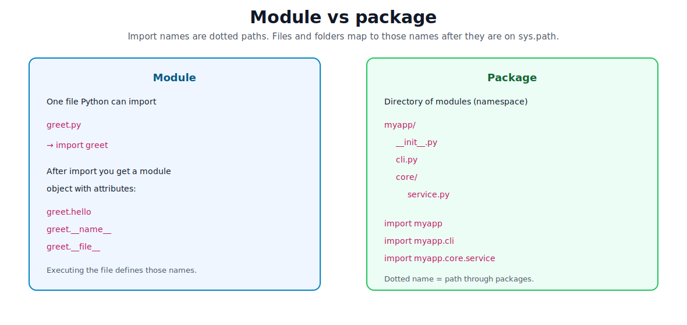
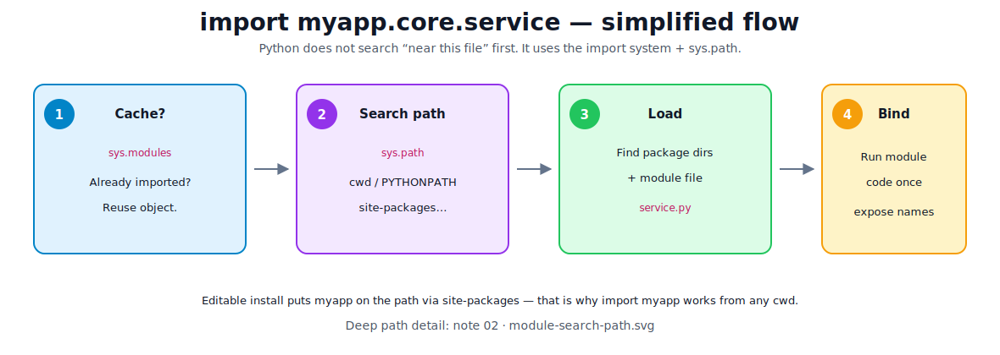
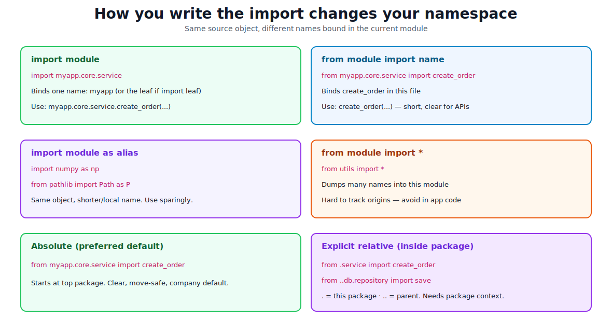
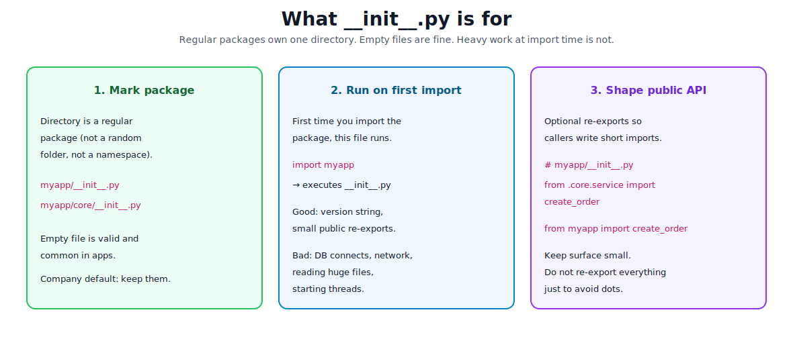

# Packages, Modules, and Imports

[toc]

> **TL;DR:** A **module** is usually one `.py` file. A **package** is a directory of modules (regular packages use `__init__.py`). You **import** by dotted names that Python finds on `sys.path` — not by “file next to me.” Prefer **absolute** imports of your installable package (`from myapp...`). Use **explicit relative** imports only inside a package. Avoid `import *` and `sys.path` hacks.

Related foundations: [project structure](./02-project-structure-and-environment.md) · [pyproject.toml](./02.6-understanding-toml-file.md).

---

## 1. The mental model

Python does not “include files” like C. It **loads modules into memory** and binds **names** in the current namespace.



| Term | What it is | Example |
| :--- | :--- | :--- |
| **Module** | Unit you can import — usually a `.py` file (also: package, built-in, extension) | `service.py` → `import myapp.core.service` |
| **Package** | Module that contains other modules — typically a directory | `myapp/`, `myapp/core/` |
| **Import name** | Dotted path Python uses | `myapp.core.service` |
| **Namespace** | Set of names available in a module (`dir(module)`) | attributes after import |

```text
src/myapp/
├── __init__.py          # package myapp
├── cli.py               # module myapp.cli
└── core/
    ├── __init__.py      # package myapp.core
    ├── models.py        # module myapp.core.models
    └── service.py       # module myapp.core.service
```

After the project is installed (editable in dev):

```python
import myapp                      # runs myapp/__init__.py
import myapp.core.service         # loads service.py as myapp.core.service
from myapp.core.service import create_order
```

> [!IMPORTANT]
> The **folder name** becomes the import segment. Rename carefully. Repo name `hello-svc` and import `hello_svc` are different concepts (see [02.6](./02.6-understanding-toml-file.md)).

---

## 2. What happens when you `import`



Roughly:

1. If the name is already in **`sys.modules`**, reuse it (imports are cached).
2. Otherwise walk **`sys.path`** (and finders) until something matches.
3. Load the file/package, **execute top-level code once**, bind names.
4. Store the module object in `sys.modules`.

```bash
python -c "import sys; print('\n'.join(sys.path))"
python -c "import myapp; print(myapp.__file__)"
python -c "import myapp.core.service as s; print(s.__name__, s.__file__)"
```

**`sys.path`** is the ordered list of places to look: script/cwd entry, `PYTHONPATH`, stdlib, `site-packages` (your venv). Full detail: [02 — module search path](./02-project-structure-and-environment.md#how-import-actually-finds-code).

> [!TIP]
> Company standard: make your package **installable** so it lives on the path via the env — not via `cd` tricks or permanent `PYTHONPATH`.

---

## 3. Import syntax — what each form does



Assume `myapp/core/service.py` defines `create_order` and `DEFAULT_TAX`.

### `import package.module`

```python
import myapp.core.service

myapp.core.service.create_order(...)
```

- Binds the **top name** needed to reach the module (here you typically keep the full path via attributes).
- Clear where things come from.
- Slightly verbose at call sites.

```python
import myapp.core.service as svc   # alias the leaf module
svc.create_order(...)
```

### `from package.module import name`

```python
from myapp.core.service import create_order, DEFAULT_TAX

create_order(...)
```

- Binds **selected names** directly in this file.
- Best when you use a few public functions/classes often.
- Still obvious origin if the import line is nearby.

```python
from myapp.core import service   # bind the submodule as "service"
service.create_order(...)
```

### `from package.module import name as alias`

```python
from myapp.core.models import Order as OrderModel
```

Use when names clash or a short local name is clearer. Do not rename everything randomly.

### `from package.module import *` — avoid in app code

```python
from myapp.core.service import *   # dumps public names into this module
```

- Hides where names come from.
- Can overwrite existing names silently.
- Breaks static analysis and code review.

OK-ish only in a REPL, or a carefully controlled `__init__.py` that defines `__all__` (still optional; prefer explicit re-exports).

### When to use which (company habit)

| Situation | Prefer |
| :--- | :--- |
| Public API call in app code | `from myapp... import ClassOrFunc` |
| Many related helpers from one module | `import myapp.x.y as y` then `y.helper` |
| Stdlib / third party with convention | `import numpy as np`, `from pathlib import Path` |
| “Grab everything” | **Don’t** — list names explicitly |

---

## 4. Absolute vs relative imports

### Absolute (default choice)

Starts from a **top-level package** on `sys.path`:

```python
from myapp.core.service import create_order
from myapp.db.repository import save
```

**Why companies prefer this**

- Readable: full path is in the line.
- Survives moving a file within the tree more safely than deep `..` chains.
- Works the same in tests after editable install.
- Matches how external users import your library.

### Explicit relative (inside a package only)

Dots mean “relative to the **current package**”:

| Syntax | Meaning |
| :--- | :--- |
| `.` | This package |
| `..` | Parent package |
| `...` | Grandparent, etc. |

```python
# inside myapp/core/service.py
from .models import Order           # myapp.core.models
from ..db.repository import save    # myapp.db.repository
```

**When relative is fine**

- Tight sibling modules inside one package.
- Library code that might be renamed at the top package someday (rare).

**When relative fails**

```text
ImportError: attempted relative import with no known parent package
```

That means the file was run as a **script** (`python path/to/file.py`) so it is not loaded as part of a package. Fix:

```bash
python -m myapp.core.service   # if meaningful
# or better: put entry in __main__/cli and import absolutely
```

### Implicit relative — do not use

Old Python 2 style like `import models` meaning “sibling models” is gone in Python 3. Always be explicit: absolute `myapp.core.models` or `from . import models`.

### Side-by-side comparison

```text
# File: src/myapp/core/service.py

# absolute — preferred in apps
from myapp.core.models import Order
from myapp.db.repository import save

# explicit relative — OK for nearby siblings
from .models import Order
from ..db.repository import save

# broken / fragile patterns
import models                 # looks for top-level models on sys.path
from utils import helper      # only works if a top-level "utils" package exists
```

---

## 5. `__init__.py` — the dunder that defines regular packages

**Dunder** means “double underscore” names Python treats specially (`__init__`, `__name__`, `__main__`, …).



### Regular package (what you want for normal apps)

A directory with **`__init__.py`** is a **regular package**. It lives in **one** place on disk and owns that import name.

```text
myapp/
├── __init__.py      # can be empty
├── cli.py
└── core/
    ├── __init__.py
    └── service.py
```

Empty `__init__.py` is completely valid. Put one in every package directory by default so tools and humans agree “this is a package.”

### What runs when?

```python
import myapp
```

1. Finds `myapp` package.
2. Executes `myapp/__init__.py` (first time only; then cached).
3. Binds the name `myapp` to that package module.

```python
import myapp.core.service
```

Loads parent packages as needed (`myapp`, then `myapp.core`, then the module). Parent `__init__.py` files run if not already loaded.

### Useful (light) contents

```python
# myapp/__init__.py
"""My application package."""

__version__ = "0.1.0"

# optional: short public API
from myapp.core.service import create_order

__all__ = ["create_order", "__version__"]
```

Then users can:

```python
from myapp import create_order
```

Keep the public surface **small**. Re-exporting every internal symbol turns `__init__.py` into a junk drawer and creates circular imports.

### What not to put in `__init__.py`

- Database connections
- Network calls
- Reading large config files
- Starting workers/threads
- Heavy imports that pull half the monorepo

Import should be **cheap**. Do real work in `main()`, framework startup, or explicit factory functions.

### Namespace packages (no `__init__.py`)

If a directory has **no** `__init__.py`, Python 3 may treat it as a **namespace package** (PEP 420): the same top name can be filled from **multiple** directories on `sys.path` (plugin ecosystems, split distributions).

| Regular package | Namespace package |
| :--- | :--- |
| Has `__init__.py` | No `__init__.py` |
| One owning directory | Can span many path entries |
| Can run init code | No package-level init file |
| Default for apps | Special tool for split libraries |

> [!WARNING]
> For normal applications and services: **always add `__init__.py`**. Skipping it by accident creates a namespace package and confusing import bugs. Detail: [02 — namespace packages](./02-project-structure-and-environment.md#namespace-packages-pep-420).

---

## 6. Other dunders you meet while importing

| Name | Meaning |
| :--- | :--- |
| `__name__` | Module’s dotted name, or `"__main__"` if this file is the entry module |
| `__file__` | Path to the loaded file (when available) |
| `__package__` | Package name this module belongs to (matters for relative imports) |
| `__path__` | On packages only: where submodules are searched |
| `__all__` | Optional list of names that `from module import *` should export |
| `__main__.py` | Makes `python -m myapp` run the package — see [02](./02-project-structure-and-environment.md#mainpy-on-a-package) |

```python
# myapp/cli.py
def main() -> int:
    print("running")
    return 0

if __name__ == "__main__":
    raise SystemExit(main())
```

When imported, `main` is available but not auto-run. When executed as the program, the guard fires.

---

## 7. Worked example — same layout, different import styles

```text
src/shop/
├── __init__.py
├── __main__.py
├── catalog.py
└── cart/
    ├── __init__.py
    └── totals.py
```

```python
# src/shop/catalog.py
def get_price(sku: str) -> int:
    return {"a": 10, "b": 25}[sku]
```

```python
# src/shop/cart/totals.py
from shop.catalog import get_price   # absolute — preferred

def cart_total(skus: list[str]) -> int:
    return sum(get_price(s) for s in skus)
```

Equivalent relative form inside `cart/totals.py`:

```python
from ..catalog import get_price
```

Caller / tests (after `pip install -e .`):

```python
from shop.cart.totals import cart_total

assert cart_total(["a", "b"]) == 35
```

Entry:

```python
# src/shop/__main__.py
from shop.cart.totals import cart_total

if __name__ == "__main__":
    print(cart_total(["a", "b"]))
```

```bash
python -m shop
```

### “Why not `from utils.notes import ...`?”

That only works if there is a **top-level importable package** named `utils` (installed or on `sys.path`) with a submodule `notes`.

| You write | Python looks for |
| :--- | :--- |
| `from utils.notes import x` | top-level package `utils`, then `utils.notes` |
| `from shop.cart.totals import x` | top-level package `shop`, then … |
| `from .notes import x` | sibling `notes` **inside the current package** |
| `import notes` | top-level module/package `notes` only |

Common mistake: a folder `utils/` sitting next to a script, **not installed**, and not a proper package — works only when cwd is lucky. Fix: put code under your real package (`shop/utils/notes.py`) and write:

```python
from shop.utils.notes import x
```

---

## 8. Intra-package design (how to keep imports clean)

```text
Good dependency direction:

  cli / api  →  core / services  →  models
                    ↓
                   db

Avoid:
  core → api          (domain depending on HTTP)
  models → everything
  circular A ↔ B
```

**Circular import** — A imports B while B imports A during loading:

```text
ImportError: cannot import name 'X' from partially initialized module ...
```

Fixes (in order of preference):

1. Move shared types to a third module (`models.py`, `types.py`).
2. Invert dependencies (high-level imports low-level, not reverse).
3. Import inside a function (lazy) only as a last resort.

```python
def save_order(order: "Order") -> None:
    from shop.db.repository import save  # lazy — avoid if structure can fix it
    save(order)
```

---

## 9. How to run code so imports work

| How you start | Package context | Relative imports | Typical use |
| :--- | :--- | :--- | :--- |
| `python -m shop` | Yes (`shop` on path if installed) | Work inside package | Preferred entry |
| `shop` console script | Yes | Work | Shipped CLI |
| `pytest` (editable install) | Yes | Work in package under test | Tests |
| `python src/shop/cart/totals.py` | **No** | Break | Avoid for package code |
| `python -c "from shop..."` | Yes if installed | n/a | Sanity check |

```bash
# day-one proof
uv pip install -e .
python -c "from shop.cart.totals import cart_total; print(cart_total(['a']))"
python -m shop
pytest
```

---

## 10. Decision guide — “how should I import this?”

```text
Is it the standard library or a third-party package?
  └─ Yes → import normally (import json / from pathlib import Path)

Is it your product code?
  └─ Is your package installed (editable in dev)?
        └─ No  → fix packaging first (see 02 / 02.5 / 02.6)
        └─ Yes → use absolute: from myapp... import ...

Are you inside a package and only touching a sibling?
  └─ Absolute still fine; relative (from .x import y) OK if clearer

Tempted to write import * or sys.path.append?
  └─ Stop → explicit names + installable layout
```

---

## 11. Common errors and fixes

| Error / smell | Meaning | Fix |
| :--- | :--- | :--- |
| `ModuleNotFoundError: myapp` | Not on `sys.path` / not installed | `pip install -e .` from project root |
| `No module named 'myapp.core'` | Missing package dir or `__init__` / wrong name | Check tree and import spelling |
| `attempted relative import with no known parent package` | File run as script | `python -m package.module` or absolute imports + proper entry |
| `cannot import name ... partially initialized` | Circular import | Restructure modules |
| Import works only from one directory | Layout / path luck | Installable package + absolute imports |
| Shadowing (`json.py` in project) | Your file hides stdlib | Rename local modules |

```python
# Anti-pattern — do not ship this
import sys
from pathlib import Path
sys.path.append(str(Path(__file__).resolve().parents[1]))
from utils import helper
```

---

## 12. Quick reference card

```python
# Prefer in applications
from myapp.core.service import create_order

# OK: module alias
import myapp.core.service as service

# OK inside package for siblings
from .models import Order

# Avoid
from myapp.core.service import *
sys.path.append("...")
import models  # hoping for a sibling without a package
```

```text
Regular package:   directory + __init__.py  (use this)
Namespace package: directory without __init__.py (special cases only)

import runs top-level module code once → caches in sys.modules
Keep __init__.py light; re-export a small public API only if useful
```

---

## Sources

- [Python Tutorial — Modules](https://docs.python.org/3/tutorial/modules.html)
- [The import system](https://docs.python.org/3/reference/import.html)
- [PEP 8 — Imports](https://peps.python.org/pep-0008/#imports) (absolute imports preferred)
- [PEP 328 — Imports: Multi-Line and Absolute/Relative](https://peps.python.org/pep-0328/)
- [PEP 420 — Implicit Namespace Packages](https://peps.python.org/pep-0420/)
- [Real Python — Absolute vs Relative Imports](https://realpython.com/absolute-vs-relative-python-imports/)
- [Real Python — Namespace Packages](https://realpython.com/python-namespace-package/)

## Related

- [Project Structure and Environment](./02-project-structure-and-environment.md) — `sys.path`, PYTHONPATH, src layout, `__main__`
- [Starter Scaffold and Tooling](./02.5-starter-scaffold-and-tooling.md)
- [Understanding pyproject.toml](./02.6-understanding-toml-file.md)
- [Basic Syntax and Data Types](./04-basic-syntax-and-data-types.md)
- [Understanding the Language](./06-understanding-the-language.md)
- [Python Road Map](./01-python-road-map.md)
