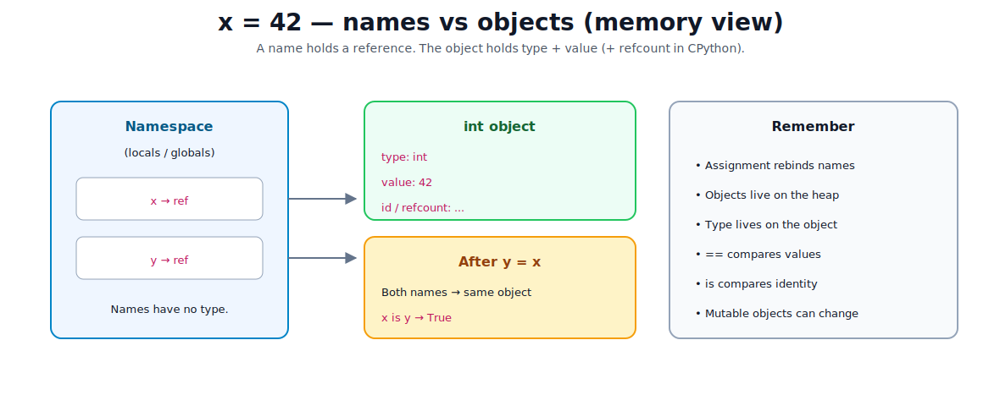
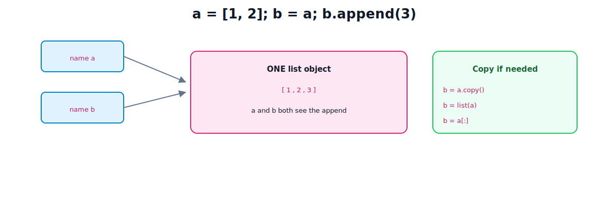

# Basic Syntax and Data Types

[toc]

> **TL;DR:** Python source is indentation-based. Values are **objects** on the heap; variables are **names** that reference them. Types live on objects (dynamic typing). Master the built-in scalars and collections, plus **identity vs equality** and **mutable vs immutable** — that is the memory story behind everyday bugs.

---

## 1. Syntax you need on day one

Python uses **indentation** (usually 4 spaces) instead of `{}` to mark blocks. Colons start a suite: `if`, `for`, `def`, `class`, `with`, …

```python
# comments start with #

name = "ada"              # assignment binds a name
print(name)               # call

def greet(who: str) -> str:   # annotations optional; see note 06
    return f"hello, {who}"

# Significant whitespace — this IndentationError if misaligned
if True:
    print("indented block")
```

| Rule | Detail |
| :--- | :--- |
| Case sensitive | `Name` ≠ `name` |
| Identifiers | letters, `_`, digits; not starting with digit |
| Strings | `'...'`, `"..."`, `'''...'''`, f-strings `f"{x}"` |
| Numbers | `int` unlimited precision; `float` IEEE-ish double |
| Booleans | `True` / `False` (subclass of `int`) |
| None | singleton “no value” object |

---

## 2. Names, objects, and memory (core model)

In Python you almost never “put a value *inside* a variable” like a C stack slot for a raw int. You **bind a name to an object**.d



Every object has (data model):

| Property | Meaning |
| :--- | :--- |
| **Identity** | Who it is — never changes. `id(obj)`; in CPython often the address |
| **Type** | What it is — `type(obj)` |
| **Value** | Payload (may change if mutable) |

```python
x = 42
y = x
print(x is y)       # True — same object
print(x == 42)      # True — equal value

x = [1, 2]
y = x
y.append(3)
print(x)            # [1, 2, 3] — shared mutable object
```



### Assignment rebinds; it does not copy

```python
a = [1, 2]
b = a          # b points to same list
b = [1, 2]     # b now points to a *new* list; a unchanged
```

### `is` vs `==`

| Operator | Compares |
| :--- | :--- |
| `==` | Equality of value (calls type’s equality logic) |
| `is` | Same object identity |

Use `is` for singletons (`None`, sometimes `True`/`False`). Prefer `==` for numbers and strings (small-int caching can make `is` look true by accident).

```python
a = 1000
b = 1000
a == b   # True
a is b   # implementation-dependent (often False for large ints)

x = None
x is None   # correct check
```

### CPython memory sketch (advanced)

Each heap object starts with a header roughly like:

- **reference count** — how many names/containers point here  
- **type pointer** — which type object defines behavior  

When refcount hits 0, CPython can free the object immediately (plus a cyclic GC for reference cycles). You rarely manage this by hand; you *do* feel it when large structures stay alive because something still references them.

```python
import sys
x = []
sys.getrefcount(x)   # elevated by the temporary argument itself
```

---

## 3. Built-in scalar types

| Type | Example | Mutable? | Notes |
| :--- | :--- | :--- | :--- |
| `int` | `0`, `-3`, `10**100` | no | Arbitrary size |
| `float` | `3.14`, `1e-3` | no | Binary float; not exact decimals |
| `bool` | `True`, `False` | no | `True == 1` |
| `str` | `"hi"`, `'hi'` | no | Unicode sequence of characters |
| `bytes` | `b"hi"` | no | Raw bytes |
| `NoneType` | `None` | n/a | Single instance |

```python
s = "hello"
# s[0] = "H"  # TypeError — strings immutable
s2 = s.upper()  # new string object
```

**Small-int cache (CPython):** integers in a small range are often pre-allocated singletons so `a is b` can be true for small equal ints. Treat as an optimization, not a language guarantee.

**String interning:** some strings may be shared; again, use `==` for content.

---

## 4. Collections — structure and memory

### List — dynamic array of references

```python
nums = [10, 20, 30]
nums.append(40)
```

Memory idea: the list object holds a **contiguous buffer of pointers** to element objects. Elements need not be the same type.

```python
mixed = [1, "two", [3]]
```

| Op | Typical cost (amortized) |
| :--- | :--- |
| index `a[i]` | O(1) |
| append | O(1) amortized |
| insert at front | O(n) |
| membership `x in a` | O(n) |

### Tuple — immutable sequence of references

```python
point = (3, 4)
# point[0] = 1  # TypeError
```

Tuple is fixed length; elements can still be mutable objects:

```python
t = ([1], 2)
t[0].append(9)   # OK — tuple’s slot still points to same list
```

### Dict — hash table of key → value references

```python
user = {"id": 1, "name": "ada"}
user["name"] = "Ada"
```

Keys must be **hashable** (immutable types like `str`, `int`, `tuple` of hashables). Lookup average O(1).

### Set — hash set of unique hashable elements

```python
tags = {"a", "b", "a"}  # {"a", "b"}
```

### Summary table

| Type | Ordered? | Mutable? | Duplicates? | Typical use |
| :--- | :--- | :--- | :--- | :--- |
| `list` | yes | yes | yes | sequences you change |
| `tuple` | yes | no | yes | fixed records, dict keys |
| `dict` | insertion order (3.7+) | yes | keys unique | maps |
| `set` | no | yes | no | membership / unique |
| `frozenset` | no | no | no | immutable set |

---

## 5. Mutability deep dive

**Immutable:** value of the object cannot change in place. Rebinding creates/uses another object.

**Mutable:** object can change while identity stays the same.

```python
# immutable rebind
n = 1
n = n + 1        # name n now refers to object 2

# mutable in-place
xs = [1]
xs.append(2)     # same list object grows
```

### Default-argument trap (classic memory bug)

```python
def add_item(item, bucket=[]):  # shared default list object!
    bucket.append(item)
    return bucket

add_item(1)  # [1]
add_item(2)  # [1, 2] — surprise
```

Fix:

```python
def add_item(item, bucket=None):
    if bucket is None:
        bucket = []
    bucket.append(item)
    return bucket
```

### Copying

```python
import copy

a = [[1], 2]
b = a.copy()          # shallow: new outer list, same inner list
c = copy.deepcopy(a)  # recursive new objects
```

---

## 6. Truthiness

Conditions use truth values. Empty/zero/None are falsey:

| Falsey | Truthy examples |
| :--- | :--- |
| `None`, `False`, `0`, `0.0`, `""`, `[]`, `{}`, `set()` | non-empty containers, non-zero numbers |

```python
if items:          # empty list → skip
    process(items)
```

---

## 7. Operators worth memorizing

```python
# arithmetic
//   # floor division
%    # remainder
**   # power

# comparison chain (nice Python-ism)
1 < x < 10

# logical
and  or  not   # short-circuit

# membership / identity
x in seq
x is y
```

**Walrus** (assignment expression):

```python
if (n := len(items)) > 10:
    print(n)
```

---

## 8. Type conversion and checking

```python
int("42"), float("3.5"), str(42), list("ab"), tuple([1, 2])
bool([])           # False

isinstance(x, int)
isinstance(x, (list, tuple))
```

Prefer duck typing / protocols in library code; use `isinstance` at boundaries when validating external data.

---

## 9. Memory levels — beginner → advanced

| Level | Picture |
| :--- | :--- |
| **Beginner** | “Variable holds a value” |
| **Correct mental model** | Name → reference → object (type + value) |
| **Containers** | Store references to other objects |
| **CPython** | Refcount + cyclic GC; `id` ≈ address |
| **Performance** | Many small objects, boxing, cache effects; use arrays/`numpy` when needed |
| **Identity bugs** | Shared mutables, default args, shallow copies |

```python
# See what you bind
x = [1, 2, 3]
print(type(x), id(x), x)
```

---

## Sources

- [Python data model](https://docs.python.org/3/reference/datamodel.html)
- [Built-in types](https://docs.python.org/3/library/stdtypes.html)
- [Python tutorial — Data structures](https://docs.python.org/3/tutorial/datastructures.html)

## Related

- [Conditionals and Loops](./05-conditionals-and-loops.md)
- [Understanding the Language](./06-understanding-the-language.md)
- [Packages, Modules, and Imports](./03-packages-modules-imports.md)
- [Python Road Map](./01-python-road-map.md)
