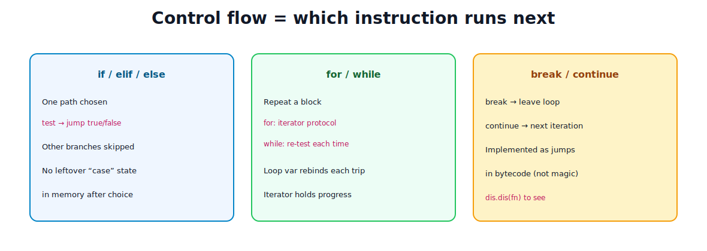
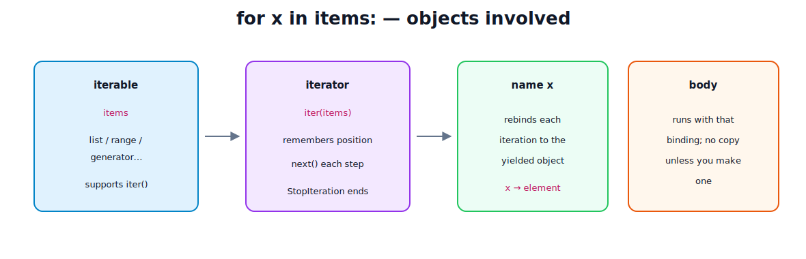

# Conditionals and Loops

[toc]

> **TL;DR:** Conditionals pick a path; loops repeat one. Under the hood both are **jumps in bytecode**. `for` uses the **iterator protocol** (iterable → iterator → `next` until `StopIteration`). Loop variables rebind names each trip; they do not copy elements unless you do.

---

## 1. Control flow as “what runs next”

Normal code runs top to bottom. Branches and loops change the **instruction pointer**.



You can inspect the jumps:

```python
import dis

def grade(score: int) -> str:
    if score >= 90:
        return "A"
    elif score >= 80:
        return "B"
    else:
        return "C"

dis.dis(grade)  # shows COMPARE/JUMP opcodes
```

---

## 2. Conditionals

```python
if cond:
    ...
elif other:
    ...
else:
    ...
```

- Only the first true branch runs.
- `else` is optional.
- Prefer clear conditions over deep nesting.

### Ternary expression

```python
label = "adult" if age >= 18 else "minor"
```

### Pattern matching (`match` / `case`) — 3.10+

```python
match status:
    case 200:
        print("ok")
    case 404 | 410:
        print("missing")
    case _:
        print("other")
```

Structural pattern matching is for shapes (literals, sequences, mappings, classes), not only C-style switches.

### Memory / runtime notes

- Conditions evaluate to objects, then truth-testing (`bool` protocol / `__bool__` / `__len__`).
- `and` / `or` **short-circuit** and return an operand object, not always a pure `bool`:

```python
x = "" or "default"    # "default"
y = "hi" and 42        # 42
```

No permanent “current branch” object is stored after the suite finishes—only side effects and what you assigned remain.

---

## 3. `while` loops

```python
n = 3
while n > 0:
    print(n)
    n -= 1
```

- Re-evaluates the condition each iteration.
- Risk: infinite loops if the condition never becomes false.
- Optional `else` runs if the loop **was not** ended by `break`:

```python
while try_connect():
    if success:
        break
else:
    print("never connected")
```

### Memory note

`while` itself allocates nothing special. Any growth comes from what you create in the body (lists, files left open, etc.).

---

## 4. `for` loops and the iterator protocol

```python
for item in items:
    print(item)
```

Desugars roughly to:

```python
it = iter(items)
while True:
    try:
        item = next(it)
    except StopIteration:
        break
    print(item)
```



| Piece | Role in memory |
| :--- | :--- |
| **Iterable** | Object that can produce an iterator (`list`, `dict`, `range`, file, generator…) |
| **Iterator** | Stateful object remembering position; implements `__next__` |
| **Loop name** | Rebinds to each yielded object (reference, not a copy of a big structure’s “value”) |

```python
items = [10, 20, 30]
for x in items:
    # x is a name bound to the int object 10, then 20, then 30
    pass
# after loop, x still bound to last value (30) — Python-specific gotcha
```

### `range` is not a giant list

```python
for i in range(1_000_000):
    ...
```

`range` is a small object that computes integers on demand (lazy). Materializing `list(range(N))` would allocate N integer objects’ worth of list slots.

### Looping dicts

```python
for key in d:            # keys
for key, value in d.items():
for value in d.values():
```

`.items()` / `.keys()` / `.values()` are views (3.x) — cheap, reflect dict changes carefully.

---

## 5. `break`, `continue`, `else` on loops

```python
for n in numbers:
    if n < 0:
        continue      # skip rest of body
    if n == target:
        print("found")
        break         # leave loop
else:
    print("not found")  # runs only if no break
```

| Keyword | Effect |
| :--- | :--- |
| `break` | Exit innermost loop |
| `continue` | Next iteration of innermost loop |
| `for/while else` | Run if loop finished **without** `break` |

Bytecode implements these as unconditional jumps out of or back into the loop block.

---

## 6. Nested loops and complexity

```python
for i in rows:
    for j in cols:
        ...
```

- Time multiplies (often O(n·m)).
- Each loop has its own iterator state.
- Prefer flattening / better data structures when nested depth grows.

---

## 7. Comprehensions (loop sugar with allocation)

```python
squares = [x * x for x in nums if x > 0]
unique = {x for x in nums}
index = {name: i for i, name in enumerate(names)}
gen = (x * x for x in nums)   # generator — lazy, not a list
```

| Form | Builds in memory |
| :--- | :--- |
| `[...]` | Full list now |
| `{...}` set/dict | Full collection now |
| `(...)` generator expr | Tiny generator; produces on demand |

```python
# memory-friendly
sum(x * x for x in huge_range)
```

Full treatment (nested fors, filter vs ternary, scope, recipes): [07.5 — Comprehensions](./07.5-lists-tuples-sets-dicts-comprehensions.md).
---

## 8. EAFP vs LBYL in control flow

**LBYL** — look before you leap:

```python
if key in data:
    return data[key]
```

**EAFP** — easier to ask forgiveness than permission (common in Python):

```python
try:
    return data[key]
except KeyError:
    return default
```

Loops often combine with `try` for I/O and parsing; keep `try` bodies small.

---

## 9. Common pitfalls (memory & logic)

| Pitfall | Why | Fix |
| :--- | :--- | :--- |
| Mutating a list while iterating it | Iterator / indices skew | Iterate a copy, or build a new list |
| `for x in items: items.remove(x)` | Skips elements | Don’t; filter instead |
| Assuming `for` copies elements | Only rebinds name | `.copy()` if you need independence |
| Using mutable default in loop helpers | Shared object | See note 04 |
| `while True` without break path | Hang | Clear exit condition |
| Building huge lists with comprehensions | RAM spike | Generators / streaming |

```python
# Safe filter
kept = [x for x in items if predicate(x)]

# Or in-place from the end
for i in range(len(items) - 1, -1, -1):
    if not predicate(items[i]):
        del items[i]
```

---

## 10. Memory levels — beginner → advanced

| Level | Understanding |
| :--- | :--- |
| **Beginner** | `if` chooses; `for` walks a list |
| **Intermediate** | Truthiness; `break`/`continue`; `range` lazy |
| **Solid** | Iterator protocol; loop var rebinding; `for/else` |
| **Advanced** | Bytecode jumps (`dis`); generator frame state; comprehension scopes (3.x) |
| **Runtime** | No separate “loop object” beyond iterator + frame locals |

**Frame locals:** while a function runs, loop variables live in the function’s **frame** (local namespace). When the function returns, the frame dies unless something still references a cell (closures). Nested functions that capture loop variables historically bit people—use default-arg binding if needed:

```python
funcs = [lambda i=i: i for i in range(3)]  # bind current i
```

---

## 11. Mini patterns

```python
# enumerate
for i, item in enumerate(items, start=1):
    ...

# zip
for a, b in zip(left, right):
    ...

# early exit search
def find(pred, seq):
    for x in seq:
        if pred(x):
            return x
    return None
```

---

## Sources

- [Python tutorial — More control flow tools](https://docs.python.org/3/tutorial/controlflow.html)
- [Iterator protocol](https://docs.python.org/3/library/stdtypes.html#iterator-types)
- [dis — Disassembler](https://docs.python.org/3/library/dis.html)
- [match statement](https://docs.python.org/3/reference/compound_stmts.html#the-match-statement)

## Related

- [Basic Syntax and Data Types](./04-basic-syntax-and-data-types.md)
- [Understanding the Language](./06-understanding-the-language.md)
- [Python Road Map](./01-python-road-map.md)
