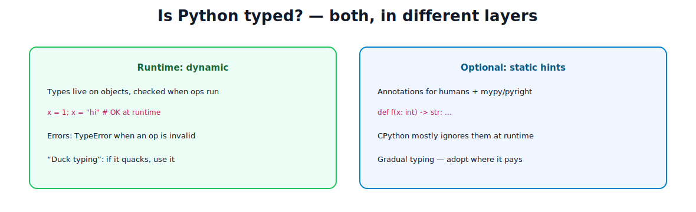
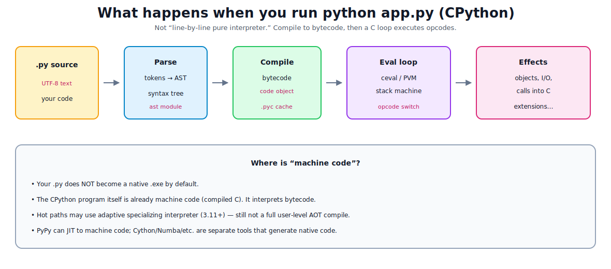

# Understanding the Language

[toc]

> **TL;DR:** **Python** is the language. **CPython** is the main implementation (written in C). It is **dynamically typed** at runtime, with **optional static type hints**. Running a program **compiles source to bytecode**, then a **virtual machine** (eval loop in C) executes opcodes. That is **not** the same as compiling your program to a standalone native machine-code binary—though the interpreter *itself* is machine code, and other implementations/tools can JIT or AOT to native code.

---

## 1. What “Python” means

| Term | Meaning |
| :--- | :--- |
| **Python (language)** | Syntax + semantics defined by the language reference / PEPs |
| **CPython** | Reference implementation: compiles to bytecode, interprets it in C (`ceval`) |
| **PyPy** | Alternative implementation with a **JIT** (can emit machine code for hot paths) |
| **Other** | Jython (JVM), IronPython (.NET), MicroPython (embedded), etc. |

When people say “Python is slow/fast,” they usually mean **CPython’s execution model + your algorithm + libraries** (many heavy libs are C under the hood).

> [!NOTE]
> Everything below focuses on **CPython** unless noted—the interpreter you get from python.org and most Linux packages.

---

## 2. Is Python typed?



### Runtime: dynamically typed, strongly typed

- **Dynamic:** types are associated with **objects**, not with variable names. A name can be rebound to different types over time.
- **Strong:** operations don’t silently coerce in wild ways as much as some “weak” languages—wrong ops raise `TypeError`.

```python
x = 1
x = "hello"      # allowed — name rebinding
# x + 1          # TypeError if x is still str
```

**Duck typing:** “If it walks like a duck…” — call methods/ops based on behavior, not declared class hierarchy.

### Optional static typing (gradual typing)

```python
def greet(name: str) -> str:
    return f"hello, {name}"
```

- Annotations are stored on functions (`__annotations__`).
- **CPython does not enforce them** during normal execution.
- Tools **mypy**, **pyright**, **pyre** check them offline / in CI.
- This is **gradual typing**: add hints where they pay off.

So: **not a statically typed language like Java/Rust by default**, but **can be statically checked** if you opt in.

---

## 3. Compiled or interpreted?

False dichotomy. CPython is **both**:

1. **Compile** source → **bytecode** (intermediate form).  
2. **Interpret** bytecode on a **virtual machine**.

It is **not** (by default) an ahead-of-time compiler to portable machine code like `gcc` producing an ELF/Mach-O binary of *your* program alone.



---

## 4. Pipeline: from `.py` to running

### Step A — Read source

UTF-8 text. Encoding can be declared (`# -*- coding: utf-8 -*-`); default is UTF-8.

### Step B — Parse

Lexer → tokens → **AST** (abstract syntax tree). Syntax errors die here.

```python
import ast
print(ast.dump(ast.parse("x = 1 + 2"), indent=2))
```

### Step C — Compile to bytecode

The AST becomes a **code object**: sequence of opcodes + constants + names.

```python
code = compile("x = 1 + 2", "<string>", "exec")
import dis
dis.dis(code)
```

Example flavor of opcodes: `LOAD_CONST`, `LOAD_NAME`, `BINARY_OP`, `STORE_NAME`, `RETURN_VALUE`, jumps for `if`/`for`.

### Step D — Cache (`.pyc`)

For imported modules, bytecode is often stored under:

```text
__pycache__/module.cpython-312.pyc
```

- Speeds up **next** import if source unchanged.
- Still **bytecode**, not machine code.
- Safe to delete; regenerated as needed.
- Your main script may not always write a `.pyc` the same way imports do; imports are the common case.

### Step E — Execute (eval loop / PVM)

CPython’s core is roughly: for each instruction in the current **frame**, switch on opcode, manipulate a **value stack** and locals, call functions (new frames), etc.

Documented conceptually as the **bytecode interpreter**; C entry points live around `Python/ceval.c` (`_PyEval_EvalFrameDefault` and friends).

```text
while program not finished:
    opcode = next instruction
    do what opcode says  # implemented in C
```

That C code is already **CPU machine code**. Your Python opcodes are **data** that the C program interprets.

### Step F — Objects and side effects

Opcodes create/bind Python objects, call methods (which may call more Python or C extension code), do I/O, etc. Memory model: [note 04](./04-basic-syntax-and-data-types.md).

---

## 5. Where machine code actually appears

| Layer | Machine code? |
| :--- | :--- |
| Your `.py` / `.pyc` | No — source / bytecode |
| CPython binary (`python`) | Yes — compiled C (and some asm) |
| C extensions (`numpy`, `cryptography`, …) | Yes — native code called from the VM |
| CPython 3.11+ specializing adaptive interpreter | Faster paths for hot bytecode; still VM-centric |
| **PyPy JIT** | Can compile hot traces to machine code at runtime |
| **Cython / mypyc / Numba / Nuitka** | Tools that generate native code or accelerate subsets |

> [!IMPORTANT]
> “Python compiles to machine code” is **misleading** for stock CPython. Accurate: **Python compiles to bytecode; the VM (machine code) executes it.** Extensions and alternate runtimes may add native code.

---

## 6. Runtime pieces you should know by name

| Concept | Role |
| :--- | :--- |
| **Code object** | Bytecode + metadata for a function/module |
| **Frame** | One active call: locals, stack, instruction pointer |
| **Module** | Object after import; has `__dict__` namespace |
| **GIL** (CPython) | Global lock so mainly one thread runs Python bytecode at a time (I/O and some C can release it) |
| **GC** | Refcounting + cyclic garbage collector |
| **sys.path / import system** | How modules are found — [note 03](./03-packages-modules-imports.md) |

### Call stack (memory)

```text
main frame
  └─ foo frame
       └─ bar frame   ← currently executing
```

Each frame holds local names (references to objects). Deep recursion → `RecursionError` when stack limit hit.

---

## 7. Dynamic features (why the VM is flexible)

Because types and attributes are runtime data, Python can:

```python
# runtime attribute
obj.dynamic = 1

# runtime import
mod = __import__("math")

# exec/eval (powerful, dangerous with untrusted input)
exec("x = 2")
```

Flexibility costs: harder AOT optimization than a closed static language, more per-operation checks.

---

## 8. Type hints vs runtime checks (practical)

```python
def add(a: int, b: int) -> int:
    return a + b

add("x", "y")   # runs in CPython → "xy"  (hints ignored)
```

To enforce at runtime, use explicit checks, pydantic, beartype, etc.—separate from CPython’s core.

Companies often: **hints + pyright/mypy in CI**, runtime validation at API boundaries only.

---

## 9. Minimal experiment kit

```bash
python -c "import dis; dis.dis(lambda x: x + 1)"
python -c "import sys; print(sys.version, sys.implementation.name)"
python -c "import this"   # Easter egg philosophy
```

```python
def demo(a, b):
    if a > b:
        return a
    return b

import dis
dis.dis(demo)
```

Watch for `COMPARE_OP`, `POP_JUMP_...`, `RETURN_VALUE`.

---

## 10. Mental model ladder

| Level | Story |
| :--- | :--- |
| **Novice** | “Python runs my lines one by one” |
| **Better** | Source → bytecode → VM executes opcodes |
| **Objects** | Names reference heap objects; types on objects |
| **Frames** | Calls push frames; locals live there |
| **Native boundary** | Hot work often in C extensions |
| **Alternatives** | PyPy JIT / specialized compilers when you need them |

---

## 11. Common misconceptions

| Myth | Reality |
| :--- | :--- |
| Python is only interpreted, never compiled | Compiles to bytecode first |
| `.pyc` is machine code | Bytecode for the VM |
| Variables have types | Objects have types; names are labels |
| Type hints make CPython enforce types | No — external checkers do |
| Multi-threading always speeds CPU code | GIL limits pure-Python CPU parallelism |
| One “Python speed” | Implementation + code + libraries dominate |

---

## Sources

- [Python data model](https://docs.python.org/3/reference/datamodel.html)
- [Execution model](https://docs.python.org/3/reference/executionmodel.html)
- [dis — bytecode](https://docs.python.org/3/library/dis.html)
- [CPython internals — bytecode interpreter](https://github.com/python/cpython/blob/main/InternalDocs/interpreter.md)
- [Ten Thousand Meters — How Python bytecode is executed](https://tenthousandmeters.com/blog/python-behind-the-scenes-4-how-python-bytecode-is-executed/)
- [PEP 484 — Type Hints](https://peps.python.org/pep-0484/)
- [typing module](https://docs.python.org/3/library/typing.html)

## Related

- [Basic Syntax and Data Types](./04-basic-syntax-and-data-types.md) — names, objects, mutability
- [Conditionals and Loops](./05-conditionals-and-loops.md) — jumps, iterators
- [Packages, Modules, and Imports](./03-packages-modules-imports.md)
- [Python Road Map](./01-python-road-map.md)
