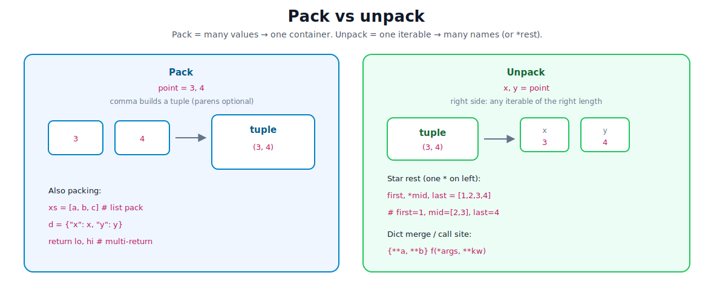

# Lists, Tuples, Sets, and Dicts

[toc]

> **TL;DR:** Python’s everyday data structures are **list**, **tuple**, **set**, and **dict**. All of them store **references** to objects. Choose by job: ordered growable sequence, fixed record, unique membership, or key→value lookup. Once you have them, **pack / unpack** (and `*`, `**`) is how you move values in and out cleanly.
---

## 1. The four jobs (start here)

You almost always want one of these four. Note [04](./04-basic-syntax-and-data-types.md) introduced them; this note is the working manual.


| Need | Reach for | Why |
| :--- | :--- | :--- |
| Sequence I will change | `list` | Index + append/pop in place |
| Fixed record / “don’t mutate the structure” | `tuple` | Immutable slots; can be dict keys if hashable |
| “Have I seen this?” / unique items | `set` | Hash membership, avg O(1) |
| Lookup by name/id | `dict` | Hash map, avg O(1) get/set |

> [!TIP]
> Default habit for beginners: everything is a list. Prefer a **dict** for named fields and a **set** for membership checks once the data grows.

---

## 2. List — ordered, mutable sequence

A **list** is a dynamic array of **references**. Indexing is O(1); membership (`x in xs`) walks the whole list (O(n)).


```python
nums = [10, 20, 30]
nums.append(40)       # [10, 20, 30, 40]
nums.insert(0, 5)     # shifts everything right — O(n)
nums.pop()            # remove last — O(1) amortized
nums[1:3]             # slice → new list [20, 30]
```

### Everyday operations

| Op | Example | Cost (typical) |
| :--- | :--- | :--- |
| Index | `xs[i]` | O(1) |
| Slice | `xs[a:b]` | O(b−a) new list |
| Append | `xs.append(x)` | O(1) amortized |
| Pop last | `xs.pop()` | O(1) |
| Pop/insert front | `xs.pop(0)`, `insert(0, x)` | O(n) |
| Membership | `x in xs` | O(n) |
| Sort in place | `xs.sort()` | O(n log n) |
| Sorted copy | `sorted(xs)` | O(n log n) + new list |

```python
# stack (end of list)
stack = []
stack.append(1)
stack.pop()

# reverse iterate without copying
for x in reversed(nums):
    ...

# sort key
people.sort(key=lambda p: p["age"])
```

### List comprehensions

Build a new list in one expression. Prefer them when the body is a short map/filter.

```python
squares = [x * x for x in range(10) if x % 2 == 0]
# [0, 4, 16, 36, 64]
```

> [!NOTE]
> A comprehension **allocates the full result**. For huge streams, use a generator expression `(...)` and consume it (see [05](./05-conditionals-and-loops.md)). Deep dive: [07.5 — Comprehensions](./07.5-lists-tuples-sets-dicts-comprehensions.md).
---

## 3. Tuple — ordered, immutable sequence

A **tuple** has a fixed number of slots. You cannot reassign `t[i]` or change length. Elements can still be **mutable objects** (the slots hold references).

```python
point = (3, 4)
# point[0] = 1   # TypeError

t = ([1], 2)
t[0].append(9)   # OK — same list object inside
# t → ([1, 9], 2)
```

### Why use tuples?

| Use | Example |
| :--- | :--- |
| Multiple return values | `return lat, lon` |
| Dict / set keys | `seen.add((r, c))` |
| Unpack | `x, y = point` |
| Heterogeneous record | `("ada", 36, True)` |

```python
def minmax(xs):
    return min(xs), max(xs)

lo, hi = minmax([3, 1, 4])
```

**Hashable:** a tuple is hashable only if **all** elements are hashable. `([1],)` is not a valid dict key.

Single-element tuple needs a trailing comma: `(1,)` not `(1)`.

---

## 4. Set — unique hashable items

A **set** is an unordered collection of unique **hashable** elements. Membership and add/remove are average O(1).

```python
tags = {"python", "go", "python"}   # {"python", "go"}
tags.add("rust")
"go" in tags                        # True

# empty set — not {}
empty = set()
```

### Set algebra (the good part)

```python
a = {1, 2, 3}
b = {2, 3, 4}

a | b    # union {1, 2, 3, 4}
a & b    # intersection {2, 3}
a - b    # difference {1}
a ^ b    # symmetric difference {1, 4}
```

| Goal | Pattern |
| :--- | :--- |
| Dedupe preserve nothing | `set(items)` |
| Dedupe keep order (3.7+) | `list(dict.fromkeys(items))` |
| Fast membership | build a `set`, then `x in s` |
| Immutable set | `frozenset(...)` — hashable, usable as dict key |

> [!IMPORTANT]
> Lists and other unhashable types cannot go in a set. Convert to tuple (if elements are hashable) or use another structure.

---

## 5. Dict — key → value map

A **dict** maps **hashable keys** to values (any objects). CPython dicts preserve **insertion order** (language guarantee since 3.7).


```python
user = {"id": 1, "name": "ada"}
user["name"] = "Ada"
user["email"] = "ada@example.com"   # insert

user.get("phone")                   # None if missing
user.get("phone", "n/a")            # default

for key, value in user.items():
    print(key, value)
```

### Views and safe access

| API | Meaning |
| :--- | :--- |
| `d.keys()` | live view of keys |
| `d.values()` | live view of values |
| `d.items()` | live view of (k, v) pairs |
| `d.get(k, default)` | no `KeyError` |
| `d.setdefault(k, v)` | get or insert default |
| `d \| other` (3.9+) | merge, right wins |
| `{**a, **b}` | merge into new dict |

```python
# merge (3.9+)
merged = defaults | overrides

# count with dict
counts: dict[str, int] = {}
for word in words:
    counts[word] = counts.get(word, 0) + 1

# or collections.Counter for that job
```

**Hashable keys:** `str`, `int`, `float` (careful with NaN), `bool`, `tuple` of hashables, `frozenset`. Not `list`, `dict`, `set`.

---

## 6. Packing, unpacking, and everyday manipulation

**Packing** means several values become one container. **Unpacking** means one iterable (or mapping) becomes several names. Python uses this constantly: multi-return, swap, loops, merges, and call sites.



### Pack — many values → one container

A comma builds a **tuple** (parentheses are optional except for empty or single-element cases). Lists and dicts pack with brackets / braces.

```python
point = 3, 4              # pack → (3, 4)
point = (3, 4)            # same, clearer

only = (1,)               # single-element tuple needs trailing comma
not_a_tuple = (1)         # just int 1

coords = [10, 20, 30]     # list pack
user = {"id": 1, "name": "ada"}

def minmax(xs):
    return min(xs), max(xs)   # pack two values for the caller
```

> [!NOTE]
> “Packing” is not a separate type of statement. It is just how assignment and `return` create a tuple (or you build a list/dict yourself).

### Unpack — one iterable → many names

On the **left** of `=`, names match positions of an **iterable** on the right. Length must match unless you use `*`.

```python
x, y = point              # x=3, y=4
a, b, c = "hi!"           # strings are iterable → "h", "i", "!"

# classic swap (no temp)
a, b = b, a

# multi-return unpack
lo, hi = minmax([3, 1, 4])

# nested
((r, g), b) = ((255, 0), 128)
```

Works for any iterable of the right length: list, tuple, str, generator, dict keys if you write `k1, k2 = d` (usually wrong intent—prefer `.items()`).

> [!WARNING]
> Too few or too many values → `ValueError: not enough values to unpack` / `too many values to unpack`. Use `*` when length varies.

### Star unpacking (`*`) — grab the rest

Exactly **one** starred target on the left may absorb the leftover sequence into a **list**.

```python
first, *rest = [10, 20, 30, 40]
# first=10, rest=[20, 30, 40]

*head, last = [10, 20, 30, 40]
# head=[10, 20, 30], last=40

first, *mid, last = [10, 20, 30, 40]
# first=10, mid=[20, 30], last=40

# ignore a middle value with _
name, _, age = ("ada", "unused", 36)
```

| Pattern | Result of `*` |
| :--- | :--- |
| `a, *b = xs` | `b` is a **list** (may be empty) |
| `*a, b = xs` | same |
| `a, *b, c = xs` | needs at least 2 items |

On the **right** (or in a call / display), `*` **expands** an iterable into positions:

```python
a = [1, 2]
b = [3, 4]
merged = [*a, *b]         # [1, 2, 3, 4]
t = (*a, 99)              # (1, 2, 99)

print(*a)                 # print(1, 2) — expand into args
```

### Dict unpacking (`**`) — keys as keywords / merge

`**` expands a mapping into **key=value** pairs. Keys must be strings when used as function keywords.

```python
defaults = {"host": "localhost", "port": 5432}
overrides = {"port": 5433}

cfg = {**defaults, **overrides}   # {"host": "localhost", "port": 5433}
# same idea (3.9+): defaults | overrides

def connect(host, port):
    ...

connect(**cfg)                    # connect(host=..., port=...)
```

> [!TIP]
> Prefer `d | other` (3.9+) when both sides are dicts and you want a clear merge. Use `{**a, **b}` when building a new dict from several mappings or mixing with literals: `{**base, "debug": True}`.

### Unpack in loops — `enumerate`, `zip`, `.items()`

These APIs already yield tuples; unpack each step.

```python
for i, item in enumerate(cart):
    print(i, item)

for sku, qty in stock.items():
    print(sku, qty)

for name, age in zip(names, ages):
    ...

# zip longest not needed often — lengths should match
for a, b in zip(xs, ys, strict=True):  # 3.10+: error if lengths differ
    ...
```

### In-place manipulation (mutate the same object)

Different from packing/unpacking: methods that **change** the container you already have.

```python
# list
xs = [1, 2]
xs.append(3)          # [1, 2, 3]
xs.extend([4, 5])     # [1, 2, 3, 4, 5]  — same as xs += [4, 5]
xs[1:3] = [20, 30]    # slice assignment (can grow/shrink)
xs += [6]             # mutates xs (for lists)
# ys = xs + [7]       # new list — does not mutate xs

# set
s = {1, 2}
s.add(3)
s |= {4, 5}           # update in place (union)
s &= {1, 3, 9}        # intersection update → {1, 3}

# dict
d = {"a": 1}
d.update(b=2, c=3)    # or d.update({"b": 2})
d |= {"c": 9}         # 3.9+ merge into d
d["a"] = 10
del d["b"]
```

| Structure | Build new | Mutate existing |
| :--- | :--- | :--- |
| list | `xs + ys`, `[*xs, *ys]`, slice copy | `append`, `extend`, `+=`, slice assign |
| tuple | `t + (x,)`, `(*t, x)` | n/a (immutable) |
| set | `a \| b`, `a & b` | `add`, `update`, `\|=`, `&=` |
| dict | `a \| b`, `{**a, **b}` | `update`, `\|=`, `d[k]=`, `del` |

> [!IMPORTANT]
> `xs += ys` for a **list** mutates `xs`. For a **tuple**, `t += (1,)` rebinds `t` to a **new** tuple (same syntax, different meaning). Know which object you hold.

### Quick recipes

```python
# head / tail
head, *tail = items

# peel first and last
first, *_, last = items

# dict → parallel lists
keys = list(d)
vals = list(d.values())

# parallel lists → dict
d = dict(zip(keys, vals))

# flatten one level of lists
flat = [x for row in rows for x in row]
# or: flat = [*row1, *row2, *row3]

# swap two dict keys' values (careful: both must exist)
d["a"], d["b"] = d["b"], d["a"]
```

Call-site packing with `*args` / `**kwargs` is covered in [08 — Functions and Classes](./08-functions-and-classes.md).

---

## 7. Choosing and converting

```python
list("ab")              # ["a", "b"]
tuple([1, 2])           # (1, 2)
set([1, 1, 2])          # {1, 2}
dict([("a", 1), ("b", 2)])
dict(zip(keys, vals))
```

| From → To | Common pattern |
| :--- | :--- |
| list → unique | `list(dict.fromkeys(xs))` keep order |
| pairs → dict | `dict(pairs)` or `{k: v for ...}` |
| dict → keys list | `list(d)` or `list(d.keys())` |
| two lists → dict | `dict(zip(ks, vs))` |

---

## 8. Copying: shallow vs deep

Assignment shares the container. `.copy()` / `list(xs)` / `xs[:]` make a **shallow** copy: new outer container, same element objects.


```python
import copy

a = [[1], 2]
b = a.copy()           # shallow
c = copy.deepcopy(a)   # full independent tree

a[0].append(9)
# b[0] is also [1, 9]
# c[0] still [1]
```

| Goal | Tool |
| :--- | :--- |
| Same object | `b = a` |
| New outer, shared inners | `a.copy()`, `list(a)`, `dict(a)`, `set(a)` |
| Independent nest | `copy.deepcopy(a)` |

---

## 9. Comprehensions for all four

```python
xs = [x * 2 for x in range(5)]           # list
ts = tuple(x * 2 for x in range(5))      # tuple (via generator)
ss = {x % 3 for x in range(10)}          # set
dd = {c: ord(c) for c in "ab"}           # dict
```

Dict and set comps use `{}` with different insides: `{k: v ...}` vs `{x ...}`. Nested fors, filters vs ternaries, generator laziness, and gotchas: [07.5 — Comprehensions](./07.5-lists-tuples-sets-dicts-comprehensions.md).
---

## 10. Mini example — inventory sketch

Scenario: track stock SKUs, unique tags, and a fixed warehouse coordinate.

```python
# list — ordered line items you edit
cart = ["sku-1", "sku-2", "sku-1"]

# set — unique tags for search
tags = {"electronics", "clearance"}
tags.add("gift")

# dict — sku → quantity
stock = {"sku-1": 10, "sku-2": 3}
stock["sku-1"] -= 1

# tuple — immutable location record (and hashable key)
warehouse = ("A", 12)          # aisle, bin
locations = {warehouse: stock}

# unpack + star: first line item, rest of cart
first_sku, *other_skus = cart

# dict items unpack in a loop
for sku, qty in stock.items():
    print(sku, qty)

aisle, bin_ = warehouse        # unpack fixed record
merged_tags = {*tags, "sale"}  # pack a new set with *

print(cart.count("sku-1"))     # 2
print("gift" in tags)          # True
print(locations[("A", 12)]["sku-2"])  # 3
print(first_sku, aisle)        # sku-1 A
```

---

## 11. Common gotchas

| Pitfall | What happens | Fix |
| :--- | :--- | :--- |
| `{}` for empty set | Creates empty **dict** | `set()` |
| Mutating list while iterating | Skipped / wrong elements | New list or iterate copy |
| `list` as dict key | `TypeError: unhashable` | `tuple(...)` if possible |
| Shallow copy surprise | Nested mutate shared | `deepcopy` or redesign |
| `dict` iteration + insert | RuntimeError if size changes | Build a new dict |
| Using list for membership in hot loop | O(n) each check | Convert to `set` once |
| Assuming set order | No index; order not semantic | Don’t rely on order for logic |
| Tuple “immutable” myth | Inner list still mutates | Only slots are fixed |
| Unpack wrong length | `ValueError` | Match count or use `*rest` |
| Two `*` on left | SyntaxError | Only one starred target |
| `**` non-str keys in call | TypeError | Keys must be `str` for kwargs |
| `list +=` vs `list +` | `+=` mutates; `+` builds new | Know which object aliases see |
> [!WARNING]
> Default argument `def f(xs=[])` shares one list across calls. Use `None` and create inside. Same trap for `{}` and `set()`. See [04](./04-basic-syntax-and-data-types.md).

```python
# membership upgrade
allowed = set(allowed_list)
if user_id in allowed:
    ...
```

---

## 12. Complexity cheat sheet

| Structure | Index | Membership | Insert typical |
| :--- | :--- | :--- | :--- |
| `list` | O(1) | O(n) | end O(1) amort.; middle O(n) |
| `tuple` | O(1) | O(n) | n/a (immutable) |
| `set` | n/a | O(1) avg | O(1) avg |
| `dict` | by key O(1) avg | key O(1) avg | O(1) avg |

“Average” for hash structures assumes good hash distribution; worst case can degrade (rare in normal Python use).

---

## Sources

- [Python tutorial — Data structures](https://docs.python.org/3/tutorial/datastructures.html)
- [Built-in types](https://docs.python.org/3/library/stdtypes.html)
- [TimeComplexity (Python wiki)](https://wiki.python.org/moin/TimeComplexity)
- [dict order guarantee (3.7)](https://docs.python.org/3/library/stdtypes.html#dict)

## Related

- [Comprehensions (list / set / dict / generator)](./07.5-lists-tuples-sets-dicts-comprehensions.md)
- [Basic Syntax and Data Types](./04-basic-syntax-and-data-types.md)
- [Conditionals and Loops](./05-conditionals-and-loops.md)
- [Functions and Classes](./08-functions-and-classes.md)
- [Understanding the Language](./06-understanding-the-language.md)
- [Python Road Map](./01-python-road-map.md)
