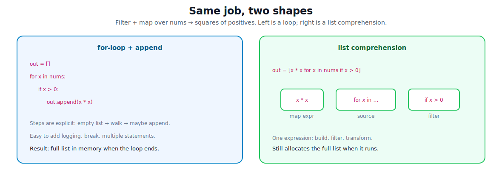
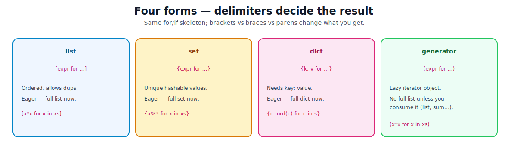
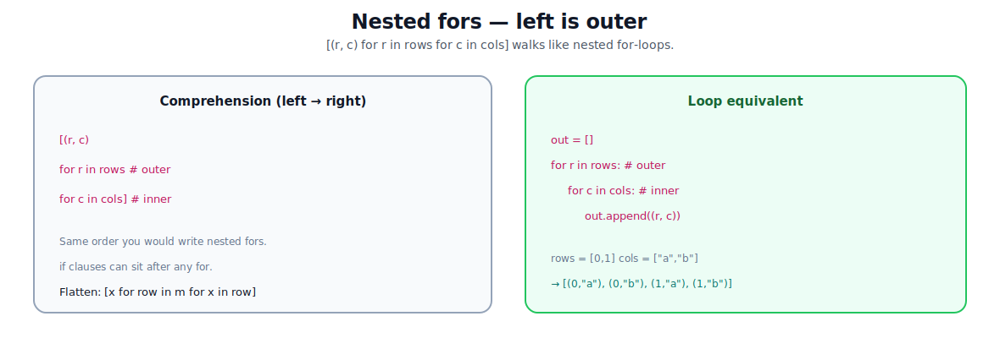

# Comprehensions for Lists, Sets, Dicts (and Generators)

[toc]

> **TL;DR:** A **comprehension** builds a collection in one expression: map, filter, or both. Brackets decide the result — `[]` list, `{}` set/dict, `()` generator (lazy). Prefer them when the body is short; fall back to a plain loop when logic gets multi-step.

Prerequisite: the four containers in [07 — Lists, Tuples, Sets, and Dicts](./07-lists-tuples-sets-dicts.md). Loops/iterators in [05 — Conditionals and Loops](./05-conditionals-and-loops.md).

---

## 1. The core idea

A list comprehension is **loop sugar that allocates a new list**. Same work as `for` + `append`, written as one expression.



```python
nums = [-2, -1, 0, 1, 2, 3]

# loop
out = []
for x in nums:
    if x > 0:
        out.append(x * x)
# out → [1, 4, 9]

# same job
out = [x * x for x in nums if x > 0]
# out → [1, 4, 9]
```

Read a comprehension left-to-right as: **produce this expression, walking this source, keeping rows that pass the filter**.

> [!TIP]
> If you cannot rewrite it as a short `for` + `append` in your head, the comprehension is probably too clever. Use a loop.

---

## 2. Anatomy of a list comprehension

General shape:

```python
[expression  for target in iterable  if condition]
```

| Piece | Role |
| :--- | :--- |
| `expression` | Value appended each kept step (the “map”) |
| `for target in iterable` | Source walk (like a `for` loop) |
| `if condition` | Optional filter — skip when false |

```python
# map only
squares = [x * x for x in range(5)]
# [0, 1, 4, 9, 16]

# filter only (identity map)
positives = [x for x in nums if x > 0]

# map + filter
even_squares = [x * x for x in range(10) if x % 2 == 0]
# [0, 4, 16, 36, 64]

# expression can be anything (call, ternary, unpack)
labels = ["even" if n % 2 == 0 else "odd" for n in range(4)]
# ["even", "odd", "even", "odd"]
```

**Ternary lives in the expression**, not as a second `if` for branching two outputs:

```python
# filter: keep some rows
[x for x in xs if x > 0]

# branch: always emit something, choose which
[x if x > 0 else 0 for x in xs]
```

> [!WARNING]
> `if` after `for` **drops** items. Ternary `a if cond else b` **always produces** a value. Mixing them up is a common bug.

---

## 3. Set and dict comprehensions

Same skeleton; braces change the container. Dicts need a **`key: value`** expression.



```python
words = ["aa", "bb", "aa", "cc"]

# set — unique results
unique_lens = {len(w) for w in words}
# {2}

# dict — key: value
index = {w: i for i, w in enumerate(words)}
# last write wins for duplicate keys: "aa" → 2

# char → code point
ord_map = {c: ord(c) for c in "ab"}
# {"a": 97, "b": 98}
```

| Form | Syntax | Notes |
| :--- | :--- | :--- |
| list | `[e for …]` | Order preserved; dups allowed |
| set | `{e for …}` | Unique; elements must be hashable |
| dict | `{k: v for …}` | Unique keys; last assignment wins |
| generator | `(e for …)` | Lazy — see §6 |

`{}` alone is an empty **dict**, not a set. Empty set comprehension still needs `set()` if you have no `for` body to write — there is no `{}` set literal for empty.

```python
empty_set = set()
# not: {}
```

---

## 4. Nested `for` — flatten and grids

Multiple `for` clauses nest **left-to-right = outer-to-inner**, same as nested loops.



```python
matrix = [[1, 2], [3, 4], [5, 6]]

# flatten one level
flat = [x for row in matrix for x in row]
# [1, 2, 3, 4, 5, 6]

# Cartesian-style pairs
pairs = [(r, c) for r in range(2) for c in "ab"]
# [(0, "a"), (0, "b"), (1, "a"), (1, "b")]

# filter on either level
kept = [x for row in matrix for x in row if x % 2 == 0]
# [2, 4, 6]
```

Equivalent nested loops for the flatten case:

```python
flat = []
for row in matrix:
    for x in row:
        flat.append(x)
```

> [!NOTE]
> Two or three `for`s is still readable. Deeper nests usually belong in a normal loop (or a helper function).

---

## 5. Unpacking inside comprehensions

Targets can unpack just like a normal `for` header. Useful with `.items()`, `enumerate`, `zip`.

```python
stock = {"sku-1": 10, "sku-2": 3}

# dict → list of labels
labels = [f"{sku}×{qty}" for sku, qty in stock.items()]

# filter on value, keep keys
low = [sku for sku, qty in stock.items() if qty < 5]
# ["sku-2"]

# rebuild / transform a dict
doubled = {sku: qty * 2 for sku, qty in stock.items()}

# zip two sequences into a dict
names = ["ada", "lin"]
ages = [36, 41]
people = {n: a for n, a in zip(names, ages)}
```

Tuple comps do **not** use `[...]`-style sugar. Build a tuple from a generator expression:

```python
t = tuple(x * x for x in range(5))
# (0, 1, 4, 9, 16)
```

---

## 6. Generator expressions — lazy sibling

A **generator expression** uses parentheses: `(expr for …)`. It does **not** build a list. It creates a small **iterator** that computes the next value when you ask (`next`, `for`, `sum`, `list`, …).

```python
nums = range(1_000_000)

# eager — huge list in RAM
squares_list = [x * x for x in nums]

# lazy — tiny object until consumed
squares_gen = (x * x for x in nums)

sum(x * x for x in nums)   # parens optional when already inside a call
```

| | List comp | Generator expr |
| :--- | :--- | :--- |
| Syntax | `[…]` | `(…)` |
| Memory | Full result now | One value at a time |
| Reusable | Yes (list stays) | **No** — exhausted after one pass |
| Indexing | `xs[i]` | Not without materializing |

```python
g = (x for x in range(3))
print(list(g))  # [0, 1, 2]
print(list(g))  # [] — already spent
```

> [!IMPORTANT]
> Use a generator expression (or generator function) when the stream is large and you only need a **single pass** (`sum`, `any`, `all`, write to file, pipeline). Use a list when you need random access, multiple passes, or to return a concrete collection.

See [05](./05-conditionals-and-loops.md) for the iterator protocol under `for`.

---

## 7. Scope — the loop variable stays inside (3.x)

In modern Python (3+), the comprehension’s `for` target is **local to the comprehension**. It does not leak into the surrounding scope the way a plain `for` does.

```python
x = "outer"
squares = [x * x for x in range(3)]
# x is still "outer" — the comp’s x was separate

# plain for still leaks
for y in range(3):
    pass
# y is 2 here
```

That isolation is why list comps are safer inside functions than people feared from Python 2 (where the name leaked).

Walrus (`:=`) inside a comp is allowed (3.8+) but easy to overuse — keep it rare and obvious:

```python
# sometimes useful: compute once, use twice
results = [y for x in xs if (y := f(x)) is not None]
```

---

## 8. When to use which form

| Goal | Prefer |
| :--- | :--- |
| New list, short map/filter | list comprehension |
| Unique values | set comprehension (or `set(...)`) |
| Build a mapping | dict comprehension |
| Huge stream, one pass | generator expression |
| Multi-statement body, `break`, side effects | plain `for` loop |
| Fixed record of values | tuple via `tuple(gen)` or pack |

```python
# side effects → loop (clearer intent)
for path in paths:
    process(path)          # not: [process(p) for p in paths]

# need early exit → loop
for x in xs:
    if bad(x):
        break
```

> [!TIP]
> Idiom: **comprehension for pure data shaping**; **loop for procedures** (I/O, mutate, control flow).

---

## 9. Mini example — inventory shaping

Scenario: same stock idea as [07](./07-lists-tuples-sets-dicts.md), shaped with comps.

```python
cart = ["sku-1", "sku-2", "sku-1", "sku-3"]
stock = {"sku-1": 10, "sku-2": 0, "sku-3": 4, "sku-4": 7}
tags_by_sku = {
    "sku-1": {"electronics", "gift"},
    "sku-2": {"clearance"},
    "sku-3": {"electronics"},
}

# unique SKUs in cart (order kept)
ordered_unique = list(dict.fromkeys(cart))

# only in-stock line items
available = [sku for sku in ordered_unique if stock.get(sku, 0) > 0]
# ["sku-1", "sku-3"]

# cart counts via dict comp + count
counts = {sku: cart.count(sku) for sku in ordered_unique}

# all tags that appear on available SKUs
tag_set = {t for sku in available for t in tags_by_sku.get(sku, set())}
# {"electronics", "gift"}

# price table sketch: sku → qty * unit (lazy until listed)
unit = {"sku-1": 5.0, "sku-2": 1.0, "sku-3": 3.0}
line_totals = {
    sku: counts[sku] * unit[sku]
    for sku in available
}

# stream a report without building an intermediate list of strings
report = "\n".join(
    f"{sku}: {line_totals[sku]:.2f}" for sku in available
)
print(report)
# sku-1: 10.00
# sku-3: 3.00
```

---

## 10. Common gotchas

| Pitfall | What goes wrong | Fix |
| :--- | :--- | :--- |
| Comp with side effects | Hard to debug; runs for every element | Plain `for` |
| Huge `[…]` over big range | RAM spike | `(…)` + consume, or chunk |
| Reusing a generator twice | Second pass empty | Materialize with `list(...)` if needed |
| `{k: v}` vs `{v}` mix-up | Wrong type or syntax error | Colon → dict; no colon → set |
| Filter `if` vs ternary | Dropped rows vs zeroed values | Choose deliberately |
| Nested comps too deep | Unreadable | Nested loops or helper |
| `list` of unhashables into set comp | `TypeError` | Don’t; or convert to tuples |
| Expecting tuple `[…]` syntax | There is no tuple-comp form | `tuple(x for x in …)` |

```python
# wrong mental model: "set of lists"
# { [1, 2] for _ in range(2) }  # TypeError: unhashable type: 'list'

# ok if elements are hashable
{ (1, 2) for _ in range(2) }     # {(1, 2)}
```

> [!CAUTION]
> `[f(x) for x in xs]` when `f` mutates or hits the network hides cost and failure modes. Prefer an explicit loop (or a named function with logging) for side-effectful work.

---

## 11. Cheat sheet

```python
# list
[e for x in xs]
[e for x in xs if cond]
[e for a in A for b in B]

# set / dict
{e for x in xs}
{k: v for x in xs}
{k: v for k, v in d.items() if cond}

# generator (lazy)
(e for x in xs)
sum(e for x in xs)
tuple(e for x in xs)
list(e for x in xs)   # materialize when you truly need a list
```

| Need | One-liner habit |
| :--- | :--- |
| Map | `[f(x) for x in xs]` |
| Filter | `[x for x in xs if p(x)]` |
| Map+filter | `[f(x) for x in xs if p(x)]` |
| Dedupe (unordered) | `{x for x in xs}` |
| Dedupe (order) | `list(dict.fromkeys(xs))` |
| Invert simple map | `{v: k for k, v in d.items()}` |
| Flatten 2D | `[x for row in m for x in row]` |

---

## Sources

- [Python tutorial — Data structures (list comps)](https://docs.python.org/3/tutorial/datastructures.html#list-comprehensions)
- [Displays for lists, sets and dictionaries](https://docs.python.org/3/reference/expressions.html#displays-for-lists-sets-and-dictionaries)
- [Generator expressions](https://docs.python.org/3/reference/expressions.html#generator-expressions)

## Related

- [Lists, Tuples, Sets, and Dicts](./07-lists-tuples-sets-dicts.md)
- [Conditionals and Loops](./05-conditionals-and-loops.md)
- [Functions and Classes](./08-functions-and-classes.md)
- [Understanding the Language](./06-understanding-the-language.md)
- [Python Road Map](./01-python-road-map.md)
