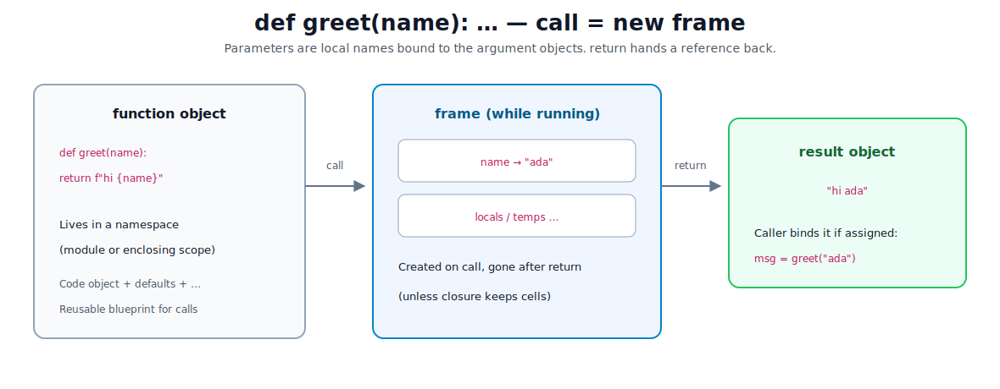
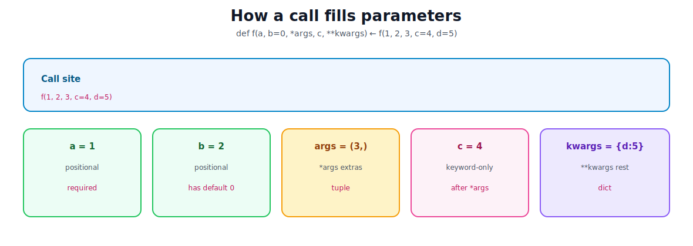
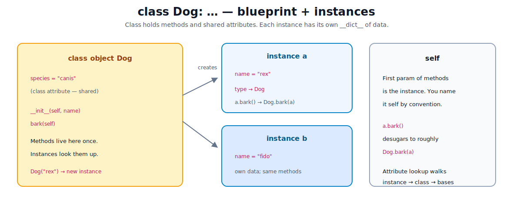
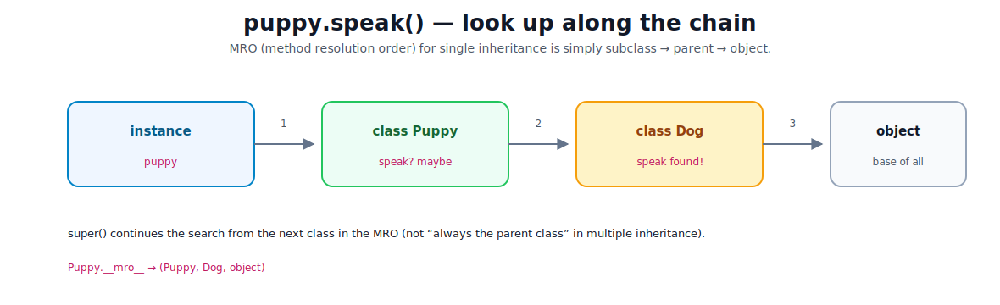

# Functions and Classes

[toc]

> **TL;DR:** A **function** packages reusable behavior: call it, get a new **frame** of locals, return a value. A **class** is a blueprint object; **instances** hold per-object data and share methods via lookup. Master parameters, scope, `self`, and `__init__` before inheritance tricks.

---

## 1. Functions — named reusable behavior

A **function** is an object created by `def` (or `lambda`). Calling it runs its body with a fresh set of **local names**.



```python
def greet(name: str) -> str:
    return f"hello, {name}"

msg = greet("ada")
print(msg)   # hello, ada
```

| Piece | Role |
| :--- | :--- |
| **Parameter** | Name in the definition (`name`) |
| **Argument** | Value you pass at the call (`"ada"`) |
| **Frame** | Temporary locals while the call runs |
| **Return** | Object handed back (or `None` if no `return`) |

```python
def answer():
    42          # expression discarded
                # implicit return None
```

> [!TIP]
> Type hints (`name: str`, `-> str`) document intent. CPython does **not** enforce them at runtime—tools like mypy/pyright do. See [06](./06-understanding-the-language.md).

---

## 2. Parameters: positional, keyword, defaults, * and **



```python
def f(a, b=0, *args, c, **kwargs):
    return a, b, args, c, kwargs

f(1, 2, 3, c=4, d=5)
# (1, 2, (3,), 4, {"d": 5})
```

| Form | Meaning |
| :--- | :--- |
| `a` | Required positional (or keyword) |
| `b=0` | Optional; default used if omitted |
| `*args` | Extra positionals → **tuple** |
| `c` after `*` | **Keyword-only** parameter |
| `**kwargs` | Extra keywords → **dict** |
| `/` (3.8+) | Positional-only before the slash |
| `*` alone | Forces keyword-only after it |

```python
def connect(host, port=5432, *, timeout=5):
    ...

connect("db", timeout=10)     # OK
# connect("db", 10)           # TypeError — timeout is keyword-only
```

### Defaults are evaluated once

Default values are bound **when `def` runs**, not on each call. Never use a mutable default.

```python
# BAD — one shared list
def add(item, bucket=[]):
    bucket.append(item)
    return bucket

# GOOD
def add(item, bucket=None):
    if bucket is None:
        bucket = []
    bucket.append(item)
    return bucket
```

### Unpacking at the call site

```python
def area(w, h):
    return w * h

dims = (3, 4)
area(*dims)                 # positional unpack

opts = {"w": 3, "h": 4}
area(**opts)                # keyword unpack
```

---

## 3. Scope: LEGB

When Python resolves a bare name, it searches:

1. **L**ocal — function body  
2. **E**nclosing — outer `def`s (closures)  
3. **G**lobal — module level  
4. **B**uilt-in — `len`, `print`, …  

```python
rate = 0.1                    # global

def price(base):
    tax = base * rate         # rate from global
    return base + tax

def outer():
    n = 1
    def inner():
        return n + 1          # enclosing cell
    return inner

fn = outer()
fn()                          # 2
```

| Keyword | Effect |
| :--- | :--- |
| `global x` | Assign to module-level `x` |
| `nonlocal x` | Assign to enclosing function’s `x` |

```python
def counter():
    n = 0
    def inc():
        nonlocal n
        n += 1
        return n
    return inc
```

> [!IMPORTANT]
> Assignment makes a name **local** for the whole function unless you declare `global` / `nonlocal`. Reading a global without assigning is fine.

---

## 4. First-class functions and lambdas

Functions are objects: pass them, store them, return them.

```python
def apply(fn, x):
    return fn(x)

apply(str.upper, "hi")        # "HI"

ops = {
    "double": lambda x: x * 2,
    "square": lambda x: x * x,
}
ops["square"](5)              # 25
```

A **lambda** is a small anonymous function: one expression, no statements.

```python
sorted(words, key=lambda s: s.lower())
```

Prefer `def` when the body needs a name, docstring, or multiple statements.

### Built-ins you will use constantly

| Built-in | Role |
| :--- | :--- |
| `len`, `sum`, `min`, `max` | Aggregate |
| `sorted`, `reversed` | Order (new list / iterator) |
| `enumerate`, `zip` | Pair with index / other seq |
| `map`, `filter` | Functional style (or use comps) |
| `any`, `all` | Boolean over iterables |
| `callable` | Is it callable? |

```python
any(x > 0 for x in nums)
all(isinstance(x, int) for x in nums)
```

---

## 5. Classes — blueprints for objects

A **class** defines a type: methods + shared attributes. An **instance** is one concrete object of that type.



```python
class Dog:
    species = "canis"              # class attribute (shared)

    def __init__(self, name: str):
        self.name = name           # instance attribute

    def bark(self) -> str:
        return f"{self.name}: woof"

a = Dog("rex")
b = Dog("fido")
print(a.bark())                    # rex: woof
print(a.species, b.species)        # canis canis
```

### `self` and `__init__`

- **`self`** — conventional name for the instance the method is bound to. `a.bark()` is roughly `Dog.bark(a)`.
- **`__init__`** — initializer run after the instance is created. Set up `self....` here. It should return `None`.

```python
class Point:
    def __init__(self, x: float, y: float):
        self.x = x
        self.y = y

    def move(self, dx: float, dy: float) -> None:
        self.x += dx
        self.y += dy
```

### Class attribute vs instance attribute

| Kind | Stored on | Shared? |
| :--- | :--- | :--- |
| Class attr | the class object | Yes, all instances see it unless shadowed |
| Instance attr | `instance.__dict__` | No — per object |

```python
Dog.species = "updated"   # all instances see the new value
a.name = "REX"            # only a changes
```

> [!WARNING]
> Mutable class attributes (`class C: items = []`) are shared across instances—same class of bug as mutable defaults. Prefer setting lists/dicts on `self` in `__init__`.

---

## 6. Methods, dunders, and representation

```python
class Point:
    def __init__(self, x, y):
        self.x = x
        self.y = y

    def __repr__(self) -> str:
        return f"Point({self.x!r}, {self.y!r})"

    def __eq__(self, other: object) -> bool:
        if not isinstance(other, Point):
            return NotImplemented
        return self.x == other.x and self.y == other.y
```

| Dunder | Role |
| :--- | :--- |
| `__init__` | Initialize new instance |
| `__repr__` | Unambiguous string (debug / repl) |
| `__str__` | User-facing string (`print`) |
| `__eq__` | `==` behavior |
| `__hash__` | Hashability (must match equality story) |
| `__len__` | `len(obj)` |

**Dunder** = “double underscore” special method. Python calls them for operators and built-ins.

### `@staticmethod` and `@classmethod`

```python
class Temp:
    def __init__(self, c: float):
        self.c = c

    @staticmethod
    def c_to_f(c: float) -> float:
        return c * 9 / 5 + 32

    @classmethod
    def from_f(cls, f: float) -> "Temp":
        return cls((f - 32) * 5 / 9)
```

| Decorator | First arg | Use |
| :--- | :--- | :--- |
| normal method | `self` (instance) | Per-object behavior |
| `@classmethod` | `cls` (class) | Alternate constructors |
| `@staticmethod` | none | Namespaced function; no self/cls |

---

## 7. Inheritance and `super`

A subclass reuses and extends a base class. Attribute lookup walks the **MRO** (method resolution order).



```python
class Animal:
    def speak(self) -> str:
        return "..."

class Dog(Animal):
    def speak(self) -> str:
        return "woof"

class Puppy(Dog):
    def speak(self) -> str:
        base = super().speak()     # Dog.speak in this linear chain
        return base + " (cute)"

p = Puppy()
p.speak()                          # woof (cute)
print(Puppy.__mro__)
# (Puppy, Dog, Animal, object)
```

```python
class Dog(Animal):
    def __init__(self, name: str):
        super().__init__()         # if base needs setup
        self.name = name
```

> [!NOTE]
> Prefer composition (“has a”) when inheritance trees get deep. For data-heavy types, consider `@dataclass` (stdlib) so you write less boilerplate `__init__` / `__repr__` / `__eq__`.

```python
from dataclasses import dataclass

@dataclass
class Point:
    x: float
    y: float
```

---

## 8. Mini example — small bank account

```python
class Account:
    def __init__(self, owner: str, balance: float = 0.0):
        self.owner = owner
        self._balance = balance          # "internal" by convention

    def deposit(self, amount: float) -> None:
        if amount <= 0:
            raise ValueError("amount must be positive")
        self._balance += amount

    def withdraw(self, amount: float) -> None:
        if amount > self._balance:
            raise ValueError("insufficient funds")
        self._balance -= amount

    @property
    def balance(self) -> float:
        return self._balance

    def __repr__(self) -> str:
        return f"Account({self.owner!r}, {self._balance!r})"


def transfer(src: Account, dst: Account, amount: float) -> None:
    src.withdraw(amount)
    dst.deposit(amount)


alice = Account("alice", 100)
bob = Account("bob")
transfer(alice, bob, 40)
print(alice.balance, bob.balance)   # 60.0 40.0
```

`@property` lets you use `alice.balance` like an attribute while still running method logic.

---

## 9. Functions vs classes — when which?

| Prefer a function when | Prefer a class when |
| :--- | :--- |
| One clear input → output | Several operations share state |
| Stateless transform | Lifecycle (`open`/`close`, connect) |
| Pipeline step | Many related methods on one entity |
| Simple script glue | You need polymorphism / interfaces |

```python
# function is enough
def total(prices: list[float]) -> float:
    return sum(prices)

# class earns its keep
class Cart:
    def __init__(self):
        self._items: list[str] = []

    def add(self, sku: str) -> None:
        self._items.append(sku)

    def count(self) -> int:
        return len(self._items)
```

---

## 10. Common gotchas

| Pitfall | Why | Fix |
| :--- | :--- | :--- |
| Mutable default arg | One object shared across calls | `None` + create inside |
| Mutable class attr | Shared across instances | Init on `self` |
| Forgetting `self` | Methods need the instance param | First param `self` |
| `return` missing in `__init__` is fine; returning non-`None` is wrong | `__init__` must not return a value | Only set attrs |
| Late-binding closures in loops | All lambdas see final `i` | `lambda i=i: ...` default bind |
| Overusing inheritance | Fragile hierarchies | Compose small objects |
| Shadowing builtins | `list = []` breaks `list(...)` | Different names |

```python
# late-binding fix
funcs = [lambda i=i: i for i in range(3)]
[f() for f in funcs]   # [0, 1, 2]
```

---

## 11. Memory / runtime sketch

| Level | Picture |
| :--- | :--- |
| Call | Push frame; bind params to arg objects |
| Locals | Names in the frame; gone when frame dies (unless closure) |
| Function object | Exists once in defining namespace |
| Class object | Methods live on the class |
| Instance | Own `__dict__` (or slots); type pointer to class |
| Method call | Load function from class; pass instance as `self` |

You do not deep-copy arguments on call—you pass **references**. Mutating a list argument mutates the caller’s list.

```python
def append_hi(xs: list[str]) -> None:
    xs.append("hi")

data = ["a"]
append_hi(data)
print(data)   # ["a", "hi"]
```

---

## Sources

- [Defining functions](https://docs.python.org/3/tutorial/controlflow.html#defining-functions)
- [Classes](https://docs.python.org/3/tutorial/classes.html)
- [Data model — special methods](https://docs.python.org/3/reference/datamodel.html)
- [dataclasses](https://docs.python.org/3/library/dataclasses.html)
- [LEGB / scopes](https://docs.python.org/3/tutorial/classes.html#python-scopes-and-namespaces)

## Related

- [Lists, Tuples, Sets, and Dicts](./07-lists-tuples-sets-dicts.md)
- [Basic Syntax and Data Types](./04-basic-syntax-and-data-types.md)
- [Conditionals and Loops](./05-conditionals-and-loops.md)
- [Understanding the Language](./06-understanding-the-language.md)
- [Python Road Map](./01-python-road-map.md)
