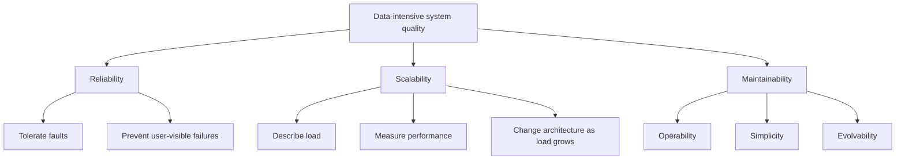

# Chapter 1: Reliable, Scalable, and Maintainable Applications

[toc]

> **TL;DR:** Chapter 1 of *Designing Data-Intensive Applications* gives the evaluation frame for data systems: reliability, scalability, and maintainability. A good system keeps working when things go wrong, remains effective as load grows, and stays understandable enough that people can operate and evolve it.

## Vocabulary

**Data-intensive application**

An application where the hard problems are usually data volume, data complexity, data correctness, and data change rate rather than raw CPU.

**Reliability**

The system continues to work correctly even when faults happen.

**Fault**

One component or assumption goes wrong. Example: a disk fails, a network request times out, or a process crashes.

**Failure**

The system as a whole stops providing the expected service to users.

**Scalability**

The system can cope with increased load by adding resources or changing architecture without unacceptable performance loss.

**Load parameter**

A measurable description of workload. Examples: requests per second, read/write ratio, active users, fan-out per request, queue size, or data volume.

**Response time**

The total time a client waits for a request to finish.

**Latency**

The time spent waiting before useful work can happen. In casual system design discussions, people often say latency when they mean response time.

**Throughput**

The rate at which the system completes work, such as requests per second or jobs per minute.

**Tail latency**

Slow responses near the high end of the distribution, such as p95, p99, or p999 response time.

**Maintainability**

The ability for engineers and operators to understand, run, debug, change, and extend the system over time.

**Operability**

How easy the system is to monitor, deploy, recover, and run in production.

**Simplicity**

How well the system hides accidental complexity behind clear abstractions.

**Evolvability**

How easily the system can change as requirements change.

## Chapter Frame

Chapter 1 is less about one specific database and more about how to judge any data system. The core question is: "What qualities make a data-intensive system good?"

The chapter groups those qualities into three big buckets:



The important mental move is to stop evaluating systems only by features. Two systems can have the same feature list but be very different once hardware fails, traffic grows, engineers leave, or requirements change.

## Data Systems Are Composed Building Blocks

Modern applications are usually assembled from specialized systems. A user-facing product might use a database for durable records, a cache for fast reads, a search index for text lookup, and queues or streams for asynchronous work.

That means "the database" is rarely the whole system. The system is the composition of many storage, communication, and processing components.

```text
request
  -> API service
  -> cache
  -> database
  -> message queue
  -> background worker
  -> search index
```

The design challenge is making the combined behavior reliable, scalable, and maintainable. A fast database does not guarantee a reliable product if queues back up, caches go stale, or operators cannot diagnose failures.

## Reliability

Reliability means the system continues to behave correctly despite faults. The distinction between a fault and a failure matters: faults are expected; failures are what users experience.

A reliable system assumes faults will happen and tries to prevent them from becoming user-visible failures.

### Sources Of Faults

Chapter 1 groups reliability concerns into hardware faults, software faults, and human errors. Each needs a different mitigation strategy.

| Fault type | Example | Common defenses |
| :--- | :--- | :--- |
| Hardware fault | disk failure, machine crash, network card failure | redundancy, replication, failover, backups |
| Software fault | bug, memory leak, cascading retry storm | testing, isolation, rate limits, circuit breakers, safe rollout |
| Human error | bad deploy, misconfiguration, accidental deletion | automation, guardrails, review, audit logs, easy rollback |

Hardware faults are often random and localized. Software and human faults can be more dangerous because they may affect many machines at once.

> [!IMPORTANT]
> A fault is not automatically a failure. Good system design contains faults before they become user-visible outages.

### Reliability Design Questions

When designing for reliability, ask what can go wrong and how the system responds. This is more useful than simply saying "the system should be highly available."

- What happens if one service instance crashes?
- What happens if the database primary becomes unavailable?
- What happens if a dependency gets slow instead of fully down?
- What happens if a deploy contains a bug?
- What happens if an operator runs the wrong command?
- What data can be reconstructed, and what data must never be lost?

The answers should show up in concrete mechanisms: retries with limits, idempotent operations, health checks, replication, backups, graceful degradation, and observability.

## Scalability

Scalability is the ability to cope with growth. It is not a one-word property like "this system is scalable." A system is scalable with respect to a particular workload and performance goal.

The chapter's flow is:

1. Describe load.
2. Describe performance.
3. Decide how to cope with increased load.

### Describe Load

Before scaling a system, define what kind of load is increasing. Different load parameters stress different parts of the architecture.

| System | Useful load parameters |
| :--- | :--- |
| Social feed | active users, posts per second, followers per user, fan-out size |
| Key-value API | reads per second, writes per second, hot-key percentage, item size |
| Queue worker | messages per second, processing time, retry rate, queue depth |
| Search system | documents indexed, queries per second, index size, freshness target |

Without load parameters, "make it scale" is too vague to guide design.

### Describe Performance

Performance should be described with distributions, not just averages. Averages hide the users who experience slow requests.

Important metrics include:

- Median response time: what a typical user sees.
- p95 or p99 response time: what slower users see.
- Throughput: how much work the system completes.
- Error rate: how often requests fail.
- Saturation: how close the system is to CPU, memory, disk, network, or queue limits.

Tail latency matters because real user experiences are often determined by the slowest dependency in a request path.

> [!TIP]
> In interviews, say the load assumptions out loud. "I am designing for 10,000 requests per second, 90 percent reads, p99 under 200 ms, and data growth of 1 TB per month" is much stronger than "this should be scalable."

### Cope With Load

Scaling strategies depend on what is bottlenecked. There is no universal architecture that scales every workload.

| Bottleneck | Possible approach |
| :--- | :--- |
| CPU on stateless services | add instances, load balance |
| database reads | caching, read replicas, denormalized views |
| database writes | partitioning, batching, log-based ingestion |
| hot keys | key sharding, request coalescing, caching |
| slow dependencies | asynchronous processing, queues, timeouts |
| large data scans | indexing, precomputation, columnar storage |

Scaling can be vertical, horizontal, or architectural. The best answer depends on load shape, correctness needs, operational cost, and complexity.

## Maintainability

Maintainability is about the people who will operate and change the system. Most of a system's lifetime is spent after the first version ships.

Chapter 1 breaks maintainability into operability, simplicity, and evolvability.

### Operability

Operability means making production understandable and manageable. A system should help operators answer what is happening, what changed, and how to recover.

Good operability includes:

- clear metrics, logs, traces, and dashboards
- meaningful alerts with runbooks
- safe deploys and rollbacks
- backup and restore procedures
- administrative tools for common tasks
- visibility into dependencies and queues

The goal is not just fewer incidents. The goal is faster diagnosis, safer recovery, and less guesswork.

### Simplicity

Simplicity means reducing accidental complexity. A simple system is not necessarily small; it is understandable.

Good abstractions hide details that callers do not need, but they should not hide failure modes. For example, a queue abstraction may hide broker internals, but engineers still need to understand retry behavior, ordering guarantees, and dead-letter handling.

> [!WARNING]
> Simplicity is not the same as minimal code. A tiny design can still be hard to operate if its failure modes are invisible.

### Evolvability

Evolvability means the system can adapt to new requirements. Data systems often live for years, and requirements change as products, teams, and traffic patterns change.

Examples of evolvability:

- adding a new read model without rewriting the source of truth
- changing a schema without downtime
- moving from synchronous work to asynchronous work
- adding a new data consumer without breaking existing ones
- replacing an internal component behind a stable interface

Evolvability improves when contracts are explicit, migrations are planned, and components are loosely coupled.

## Real-World Example: Order Service Review

Imagine an order service for an e-commerce app. It accepts checkout requests, stores orders, charges payment, and emits events for fulfillment and email.

Before jumping into technology choices, Chapter 1's frame asks us to describe reliability, scalability, and maintainability targets.

```yaml
service: order-service
load:
  steady_state_checkout_rps: 800
  peak_checkout_rps: 5000
  read_to_write_ratio: "4:1"
performance:
  p50_response_time_ms: 80
  p99_response_time_ms: 350
  availability_target: "99.9 percent monthly"
reliability:
  payment_requests_are_idempotent: true
  order_writes_are_durable_before_ack: true
  retry_policy: bounded_with_backoff
  rollback_strategy: blue_green_or_canary
maintainability:
  dashboards:
    - checkout_success_rate
    - payment_latency
    - database_write_latency
    - queue_depth
  runbooks:
    - payment_provider_degraded
    - order_database_failover
    - stuck_fulfillment_queue
```

This is not production-ready config. It is a design thinking tool: make the hidden assumptions explicit enough to discuss tradeoffs.

## System Design Checklist

Use this checklist when evaluating any data-intensive system. It turns the chapter into interview and design-review prompts.

### Reliability Checklist

Ask how the system behaves when things go wrong. A design that only works in the happy path is not finished.

- What are the most likely faults?
- Which faults can become user-visible failures?
- Which operations must be idempotent?
- What data is replicated?
- How are backups tested?
- What happens during partial dependency failure?
- How do deploys roll back?
- What alerts tell us users are affected?

### Scalability Checklist

Start with load and performance, then choose architecture.

- What are the main load parameters?
- What is the expected read/write ratio?
- What is the target p95 or p99 response time?
- What resource saturates first?
- Can stateless parts scale horizontally?
- Does state need partitioning?
- Are there hot keys or skewed traffic?
- What can be cached, precomputed, or processed asynchronously?

### Maintainability Checklist

Design for the engineers who will live with the system.

- Can a new engineer understand the architecture?
- Are failure modes visible in metrics and logs?
- Are operational tasks automated?
- Are interfaces stable and documented?
- Can schemas evolve safely?
- Can components be replaced incrementally?
- Is the design simpler than the problem requires?

## Common Pitfalls

These mistakes show up in both real systems and interviews.

| Pitfall | Better framing |
| :--- | :--- |
| Saying "make it scalable" without load numbers | Define load parameters and target performance. |
| Treating reliability as only uptime | Discuss correctness, durability, fault containment, and recovery. |
| Reporting only average latency | Include tail latency such as p95 and p99. |
| Adding complex distributed components too early | Start from load requirements and bottlenecks. |
| Ignoring human error | Add guardrails, automation, review, and rollback. |
| Treating maintainability as cleanup | Build operability, simplicity, and evolvability into the design. |

## Interview Questions and Answers

**Q: What are the three big qualities from Chapter 1?**

A: Reliability, scalability, and maintainability.

**Q: What is the difference between a fault and a failure?**

A: A fault is something going wrong inside the system. A failure is when the system stops providing the expected service to users.

**Q: How do you start a scalability discussion?**

A: First define load parameters, then define performance targets, then choose scaling approaches.

**Q: Why are averages not enough for performance?**

A: Averages hide slow requests. Tail latency shows what slower users experience.

**Q: What are the three parts of maintainability?**

A: Operability, simplicity, and evolvability.

**Q: Why is human error a reliability concern?**

A: Many outages come from misconfiguration, bad deploys, or operational mistakes, so systems need guardrails and recovery paths.

**Q: How should you say this chapter out loud in a system design interview?**

A: "I want to evaluate this design along three axes: reliability under faults, scalability under defined load, and maintainability for the team operating and evolving it."

## Sources

- Martin Kleppmann, *Designing Data-Intensive Applications*, Chapter 1: "Reliable, Scalable, and Maintainable Applications."
- [O'Reilly: Designing Data-Intensive Applications](https://www.oreilly.com/library/view/designing-data-intensive-applications/9781491903063/)
- [O'Reilly: Chapter 1 preview page](https://www.oreilly.com/library/view/designing-data-intensive-applications/9781491903063/ch01.html)
- [Martin Kleppmann: Designing Data-Intensive Applications](https://martin.kleppmann.com/2017/03/27/designing-data-intensive-applications.html)

## Related

- [Cloud and Datacenter](../Computer-Networking/12-cloud-and-datacenter.md)
