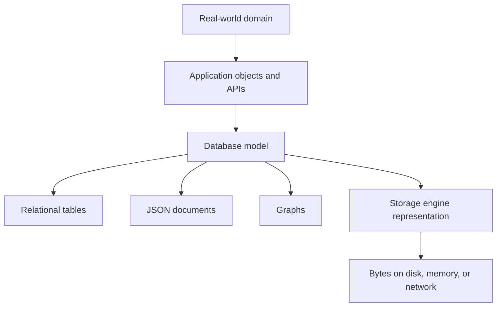
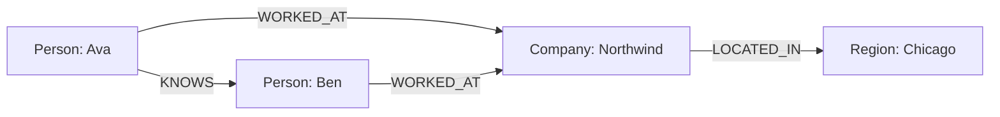

# Chapter 2: Data Models and Query Languages

[toc]

> **TL;DR:** Chapter 2 of *Designing Data-Intensive Applications* is about choosing the right way to represent and query data. Relational, document, and graph models are not just storage formats; they shape what feels easy, what feels awkward, and how the system evolves.

## Vocabulary

**Data model**

A way of representing information, relationships, and operations. Examples include relational tables, JSON documents, and graphs.

**Query language**

A language for asking a database to return or transform data. SQL, Cypher, SPARQL, and Datalog are examples.

**Relational model**

A model where data is represented as relations, usually called tables in SQL databases. Rows represent records and columns represent attributes.

**Document model**

A model where data is represented as self-contained documents, often JSON-like objects. It works well when one aggregate is usually read and written together.

**Object-relational mismatch**

The friction between application objects and relational tables. Application code often wants nested objects, while relational databases prefer normalized tables.

**Normalization**

Storing one fact in one place and referencing it by ID elsewhere. Normalization reduces duplication but usually increases the need for joins.

**Denormalization**

Copying related data into a record to make reads faster or simpler. Denormalization can improve locality but creates update-consistency work.

**Many-to-one relationship**

Many records point to the same shared entity. Example: many users live in one region.

**Many-to-many relationship**

Records on both sides can connect to many records on the other side. Example: users can belong to many groups, and groups can contain many users.

**Schema-on-write**

Data must match a schema before it is written. This is common in traditional relational databases.

**Schema-on-read**

Data is stored with less upfront enforcement, and the application interprets shape when reading. This is common in flexible document workflows.

**Declarative query**

A query that says what result is wanted without spelling out the step-by-step algorithm. SQL is the classic example.

**Imperative query**

A query or program that tells the computer exactly how to iterate, branch, and build the result.

**MapReduce**

A programming model that maps over records, emits intermediate values, and reduces grouped values. It is powerful but lower-level than declarative query languages.

**Graph model**

A model focused on entities and the relationships between them. It is useful when connections are the primary data.

**Vertex**

A node in a graph. It often represents an entity such as a person, place, account, product, or event.

**Edge**

A relationship between vertices. It often has a label and may have properties.

**Property graph**

A graph model where vertices and edges can both carry key-value properties.

**Triple-store**

A graph-like model where facts are stored as subject, predicate, object triples.

**Datalog**

A rule-based query language built around facts and inference rules.

## Chapter Frame

Chapter 2 is about the way data models shape thinking. A data model makes some operations feel natural and makes other operations awkward or expensive.

Most applications do not use only one model. They layer application objects, database representations, storage-engine bytes, and hardware-level representation on top of each other.



The design question is not "Which database is best?" The stronger question is: "Which data model matches the relationships, access patterns, and evolution pressure in this product?"

## Relational Model Versus Document Model

Relational databases store data in tables. Document databases store data in nested documents. Both can represent the same real-world facts, but they make different tradeoffs.

The relational model is strong when data is connected in many ways and the application needs flexible joins. The document model is strong when data is naturally one self-contained tree that is usually loaded together.

| Question | Relational model | Document model |
| :--- | :--- | :--- |
| Natural shape | Tables with references | Nested aggregate documents |
| Strength | Joins, constraints, many-to-many relationships | Locality, flexible shape, one-to-many trees |
| Weakness | Object-relational mismatch, join complexity | Duplicated data, weaker joins, app-side consistency |
| Common query style | SQL | JSON/document query APIs |
| Best fit | highly connected business data | profile, catalog, content, event-like records |

> [!IMPORTANT]
> The same data can often be modeled either way. The real choice is about access patterns, relationship complexity, and how often the shape changes.

### Object-Relational Mismatch

Application code often wants to work with nested structures: a user object with positions, education, links, skills, and contact methods. A relational database represents that same information as multiple tables.

This mismatch is why object-relational mapping tools exist. They translate between application objects and relational tables, but the translation can introduce complexity and performance surprises.

```json
{
  "user_id": 42,
  "name": "Ava",
  "positions": [
    {
      "company": "Northwind",
      "title": "Backend Engineer",
      "start_year": 2023
    }
  ],
  "skills": ["python", "postgres", "distributed-systems"]
}
```

The document version feels close to the application object. The relational version would usually split the same profile into tables such as `users`, `positions`, and `skills`.

### Many-To-One And Many-To-Many Relationships

Relationships are where the models separate. A document can easily contain a user's current job history, but shared entities are different.

If many users reference the same company, region, school, or skill, storing the literal string everywhere creates duplication. Storing an ID avoids duplication, but then reads need lookups or joins.

```sql
SELECT users.name, companies.name AS company_name
FROM users
JOIN positions ON positions.user_id = users.id
JOIN companies ON companies.id = positions.company_id
WHERE companies.name = 'Northwind';
```

Relational databases make this style of joining a first-class operation. Document databases can do it too in some systems, but the model is usually less centered around joins.

> [!TIP]
> A simple rule of thumb: if the data is mostly a tree, documents are comfortable. If the data is full of shared references and many-to-many relationships, relational or graph models tend to age better.

## The Birth Of NoSQL

NoSQL did not appear because SQL was suddenly obsolete. It appeared because teams had workloads and constraints that traditional relational systems did not always fit neatly.

Common motivations included large-scale datasets, open-source alternatives, specialized query needs, and more flexible data models. The result was not one replacement for relational databases, but many specialized systems.

| Motivation | Example pressure |
| :--- | :--- |
| Scale | very large write volume or data volume |
| Flexibility | records do not all share the same shape |
| Locality | one request usually needs one whole aggregate |
| Specialized access | search, graph traversal, time series, key-value lookup |
| Operational fit | team wants a simpler deployment or different consistency model |

The lesson is not "use NoSQL." The lesson is to understand what tradeoff the database is making for your workload.

## Relational Versus Document Databases Today

The boundary between relational and document systems has blurred. Relational databases often support JSON columns, and document databases often add indexing, aggregation, and some join-like features.

That convergence is practical. Real applications frequently need both structured relational constraints and flexible nested data.

### Schema Flexibility

Document databases are often described as schemaless, but that can be misleading. The schema still exists somewhere; it may just live in application code and conventions instead of being enforced centrally by the database.

Schema flexibility helps when records vary or requirements are changing quickly. It hurts when many services need a shared understanding of the data shape.

### Data Locality

Documents can improve read locality when the application usually needs the whole document. One read can fetch the whole aggregate.

That same locality can become a weakness when documents grow large or when the application often needs only a small piece. Updating duplicated fields across many documents can also be painful.

```json
{
  "order_id": "ord_1001",
  "customer": {
    "id": "cus_7",
    "display_name": "Ava"
  },
  "items": [
    {
      "sku": "keyboard-01",
      "quantity": 1,
      "price_cents": 12900
    }
  ]
}
```

This order document is convenient if order pages always show customer summary and line items together. It is less convenient if customer names change often and are copied into millions of historical orders.

## Query Languages For Data

Chapter 2 contrasts declarative and imperative querying. This is one of the most important ideas in the chapter because it affects both developer experience and database optimization.

A declarative query says what result you want. The database can choose indexes, join order, parallel execution, and other implementation details.

```sql
SELECT name
FROM users
WHERE active = true
ORDER BY created_at DESC
LIMIT 20;
```

In an imperative approach, the caller describes how to loop, filter, sort, and return. That gives procedural control but leaves fewer choices to the query optimizer.

```python
active_users = []

for user in users:
    if user["active"]:
        active_users.append(user)

active_users.sort(key=lambda user: user["created_at"], reverse=True)
names = [user["name"] for user in active_users[:20]]
```

Declarative query languages are powerful because they leave room for the database to improve execution without changing the application query.

### Declarative Queries On The Web

The chapter uses web examples to show the same idea outside databases. CSS is declarative: it describes which elements should have which style, and the browser decides how to apply it.

That same style is useful in databases. When the user says what they want, the engine has freedom to choose an efficient plan.

### MapReduce Querying

MapReduce is more imperative than SQL-like query languages. It exposes a programming model where the developer writes functions to map input records and reduce grouped intermediate results.

This can be useful for large-scale processing, but it is harder for a database to optimize arbitrary code. Many systems later added higher-level query layers because declarative interfaces are usually easier to write, optimize, and maintain.

```python
def map_order(order):
    for item in order["items"]:
        emit(item["sku"], item["quantity"])

def reduce_sku(sku, quantities):
    emit(sku, sum(quantities))
```

This example expresses the idea of aggregating quantities by SKU. A SQL-style aggregation would usually be shorter and easier for the engine to optimize.

## Graph-Like Data Models

Graph models are useful when relationships are not just metadata but the main thing being queried. Social networks, recommendation systems, fraud detection, dependency graphs, and knowledge graphs often fit this shape.

In a graph, vertices represent entities and edges represent relationships. Both can carry properties, depending on the graph model.



The power of a graph model is traversal. Instead of asking for one table or one document, you often ask for paths through relationships.

### Property Graphs And Cypher

Property graphs store vertices, edges, and properties. Cypher is a declarative graph query language commonly associated with Neo4j.

The syntax visually resembles paths. That makes it natural to express relationship-heavy questions.

```cypher
MATCH (person:Person)-[:WORKED_AT]->(company:Company)<-[:WORKED_AT]-(candidate:Person)
WHERE person.name = 'Ava'
RETURN candidate.name, company.name;
```

This asks for people who worked at the same company as Ava. The relationship path is the center of the query.

### Graph Queries In SQL

Relational databases can represent graphs with tables such as `vertices` and `edges`. They can query those graphs too, often with recursive queries.

The tradeoff is ergonomics. SQL can do many graph tasks, but deep traversal can be more awkward than a graph-native query language.

### Triple-Stores, SPARQL, And Datalog

Triple-stores represent facts as subject, predicate, object. SPARQL is a query language for RDF-style data.

Datalog represents data as facts and rules. It is especially interesting because it separates facts from inference rules, allowing derived relationships to be queried.

```prolog
parent(alice, bob).
parent(bob, cara).

grandparent(X, Z) :- parent(X, Y), parent(Y, Z).
```

This example says Alice is Bob's parent, Bob is Cara's parent, and a grandparent relationship can be inferred through two parent links.

## Choosing A Data Model

The data model should follow the shape of the domain and the dominant access patterns. Start with the relationships, not with a favorite database.

Use this table as a practical interview and design-review shortcut.

| Data shape | Usually consider | Why |
| :--- | :--- | :--- |
| Self-contained aggregate | document model | read/write locality and flexible shape |
| Many shared references | relational model | joins, constraints, normalization |
| Relationship traversal | graph model | paths and connections are first-class |
| Simple lookup by key | key-value model | low-latency direct access |
| Append-heavy events | log/event model | ordered history and downstream consumers |
| Analytics over large columns | columnar/warehouse model | scan efficiency and aggregation |

> [!WARNING]
> Data model choice is hard to reverse once the product grows around it. Choose based on the queries and relationships you expect, not on what sounds modern.

## Real-World Example: Product Catalog

Imagine an e-commerce product catalog. Product pages need fast reads, search needs flexible attributes, orders need stable historical data, and recommendations need relationships between users, products, brands, and categories.

One product might fit naturally as a document because its page loads the product, variants, images, and attributes together.

```json
{
  "product_id": "prod_42",
  "name": "Mechanical Keyboard",
  "brand": {
    "id": "brand_7",
    "name": "Northwind"
  },
  "variants": [
    {
      "sku": "keyboard-01-blue",
      "color": "blue",
      "price_cents": 12900
    },
    {
      "sku": "keyboard-01-black",
      "color": "black",
      "price_cents": 12900
    }
  ],
  "attributes": {
    "switch_type": "tactile",
    "layout": "75 percent"
  }
}
```

The same product catalog may still need relational tables for orders and inventory because those workflows need constraints, joins, and careful consistency.

```sql
CREATE TABLE inventory (
  sku TEXT PRIMARY KEY,
  warehouse_id TEXT NOT NULL,
  quantity_on_hand INTEGER NOT NULL,
  quantity_reserved INTEGER NOT NULL
);

SELECT sku
FROM inventory
WHERE warehouse_id = 'chi-1'
  AND quantity_on_hand - quantity_reserved > 0;
```

Recommendations may fit a graph because they care about paths: users viewed products, products belong to brands, brands belong to categories, and similar users bought related products.

```cypher
MATCH (:User {id: 'user_7'})-[:VIEWED]->(:Product)<-[:VIEWED]-(other:User)-[:BOUGHT]->(recommendation:Product)
RETURN recommendation.id, count(*) AS score
ORDER BY score DESC
LIMIT 10;
```

The lesson is that one product can use multiple data models. The clean design is not purity; it is making each model own the access pattern it is good at.

## System Design Checklist

Use these questions when you are deciding between relational, document, and graph models. The goal is to make the tradeoff explicit.

- What are the top five queries the application must serve?
- Is the dominant shape a tree, a set of tables, or a web of relationships?
- Which data is duplicated?
- Which duplicated fields must stay consistent?
- Which relationships are many-to-one or many-to-many?
- Do reads need joins, traversals, or whole-document locality?
- How often does the schema change?
- What constraints must the database enforce?
- Can the query optimizer help, or is important logic hidden in application code?
- What happens when one field needs to be renamed across old and new records?

## Common Pitfalls

These mistakes appear often when teams choose a database before understanding the data model.

| Pitfall | Better framing |
| :--- | :--- |
| "Documents are schemaless" | The schema moved into application code and conventions. |
| "NoSQL means no structure" | Most NoSQL systems still encode strong assumptions about access patterns. |
| "Joins are always bad" | Joins are useful when relationships are shared and normalized. |
| "One database should model everything" | Use the model that matches the access pattern, but keep ownership clear. |
| "Graphs are only for social networks" | Graphs help whenever relationship traversal is central. |
| "Declarative queries are just syntax sugar" | Declarative queries give the optimizer room to improve execution. |

## Interview Questions and Answers

**Q: What is the main point of Chapter 2?**

A: Data models shape how we think about the problem. Choosing a model changes which operations are simple, expensive, or awkward.

**Q: When is a document model a good fit?**

A: When the data is mostly a self-contained aggregate that is usually read and written as one unit.

**Q: When is a relational model a good fit?**

A: When the data has many shared references, many-to-many relationships, joins, constraints, and flexible query needs.

**Q: What is object-relational mismatch?**

A: It is the friction between nested application objects and normalized relational tables.

**Q: Why normalize data?**

A: To store one fact in one place, reduce duplication, and make updates more consistent.

**Q: What is the downside of denormalization?**

A: Faster reads can come at the cost of duplicated data and harder consistency when copied fields change.

**Q: What is the advantage of declarative query languages?**

A: They say what result is wanted, which lets the database optimizer choose how to execute it.

**Q: When should you consider a graph model?**

A: When the system mostly answers questions about paths, connections, recommendations, dependencies, or relationship patterns.

**Q: How should you say this chapter out loud in a system design interview?**

A: "Before choosing a database, I want to understand the data shape and query patterns: whether this is mostly documents, relational joins, or graph traversal."

## Sources

- Martin Kleppmann, *Designing Data-Intensive Applications*, Chapter 2: "Data Models and Query Languages."
- [O'Reilly: Chapter 2 preview page](https://www.oreilly.com/library/view/designing-data-intensive-applications/9781491903063/ch02.html)
- [O'Reilly: Designing Data-Intensive Applications](https://www.oreilly.com/library/view/designing-data-intensive-applications/9781491903063/)
- [Martin Kleppmann: Designing Data-Intensive Applications](https://martin.kleppmann.com/2017/03/27/designing-data-intensive-applications.html)
- [Neo4j: Cypher Query Language](https://neo4j.com/docs/cypher-manual/current/introduction/)
- [W3C: SPARQL 1.1 Query Language](https://www.w3.org/TR/sparql11-query/)

## Related

- [Chapter 1: Reliable, Scalable, and Maintainable Applications](./ch1-reliable-scalable-and-maintainable-applications.md)
- [Cloud and Datacenter](../Computer-Networking/12-cloud-and-datacenter.md)
